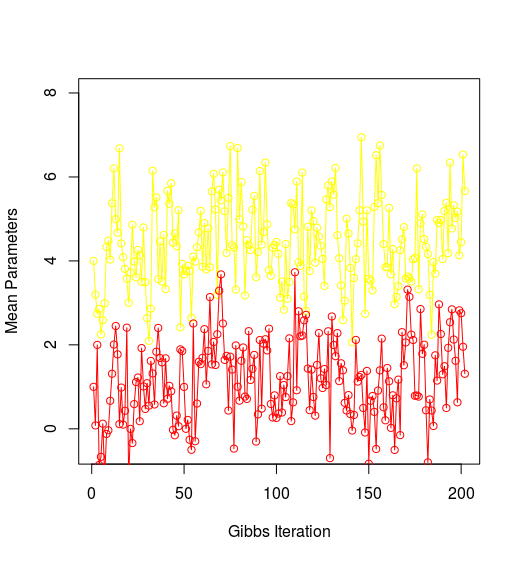
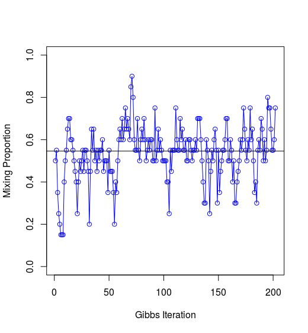
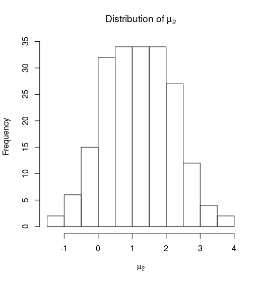
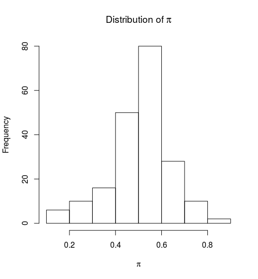

# 混合模型的吉布斯采样

主要程序见[gibbs.R](gibbs.R)

类似书中的Figure 8.8，作出$\mu_1$和$\mu_2$，以及$\sum_i\hat \gamma_i/N$的分布图象。

```
plot(1:length(mu1.h), mu1.h, ylim=c(-0.5, 8), col = "yellow", type = "o", xlab = "Gibbs Iteration", ylab = "Mean Parameters")
points(1:length(mu2.h), mu2.h, col = "red", type = "o")

plot(1:length(pi0.h), pi0.h, ylim = c(0, 1), col = "blue", type = "o", xlab = "Gibbs Iteration", ylab = "Mixing Proportion")
abline(h = 0.546)
```

图象如下所示






同时我们也可以考察$\mu_1$和$\mu_2$、以及$\pi$的分布，通过下面的直方图来体现。







