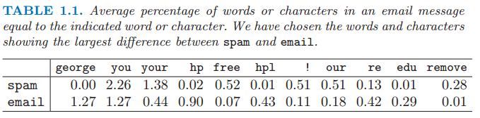
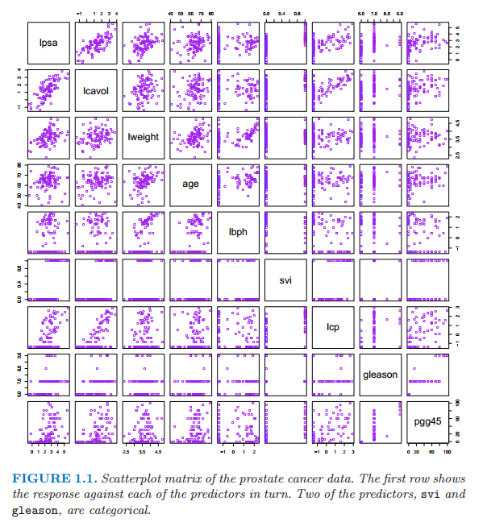
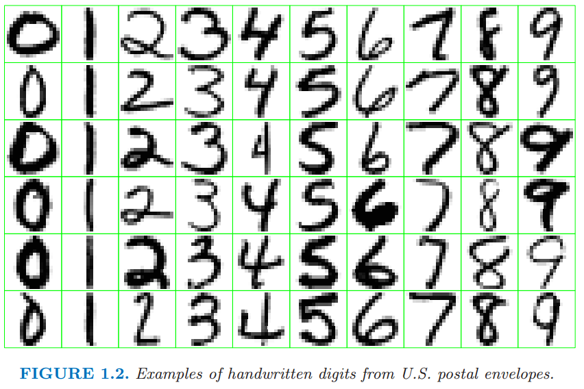

# 1.1 导言

原文     | [The Elements of Statistical Learning](https://web.stanford.edu/~hastie/ElemStatLearn/printings/ESLII_print12.pdf#page=20)
      ---|---
翻译     | szcf-weiya
 发布 | 2016-09-30 

统计学习在科学、经济和工业的许多领域都扮演着重要角色．下面是学习问题中的一些例子．

- 预测一个心脏病患者是否会发生第二次心脏病．这些预测是基于人口统计学，该患者的饮食和临床表现．

- 基于公司的表现和经济数据来预测从现在起六个月后股票的价格．

- 从数字化图像中确定手写的邮政编码中的数字

- 从糖尿病患者血液中的红外光谱吸收情况来估计该患者血液中的葡萄糖含量．

- 基于临床和人口统计学变量确定前列腺癌的致病因素

- 在统计、数据挖掘和人工智能等领域学习扮演了重要角色，与工程和其他学科都有交叉．

- 这本书关于从数据中学习．在一个典型的情境中，我们有一个希望能够基于一系列特征（如饮食和临床表现）预测的结果，通常是数量（如股票价格）或者类别（比如有心脏病和没有心脏病）．我们有一系列训练数据，其中有我们对结果的观测数据和对一系列物体（如人类）的特征测量．利用这些数据我们建立预测模型，或者学习，这个模型或学习能够让我们预测新的未知的物体的结果．一个好的学习是能够准确预测出一个结果．

> **表 1.1：**电子邮件信息中的指示字符等于字符的平均比例．我们选择垃圾邮件和电子邮件，表1.1显示了两者的巨大区别．

上述的例子描述的是监督学习问题．之所以称之为监督学习是因为存在结果变量来引导学习的过程．在非监督学习中，我们仅仅观察特征而且没有对结果的测量．我们的任务而是描述数据是如何形成的或者成簇的．我们将本书的绝大部分致力于监督学习，非监督学习问题的进展也相对较小，我们将在最后一章讨论．

下面是在本书中讨论的一些真实的学习问题．

## 例1：垃圾电子邮件

例子中的数据包含 4601 封电子邮件的信息，在一项研究中试图预测一封电子邮件是否是垃圾邮件．目标是涉及一个自动垃圾邮件检测器，该检测器可以在邮件塞进用户邮箱前过滤掉垃圾电子邮件．对于所有的4601封电子邮件，可用的真实结果是邮件或者垃圾邮件，同时还有 57 个常用词和标点符号的相对频率．这是一个监督学习的例子，其中结果变量是类别型变量 **email/spam**．这也被称作分类问题．

表 1.1 列出了垃圾邮件和普通邮件平均差异比较大的单词和字符．

我们的学习方法要决定用哪个特征以及怎么使用，比如说，我们会有下述规则

**当(%george < 0.6) 且 (%you > 1.5)时，为垃圾邮件，否则为普通邮件**

另一条规则可能是

**当(0.2 · %you − 0.3 · %george) > 0时，为垃圾邮件，否则为普通邮件**

对于这个问题不是所有的错误都相等，我们想要避免过滤掉好的电子邮件，尽管让垃圾邮件通过不是想要的但是结果不是很严重．我们将在本书中讨论一系列不同的方法来解决这个学习问题．

## 例2：前列腺癌

> 图 1.1 是前列腺癌数据的散点图矩阵．第一行显示了响应变量和自变量之间的关系．其中两个自变量，*svi*和*gleason*是类别型变量．

这个例子的数据如图 1.1 所示，来自 Stamey et al. (1989)[^1] 检验 **前列腺癌特定抗原水平 (PSA)** 和临床措施之间相关性的研究，其中有 97 名男性接受了彻底的前列腺切除术．

目标是根据癌体积的对数值（*lcavol*）、前列腺重量的对数值（*lweight*）、良性前列腺增生数量（*lbph*）、精囊浸润（*svi*）、包膜浸透的对数值（*lcp*）、Gleason得分（*gleason*）、Gleason得分为4或5的比例（*pgg45*）来预测PSA的对数值（*lpsa*）．图1.1是这些变量的散点图矩阵．一些和（*lpsa*）的值是显著的，但是一个好的预测模型是很难根据眼睛构造出来的．

这是一个监督学习的问题，也称之为回归问题，因为结果测量是可量化的．

## 例3：手写数字识别

> 本例的数据是来自美国邮局中信封上的手写邮政编码．每张图片是五位邮政编码的一部分，并且每个数字分隔开了．这些图片是 $16\times 16$ 的8位灰度位图，每个像素点密度值为 0 到 255.一些样例图片如图1.2所示．

这些图片都已经被标准化为几乎同样尺寸同样方向的图片了．任务是从 $16\times 16$ 的灰度值矩阵中快速又准确地判断每张图片上的数字（0，1，...，9）．如果结果够精确，最终的算法会用到自动整理信封的过程中．这是一个分类问题，而且要求犯错误概率要很低避免分错邮箱．为了实现低错误率，一些物品要被分到不知道这个类里面，然而人工分拣．

## 例4：基因表达微阵列

DNA是脱氧核糖核酸，而且是组成人类染色体的基本材料．DNA表达微阵列通过测量一个细胞某基因的mRNA的量来衡量基因的表达情况．DNA表达微阵列被当作一个生物学领域的重大突破，促进了对单个细胞内成千上万基因同时量化研究．

下面介绍DNA表达微阵列如何工作．几千个基因的核苷酸序列打印在载玻片上．分别用红色和绿色染料标记目标样本和参照样本，并且每个都与载玻片上的DNA混合．通过X光透视检查，可以测量出每个位置上红色/绿色的RNA强度之比的对数值．结果是几千个数，基本上在-6到6之间，衡量每个目标样本中基因相对于参考样本中基因的表达水平．正值表示目标样本中基因表达程度更高，反之亦然．

一个基因表达数据集收集了一系列DNA微阵列实验中的表达的值，每一列表示一次实验．因此几千行表示几千个不同的基因，每一列表示一个样本：在图 1.3 中有 6830 个基因（行）和 64 个样本（列），尽管为了清晰只有一个随机样本的100行显示出来．这张图是用热点图显示了该数据集，从绿色（消极）到红色（积极）．样本是从不同病人得到的64个癌症肿瘤．

这里的挑战是理解基因和样本是怎样组织起来的．典型的问题有如下几个：

(a) 根据基因的表达谱，哪些样本两两之间最相似？

(b) 根据样本的表达谱，哪些基因两两之间最相似？

(C) 对于特定的癌症样本，特定的基因是否有非常高或低的表达？

我们可以把这个任务看成是回归问题，有两个类别型自变量——基因和样本——以及对应变量的表达水平．然而，把这个问题看成是非监督学习可能更有用．例如，对于上述的问题(a)，我们把样本看成是6830维空间中的一点，并且想通过某种方式对其进行聚类．

> 图1.3 DNA阵列数据：基于人类肿瘤数据的 6830 个基因（行）、64个样本（列）的基因表达矩阵．只有随机的100行显示在图中．使用热点图描述这些数据，从绿色（消极，抑制表达）到红色（积极，过表达）．缺失数据为灰色．行和列是采用随机的顺序展示．

## 谁应该读读这本书

这本书是为了许多领域的研究者和学生设计的，这些领域包括统计、人工智能、工程、金融以及其他．我们预期读者至少学过统计的一门基础课程，掌握包括线性回归等基本概念．

我们没有试图写一篇全面的关于学习方法的目录，而是描述一些很重要的技巧．同样值得说明的是，我们描述根本的概念和用于研究者评判学习方法需要考虑的因素．我们试图从一个直观的角度来写这本书，强调概念而不是数学细节．

作为统计学家，我们的描述自然反映了我们的背景和专业领域．然而在过去八年时间里我们参加了神经网络、数据挖掘和机器学习领域的会议，而且我们的想法已经深深被这些令人激动的领域所影响，这些影响在我们当前研究以及这本书中是很明显的．

## 这本书是如何组织的

我们的观点是一个人在尝试掌握复杂的概念前必须理解简单的方法．因此，当在**第二章**对监督学习给出概要后，我们在**第三和第四章**讨论了回归和分类的线性方法．**第五章**我们描述了对单个自变量的样条，小波和正则/惩罚方法，**第六章**则描述了核方法和局部回归．上述两种方法都是高维学习技术的重要基石．模型评估与选择是**第七章**的主题，包括偏差和方差，过拟合和用于选择模型用的交叉验证．**第八章**讨论了模型推断与平均，概要地介绍了极大似然法、贝叶斯推断、自助法、EM算法、吉布斯抽样和bagging．与此相关的boosting过程是**第十章**的重点．

在**第九到十三章**我们描述了一系列用于监督学习的结构化方法，其中**第九和第十一章**介绍回归以及**第十二和第十三章**重点在分类．**第十四章**描述了非监督学习的方法．两个最近提出来的技术，随机森林和集成学习将在**第十五和第十六章**讨论．我们在**第十七章**讨论无向图模型以及最后在**第十八章**学习高维问题．

在每一张结尾我们讨论计算需要考虑的因素，这对於数据挖掘的应用是很重要的，包括计算量级随着观测值和自变量数目的变化．每一章节最后的文献注解提供了本章的背景参考资料．

我们建议按顺序先阅读第1-4章，第7章也应该当作强制阅读，因为它介绍了关于所有学习方法的中心概念．有了这些概念，这本书的其他章节根据读者的兴趣可以按照顺序读，或选读．

这个标志表明这是技术上困难的部分，读者可以跳过这部分而且不会影响后续讨论．

## 书的网址

这本书的网站是
[http://www-stat.stanford.edu/ElemStatLearn](http://www-stat.stanford.edu/ElemStatLearn)
里面包含很多资源，包括这本书里面用到的很多数据集．

## 教师注意事项

我们成功地将这本书的第一版用做两个短学期的课程基础，如果加上第二版中的补充材料，可以用做三个短学期．练习题在每一章的最后．对学生而言，使用良好的软件处理书后的问题是很重要的．我们在自己的教学课堂上使用R和S-PLUS 编程．

[^1]: Stamey, T., Kabalin, J., McNeal, J., Johnstone, I., Freiha, F., Redwine, E. and Yang, N. (1989). Prostate specific antigen in the diagnosis and treatment of adenocarcinoma of the prostate II radical prostatectomy treated patients, Journal of Urology 16: 1076–1083.