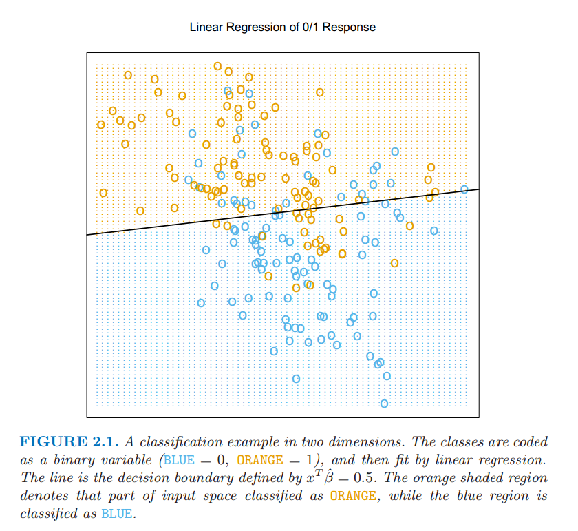
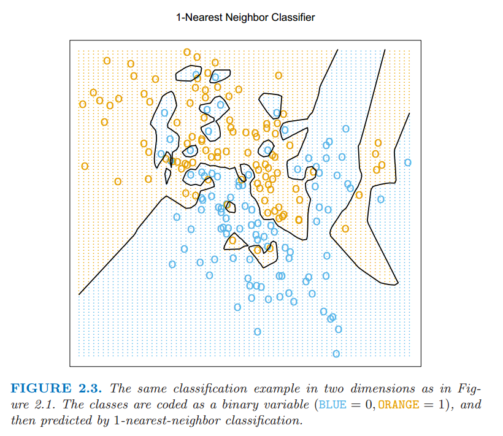
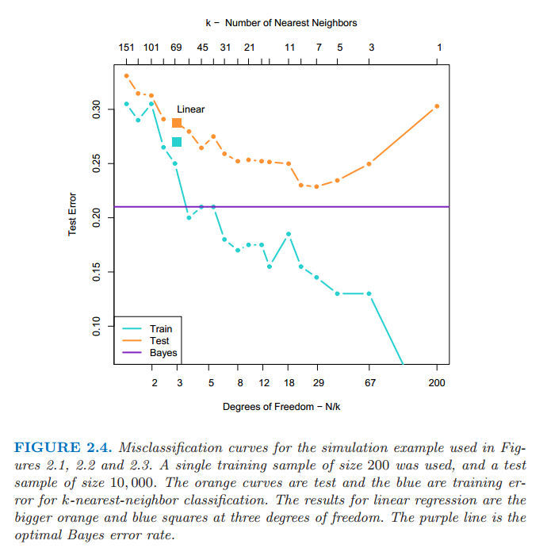

# 2.3 两种简单的预测方式：最小二乘和最近邻

原文     | [The Elements of Statistical Learning](https://web.stanford.edu/~hastie/ElemStatLearn/printings/ESLII_print12.pdf#page=30)
      ---|---
翻译     | szcf-weiya
 发布 | 2016-09-30 
更新 | 2018-08-21, 2018-10-15
状态 | Done

在这一部分中我们讨论两种简单但很有用的预测方法：最小二乘法的线性模型拟合和 $k$-最近邻预测规则．线性模型对结构做出很大的假设而且得出稳定但可能不正确的预测．$k$-最近邻方法对结构的假设很温和：它的预测通常是准确的但不稳定．

## 线性模型和最小二乘

线性模型已经成为过去 $30$ 年统计学的支柱，而且仍然是我们最重要的工具．给定输入向量 $X^T=(X_1,X_2,\cdots,X_p)$，我们通过模型

$$
\hat{Y} = \hat{\beta}_0+\sum\limits_{j=1}^{p}X_j\hat{\beta}_j
\tag{2.1}
$$

来预测输出 $Y$．

$\hat{\beta}_0$ 是截距，也是机器学习中的 **偏差 (bias)**．经常为了方便起见把常数变量 $1$ 放进 $X$，把 $\hat{\beta}_0$ 放进系数变量 $\hat{\beta}$ 中，然后把用向量内积形式写出线性模型

$$
\hat{Y} = X^T\hat{\beta}
\tag{2.2}
$$

其中 $X^T$ 为向量或者矩阵的转置（$X$ 为列向量）．这里我们对单个输出的建立模型，所以 $\hat{Y}$ 为标量；一般地，$\hat{Y}$ 可以是一个 $K$ 维向量，这种情形下，$\beta$ 是一个 $p\times K$ 的系数矩阵．在 $(p+1)$ 维输入输出空间中，$(X,\hat{Y})$ 表示一个超平面．如果常数项包含在 $X$ 中，则超平面过原点，而且是一个子空间；如果不是，则是一个过点 $(0,\hat{\beta}_0)$ 切 $Y$ 轴的仿射集．从现在起，我们假设截距项包含在 $\hat{\beta}$ 中．

在 $p$ 维输入空间从函数观点来看，$f(X)=X^T\beta$ 是线性的，其梯度 $f'(X)=\beta$ 是输入空间里的最速上升方向的向量．

根据训练数据我们怎样拟合线性模型？有许多不同的方法，但目前为止最受欢迎的是最小二乘法．在这个方法里面，我们选取系数 $\beta$ 使得残差平方和最小:

$$
\RSS(\beta) = \sum_{i=1}^N(y_i-x_i^T\beta)^2
\tag{2.3}
$$

$\RSS(\beta)$ 是系数的二次函数，因此其最小值总是存在，但是可能不唯一．它的解用矩阵来表示是最简单的．我们可以写成

$$
\RSS(\beta) = (\y-\mathbf{X}\beta)^T(\y-\mathbf{X}\beta)
\tag{2.4}
$$

其中，$\mathbf{X}$ 是 $N\times p$ 矩阵，每一行是一个输入向量，$\mathbf{y}$ 是训练集里面的 $N$ 维输出向量．对 $\beta$ 微分我们有 **正规方程组 (normal equations)**

$$
\mathbf{X}^T(\mathbf{y}-\mathbf{X}\beta)=0
\tag{2.5}
$$

如果 $\mathbf{X}^T\mathbf{X}$ 非奇异，则唯一解为

$$
\hat{\beta}=(\mathbf{X}^T\mathbf{X})^{-1}\mathbf{X}^T\mathbf{y}
\tag{2.6}
$$

而且第 $i$ 个输入 $x_i$ 的拟合值为 $\hat{y}_i=\hat{y}(x_i)=x_i^T\hat{\beta}$．在任意输入 $x_0$ 处，预测值为 $\hat{y}(x_0)=x_0^T\hat{\beta}$．整个拟合曲面由 $\hat{\beta}$ 的 $p$ 个系数所决定．直观地，我们不需要非常多的数据集去拟合这样一个模型．

让我们来看线性模型在分类问题中的一个例子．图 2.1 显示了训练数据在一对输入 $X_1$ 和 $X_2$ 的散点图．数据是模拟的，而且现在模拟模型不是很重要．输出的类变量 $G$ 取值为蓝色或橘黄色，而且正如散点图表示的那样．每个类里面都有 $100$ 个点．线性回归模型是去拟合这些数据，蓝色时响应变量 $Y$ 编码为 $0$，橘黄色时编码为 $1$．拟合值 $\hat{Y}$ 根据下面规则转化为拟合的类变量 $\hat{G}$

$$
\hat{G}=
\left\{
\begin{array}{cc}
\color{orange}{ORANGE}\quad&\text{if }\hat{Y} > 0.5\\
\color{blue}{BLUE}\quad & \text{if }\hat{Y}\le 0.5
\end{array}
\right.
\tag{2.7}
$$

> 图 2.1：两维分类的例子．类别被编码为二进制变量（蓝色为 $0$，橘黄色为 $1$），然后通过线性回归进行拟合．图中直线是判别边界，直线方程为 $x^T\hat{\beta}=0.5$．橘黄色阴影区域表示这一部分输入区域被分成橘黄色，而蓝色阴影区域分成蓝色．

在 $\mathbf{R}^2$ 中被分成橘黄色类的点对应 $\\{x:x^T\hat{\beta}>0.5\\}$，如图 2.1 中显示的那样，而且两个预测的类被判别边界 $\\{x:x^T\hat{\beta}=0.5\\}$ 分隔开，在这种情形下是线性的．我们可以看到在判别边界的两边都有被分错的点．或许我们的线性模型太严格了，又或者是这些错误无法避免？记住这些是在训练数据本身上的错误，而且我们没有说这些构造的数据从哪里来的．考虑下面两种可能的情境：

**情境1：**每一类的训练数据是从二元正态分布（不相关且均值不同）中生成的．

**情境2：**每一类的训练数据是来自 $10$ 个低方差的高斯分布的混合，每一个高斯分布都有各自的均值．

就生成模型而言，混合的高斯分布是描述得最好的．首先产生一个离散随机变量，该变量决定使用哪个部分的高斯分布，然后根据选择的密度产生观测值．在每一类是一个高斯分布的情形下，我们将在第四章看到一个线性的判别边界是最好的，而且我们的估计也几乎是最优的．区域的重叠是不可避免的，而且将要被预测的数据因为数据重叠也会变得很麻烦．

在混合紧密聚集的高斯分布中情形不一样了．一个线性的判别边界不大可能是最优的，而且事实上也不是．最优的判别边界是非线性不相交的，而且作为这种判别边界，将会更难确定．

我们现在来看一下另一种分类和回归的过程，在某种程度上是与线性模型相反的一种做法，但却更好地能够适用第二种情形．

## 最邻近方法

最邻近方法用训练集 $\mathcal{T}$ 中在输入空间中离 $x$ 最近的观测组成 $\hat{Y}$．特别地，对 $\hat{Y}$ 的 $k$-最近邻拟合定义如下：

$$
\hat{Y}(x)=\frac{1}{k}\sum\limits_{x_i\in N_k(x)}y_i\tag{2.8}\label{2.8}
$$

$N_k(x)$ 是在训练样本中 $k$ 个离 $x$ 最近的点 $x_i$ 组成的邻域．远近意味着度量，目前我们假设是欧氏距离．因此，用文字来叙述就是，我们在输入空间中找到离 $x$ 最近的 $k$ 个观测 $x_i$，然后取这些值的平均．

在图 2.2 中我们采用图 2.1 中同样的训练数据，然后采用 $15$-最近邻平均二进制编码作为拟合的方法．因此 $\hat{Y}$ 是橘黄色在邻域中的比例，然后如果 $\hat{Y} > 0.5$ 在邻域中的数量占了主要部分则将橘黄色的类赋值给 $\hat{G}$．有颜色的区域表明该区域里面的点根据这一条规则分成了橘黄色和蓝色，这种情形下是靠对网格上的点进行赋值找到的．我们可以看到分开蓝色和橘黄色的判别边界更加地不规则，而且对应于某一类所主导的局部聚集．

> 图 2.2 图 2.1 中一样的二维分类的例子．类别被二进制变量编码（蓝色为 $0$，橘黄色为 $1$），通过 $15$-最近邻平均拟合．因此预测的类别是选择 $15$-最近邻中占大部分的类别．

图 2.3 显示了 $1$-最近邻的分类结果：$\hat{Y}$ 被赋了距离 $x$ 的最近点 $x_{\ell}$ 的值 $y_{\ell}$．这种情形下，区域的分类可以相对简单的计算出来，这对应训练数据的 **泰森多边形图 (Voronoi tessellation)**．每个点 $x_i$ 都有一个对应的区域，这些小区域形成了离某点最近的区域．对于小区域里面的每一个点，$\hat{G}(x)=g_i$．判别边界比之前更加不规则了．

图 2.1 中一样的二维分类的例子．类别被二进制变量编码（蓝色为 $0$，橘黄色为 $1$），通过 $1$-最近邻分类预测．

对于关于定量输出变量 $Y$ 的回归问题，**k-最近邻平均 (k-nearest-neighbor averaging)** 方法的定义和 \eqref{2.8} 完全一样，尽管 $k=1$ 是不太可能的选择．

相比较图 2.1，在图 2.2 中更少的训练观测值被错误地分类．尽管如此，这个不应该给我们太大的安慰，因为图 2.3 中没有一个训练数据被错误地分类．一个小小的想法表明在 $k$-最近邻拟合中，训练数据的误差应该近似是关于 $k$ 的增函数，而且当 $k=1$ 时误差总是为 $0$．一个独立的测试集比较这些不同的方法会给我们一个满意的方法．

看起来 $k$-最近邻拟合只有一个参数，$k$ 值的大小，而在最小二乘有 $p$ 个参数．尽管情况就是这样，我们将会看到 $k$-最近邻的 **有效(effective)** 参数个数是 $\frac{N}{k}$，而且一般地会比 $p$ 大，另外随着 $k$ 的增长有效参数个数减少．为了弄清楚为什么，注意到如果邻域没有重叠，则会有 $\frac{N}{k}$ 个邻域，而且我们在每个区域内拟合一个参数．

我们不能在训练集上将误差平方和作为选择 $k$ 的标准，因为我们总会选择 $k=1$．$k$-最近邻方法对于上文中描述的情境 $2$ 更适合，尽管对于高斯分布的数据 $k$-最近邻判别边界会有不必要的噪声．

## 从最小二乘到最近邻

最小二乘法的线性判别边界非常光滑，而且显然拟合得很稳定．它似乎严重依赖线性判别边界是合理的假设．我们马上用文字讨论，它有低方差和潜在的高偏差．

另一方面，$k$-最近邻过程似乎不非常依赖任何关于数据的假设，而且可以适用于任何情形．然而，判别边界的任何特定的分区都依赖几个输入点和它们的特定位置，而且因此左右摇摆不稳定——高方差和低偏差．

每种方法都有各自处理得最好的情形；特别地，线性回归更适合上面介绍的情形 $1$，而最邻近方法最适合情形 $2$．是时候揭露真相了．事实上数据是从介于两种情形的模型中模拟出来的，但是更接近于情形 $2$．首先，我们从双变量高斯分布 $N((1,0)^T,\bf{I})$ 中产生 $10$ 个均值 $m_k$，标记此类为蓝色．类似地，从双变量高斯分布 $N((0,1)^T,\bf{I})$ 中产生 $10$ 个均值并标记此类为橘黄色．然后对每一类按照下面方式产生 $100$ 个观测：对于每个观测，我们以 $1/10$ 的概率随机选择一个 $m_k$，然后产生 $N(m_k,\bf{I}/5)$，因此对于每一类引出了一个高斯分布簇的混合．图 2.4 显示了从该模型产生 $10000$ 个新观测的的分类结果，我们比较最小二乘法和一系列 $k$ 值对应的 $k$-最近邻的结果．

> 图 2.4：在图 2.1，图 2.2，图 2.3 中运用的模拟例子的错误分类曲线．我们用的是 $200$ 个样本作为训练数据，检测数据规模为 $10000$个．橘黄色的曲线对应 $k$-最近邻分类的测试数据，蓝色的曲线对应 $k$-最近邻分类的训练数据．线性回归的结果是在自由度为 $3$ 上的大橘黄色和蓝色的方块．紫色的直线是最优的贝叶斯错误率．

今天最受欢迎的技巧的一大部分是这两种方法的变形．事实上，$1$-最近邻，所有方法中最简单的，夺取了低维问题的大部分市场．下面列举描述了这些简单的过程增强的方式

- 核方法用光滑递减至 $0$ 的权重及距离目标点的距离，而不是像在$k$-最近邻中用的有效的 $0/1$ 权重系数
- 高维空间中，距离核修改成比其它的变量更多地强调某些变量
- 通过局部权重的最小二乘的局部线性回归，而不是局部用常数值来拟合
- 线性模型适应基本的允许任意复杂模型的原始输入的拓展
- 投影寻踪和神经网络模型包括非线性模型转换为线性模型之和
