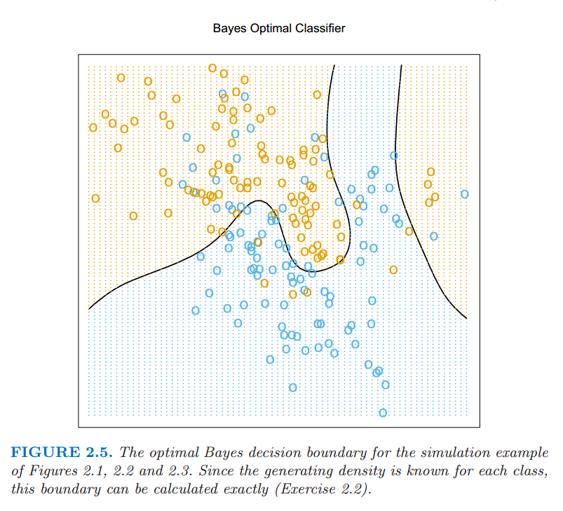

# 2.4 统计判别理论

原文     | [The Elements of Statistical Learning](https://web.stanford.edu/~hastie/ElemStatLearn/printings/ESLII_print12.pdf#page=37)
      ---|---
翻译     | szcf-weiya
 发布 | 2016-09-30 
更新 | 2018-08-22
状态 | Done

这一节我们讨论一小部分理论，这些理论提供构建模型的一个框架，比如我们目前为止所有非正式讨论的模型．我们首先考虑定量输出时的情形，而且从随机变量和概率空间的角度来考虑．记 $X\in \IR^p$ 为实值随机输入向量，$Y\in \IR$ 为实值随机输出变量，联合概率分布为 $\Pr(X,Y)$．给定输入 $X$，我们寻找一个函数 $f(X)$ 来预测 $Y$．这个理论需要一个 **损失函数 (loss function)** $L(Y,f(X))$ 用来惩罚预测中的错误，到目前为止最常用并且最方便的是 **平方误差损失 (squared error loss)**: $L(Y,f(X))=(Y-f(X))^2$．这促使我们寻找 $f$ 的一个准则——预测（平方）误差的期望

$$
\begin{align*}
\EPE(f)&=E(Y-f(X))^2\qquad\qquad\tag{2.9}\\
&=\int[y-f(x)]^2\Pr(dx,dy)\tag{2.10}
\end{align*}
$$

在 $X$ 的**条件**下，我们可以把 $\EPE$ 写成

$$
\EPE(f) = \E_X\E_{Y\mid X}([Y-f(X)]^2\mid X)\tag{2.11}
$$

而且我们看到使 $\EPE$ 逐点最小就足够了：

$$
f(x) = \argmin_c\E_{Y\mid X}([Y-c]^2\mid X=x)\tag{2.12}
$$

解为条件期望

$$
f(x) = \E(Y\mid X=x)\tag{2.13}\,,
$$

也被称作 **回归 (regression)** 函数。因此 $Y$ 在任意点 $X=x$ 处的最优预测为条件均值，“最优”是在均方误差意义下的。

!!! note "原书注："
	此处条件是指对联合概率密度分解 $\Pr(X, Y ) = \Pr(Y \mid X)\Pr(X)$，其中 $\Pr(Y \mid X) = \Pr(Y, X)/\Pr(X)$，因此分解成了双变量的积分．

最近邻方法试图直接利用训练数据完成任务．在每一点 $x$ 处，我们可能需要输入变量 $x_i=x$ 附近的所有 $y_i$ 的均值．因为在任一点 $x$，一般至多有一个观测值，我们令

$$
\hat{f}(x)=\Ave(y_i\mid x_i\in N_k(x))\tag{2.14}
$$

其中“Ave”表示平均，$N_k(x)$ 是集合 $\cal{T}$ 中离 $x$ 最近的 $k$ 个点的邻域．这里有两个近似

- 用样本数据的平均近似期望；
- 在每一点的条件（期望）松弛为在离该目标点近的某个区域上的条件（期望）．

对于规模为 $N$ 的大规模训练数据，邻域中的点更可能接近 $x$，而且当 $k$ 越大，平均值会更加稳定．事实上，在联合概率分布 $\Pr(X,Y)$ 温和正则条件下，可以证明当 $N,k \longrightarrow \infty$ 使得 $k/N \longrightarrow 0$ 时，$\hat{f}(x) \longrightarrow \E(Y \mid X = x)$．根据这个，为什么看得更远，因为似乎我们有个一般的近似量吗？我们经常没有非常大的样本．如果线性或者其它更多结构化的模型是合适的，那么我们经常可以得到比 $k$-最近邻更稳定的估计，尽管这些知识必须也要从数据中学习．然而还有其它的问题，有时是致命的．在下一个部分我们看到当维数 $p$ 变大，$k$-最近邻的度量大小也随之变大．所以最近邻代替条件会让我们非常失望．收敛仍然保持，但是当维数增长后收敛 **速率 (rate)** 变小．

线性回归怎样适应这个框架？最简单的解释是假设回归函数 $f(x)$ 近似线性

$$
f(x)\approx x^T\beta\tag{2.15}
$$

这是个基于模型的方式——我们明确用于回归函数的模型．将 $f(x)$ 的线性模型插入 $\EPE (2.9)$ 然后微分，可以理论上解出 $\beta$
$$
\beta = [\E(XX^T)]^{-1}\E(XY)\tag{2.16}
$$

注意到我们在 $X$ 上没有条件；而是已经用了我们对函数关系的理解 **整合 $X$ 的值 (pool over values of $X$)**．最小二乘的解 $(2.6)$ 相当于用训练数据的平均值替换掉 $(2.16)$ 中的期望．

所以 $k$-最邻近和最小二乘最终都是根据平均来近似条件期望．但是它们在模型上显著不同．

- 最小二乘假设 $f(x)$ 是某个整体线性函数的良好近似．
- $k$-最近邻假设 $f(x)$ 是局部常值函数的良好近似．

尽管后者似乎更容易被接受，但我们已经看到我们需要为这种灵活性付出代价．

这本书中描述的很多技巧都是基于模型的，尽管比严格的线性模型更加灵活．举个例子，可加性模型假设

$$
f(X) = \sum\limits_{j=1}^{p}f_j(X_j)\tag{2.17}
$$

这保留着线性模型的可加性，但是每个并列的函数 $f_j$ 是任意的．结果表明可加模型的最优估计是对于每个并列的函数 **同时 (simultaneously)** 用 $k$-最邻近去近似 **单变量 (univariate)** 的条件期望．因此在可加性的情况下，通过加上某些（通常不现实）的模型假设在高维中估计条件期望的问题被扫除了．

是否为 $(2.11)$ 的标准而高兴？如果我们用 $L_1$ 损失函数 $\E\mid Y-f(X)\mid $ 来替换 $L_2$ 损失函数会怎么样．这种情况下解是条件中位数，
$$
\hat{f}(x) = \median(Y \mid X = x)\tag{2.18}
$$

条件中位数是另一种定位的方式，而且它的估计比条件均值更加鲁棒． $L_1$ 准则的导数不连续，阻碍了它们的广泛应用．其它更多耐抵抗 (resistant) 的损失函数会在后面章节中介绍，但是平方误差是分析方便而且是最受欢迎的．

当输出为类变量 $G$ 时，我们应该怎样处理？同样的范例在这里也是可行的，除了我们需要一个不同的损失函数来惩罚预测错误．预测值 $\hat{G}$ 在 $\cal G$ 中取值， $\cal G$ 是可能的类别的集合．我们的损失函数可以用 $K\times K$ 的矩阵 $\mathbf{L}$ 来表示，其中 $K=\card({\cal G})$．矩阵 $\mathbf{L}$ 对角元为 $0$ 且其它地方值非负，其中 $L(k,\ell)$ 为把属于 $\cal G_k$ 的类分到 $\cal G_\ell$ 的代价．大多数情况下我们用 $0$-$1$ **(zero-one)** 损失函数，其中所有的错误分类都被要求一个单位的惩罚．预测错误的期望为

$$
\EPE = \E[L(G,\hat{G}(X))]\tag{2.19}
$$

同样关于联合分布 $\Pr(G,X)$ 取期望．再一次考虑条件分布，我们可以写出如下的 $\EPE$

$$
\EPE = \E_X\sum\limits_{k=1}^KL[{\cal{G}}_k,\hat{G}(X)]\Pr({\cal{G}}_k\mid X)\tag{2.20}
$$

同样逐点最小化 $\EPE$ 就足够了:

$$
\hat{G}(x) = \argmin_{g\in \cal{G}}\sum\limits_{k=1}^KL({\cal{G}}_k,g)\Pr({\cal G}_k\mid X = x)\tag{2.21}
$$

结合 0-1 损失函数上式简化为

$$
\hat{G}(x) = \argmin_{g\in \cal{G}}[1 − \Pr(g\mid X = x)]\tag{2.22}\label{2.22}\,.
$$

!!! note "weiya 注：推导 \eqref{2.22}"
    注意到，对于 0-1 损失，
    $$
    L(\cG_k, g) = \begin{cases}
        0 & \text{if } g=\cG_k\\
        1 & \text{if } g\neq \cG_k
    \end{cases}\,,
    $$
    则我们有
    $$
    \sum_{k=1}^KL({\cal{G}}_k,g)\Pr(G={\cal G}_k\mid X = x) = \sum_{\cG_k\neq g}\Pr(G=\cG_k \mid X=x)=1-\Pr(G=g\mid X=x)\,.
    $$

或者简单地

$$
\hat{G}(X) = {\cal{G}}_k \text{ if } \Pr({\cal{G}}_k\mid X = x) = \underset{g\in{\cal{G}}}{\max } \Pr(g\mid X = x)\tag{2.23}
$$

合理的解决方法被称作 **贝叶斯分类 (Bayes classifier)**，利用条件（离散）分布 $\Pr(G\mid X)$ 分到最合适的类别．对于我们模拟的例子图 2.5 显示了最优的贝叶斯判别边界．贝叶斯分类的误差阶被称作 **贝叶斯阶 (Bayes rate)**．

> 图 2.5：在图 2.1，2.2，和 2.3 中模拟的例子的最优贝叶斯判别边界．因为每个类别的产生密度已知，则判别边界可以准确地计算出来．

再一次我们看到 $k$-最近邻分类直接近似这个解决方法——在最近邻内占绝大多数恰好意味着这个，除了某一点的条件概率松弛为该点的邻域内的条件概率，而且概率是通过训练样本的比例来估计的．

假设对于一个二分类的问题，我们采用虚拟变量的方法并且通过二进制变量 $Y$ 编码 $G$，然后进行平方误差损失估计．当 ${\cal{G}}_1$ 对应 $Y=1$，有 $\hat{f}(X)=\E(Y\mid X)=\Pr(G={\cal{G}}_1\mid X)$．同样对于 $K$ 个类别的问题 $\E(Y_k\mid X)=\Pr(G={\cal{G}}_k\mid X)$．这显示了我们虚拟变量回归的过程，然后根据最大的拟合值来分类，这是表示贝叶斯分类器的另一种方式．尽管这个理论是确定的，在实现中问题也会随着采用的回归模型不同而出现．举个例子，当采用线性回归模型，$\hat{f}(X)$ 不必要为正值，而且我们可能会怀疑用这个作为概率的一个估计．我们将在第四章中讨论构建模型 $\Pr(G\mid X)$ 的各种不同的方式．
