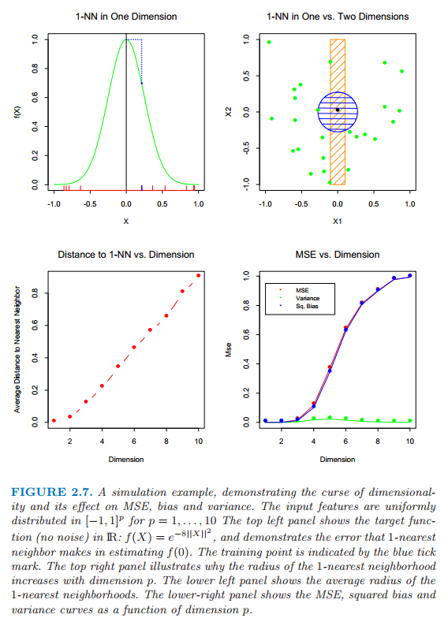
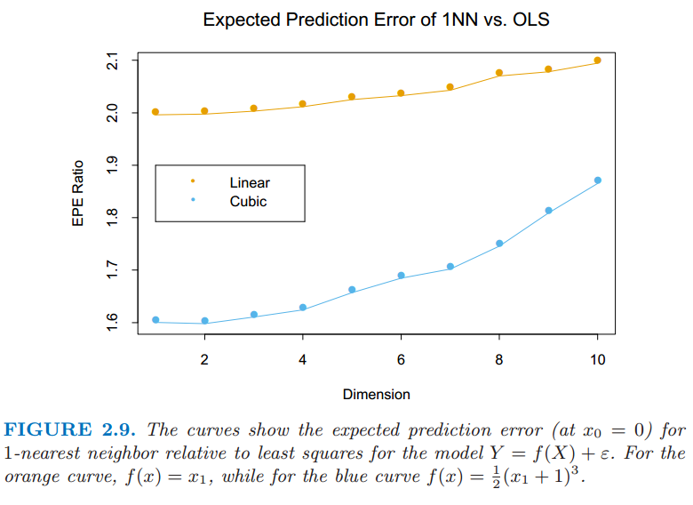

# 2.5 高维问题的局部方法

原文     | [The Elements of Statistical Learning](https://web.stanford.edu/~hastie/ElemStatLearn/printings/ESLII_print12.pdf#page=41)
      ---|---
翻译     | szcf-weiya
 发布 | 2016-09-30 
校订   |  2017-09-10

至今为止我们已经仔细讨论了两个关于预测的学习方法：稳定但是有偏差的线性模型和不稳定但显然偏差较小的 $k$-最近邻估计．当有充分大的训练数据，我们似乎总会选择 $k$-最近邻平均来近似理论上的最优条件期望，因为我们能够找到一个相当大的离 $x$ 近的观测构成的邻域并且平均里面的观测值．在高维情形下这种方法以及我们的直觉都没有用，而且这种现象通常被称作 **维度的诅咒 (curse of dimensionality)** (Bellman, 1961[^1])．关于这个问题有很多的证明，我们将要仔细讨论一些．

!!! note "weiya 注:"
    查阅[维基百科](https://zh.wikipedia.org/wiki/%E7%BB%B4%E6%95%B0%E7%81%BE%E9%9A%BE)，“curse of dimensionality” 可以翻译成 **维数灾难** 或 **维度的诅咒**．

[^1]: Bellman, R. E. (1961). Adaptive Control Processes, Princeton University Press.

正如图 2.6 显示的那样，我们考虑输入在 $p$ 维单位超立方体均匀分布的最近邻过程．假设我们在某个目标点构造超立方体的邻域来捕获观测值的一个小部分 $r$．因为这个邻域对应单位体积的比例 $r$，则边长的期望值为 $e_p(r)=r^{1/p}$．在 $10$ 维空间下 $e_{10}(0.01)=0.63$,$e_{10}(0.1)=0.80$，而每个输入的全部范围为 $1.0$．所以选取 $1\%$ 或 $10\%$ 的数据去形成局部均值，我们必须在每个输入变量上覆盖到 $63\%$ 或者 $80\%$．这样的邻域不再是局部的．显著地降低 $r$ 并没有作用，因为我们选取去平均的观测值越少，我们拟合的方差也会越大．

> 图 2.6:一个输入为均匀分布数据的单位立方体的子立方体邻域, 它很好地展现出了维数的灾难．右边的图显示了不同维数 $p$ 下，为了捕捉一小部分的数据 $r$，子立方体的所需要的边长．在 $10$ 维的情况下，为了捕捉 $10\%$ 的数据，我们需要包括每个坐标取值范围的 $80\%$．

高维下的稀疏取样的另外一个后果是所有的样本点离样本的某一边很近．考虑在 $p$ 维以原点为中心的单位球中均匀分布的 $N$ 个数据点．假设我们考虑原点处的最近邻估计．距离原点最近的数据点距离的中位数由下式给出（[练习 2.3](https://github.com/szcf-weiya/ESL-CN/issues/60)）

$$
d(p,N)=(1-(\frac{1}{2})^{1/N})^{1/p}\tag{2.24}\label{2.24}
$$

!!! note "weiya 注"
    我们可以这样得到 \eqref{2.24} 式：
    将数据点与原点的距离看成随机变量$X$，因为数据点均匀分布，则 $X$ 的分布函数为
    $$
    F(X < x)=x^p, \; x\in [0,1]
    $$
    则最近距离为次序统计量$X_{(1)}$，其分布函数为
    $$
    F_1(x)=1-(1-F(x))^N
    $$
    最近距离的中位数满足 $F_1(d(p,N))=\frac{1}{2}$，于是可以得到 \eqref{2.24} 式．

距离原点最近的数据点的距离的均值表达式更加复杂．当 $N=500,p=10,d(p,N)\approx 0.52$，比到边界的距离的一半还要大．因此大部分的数据点离样本空间的边界比其他任何的数据点更近．这里产生问题的原因是对于训练样本中靠近的边的预测更加困难．一定要从样本点的邻域外推而不是在中间插入．

另外一个证明这个灾难是取样密度是跟 $N^{1/p}$ 成比例，其中 $p$ 为输入空间的维数，$N$ 为样本的规模．因此，如果 $N_1=100$ 表示对于单输入问题的大密度取样，然后 $N_{10}=100^{10}$ 是 $10$ 个输入时取样密度同上面相同时所需要的样本规模大小．因此在高维空间中所有可行的训练样本在输入空间中很稀少．

让我们构造另一个均匀分布的例子．假设我们有从 $[-1,1]^p$ 中均匀产生的 $1000$ 个训练样本 $x_i$．假设没有任何测量错误，$X$ 和 $Y$ 之间真正的关系是

$$
Y = f(X) = e^{−8\mid \mid X\mid \mid ^2},
$$

我们采用 $1$-最近邻规则去预测测试点 $x_0=0$ 的值 $y_0$．记训练集为 ${\cal{T}}$．对于我们的过程，可以通过平均所有的大小为 $1000$ 的样本来计算在 $x_0$ 处的预测偏差的期望值．因为这个问题是确定性的，下面是估计 $f(0)$ 的均方误差 $\MSE$

$$
\begin{align*}
\MSE(x_0)&=\E_{\cal{T}}[f(x_0)-\hat{y}_0]^2\notag\\
&=\E_{\cal{T}}[\hat{y}_0-E_{\cal{T}}(\hat{y}_0)]^2+[\E_{\cal T}(\hat y_0)-f(x_0)]^2\notag\\
&=\Var_{\cal{T}}(\hat{y}_0)+Bias^2(\hat{y}_0)\tag{2.25}
\end{align*}
$$

图 2.7 显示了这个设定．我们已经把 $\MSE$ 分解成两个部分，随着我们继续讨论，会越来越熟悉这两个部分，这两部分分别是方差和偏差平方．这一分解总是可行的而且经常有用，并且这一分解被称为 **偏差-方差分解 (bias-variance decomposition)**．除非最近邻在 $0$ 处，这一例子中 $\hat{y}_0$ 会比 $f(0)$ 小，而且平均估计会向下偏．方差是因为 $1$-最近邻取样的方差．在低维度以及 $N=1000$ 情况下，最近邻非常接近 $0$，于是偏差和方差都会非常小．当维数增大，最近邻有从目标点远离的趋势，而且都会带来偏差跟方差．$p=10$ 时，超过 $99\%$ 的样本的最近邻距离原点大于 $0.5$．因此，当 $p$ 增长时，估计值多半有趋势趋于 $0$，因此 $\MSE$ 保持在 $1.0$ 附近，偏差也是如此，方差开始下降（这个例子的衍生）．

> 图 2.7：一个模拟的例子，证明维数的灾难以及其在 $\MSE$，偏差和方差的影响．输入的特征在 $[-1,1]^p,p=1,\ldots,10$ 上均匀分布．左上角显示了在 $\IR$ 上的目标函数（无噪声）：$f(X)=e^{-8\mid \mid X\mid \mid ^2}$，而且展示了 $1$-最近邻在估计 $f(0)$ 时的误差．训练点用蓝色的记号表示．右上角显示了为什么 $1$-最近邻的半径随着维数 $p$ 的增加而增加．左下角显示了 $1$-最近邻的平均半径．右下角显示了 $\MSE$，偏差平方和方差关于维数 $p$ 的函数曲线．

> 图 2.8：同图 2.7一样的配置的模拟例子．函数除了一个维数外都为常数，该维数下 $F(X)=\frac{1}{2}(X_1+1)^3$．方差占主导地位．

尽管这是一个非常不自然的例子，类型的情形发生的更一般．多变量的函数复杂度随着维数呈指数增长，而且如果我们希望以在低维中以相同的精度来估计高维中的函数，我们将会需要呈指数增长规模的训练集．在这个例子中，函数是所有 $p$ 个变量参与的复杂交互．

偏差项关于距离的依赖性取决于真实值，而且在 $1$-最近邻情况它并不总是占主要部分．举个例子，如果像图 2.8 一样函数总是仅仅与少量的维度有关，方差便会占主要部分．

另一方面假设我们知道 $Y$ 与 $X$ 之间的关系为线性的

$$
Y = X^T\beta + \varepsilon\tag{2.26}
$$

其中 $\varepsilon \sim N(0,\sigma^2)$，而且我们用最小二乘对训练数据进行拟合模型．对于任意测试点 $x_0$，我们有 $\hat y_0=x_0^T\hat{\beta}$，可以写成 $\hat y_0=x_0^T\beta+\sum_{i=1}^N\ell_i(x_0)\epsilon_i$，其中 $\ell_i(x_0)$ 是 ${\mathbf{X(X^TX)}}^{-1}x_0$ 的第 $i$ 个元素．因为在这个模型下，最小二乘估计是无偏的，我们发现

$$
\begin{align}
\EPE(x_0) &= \E_{y_0\mid x_0}\E_{{\cal T}}(y_0-\hat{y}_0)^2\notag\\
&={\color{red} {\E_{y_0\mid x_0}\E_{\cal T}(x_0^T\beta+\varepsilon-\hat{y}_0)^2}}\notag\\
&={\color{red} {\E_{y_0\mid x_0}\E_{\cal T}[(x_0^T\beta-\hat{y}_0)^2+2\varepsilon (x_0^T\beta-\hat{y}_0)+\varepsilon ^2]}}\notag\\
&={\color{red} {\E_{y_0\mid x_0}\varepsilon ^2+\E_{\cal T}(x_0^T\beta-\hat{y}_0)^2\qquad\qquad \because \E_{y_0\mid x_0}\varepsilon = 0}}\notag\\
&=\Var(y_0\mid x_0)+\E_{\cal T}[\hat{y}_0-\E_{\cal T}\hat{y}_0]^2+[\E_{\cal T}\hat{y}_0-x_0^T\beta]^2\notag\\
&=\Var(y_0\mid x_0)+\Var_{\cal T}(\hat{y}_0)+\Bias^2(\hat{y}_0)\notag\\
&=\sigma^2+E_{\cal T}x_0^T(\mathbf{X^TX})^{-1}x_0\sigma^2+0^2\qquad\qquad\tag{2.27}\label{2.27}
\end{align}
$$

因为我们的目标不是确定的，所以在预测误差中带来了一个附加的方差$\sigma^2$．没有偏差，而且方差依赖于 $x_0$．如果 $N$ 较大且 $\cal{T}$ 随机选取，并且假设 $\E(X)=0$，则 $\mathbf{X}^T\mathbf{X}\longrightarrow N\Cov(X)$，并且

$$
\begin{align*}
\E_{x_0}\EPE(x_0)&\sim \E_{x_0}x_0^T\Cov(X)^{-1}x_0\sigma^2/N+\sigma^2\notag\\
&=\trace[\Cov(X)^{-1}\Cov(x_0)]\sigma^2/N+\sigma^2\notag\\
&=\sigma^2(p/N)+\sigma^2\qquad\qquad\tag{2.28}\label{2.28}
\end{align*}
$$

我们可以看到 $\EPE$ 的期望作为 $p$ 的函数线性增长，斜率 $\sigma^2/N$．如果 $N$ 大且/或 $\sigma^2$ 小，方差的增长可以忽略（在确定情形下为 $0$）．通过在拟合的模型的类别上插入一些强的限制，我们避免了维数的灾难．式 \eqref{2.27} 和 \eqref{2.28} 中部分技巧细节的推导另见[练习 2.5](https://github.com/szcf-weiya/ESL-CN/issues/160)．

!!! info "Ex. 2.5"
    已解决，详见 [Issue 160: Ex. 2.5](https://github.com/szcf-weiya/ESL-CN/issues/160).

图 2.9 在两种情形下比较 $1$-最近邻和最小二乘法，两种情形下形式均为 $Y=f(X)+\epsilon$，$X$ 和前面一样都是均匀分布的，而且$\epsilon\sim N(0,1)$．样本规模为 $N=500$．对于橙色曲线，$f(X)$ 关于第一个坐标是线性的，对于蓝色曲线，如图 2.8 中的三次函数．图中显示了相对于最小二乘而言，$1$-最近邻的相对 $\EPE$ 值，线性情况下大概是从 $2$ 开始．在这种情况下最小二乘是无偏的，而且如上面所讨论的，$\EPE$ 略高于 $\sigma^2=1$．$1$-最近邻的 $\EPE$ 总是大于 $2$，因为这种情形下 $\hat{f}_0$ 的方差至少是 $\sigma^2$，而且随着维数增长比率增加，因为随着维数增加最近邻会远离目标点．

!!! note "weiya 注:"
    对于 1NN，
    $$
    \EPE(x_0) = \sigma^2 + \Var_{\cal T}(\hat{y}_0)+\Bias^2(\hat{y}_0) \gtrsim \sigma^2 + \sigma^2 + c \ge 2\sigma^2
    $$
    而对于 OLS,
    $$
    \E_{x_0}\EPE(x_0) = \sigma^2(p/N) + \sigma^2 \approx \sigma^2
    $$
    则 EPE 比率大致为 2，又因为 1NN 中的方差项（第二项）随 $p$ 增大的速率大于 OLS 中方差项（第一项），则 EPE 比率也会缓慢随 $p$ 增长。

对于三次函数，最小二乘是有偏的，这使得比率变得缓和．显然我们可以构造最小二乘的偏差主导方差的例子，然后 $1$-最近邻就会变成胜利者．

通过依赖严格的假设，线性模型没有偏差而且方差几乎可以忽略，然后 $1$-最近邻的误差就会相当的大．然而，如果假设是错误的，所有的东西都不复存在，而 $1$-最近邻将占主导地位．我们将会看到介于严格的线性模型和非常灵活的 $1$-最近邻模型之间的模型谱，每个都有它们各自的假设和偏差，这些假设已经具体提到过，通过在很大程度上借鉴这些假设来避免高维下函数复杂度呈指数增长．

在我们更加细致地探究下去之前，我们在统计模型的概念上进行详细说明，并且看一下他们怎么适应预测的框架．
