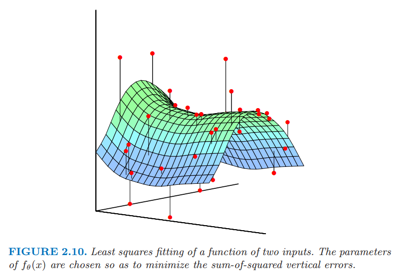

# 2.6 统计模型，监督学习和函数逼近

原文     | [The Elements of Statistical Learning](https://web.stanford.edu/~hastie/ElemStatLearn/printings/ESLII_print12.pdf#page=47)
      ---|---
翻译     | szcf-weiya
 发布 | 2016-09-30 
更新 | 2019-11-02 22:28:35
状态 | Done

我们的目标是寻找函数 $f(x)$ 的一个有用的近似 $\hat{f}(x)$，函数 $f(x)$ 蕴含着输入与输出之间的预测关系．在前面统计判别理论的章节的理论准备中，对于定量的响应，我们看到平方误差损失引导我们得到了回归函数 $f(X)=\E(Y\mid X=x)$．最近邻方法可以看成是对条件期望的直接估计，但是我们可以看到至少在两个方面它们不起作用

- 如果输入空间的维数高，则最近邻不必离目标点近，而且可能导致大的误差
- 如果知道存在特殊的结构，可以用来降低估计的偏差与方差．

我们预先用了关于 $f(X)$ 的其它类别的模型，在很多情形下是为了解决维数问题而特别设计的，现在我们讨论把它们合并进一个预测问题的框架．

## 联合分布 $\Pr(X,Y)$ 的统计模型

假设事实上我们的数据是从统计模型

$$
Y=f(X)+\varepsilon\tag{2.29}\label{2.29}
$$

中产生的,其中随机误差 $\varepsilon$ 满足 $\E(\varepsilon)=0$ 且与 $X$ 独立．注意到这个模型 $f(x)=\E(Y\mid X=x)$，而且事实上条件分布 $\Pr(Y\mid X)$ 只通过条件均值 $f(X)$ 依赖于 $X$．

可加误差模型是一个对真实情况的有用近似．对于大多数系统输入输出对 $(X,Y)$ 没有一个确定的关系 $Y=f(X)$．一般地，存在不可测量的变量对 $Y$ 起作用，包括测量误差．该可加误差模型假设我们可以通过误差 $\varepsilon$ 从确定关系中捕捉所有的偏移量．

对于有些问题确实存在一个确定的关系．许多在机器学习中讨论的分类问题都是这个形式，其中，**响应曲面 (response surface)** 可以认为是定义在 $\IR^p$ 中的着色映射．这些训练数据由映射 $\\{x_i,g_i\\}$ 中的彩色样本构成，我们的目标是对每一点着色．这里函数是确定的，并且随机量体现在训练数据的位置 $x$ 上．现在我们不去追究这个问题，但是将会看到这个可以通过合适的基于误差的模型技巧解决．

式 \eqref{2.29} 并不严格需要误差是独立同分布这一假设，但是当我们在 EPE 准则下均匀地对平方误差进行平均时这个假设似乎出现在我们脑海后面．正如在式 \eqref{2.1} 一样，对于这样的一个模型，用最小二乘作为模型估计的数据准则变得很自然．

!!! note "weiya 注: Recall"
    $$
    \hat{Y} = \hat{\beta}_0+\sum\limits_{j=1}^{p}X_j\hat{\beta}_j
    \tag{2.1}\label{2.1}
    $$

一些简单的修改可以避免独立性的假设；举个例子，我们可以有 $\Var(Y\mid X=x)=\sigma(x)$，则均值和方差都依赖于 $X$．一般地，条件分布 $\Pr(Y\mid X)$ 可以以某种复杂的方式依赖 $X$，但是可加误差模型排除了这些情形．

至今为止我们集中考虑定量的响应变量．可加误差模型一般不用于定性的输出变量 $G$；这种情形下目标函数 $p(X)$ 是条件密度 $\Pr(G\mid X)$，这是直接建模的．举个例子，对于两个类别的数据，假设数据来自独立的二元试验总是合理的，特定的一个输出的概率是 $p(X)$，另一个为 $1-p(X)$．因此，如果 $Y$ 是 $0$-$1$ 编码的 $G$，然后 $\E(Y\mid X=x)=p(x)$，但是方差同样依赖 $x$：$\Var(Y\mid X=x)=p(x)[1-p(x)]$.

## 监督学习

在推出更多的统计导向的术语之前，我们首先从机器学习的角度提出函数拟合的范例．简便起见，假设误差可加，即模型 $Y=f(X)+\varepsilon$ 是合理的假设．监督学习试图通过 **老师 (teacher)** 从样本中来学习 $f$．在观测系统中，无论输入还是输出，构成了观测值为 ${\cal T}=(x_i,y_i),i=1,\ldots,N$ 的 **训练集 (training)**．对系统 $x_i$ 的观测输入馈送到人工系统，被称作学习算法（通常是计算机程序），同时针对输入变量产生输出 $\hat{f}(x_i)$．学习算法能够根据原始输出和产生的输出之间的差异 $y_i-\hat{f}(x_i)$ 来修改输入和输出的关系 $\hat{f}$．这一过程被称作 **样本学习 (learning by example)**．完成学习过程的希望是，人工输出与实际输出足够地接近，这样对所有实际可能会出现的输入是有帮助的．

## 函数逼近

上节中的学习范例已经成为了机器学习领域（类比人类思考）和神经网络（类比生物学中的大脑）领域中监督学习研究的动力．应用数学和统计学中采用的方法是从函数逼近和估计的角度出发．数据对 $\\{x_i,y_i\\}$ 被看成是 $(p+1)$ 维欧几里得空间的点．函数 $f(X)$ 的定义域为 $p$-维输入子空间，通过一个模型如 $y_i=f(x_i)+\varepsilon_i$ 关联这些数据．为了方便，本章中假设定义域为 $p$ 维的欧几里得空间 $\IR^p$，尽管输入可能是混合类型．给定 $\cal T$ 的表示，目标是对于 $\IR^p$ 的某些区域里面的所有 $x$ 得到一个对 $f(x)$ 有用的近似．尽管相比较学习的范例不是那么优美，但把监督学习看成函数逼近的问题可以将欧式空间里面的几何概念以及概率推断中的数学概念应用到问题中．这也是本书的方式．

我们将要遇到的许多近似都与一系列系数 $\theta$ 有关，可以修改这些系数去适应手头上数据．举个例子，线性模型 $f(x)=x^T\beta$ 中 $\theta=\beta$．另外一种有用的近似可以表示为 **线性基展开 (linear basis expansions)**．

$$
f_{\theta}(x)=\sum\limits_{k=1}^{K}h_k(x)\theta_k\tag{2.30}
$$

其中，$h_k$ 是适合输入向量 $x$ 的一系列函数或变换关系．传统的例子有多项式或者三角函数，其中 $h_k$ 可能是 $x_1^2,x_1x_2^2,\cos(x_1)$ 等等．我们也会遇到非线性展开的情况，比如说神经网络模型中常见的 sigmoid 变换

$$
h_k(x)=\dfrac{1}{1+\exp(-x^T\beta_k)}\tag{2.31}
$$

当我们处理线性模型，可以用最小二乘来估计 $f_{\theta}$ 中的参数 $\theta$，也就是最小化下面关于 $\theta$ 的残差平方和
$$
\RSS(\theta)=\sum\limits_{i=1}^N(y_i-f_{\theta}(x_i))^2\,.
\tag{2.32}
$$
这似乎也是一个可加性误差模型的合理的准则．就函数逼近而言，我们想象我们的含参函数是 $p+1$ 维空间里面的一个曲面，而我们的观测是带有一定噪声的曲面上的取值．当 $p=2$ 时是很容易可视化的，而且此时垂直坐标为输出 $y$，正如在图 2.10 中显示的那样．噪声是在输出的坐标上的，所以我们寻找一组参数使得拟合后的曲面尽可能接近观测点，其中近是用 $\RSS(\theta)$ 中的垂直平方误差来衡量．

> 关于两个输入变量的函数的最小二乘拟合．选择 $f_{\theta}(x)$ 的系数使得垂直误差平方和最小．

对于线性模型我们得到该最小化问题的一个简单的 **闭型 (closed)** 解．如果基本函数本身没有任何隐藏的参数，这种方法也适用．否则这种解决方法不是需要迭代的方法就是需要数值优化．

!!! note "weiya 注：closed form expression"
    根据 [wiki: Closed-form expression](https://en.wikipedia.org/wiki/Closed-form_expression)，closed-form 是指可以进行有限次赋值的表达式，其中可能包含常数、变量、常见的运算符（加减乘除）或函数（指数、对数、三角函数），但是通常不存在极限运算。依此理解，粗略地说，有显式解的应当为 closed form solution．

尽管最小二乘在一般情况下非常方便，但并不是唯一的准则，而且在一些情形下没有意义．一个更一般的估计准则是 **极大似然估计 (maximum likelihood estimation)**．假设我们有一个指标为 $\theta$ 的密度为 $\Pr_{\theta}(y)$ 的随机样本 $y_i,i=1,\ldots,N$．观测样本的概率对数值为
$$
L(\theta) = \sum\limits_{i=1}^N\log\Pr\nolimits_{\theta}(y_i)\tag{2.33}
$$
极大似然的原则是假设最合理的 $\theta$ 值会使得观测样本的概率最大．可加误差模型 $Y=f_{\theta}(X)+\varepsilon, \varepsilon \sim N(0,\sigma^2)$ 的最小二乘，等价于使用下面条件概率的极大似然
\begin{equation}
\Pr(Y\mid X,\theta) = N(f_{\theta}(X),\sigma^2)\tag{2.34}
\end{equation}
所以尽管正态的附加假设似乎更加限制，但结果是一样的．数据的对数概率值是
$$
L(\theta)=-\dfrac{N}{2}\log(2\pi)-N\log\sigma-\dfrac{1}{2\sigma^2}\sum\limits_{i=1}^{N}(y_i-f_{\theta}(x_i))^2\tag{2.35}
$$
涉及 $\theta$ 的项是最后一项，是 $\RSS(\theta)$ 乘以一个非负标量乘子．

一个更有趣的例子是对于定性输出 $G$ 的回归函数 $\Pr(G\mid X)$ 的多项式概率．假设我们有一个模型，给定 $X$，每一类的条件概率为 $\Pr(G={\cal G}\mid X=x)=p_{k,\theta}(x),k=1,\ldots,K$，指标是参数向量 $\theta$．然后对数概率（也被称作**交叉熵 (cross-entropy)**）为
$$
L(\theta)=\sum\limits_{i=1}^N\log p_{g_i,\theta}(x_i)\tag{2.36}
$$
当最大化 $L$ 时，它提供的 $\theta$ 最符合该似然意义上的数据．