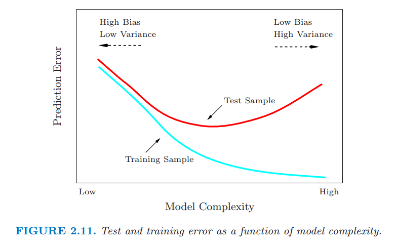

# 2.9 模型选择和偏差-方差的权衡

原文     | [The Elements of Statistical Learning](https://web.stanford.edu/~hastie/ElemStatLearn/printings/ESLII_print12.pdf#page=56)
      ---|---
翻译     | szcf-weiya
 发布 | 2016-09-30 
更新 | 2018-02-14; 2018-02-21
状态 | Done

上面讨论的所有模型以及其他将要在后面章节讨论的模型都有一个 **光滑 (smoothing)** 或 **复杂性 (complexity)** 参数需要确定：

- 惩罚项的乘子
- 核的宽度
- 基函数的个数

在光滑样条的情形下，参数 $\lambda$ 表示了从直线拟合到插值的各种模型．类似地，degree 为 $m$ 的局部多项式模型从 **窗宽 (window size)** 无限大时阶为 $m$ 的全局多项式到 **窗宽 (window size)** 至零时的插值拟合模型．这意味着我们不能用训练数据的残差平方和来确定这些参数，因为我们总是选择插值拟合，因为能达到零残差．这样的一个模型不可能用来预测未来的数据．

$k$ 最近邻回归的拟合值 $\hat{f}_k(x_0)$ 有效地说明了其有与上述近似方法的竞争力．假设数据来自模型 $Y=f(X)+\epsilon, \E(\epsilon)=0,\Var(\epsilon)=\sigma^2$．为了简化，我们假设样本中的值 $x_i$ 提前修正好（不是随机）．在 $x_0$ 处的期望预测误差，也被称为 **测试 (test)** 或 **泛化 (generalization)** 误差，可按如下方式分解：
$$
\begin{align*}
\EPE_k(x_0)&=\E[(Y-\hat{f}_k(x_0))^2\mid X=x_0]\notag\\
&=\sigma^2+[Bias^2(\hat{f}_k(x_0))+Var_{\cal T}(\hat{f}_k(x_0))]\label{2.46}\\
&=\sigma^2+[f(x_0)-\frac{1}{k}\sum\limits_{\ell=1}^kf(x_{(\ell)})]^2+\frac{\sigma^2}{k}\label{2.47}
\end{align*}
$$
带括号的下标 $(\ell)$ 表示 $x_0$ 的最近邻的顺序．

在展开式中有三项．第一项 $\sigma^2$ 是 **不可约减的 (irreducible)** 误差——是新测试目标点的方差——而且我们不能够控制，即使我们知道真值 $f(x_0)$

第二项和第三项在我们的控制范围内，并且构成了估计 $f(x_0)$ 时 $\hat f_k(x_0)$ 的 **均方误差 (mean squared error)**，均方误差经常被分解成偏差部分和方差部分．偏差项是真值均值 $f(x_0)$ 与估计的期望值之间差异的平方——$[\E_{\cal T}(\hat{f}\_k(x_0))-f(x_0)]^2$——其中期望平均了训练数据中的随机量．如果真实的函数相当地光滑，这一项很可能随着 $k$ 的增加而增加．对于较小的 $k$ 值和较少的近邻点会导致值 $f(x_{(\ell)})$ 与 $f(x_0)$ 很接近，所以它们的平均应该距离 $f(x_0)$ 很近．当 $k$ 值增加，邻域远离，然后任何事情都可能发生．

这里的方差项是方差的简单平均，因为 $k$ 的倒数关系，随 $k$ 变大而变小．所以当 $k$ 变化，会有 **偏差——误差的权衡 (bias-variance tradeoff)**．

更一般地，随着我们过程的 **模型复杂度 (model complexity)** 增加，方差趋于上升，偏差趋于下降．当模型复杂度下降时会发生相反的行为．对于 $k$-最近邻，模型复杂度由 $k$ 来控制．

一般地，我们选择模型复杂度使偏差与方差达到均衡从而使测试误差最小．测试误差的一个明显的估计是 **训练误差 (training error)** $\frac{1}{N}\sum_i(y_i-\hat{y}_i)^2$．不幸的是，训练误差不是测试误差的良好估计，因为这不能解释模型复杂度．

> 图2.11：测试和训练错误随模型复杂度变化

图 2.11 显示了不同模型复杂度下测试和训练误差的一般表现．无论何时增加模型复杂度（换句话说，无论何时更精细地(harder)拟合数据），训练误差都趋于下降．然而过度的拟合，模型会自适应使得更加接近训练数据，但不能很好地进行泛化（比如说，测试误差很大）．正如式 (2.46) 的最后一项，在这种情形下，预测值 $\hat{f}(x_0)$ 的方差较大．相反地，如果模型不是特别的复杂，会 **欠拟合 (underfit)** 且有较大的偏差，也导致不能很好地泛化．在第 7 章中，我们考虑估计预测方法的测试误差的各种方式，并因此在给定的预测方法和训练集下，估计出最优的模型复杂度．
