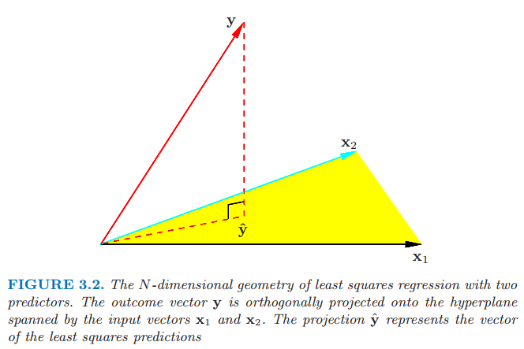
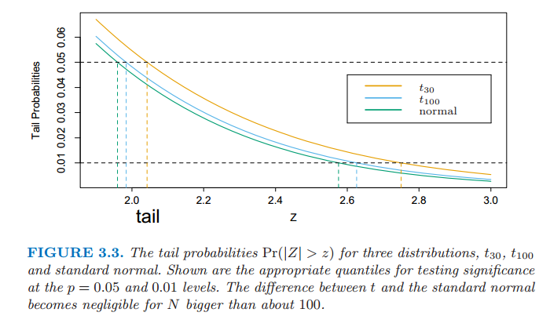
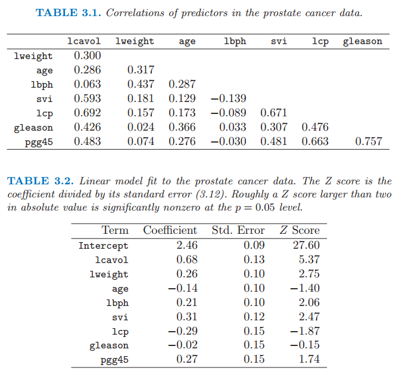
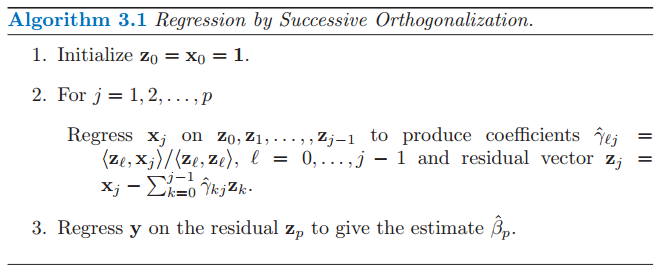

# 线性回归模型和最小二乘法

| 原文   | [The Elements of Statistical Learning](../book/The Elements of Statistical Learning.pdf) |
| ---- | ---------------------------------------- |
| 翻译   | szcf-weiya                               |
| 时间   | 2016-08-03                               |
|更新|2017-10-31, 2017-12-27|

> 更新笔记
>
> @2017-12-27　最近在看power analysis的有关内容，R in Action一书中举了了例子来讨论对于不同模型如何进行power analysis，但其中关于线性模型的部分没有想清楚。后来在这一节的式(3.13)找到答案，为丰富本节内容，遂更新与式3.13有关的power analysis.

正如第二章介绍的那样，我们有输入向量$X^T=(X\_1,X\_2,\ldots,X\_p)$，而且想要预测实值输出变量$Y$。线性回归模型有如下形式

$$
f(X)=\beta_0+\sum\limits_{j=1}^pX_j\beta_j \qquad (3.1)
$$

线性模型要么假设回归函数$E(Y\mid X)$是线性的，要么假设它本身是一个合理的近似。这里$\beta_j$是未知的参数或系数，变量$X_j$可以有下列不同的来源：

- 定量的输入变量
- 定量输入变量的变换，比如对数变换，平方根变换或者平方变换
- 基函数展开，比如$X_2=X_1^2,X_3=X_1^3$，产生一个多项式的表示
- 定性输入变量水平(level)的数值或“虚拟”编码。举个例子，如果$G$是有5个水平的输入变量，我们可能构造$X_j,j=1,\ldots,5$使得$X_j=I(G=j)$。通过一系列独立于水平的常数，整个$X_j$可以用来表示$G$的效应，因为在$\sum_{j=1}^5X_j\beta_j$中，其中一个$X_j$的系数为1，其它的都是0。
- 变量的交叉影响，举个例子，$X_3=X_1\cdot X_2$

无论$X_j$是哪个来源，模型关于参数都是线性的。

一般地，我们有一个用来估计参数$\beta$的训练数据集合$(x_1,y_1),\ldots,(x_N,y_N)$。每个$x_i=(x_{i1},x_{i2},\ldots,x_{ip})^T$是第$i$种情形的特征测量值的向量。最受欢迎的估计方法是最小二乘(least squares)，我们取参数$\beta=(\beta_0,\beta_1,\ldots,\beta_p)^T$使得下式的残差平方和最小
$$
\begin{align}
RSS(\beta)&=\sum\limits_{i=1}^N(y_i-f(x_i))^2\\
&=\sum\limits_{i=1}^N(y_i-\beta_0-\sum\limits_{j=1}^px_{ij}\beta_j)^2\qquad (3.2)
\end{align}
$$

从统计学的观点来看，如果训练观测值$(x_i,y_i)$是从总体独立随机抽取的，则该标准是很合理的。即使$x_i$'s不是随机选取的，如果在给定输入$x_i$的条件下$y_i$条件独立，这个准则也是有效的。图3.1展示了在充满数据对$(X,Y)$的$R^{p+1}$维空间的最小二乘拟合的几何意义。注意到(3.2)对模型(3.1)的有效性没有作假设，而是简单地找到对数据最好的线性拟合。无论数据是怎样产生的，最小二乘拟合直观上看是满意的，这个准则衡量了平均的拟合误差。

> 图3.1 $X\in R^2$中的最小二乘拟合。我们寻找关于$X$并且使$Y$的残差最小的线性函数。

那我们应该怎样最小化(3.2)？记$\mathbf{X}$为$N\times (p+1)$的矩阵，矩阵每一行为一个输入向量(在第一个位置为1)，类似地令$\mathbf{y}$为训练集里的$N$个输出向量。然后我们可以将残差平方和写成如下形式
$$
RSS(\beta)=(\mathbf{y}-\mathbf{X}\beta)^T(\mathbf{y}-\mathbf{X}\beta)\qquad (3.3)
$$

这是含$p+1$个参数的二次函数。关于$\beta$求导有
$$
\begin{array}{ll}
\dfrac{\partial RSS}{\partial \beta}&=-2\mathbf{X}^T(\mathbf{y}-\mathbf{X}\beta)\\
\dfrac{\partial^2 RSS}{\partial \beta\partial \beta^T}&=2\mathbf{X}^T\mathbf{X}
\end{array}
\qquad (3.4)
$$

假设$\mathbf{X}$列满秩，因此$\mathbf{X}^T\mathbf{X}$是正定的，我们令一阶微分为0，即
$$
\mathbf{X}^T(\mathbf{y}-\mathbf{X}\beta)=0\qquad (3.5)
$$

得到唯一解
$$
\hat{\beta}=(\mathbf{X}^T\mathbf{X})^{-1}\mathbf{X}^T\mathbf{y}\qquad (3.6)
$$

在输入向量$x_0$下的预测值由$\hat{f}(x_0)=(1:x_0)^T\hat{\beta}$给出；在训练输入值下的拟合值为
$$
\hat{y}=\mathbf{X}\hat{\beta}=\mathbf{X}(\mathbf{X}^T\mathbf{X})^{-1}\mathbf{X}^T\mathbf{y}\qquad (3.7)
$$

其中，$\hat y_i=\hat f(x_i)$。在式(3.7)中出现的矩阵$\mathbf{H=X(X^TX)^{-1}X^T}$有时称之为“帽子”矩阵，因为其为$\mathbf y$戴了一顶帽子。

> 图3.2 含两个预测的最小二乘回归的$N$维几何图形。输出向量$\mathbf{y}$正交投影在输入向量$\mathbf{x}_1$和$\mathbf{x}_2$张成的超空间中。投影向量$\hat{\mathbf{y}}$表示最小二乘法的预测值

图3.2展示了在$R^N$中最小二乘估计的的不同几何表示。我们记$\mathbf{X}$的列向量为$\mathbf(x_0,x_1,\ldots,x_p)$,其中$x_0 \equiv 1$。下文中第一列都是这样假设。这些向量张成了$R^N$的子空间，也被称作$\mathbf{X}$的列空间。我们通过选择$\hat{\beta}$来最小化$RSS(\beta)=\lVert(\mathbf{y}-\mathbf{X}\beta)\rVert^2$，则残差向量$\mathbf{y-\hat{y}}$正交于子空间。(3.5)式描述了这种正交，然后估计值$\hat{y}$因此可以看成是$\mathbf{y}$在子空间中的正交投影。帽子矩阵$\mathbf{H}$计算了正交投影，因此也被称作投影矩阵。

可能会出现$\mathbf{X}$的列不是线性独立的，则$\mathbf{X}$不是满秩的。举个例子，如果两个输入是完全相关的，（比如，$x_2=3x_1$）。则矩阵$\mathbf{X^TX}$是奇异的，并且最小二乘的系数$\hat{\beta}$不是唯一的。然而，拟合值$\mathbf{\hat{y}}=\mathbf{X}\hat{\beta}$仍然是$\mathbf{y}$在列空间$\mathbf{X}$的投影；对于$\mathbf{X}$的列向量有多种方式表达这种投射。当一个或多个定性输入用一种冗余的方式编码时经常出现非满秩的情形。通过重编码或去除$\mathbf{X}$中冗余的列这些自然的方式去解决非唯一表示的问题。大多数回归软件包会监测这些冗余并且自动采用一些策略去除冗余项。秩缺失在信号和图像分析中经常发生，输入的个数$p$可以大于训练的情形$N$。在这种情形下，特征经常通过滤波来降维或者对拟合进行正则化。（5.2.3节和第18章）

截至目前我们已经对数据的真实分布做了很少的假设。为了约束$\hat{\beta}$的取样特点，我们现在假设观测值$y\_i$不相关，且有固定的方差$\sigma^2$，并且$x\_i$是固定的（非随机）。最小二乘法的参数估计的方差-协方差阵可以很容易从式(3.6)导出：
$$
Var(\hat{\beta})=(\mathbf{X}^T\mathbf{X})^{-1}\sigma^2\qquad (3.8)
$$

一般通过下式来估计方差$\sigma^2$
$$
\hat{\sigma}^2=\frac{1}{N-p-1}\sum\limits_{i=1}^N(y_i-\hat{y}_i)^2
$$

之所以分母是$N-p-1$而不是$N$，是因为$N-p-1$使得$\hat{\sigma}^2$为无偏估计：$E(\hat{\sigma}^2)=\sigma^2$

为了对参数和模型进行推断，需要一些额外的假设。我们现在假设式$(3.1)$是均值的正确模型；则$Y$的条件期望关于$X_1,X_2,\ldots,X_p$是线性的。我们也假设$Y$与其期望的偏差是可加的且是正态的。因此
$$
\begin{align}
Y&=E(Y\mid X_1,\ldots,X_p)+\varepsilon\\
&=\beta_0+\sum\limits_{j=1}^pX_j\beta_j+\varepsilon\qquad (3.9)
\end{align}
$$

其中误差$\epsilon$是期望值为0方差为$\sigma^2$的高斯随机变量，记作$\varepsilon\sim N(0,\sigma^2)$

由式(3.9),可以很简单地证明
$$
\hat{\beta}\sim N(\beta,(\mathbf{X}^T\mathbf{X})^{-1}\sigma^2) \qquad (3.10)
$$

这是一个有上述均值向量和方差-协方差矩阵的多元正态分布。同时有
$$
(N-p-1)\hat \sigma^2\sim \sigma^2\chi^2_{N-p-1}\qquad (3.11)
$$

是一个自由度为$N-p-1$的卡方分布。另外，$\hat{\beta}$和$\hat\sigma^2$是统计独立的。我们利用这些分布性质得到假设检验以及对于参数$\beta_j$的置信区间

> 图3.3 $t_{30}$,$t_{100}$以及标准正态三种分布的尾概率$Pr(|Z|>z)$。图中显示了在$p=0.05$和0.01水平下检验显著性的合适分位数。当$N$大于100时$t$分布与标准正态分布之间的差异很小。

为了检验系数$\beta_j$的这一假设，我们构造标准化因数或者Z-分数。
$$
z_j=\dfrac{\hat{\beta}_j}{\hat{\sigma}\sqrt{v_j}}\qquad  (3.12)
$$

其中$v_j$是$(\mathbf{X}^T\mathbf{X})^{-1}$的第$j$个对角元。零假设为$\beta_j=0$,$z_j$分布为$t_{N-p-1}$(自由度为$N-p-1$的$t$分布)，因此当$z_j$的绝对值较大时会拒绝零假设。如果用已知的$\sigma$值替换$\hat{\sigma}$，则$z_j$服从标准正态分布。$t$分布和标准正态分布在尾概率之间的差异随着样本规模增大可以忽略，因此我们一般使用正态的分位数（图3.3）。

我们经常需要同时检验多个系数(groups of coefficients)的显著性。举个例子，检验有$k$个水平的分类变量是否要从模型中排除，我们需要检验用来表示水平的虚拟变量的系数是否可以全部设为0。这里我们利用$F$统计量

$$
F=\dfrac{(RSS_0-RSS_1)/(p_1-p_0)}{RSS_1/(N-p_1-1)}\qquad (3.13)
$$

其中$RSS_1$是有$p_1+1$个参数的大模型的最小二乘法拟合的残差平方和，$RSS_0$是有$p_0+1$参数的小模型的最小二乘法拟合的残差平方和，其有$p_1-p_0$个参数约束为0。$F$统计量衡量了在大模型中每个增加的系数对残差平方和的改变，而且用$\sigma^2$的估计值进行标准化。在高斯分布以及小模型的零假设为正确的情况下，$F$统计量服从$F_{p_1-p_0,N-p_1-1}$分布。可以证明（习题3.1）（3.12）式中的$z_j$等于从模型中去除单系数$\beta_j$的$F$统计量，当$N$足够大时，$F_{p_1-p_0,N-p_1-1}$近似$\chi^2_{p_1-p_0}$

!!! note "weiya注"
    在R语言中，可以采用pwr包来进行power analysis。这里举一个实际例子来说明如何在线性回归模型中进行power analysis。

    假设我们要研究老板的领导风格对公司员工满意度的影响，同时员工满意度还与薪酬有关，其中薪酬用3个变量来衡量，而老板领导风格用4个变量来衡量。根据以往经验，薪酬能够解释员工满意度方差的30\%，现在问题是确定多少的调查个体，使得显著度为.05，而power为.90。求解代码如下
    
    其中u和v分别被称为分子、分母自由度。结合(3.13)式，我们可以看出$p_1-p_0=u, N-p_1-1=v$，并且这里$p_0=4, p_1=7$。换个角度看，其实式(3.13)就是用于power analysis的检验统计量，原假设为可以将领导力水平的四个变量系数设为0，若F足够大，则会拒绝原假设。

类似地，我们可以分离式（3.10）中的$\beta_j$得到$\beta_j$的置信水平为$1-2\alpha$的置信区间

$$
(\hat{\beta}_j-z^{1-\alpha}v_j^{1/2}\hat{\sigma},\hat{\beta}_j+z^{1-\alpha}v_j^{1/2}\hat{\sigma})\qquad (3.14)
$$

这里，$z^{1-\alpha}$是正态分布的$1-\alpha$分位数。
$$
\begin{align}
z^{1-0.025}&=1.96,\\
z^{1-0.05}&=1.645,etc.
\end{align}
$$

因此报告$\hat{\beta}\pm 2\cdot se(\hat{\beta})$的标准做法是约$95\%$的置信区间。即便没有高斯误差的假设，区间也近似正确，因为当样本规模$N\sim \infty$时，覆盖范围近似为$1-2\alpha$。

运用类似的方法我们可以得到全体系数向量$\beta$的近似置信集，记作

$$
C_{\beta} = \{\beta \mid (\hat{\beta}-\beta\mathbf\bf{X^TX}(\hat{\beta}-\beta)\le \hat{\sigma}^2\chi^{2^{(1-\alpha)}}_{p+1} \}
$$

其中，$\chi_\ell^{2^{(1-\alpha)}}$是$\ell$个自由度的卡方分布的$1-\alpha$的分位数：举个例子，$\chi^{2^{(1-0.05)}}\_5=11.1,\chi^{2^{(1-0.1)}}\_5=9.2$。这个关于$\beta$的置信集导出关于真函数$f(x)=x^T\beta$对应的置信集，记作$\{x^T\beta\mid \beta \in C_\beta\}$（练习3.2；并见5.2.2节中函数置信带的例子图5.4）

## 例子：前列腺癌

这个例子的数据来自Stamey et al. (1989)[^1]。他们检验即将接受彻底前列腺切除术男性的前列腺特定抗原水平和一系列临床措施之间的相关性。变量有癌体积的对数值(lcavol)、前列腺重量的对数值(lweight)、良性前列腺增生数量(lbph)、精囊浸润(svi)、包膜浸透的对数值(lcp)、Gleason得分(gleason)、Gleason得分为4或5的比例(pgg45)。表3.1中给出的预测变量的相关性矩阵显示了很多强相关性。第1章的图1.1（第3页）是散点图矩阵，显示了变量两两间的图像。我们看到svi是二进制变量，gleason是有序分类变量。举个例子，我们看到lcavol和lcp都与响应变量lpsa有强的相关性。我们需要联合拟合这些影响来解开预测变量和响应变量之间的关系。

>表3.1 前列腺癌数据中预测变量的相关系数
表3.2 前列腺癌数据的线性模型拟合。$Z$分数为系数除以标准误差（3.12）。大体上，$Z$分数绝对值大于2表示在$p=0.05$的水平下显著不为零。

我们对前列腺特定抗原的对数值lpsa和经过一次标准化有单位方差的预测变量进行线性模型拟合。我们随机将数据集分离得到规模为67的训练集以及规模为30的测试集。我们对训练集应用最小二乘估计得到表3.2中的估计值、标准误差以及$Z$分数。$Z$分数定义式为(3.12)，并且衡量了从模型中去掉该变量的影响。在$5\%$的水平下，$Z$分数的绝对值大于2近似显著。（在我们的例子中，我们有9个参数，$t_{67-9}$的分布的0.025尾分位数是$\pm 2.002$!） 预测变量lcavol显示了最强的影响，lweight和svi的影响同样显著。注意到一旦lcavol在模型中，lcp便不显著（当使用一个没有lcavol的模型，lcp是强显著的）。我们也可以用$F$统计量（3.13）一次除去一些项。举个例子，我们考虑除掉表3.2中所有不显著的项，age,lcp,gleason以及pgg45。我们得到

$$
F=\dfrac{(32.81-29.43)/(9-5)}{29.43/(67-9)}=1.67\qquad (3.16)
$$

其中，$p$值为0.17（$Pr(F_{4,58}>1.67)=0.17$）,因此不是显著的。

测试数据的平均预测误差为0.521。相反地，使用lpsa训练数据的平均值预测的测试误差为1.057，称作“基本误差阶”。因此线性模型将基本误差阶降低了大概$50\%$。下文中我们将要回到这个例子来比较不同的选择和收缩方法。

## Guass-Markov定理

统计学中一个很有名的结论称参数$\beta$的最小二乘估计在所有的线性无偏估计中有最小的方差。我们将要严谨地说明这一点，并且说明约束为无偏估计不是明智的选择。这个结论导致我们考虑本章中像Ridge回归的有偏估计。我们考虑任意参数$\theta = a^T\beta$的线性组合，举个例子，预测值$f(x_0)=x_0^T\beta$是这种形式。$a^T\beta$的最小二乘估计为

$$
\hat{\theta}=a^T\hat{\beta}=a^T\mathbf{(X^TX)^{-1}X^Ty}\qquad (3.17)
$$

考虑$\mathbf{X}$固定，这是关于响应变量$\mathbf{y}$的线性函数$\mathbf{c}_0^T\mathbf{y}$。如果我们假设线性模型是正确的，$a^T\hat{\beta}$是无偏的，因为
$$
\begin{align}
E(a^T\hat{\beta})&=E(a^T\mathbf{(X^TX)^{-1}X^Ty})\\\\
&=a^T\mathbf{(X^TX)^{-1}X^TX}\beta\\\\
&=a^T\beta\qquad (3.18)
\end{align}
$$

Gauss-Markov定理说如果我们有$a^T\beta$的其它无偏估计$\tilde{\theta}=\mathbf{c}^T\mathbf{y}$,也就是$E(\mathbf{c}^T\mathbf{y})=a^T\beta$,则

$$
Var(a^T\hat{\beta})\le Var(\mathbf{c}^T\mathbf{y})\qquad (3.19)
$$

该证明（习题3.3）运用三角不等式。为了简化我们已经用单个参数$a^T\beta$估计来叙述结果，但是再加点新的定义我们可以用整个参数向量$\beta$来说明（练习3.3）

考虑$\theta$估计$\tilde{\theta}$的均方误差

$$
\begin{align}
MSE(\tilde{\theta})&=E(\tilde{\theta}-\theta)^2\\\\
&=Var(\tilde{\theta})+[E(\tilde{\theta})-\theta]^2\qquad (3.20)
\end{align}
$$

第一项为方差，第二项为平方偏差。Gauss-Markov定理表明最小二乘估计在所有无偏线性估计中有最小的均方误差。然而，或许存在有较小均方误差的有偏估计。这样的估计用小的偏差来换取方差大幅度的降低。有偏估计经常使用。任何收缩或者将最小二乘的一些参数设为0的方法都可能导致有偏估计。我们将在章节的后面讨论许多例子，包括变量子集选择和岭回归。从一个更加实际的观点来看，许多模型是对事实的曲解，因此是有偏的；挑选一个合适的模型意味着要在偏差和方差之间创造某种良好的平衡。我们将在第7章中详细讨论这些问题。

正如在第2章中讨论的那样，均方误差与预测的正确性紧密相关。考虑在输入$x_0$处的新响应的预测

$$
Y_0=f(x_0)+\varepsilon_0 \qquad (3.21)
$$

则估计$\tilde{f}(x_0)=x_0^T\tilde{\beta}$的预测误差期望值为

$$
\begin{align}
E(Y_0-\tilde{f}(x_0))^2 &=\sigma^2+E(x_0^T\tilde{\beta}-f(x_0))^2\\
&= \sigma^2+MSE(\tilde{f}(x_0))\qquad (3.22)
\end{align}
$$

因此，预测误差的估计值和均方误差只有常数值$\sigma^2$的差别，$\sigma^2$表示了新观测$y_0$的方差。

## 从简单单变量回归到多重回归

有$p>1$个输入的线性模型（3.1）称作多重线性回归模型。模型（3.6）的最小二乘估计用单（$p=1$）变量线性模型的估计最好理解，我们将在这部分指出。

首先假设我们有一个没有截距的单变量模型，也就是

$$
Y=X\beta + \varepsilon \qquad (3.23)
$$

最小二乘估计和残差为

$$
\begin{align}
\hat{\beta}&=\dfrac{\sum_1^Nx_iy_i}{\sum_1^Nx_i^2}\\\\
r_i &= y_i -x_i\hat{\beta}
\end{align}
\qquad (3.24)
$$

为了简便用向量表示，我们令$\mathbf{y}=(y_1,\ldots,y_N)^T$,$\mathbf{x}=(x_1,\ldots,x_N)^T$，并且定义
$$
\begin{align}
\langle\mathbf{x},\mathbf{y}\rangle &= \sum\limits_{i=1}^Nx_iy_i\\
&=\mathbf{x^Ty}\qquad (3.25)
\end{align}
$$

$\mathbf{x}$和$\mathbf{y}$之间的内积，于是我们可以写成

$$
\begin{align}
\hat{\beta}&=\dfrac{\langle \mathbf{x,y}\rangle}{\langle\mathbf{x,x} \rangle}\\
\mathbf{r}&=\mathbf{y}-\mathbf{x}\hat{\beta}
\end{align}
\qquad (3.26)
$$

!!! note "作者注"
    The inner-product notation is suggestive of generalizations of linear regression to different metric spaces, as well as to probability spaces. 内积表示是线性回归模型一般化到不同度量空间（包括概率空间）建议的方式。

正如我们所看到的，这个简单的单变量回归提供了多重线性回归的框架（building block）。进一步假设输入变量$\mathbf{x}_1,\mathbf{x_2,\ldots,x_p}$（数据矩阵$\mathbf{X}$的列）是正交的；也就是对于所有的$j\neq k$有$\langle x_j,x_k\rangle=0$。于是很容易得到多重最小二乘估计$\hat{\beta}_j$等于$\langle \mathbf{x}_j,\mathbf{y}\rangle/\langle\mathbf{x}_j,\mathbf{x}_j\rangle $——单变量估计。换句话说，当输入变量为正交的，它们对模型中其它的参数估计没有影响。

正交输入变量经常发生于平衡的、设定好的实验（强制了正交），但是对于实验数据几乎不会发生。因此为了后面实施这一想法我们将要对它们进行正交化。进一步假设我们有一个截距和单输入$\bf{x}$。则$\bf{x}$的最小二乘系数有如下形式

$$
\hat{\beta}_1=\dfrac{\langle \mathbf{x}-\bar{x}\mathbf{1},\mathbf{y}\rangle}{\langle \mathbf{x}-\bar{x}\mathbf{1},\mathbf{x}-\bar{x}\mathbf{1}\rangle}\qquad (3.27)
$$

其中，$\bar{x}=\sum_ix_i/N$,且$N$维单位向量$\mathbf{1}=x_0$。我们可以将式（3.27）的估计看成简单回归（3.26）的两次应用。这些步骤是：
1. 在$\bf{1}$上回归$\bf{x}$产生残差$\mathbf{z}=\mathbf{x}-\bar{x}\mathbf{1}$;
2. 在残差$\bf{z}$上回归$\bf{y}$得到系数$\hat{\beta}_1$
   在这个过程中，“在$\bf{a}$上回归$\bf{b}$”意思是$\bf{b}$在$\bf{a}$上的无截距的简单单变量回归，产生系数$\hat{\gamma}=\langle\mathbf{a,b}\rangle/\langle\mathbf{a,a}\rangle$以及残差向量$\mathbf{b}-\hat{\gamma}\mathbf{a}$。我们称$\bf{b}$由$\bf{a}$校正[^adjusted for],或者关于$\bf{a}$正交化。

第一步对$\mathbf{x}$作关于$\mathbf{x}_0=\mathbf{1}$的正交化。第二步是一个利用正交预测变量$\mathbf{1}$和$\mathbf{z}$简单的单变量回归。图3.4展示了两个一般输入$\mathbf{x}_1$和$\mathbf{x}_2$的过程。正交化不会改变由$\mathbf{x}_1$和$\mathbf{x}_2$张成的子空间，它简单地产生一个正交基来表示子空间。

正交输入的最小二乘回归。向量$\mathbf{x}_2$在向量$\mathbf{x}_1$上回归，得到残差向量$\mathbf{z}$。$\mathbf{y}$在$\mathbf{z}$上的回归给出$\mathbf{x}_2$的系数。把$\mathbf{y}$在$\mathbf{x}_1$和$\mathbf{z}$上的投影加起来给出了最小二乘拟合$\mathbf{\hat{y}}$.

这个方法可以推广到$p$个输入的情形，如算法3.1所示。注意到第二步的输入$\mathbf{z}_0,\ldots,\mathbf{z}_{j-1}$是正交的，因此这里计算得到的简单回归的系数实际上是多重回归的系数。

<!--
****
**算法 3.1** 依次正交的回归
****
1. 初始化 $\mathbf{z}_0=\mathbf{x}_0=\mathbf{1}$
2. 对于 $j=1,2,\ldots,p$
    在$\mathbf{z}_0,\mathbf{z}_1,\ldots,\mathbf{z}_{j-1}​$上对$\mathbf{x}_j​$回归得到系数$\hat{\gamma}_{\ell j}=\langle \mathbf{z}_{\ell},\mathbf{x}_j \rangle/\langle\mathbf{z}_{\ell},\mathbf{z}_{\ell}\rangle,\ell=0,\ldots,j-1$以及残差向量$\mathbf{z}_j=\mathbf{x}_j-\sum_{k=0}^{j-1}\hat{\gamma}_{kj}\mathbf{z}_k$
3. 在残差$\mathbf{z}_p$上回归$\mathbf{y}$得到系数$\hat{\beta}_p$
****
-->

算法的结果为
$$
\hat{\beta}_p=\dfrac{\langle \mathbf{z}_p,\mathbf{y} \rangle}{\langle \mathbf{z}_p,\mathbf{z}_p \rangle}\qquad (3.28)
$$

对第二步中的残差进行重排列，我们可以看到每个$\mathbf x_j​$是$\mathbf z_k,k\le j​$的线性组合。因为$\mathbf z_j​$是正交的，它们形成了$\mathbf{X}​$列空间的基，从而得到最小二乘在子空间上投影为$\hat{\mathbf{y}}​$。因为$\mathbf z_p​$仅与$\mathbf x_p​$有关(系数为1)，我们可以看到系数(3.28)确实是$\mathbf{y}​$在$\mathbf x_p​$上多重回归的系数。这一重要结果揭示了在多重回归中相关输入的影响。注意到通过对$\mathbf x_j​$重排列，任何其中一个都有可能是最后一个，然后得到一个类似的结果。因此一般来说，我们已经展示了多重回归的第$j​$个系数是$\mathbf{y}​$在$\mathbf x_{j\cdot 012...(j-1)(j+1)...,p}​$的单变量回归，$\mathbf x_{j\cdot 012...(j-1)(j+1)...,p}​$是$\mathbf x_j​$ 在$\mathbf x_0,\mathbf x_1,...,\mathbf x_{j-1},\mathbf{j+1},...,\mathbf{x}_p​$回归后的残差向量：

> 多重回归系数$\hat\beta_j​$表示$\mathbf x_j​$经过$\mathbf x_0,\mathbf x_1,\ldots,\mathbf x_{j-1},\mathbf x_{j+1},\ldots,\mathbf x_p​$调整后$\mathbf x_j​$对$\mathbf y​$额外的贡献

如果$\mathbf{x}_p$与某些$\mathbf{x}_k$高度相关，残差向量$\mathbf{z}_p$会近似等于0，而且由(3.28)得到的系数$\hat{\beta}_p$会非常不稳定。在相关集对于所有的变量都是正确的。在这些情形下我们可能得到所有的Z分数（表3.2所示）都很小——集中的任何一个都可以删掉——然而我们不可能删掉所有。由（3.28）我们也得到估计方差（3.8）的另一种方法
$$
Var(\hat{\beta}_p)=\dfrac{\sigma^2}{\langle \mathbf{z}_p,\mathbf{z}_p \rangle}=\dfrac{\sigma^2}{\Vert\mathbf{z}_p\Vert ^2}\qquad (3.29)
$$

换句话说，我们估计$\hat{\beta}_p$的精度取决于残差向量$\mathbf{z}_p$的长度;它表示$\mathbf{x}_p$不能被其他$\mathbf{x}_k$解释的程度。

算法3.1被称作多重回归的Gram-Schmidt正交化，也是一个计算估计的有用的数值策略。我们不仅从中不仅可以得到$\hat{\beta}_p$,而且可以得到整个多重最小二乘拟合，如练习3.4所示。

我们可以用矩阵形式来表示算法3.1的第二步：

$$
\mathbf{X=Z\Gamma}\qquad (3.30)
$$

其中$\mathbf{Z}$是$\mathbf{z_j}$（按顺序）作为列向量的矩阵，$\mathbf{\Gamma}$是值为$\hat{\gamma}_{kj}$的上三角矩阵。引入第$j$个对角元$D_{jj}=\Vert \mathbf{z}_j \Vert$的对角矩阵$\mathbf{D}$，我们有
$$
\begin{align}
\mathbf{X}&=\mathbf{ZD^{-1}D\Gamma}\\\\
&=\mathbf{QR}\qquad (3.31)
\end{align}
$$

称为矩阵$\mathbf{X}$的QR分解。这里$\mathbf{Q}$为$N\times (p+1)$正交矩阵，$\mathbf{Q^TQ=I}$,并且$\mathbf{R}$为$(p+1)\times (p+1)$上三角矩阵。

$\mathbf{QR}$分解表示了$\mathbf{X}$列空间的一组方便的正交基。举个例子，很容易可以看到，最小二乘的解由下式给出
$$
\begin{align}
\hat{\beta}&=\mathbf{R^{-1}Q^Ty}\qquad (3.32) \\\\
\hat{\mathbf{y}}&=\mathbf{QQ^Ty}\qquad (3.33)
\end{align}
$$

等式（3.32）很容易求解，因为$\mathbf{R}$为上三角（练习3.4）

## 多重输出

假设我们有多重输出$Y_1,Y_2,\ldots,Y_K$，我们希望通过我们的输入$X_0,X_1,X_2,\ldots,X_p$去预测。我们假设对于每一个输出有线性模型

$$
\begin{align}
Y_k&=\beta_{0k}+\sum\limits_{j=1}^pX_j\beta_{jk}+\varepsilon_k \qquad (3.34)\\\\
&= f_k(X)+\varepsilon_k \qquad (3.35)
\end{align}
$$

有$N$个训练情形时我们可以将模型写成矩阵形式

$$
\mathbf{Y=XB+E}\qquad (3.36)
$$

这里$\mathbf{Y}$为$N\times K$的响应矩阵，$ik$处值为$y_{ik}$，$\mathbf{X}$为$N\times (p+1)$的输入矩阵，$\mathbf{B}$为$(p+1)\times K$的系数矩阵 $\mathbf{E}$为$N\times K$的误差矩阵。单变量损失函数（3.2）的直接推广为
$$
\begin{align}
RSS(\mathbf{B})&=\sum\limits_{k=1}^K\sum\limits_{i=1}^N(y_{ik}-f_k(x_i))^2\qquad (3.37)\\
&= tr[\mathbf{(Y-XB)^T(Y-XB)}]\qquad (3.38)
\end{align}
$$

最小二乘估计有前面一样的形式

$$
\mathbf{\hat{B}=(X^TX)^{-1}X^TY}\qquad (3.39)
$$

因此第$k$个输出的系数恰恰是$\mathbf{y}_k$在$\mathbf{x}_0,\mathbf{x}_1,\ldots,\mathbf{x}_p$上回归的最小二乘估计。多重输出不影响其他的最小二乘估计。

如果式（3.34）中的误差$\varepsilon = (\varepsilon_1,\ldots,\varepsilon_K)$相关，则似乎修正（3.37）有利于多重变量版本更加恰当。特别地，假设$Cov(\varepsilon)=\Sigma$,则多重变量加权准则为

$$
RSS(\mathbf{B;\Sigma})=\sum\limits_{i=1}^N(y_i-f(x_i))^T\Sigma^{-1}(y_i-f(x_i))\qquad (3.40)
$$

由多变量高斯定理自然得出。这里$f(x)$为向量函数$(f_1(x),\ldots,f_K(x))$,而且$y_i$为观测值$i$的$K$维响应向量。然而，可以证明解由式（3.39）给出；$K$个分离的回归忽略了相关性（练习3.11）。如果$\Sigma_i$不同观测为不同值，则不再是这种情形，而且关于$\mathbf{B}$的解不再退化(decouple).

在3.7节我们继续讨论多重输出的问题，并且考虑需要合并回归的情形。
