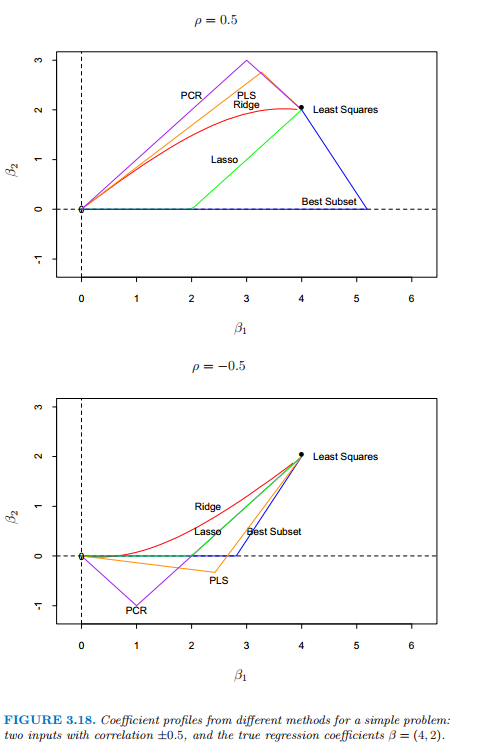

# 3.6 讨论：选择和收缩方法的比较

| 原文   | [The Elements of Statistical Learning](https://web.stanford.edu/~hastie/ElemStatLearn/printings/ESLII_print12.pdf) |
| ---- | ---------------------------------------- |
| 翻译   | szcf-weiya                               |
| 发布 | 2016-10-21 |
| 更新 | 2018-03-25|
|状态|Done|
|备注| [1 simulation](../notes/linear-reg/sim-3-18/index.html) |

一些简单的设定会帮助我们更好地理解上面描述的不同方法之间的关系．考虑相关系数为 $\rho$ 的两个相关输入变量$\mathbf X_1,\mathbf X_2$．我们假设实际的回归系数为 $\beta_1=4,\beta_2=2$．

> 图 3.18：关于一个简单问题不同方法的系数曲线，这个问题有两个相关性为 $\pm 0.5$ 的输入变量，真实的回归系数为 $\beta=(4,2)$．

!!! info "weiya 注："
    已经重现了本节的模拟实验，详见[模拟：Fig. 3.18](../notes/linear-reg/sim-3-18/index.html)

图 3.18 显示了不同方法下当它们惩罚参数改变时的系数曲线．上图 $\rho=0.5$，下图 $\rho=-0.5$．岭回归和 lasso 的惩罚参数在一个连续的区域内变化，而最优子集，PLS 和 PCR 只要两个离散的步骤便达到了最小二乘解．在上面的图中，从零点开始，岭回归整体收缩参数直到最后收缩到最小二乘．尽管 PLS 和 PCR 是离散的且更加极端，但它们显示了类似岭回归的行为．最优子集超出解然后回溯．lasso 的行为是其他方法的过渡．当相关系数为负数时（下图），PLS 和 PCR 再一次大致地跟随岭回归的路径，而所有的方法都更加相似．

比较不同方法的收缩行为是很有趣的．岭回归对所有方向都有收缩但在低方差方向收缩程度更厉害．主成分回归将 $M$ 个高方差的方向单独取出来，然后丢掉剩下的．有趣的是，可以证明偏最小二乘也趋向于收缩低方差的方向，但是实际上会使得某些高方差方向膨胀．这使得 PLS 稍微不太稳定，因此相比于岭回归会有较大的预测误差．整个研究由 Frank and Friedman (1993)[^1] 给出．他们总结到对于最小化预测误差，岭回归一般比变量子集选择、主成分回归和偏最小二乘更好．然而，相对于后两种方法的提高只是很小的．

总结一下，PLS，PCR 以及岭回归趋向于表现一致．岭回归可能会更好，因为它收缩得很光滑，不像离散步骤中一样．Lasso 介于岭回归和最优子集回归中间，并且有两者的部分性质．

[^1]: Frank, I. and Friedman, J. (1993). A statistical view of some chemometrics regression tools (with discussion), Technometrics 35(2): 109–148.