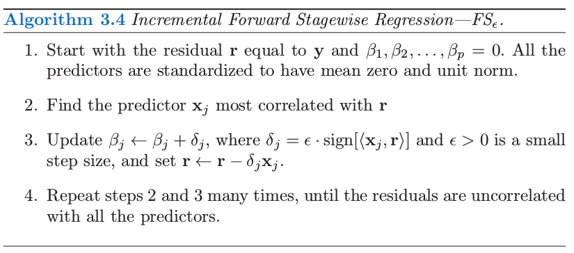
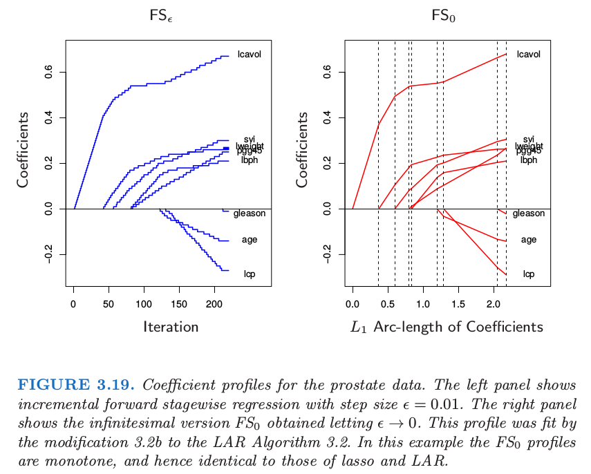
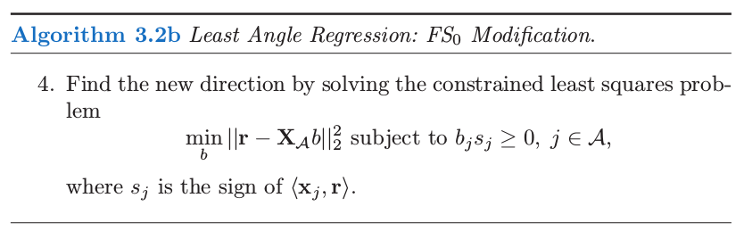
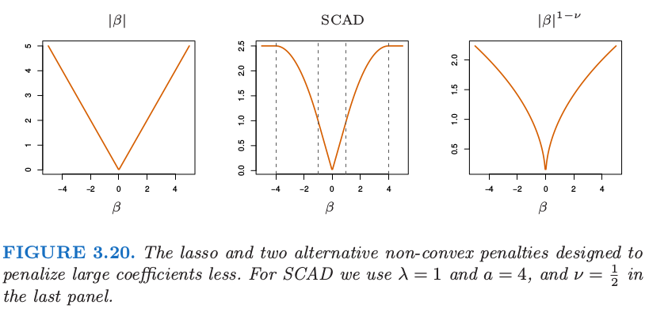

# 3.8 Lasso 和相关路径算法的补充

| 原文   | [The Elements of Statistical Learning](https://web.stanford.edu/~hastie/ElemStatLearn/printings/ESLII_print12.pdf#page=105) |
| ---- | ---------------------------------------- |
| 翻译   | szcf-weiya                               |
| 发布 | 2016-10-21 |
|更新|2019-02-18 16:25:57|
|状态 |Done|

自从 LAR 算法（Efron et al., 2004[^1]）的提出，许多研究都在发展对于不同问题的正则化拟合算法．另外，$L_1$ 正则有它自己的用处，它促进了信号处理领域的 **压缩传感 (compressed sensing)** 的发展（Donoho, 2006a[^2]; Candes, 2006[^3]）．在这部分我们讨论一些相关的想法和以 LAR 算法为先驱的其它路径算法．

## 增长的向前逐渐回归 (Incremental Forward Stagewise Regression)

这里我们提出另外一种类似 LAR 的算法，这次集中在 **向前逐渐回归 (Forward Stagewise Regression)**．有趣地是，理解一个灵活的非线性回归过程 (boosting) 的努力导出了线性模型的一个新算法（LAR）．在阅读本书的第一版时，[第 16 章](../16-Ensemble-Learning/16.1-Introduction/index.html)的向前逐渐算法 16.1，Brad Efron 意识到对于线性模型，可以明确地构造出如图 3.10 所示的分段线性的 lasso 路径．这促使他提出 [3.4.4 节](3.4-Shrinkage-Methods/index.html#_2)介绍的 LAR 过程，以及这里提到的 **向前逐渐回归 (forward-stagewise regression)** 的增长版本．

<!--
****
**算法 3.4** 增长的向前逐渐回归——$FS_\epsilon$
****
1. 从残差向量$\mathbf r$等于$\mathbf y$开始，$\beta_1,\beta_2,\ldots,\beta_p=0$. 所有的预测变量进行标准化使得均值为0、方差为1.
2. 寻找与残差向量$\mathbf r$最相关的预测变量$\mathbf x_j$
3. 更新$\beta_j\leftarrow\beta_j+\delta_j$, 其中$\delta_j=\epsilon\cdot sign[\langle \mathbf x_j,\mathbf r\rangle]$并且$\epsilon>0$是一个很小的步长，然后令$\mathbf r=\mathbf r-\delta_j\mathbf x_j$
4. 重复步骤2和步骤3，直到所有的残差向量与所有的预测变量都不相关．

****
-->

考虑 [16.2 节](../16-Ensemble-Learning/16.2-Boosting-and-Regularization-Paths/index.html) 提出的 forward-stagewise boosting 算法 16.1 的线性版本．它通过重复更新与当前残差最相关的变量的系数（乘以一个小量 $\epsilon$）得到系数曲线．算法 3.4 给出了具体的细节．图 3.19（左边）展示了前列腺癌数据中步长 $\epsilon=0.01$ 的过程．如果 $\delta_j=\langle \mathbf x_j,\mathbf r\rangle$（残差在第 $j$ 个预测变量的最小二乘系数），则这恰恰是 [3.3 节](3.3-Subset-Selection/index.html#forward-stagewis) 中介绍的一般 **向前逐渐过程 (FS)**．

这里我们主要对小的 $\epsilon$ 值感兴趣．令 $\epsilon\rightarrow 0$ 则得到图 3.19 的右图，在这种情形下与图 3.10 的 lasso 路径相同．我们称这个极限过程为 **无穷小的向前逐渐回归 (infinitesimal forward stagewise regression)** 或者 $FS_0$ ．这个过程在非线性、自适应方法中有着很重要的作用，比如 boosting（[第 10](../10-Boosting-and-Additive-Trees/10.1-Boosting-Methods/index.html) 和 [16 章](../16-Ensemble-Learning/16.1-Introduction/index.html)），并且是增长的向前逐渐回归的，这是最能经得起理论分析的版本．由于它与 boosting 的关系，Buhlmann and Hothorn (2007)[^4]称这个过程为"L2boost"

Efron 最初认为 LAR 算法 3.2 是 $FS_0$ 的一个实现，允许每个连结变量 (tied predictor) 以一种平衡的方式更新他们的系数，并且在相关性方面保持连结．然而，他接着意识到 LAR 在这些连结预测变量中的最小二乘拟合可以导致系数向相反的方向移动到它们的相关系数，这在算法 3.4 中是不可能发生的．下面对 LAR 算法的修正实现了 $FS_0$：

!!! note "weiya 注"
    直观上看，在算法 3.2 的第 4 步中，系数朝着联合最小二乘方向移动，注意此时方向与最小二乘方向可能一致或者相反．然而算法 3.4 中的移动方向始终与最小二乘方向保持一致．因此需要算法 3.2b 的修改．

<!--
****
**算法 3.2b** 最小角回归：$FS_0$修正
****
4.通过求解下面的约束最小二乘问题找到新的方向
$$
\underset{b}{min}\Vert\mathbf r-\mathbf X_{\cal A}b\Vert^2_2 \;s.t.\; b_js_j\ge 0,\;j\in\cal A
$$
其中，$s_j$是$\langle\mathbf x_j,\mathbf r \rangle$的方向．
****
-->

这个修正相当于一个非负的最小二乘拟合, 保持系数的符号与相关系数的符号一致．可以证明它实现了对于最大相关性的连结变量的无限小"更新"的最优平衡．（Hastie et al.，2007[^5]）．类似 lasso，全 $FS_0$ 路径可以通过 LAR 算法非常有效地计算出来．

作为这些事实的结果，如果 LAR 图象是单调不减或者单调不增，如 3.19 所示，则 LAR，lasso，以及 $FS_0$ 这三种算法给出了相同的图象．如果图象不是单调的但是不穿过 0，则 LAR 和 lasso 是一样的．

因为 $FS_0$ 与 lasso 不同，很自然地问它是否优化了准则．答案比 lasso 更加的复杂；$FS_0$ 系数曲线是微分方程的一个解．尽管 lasso 在降低系数向量 $\beta$ 的 $L_1$ 范数的单位残差平方和增长方面实现了最优化，但 $FS_0$ 在沿着系数路径的 $L_1$ 弧长的单位增长是最优的．因此它的系数曲线不会经常改变方向．

$FS_0$ 比 lasso的约束更强，事实上也可以看成是lasso的单调版本；见图16.3生动的例子．$FS_0$ 可能在 $p>>N$ 情形下很有用，它的系数曲线会更加的光滑，因此比 lasso 有更小的方差．更多关于 $FS_0$ 的细节将在 16.2.3 节给出以及 Hastie et al. (2007)[^5]．图 3.16 包含了$FS_0$, 它的表现非常类似于 lasso．

## 分段线性路径算法

最小角回归过程探索了 lasso 解的路径分段线性的本质．这导出了其他正则化问题类似的“路径算法”．假设我们求解

$$
\hat \beta(\lambda)=\mathrm{argmin}_\beta[R(\beta)+\lambda J(\beta)]\tag{3.76}
$$

$$
R(\beta)=\sum\limits_{i=1}^NL(y_i,\beta_0+\sum_{j=1}^px_{ij}\beta_j)\tag{3.77}
$$

其中损失函数 $L$ 和惩罚函数 $J$ 都是凸函数．则下面是解的路径 $\hat\beta(\lambda)$ 为分段线性的充分条件(Rosset and Zhu, 2007)[^6]

1. $R$ 作为 $\beta$ 的函数是二次的或者是分段二次
2. $J$ 关于 $\beta$ 分段线性

这也意味着（原则上）解的路径可以有效地计算出来．例子包括平方损失和绝对误差损失，“Huberized”损失，以及关于 $\beta$ 的 $L_1, L_\infty$ 惩罚．另一个例子是支持向量机中的“hinge loss”．那里损失是分段线性，惩罚是二次的．有趣的是，这导出了对偶空间的分段线性路径算法；更多的细节在 [12.3.5 节](../12-Support-Vector-Machines-and-Flexible-Discriminants/12.3-Support-Vector-Machines-and-Kernels.md)给出．

!!! note "weiya 注：Huber Loss & Hinge Loss"
    Huber loss 损失函数为：
    $$
    \rho(t;\lambda) = \begin{cases}
    \lambda \vert t\vert - \lambda^2/2 & \text{ if }\vert t\vert >\lambda\\
    t^2/2 & \text{ if }\vert t\vert \le \lambda
    \end{cases}\,.
    $$
    其图象为
    

    [SLS 的 Ex. 2.11 **(已解决！)**](https://github.com/szcf-weiya/ESL-CN/issues/178) 讨论了 Huber 损失函数与 $\ell_1$-norm 的等价性．

    Hinge Loss 是用于分类器的损失函数，定义为

    $$
    L(y, f) = [1-yf]_+\,,
    $$

    其中 $f\in\\{-1,+1\\}$.

## Dantzig 选择器

Candes and Tao (2007)[^7] 提出下面的准则：

$$
\mathrm{min}_\beta\Vert\beta\Vert_1\text{ subject to }\Vert \mathbf X^T(\mathbf y-\mathbf X\beta)\Vert_\infty\le s\tag{3.78}
$$

他们称这个解为 **Dantzig selector (DS)**．可以等价地写成

$$
\min_\beta \Vert \mathbf X^T(\mathbf y-\mathbf X\beta)\Vert_\infty\text{ subject to } \Vert\beta\Vert_1\le t\tag{3.79}
$$

这里 $\Vert\cdot\Vert_\infty$ 为 $L_\infty$ 范数，也就是该向量中绝对值最大的组分．这种形式类似 lasso，用梯度绝对值的最大值替换平方误差损失．注意到当 $t$ 变大，如果 $N < p$，则两个过程都会得到最小二乘解．如果 $p\ge N$，它们都得到最小的 $L_1$ 范数的最小二乘解．然而，对于较小的 $t$，DS 过程的解的路径与 lasso 不同．

Candes and Tao (2007)[^7]证明了求解 DS 是线性规划问题；为了纪念 George Dantzig（线性规划中单纯形法的发明者），因此称为 Dantzig．他们也证明了该方法的一系列有趣的数学问题，这些性质与重建潜在的稀疏系数向量的能力有关．如 Bickel et al. (2008)[^13] 所证明，这些性质对于 lasso 也适用．

不幸的是 DS 方法的运算性质不够令人满意．这个方法想法上与 lasso 类似，特别是当我们观察 lasso 的平稳条件 (3.58)．和 LAR 算法一样，对于活跃集中的所有变量，lasso 保持着与当前残差相同的内积（以及相关系数），并且将它们的系数向残差平方和的最优下降方向变化．在这个过程中，相同的相关系数单调下降（[练习 3.23](https://github.com/szcf-weiya/ESL-CN/issues/100)），并且在任何时刻这个相关性大于非活跃集中的变量．

!!! info "weiya 注：Ex. 3.23"
    已解决，详见 [Issue 100: Ex. 3.23](https://github.com/szcf-weiya/ESL-CN/issues/100)，欢迎讨论交流．

而 Dantzig 选择器试图最小化当前残差与所有变量之间的最大内积．因此它可以达到比 lasso 更小的最大值，但是在这一过程中会发生奇怪的现象．如果活跃集的大小为 $m$，则会有 $m$ 个变量与最大相关性绑在一起．然而，这些变量不需要与活跃集重合！因此它可以在模型中包含这样一个变量，其与当前残差的相关性小于不在活跃集中的变量与残差的相关性 (Efron et al., 2007[^14])．这似乎不合理，而且有时会导致较差的预测误差．Efron et al. (2007)[^14] 也证明了随着正则化参数 $s$ 的变化，DS 可能得到非常不稳定的系数曲线．

## The Grouped Lasso

在一些问题中，预测变量属于预定义的群体中；举个例子，属于同一个生物路径的基因，或者表示类别型数据层次的指示变量（哑变量）．在这种情形中，或许想要对群体中每个成员一起进行收缩或选择．grouped lasso 便是一种实现方式．假设 $p$ 个预测变量被分到 $L$ 个群中，在第 $\ell$ 个群中有 $p_\ell$ 个成员．为了简便，我们采用矩阵 $\mathbf X_\ell$ 来表示对应第 $\ell$ 个群的预测变量，对应的系数向量为$\beta_\ell$．grouped-lasso 最小化下面的凸准则

$$
\underset{\beta\in \IR^p}{\mathrm{min}}\Big(\Vert \mathbf y-\beta_0\boldsymbol 1-\sum\limits_{\ell=1}^L\mathbf X_\ell\beta_\ell\Vert_2^2+\lambda \sum\limits_{\ell=1}^L\sqrt{p_\ell}\Vert \beta_\ell\Vert_2\Big)\tag{3.80}
$$

其中 $\sqrt{p_\ell}$ 项对应不同的群体大小，并且 $\Vert\cdot\Vert_2$ 是欧几里得范数．因为一个向量 $\beta_\ell$ 的欧式范数为 0 当且仅当其各组分都为 0，这个过程保证了群体层次和个体水平的稀疏性．也就是，对于某些 $\lambda$，预测变量的整个群体都排除在模型之外．这个过程由 Bakin (1999)[^8] 和 Lin and Zhang (2006)[^9] 提出，以及 Yuan and Lin (2007)[^10] 的研究和推广．推广包括更一般的 $L_2$ 范数 $\Vert \eta\Vert=(\eta^TK\eta)^{1/2}$，并且允许重复的预测变量 (Zhao et al., 2008[^11])．拟合离散的可加模型的方法之间也有联系（Lin and Zhang, 2006[^9]; Ravikumar et al., 2008[^12]）

## lasso 的更多性质

许多作者已经研究了当 $N$ 和 $p$ 增长时，lasso 的能力以及重建模型相关的过程．这个工作的例子有 Knight and Fu (2000)[^15], Greenshtein and Ritov (2004)[^16], Tropp (2004)[^17], Donoho (2006b)[^18], Meinshausen (2007)[^19], Meinshausen and Bühlmann (2006)[^20], Tropp (2006)[^21], Zhao and Yu (2006)[^22], Wainwright (2006)[^23], 以及 Bunea et al. (2007)[^24]．举个例子，Donoho (2006b)[^18] 集中在 $p>N$ 的情形并且当边界 $t$ 变大时 lasso 的解．极限情形下，这给出了在所有零训练误差的模型中最小的 $L_1$ 范数解．他证明了对模型矩阵 $\mathbf X$ 加上具体的假设，如果真实模型为稀疏的，则解能以高概率识别出正确的预测变量．

许多这领域的结果对模型矩阵假设了如下条件

$$
\underset{j\in \cal S^c}{\mathrm{max}}\Vert \mathbf x_j^T\mathbf X_{\cal S}(\mathbf X_{\cal S}^T\mathbf X_{\cal S})^{-1}\Vert_1\le (1-\epsilon)\text{ for some }\epsilon\in (0, 1]\tag{3.81}
$$

这里 $\cal S$ 标记真实的潜在模型中非零系数特征的子集，$\mathbf X_{\cal S}$ 是 $\mathbf X$ 中对应的这些特征的列．类似地，$\cal S^c$是真实系数为 0 的特征的集合，$\mathbf X_{\cal S^c}$ 是对应的列．这说明 $\mathbf X_{\cal S^c}$ 的列在 $\mathbf X_{\cal S}$ 上的最小二乘系数不会太大，也就是，“好”的变量 $\cal S$ 与多余的变量 $\cal S^c$ 之间不是高度相关．

考虑这些系数本身，lasso 收缩导致非零系数的估计偏向 0，并且一般地他们不是一致的．降低这种偏差的一种方式是运行 lasso 来识别非零系数的集合，接着对选出的特征进行无约束线性模型拟合．另外，也可以采用 lasso 来选择非零预测变量，接着再次运用 lasso，但是从第一步开始便只用选择出的变量．这称为 relaxed lasso (Meinshausen, 2007[^19])．这个想法是采用交叉验证来估计 lasso 初始的惩罚参数，然后接着对选择出的变量再用一次惩罚参数．因为第二步中的变量与噪声变量之间的竞争变小，所以交叉验证会趋向于选择较小的 $\lambda$，因此它们的系数会比初始估计时收缩得要小．

另外，也可以修改 lasso 惩罚函数使得更大的系数收缩得不要太剧烈；Fan and Li (2005)[^25]的 **平稳削减绝对偏差法 (smoothly clipped absolute deviation, SCAD)** 用 $J_a(\beta,\lambda)$ 替换 $\lambda\vert\beta \vert$，其中对于 $a\ge 2$

$$
\frac{dJ_a(\beta,\lambda)}{d\beta}=\lambda \cdot \mathrm{sign}(\beta)[I(\vert \beta\vert\le \lambda)+\frac{(a\lambda-\vert \beta\vert)_\+}{(a-1)\lambda}I(\vert\beta\vert>\lambda)]\tag{3.82}
$$

方括号中的第二项降低了 lasso 对于较大 $\beta$ 的收缩程度，在极限状态时，当 $a\rightarrow \infty$，没有收缩．图 3.20 显示了 SCAD 惩罚，以及 lasso 和 $\beta^{1-\nu} $．然而这个准则不是凸的，这是一个缺陷，因为它会使得计算变得很困难．adaptive lasso (Zou, 2006)[^26]采用形如 $\sum_{j=1}^pw_j\vert\beta_j\vert$ 的加权惩罚，其中 $w_j=1/\vert\hat\beta_j\vert^\nu$，$\hat\beta_j$ 是一般最小二乘估计并且 $\nu >0$．这是对 [3.4.3 节](3.4-Shrinkage-Methods/index.html#lasso_1)中讨论的 $\vert\beta\vert^q$ 惩罚的实际近似（这里 $q=1-\nu$）．adaptive lasso 在保证 lasso 吸引人的凸性基础上还得到了参数的一致估计．

## Pathwise Coordinate Optimization

一种替代计算 lasso 的 LARS 算法是 **简单坐标下降 (simple coordinate descent)**．这个想法由 Fu (1998)[^27] 和 Daubechies et al. (2004)[^28] 提出，后来被 Friedman et al. (2007)[^29], Wu and Lange (2008)[^30] 和其他人研究及推广．想法是固定 Lagrangian 形式 (3.52) 中的惩罚参数 $\lambda$，在控制其它参数固定不变时，相继地优化每一个参数．

假设预测变量都经过标准化得到 0 均值和单位范数．用 $\tilde\beta_k(\lambda)$ 表示惩罚参数为 $\lambda$ 时对 $\beta_k$ 的当前估计．我们可以分离出 (3.52) 的 $\beta_j$,

$$
R(\tilde\beta(\lambda),\beta_j)=\frac{1}{2}\sum\limits_{i=1}^N(y_i-\sum\limits_{k\neq j}x_{ik}\tilde \beta_k(\lambda)-x_{ij}\beta_j)^2+\lambda \sum\limits_{k\neq j}\vert \tilde \beta_k(\lambda)\vert+\lambda \vert \beta_j\vert
$$

其中我们压缩了截距并且为了方便引出因子 $\frac 12$．这个可以看成是响应变量为部分残差 $y_i-\tilde y_i^{(j)}=y_i-\sum_{k\neq j}x_{ik}\tilde \beta_k(\lambda)$．这有显式解，得到下面的更新

$$
\tilde \beta_j(\lambda)\leftarrow S(\sum\limits_{i=1}^Nx_{ij}(y_i-\tilde y_i^{(j)}),\lambda)\tag{3.84}\label{eq:3.84}
$$

这里 $S(t,\lambda)=\sign(t)(\vert t\vert-\lambda)\_+$ 是表 3.4 中的软阈值算子．$S(\cdot)$ 中的第一个变量是部分残差在标准化变量 $x_{ij}$ 上的简单最小二乘系数．\eqref{eq:3.84} 的重复迭代——轮流考虑每个变量直到收敛——得到 lasso 估计 $\hat\beta(\lambda)$．

我们也可以采用这种简单的算法来有效地计算在 $\lambda$ 的每个网格结点上 lasso 的解．我们从使得 $\hat\beta(\lambda_{max})=0$ 的最小 $\lambda_{\max}$ 开始，每次降低一点点来循环考虑每个变量直到收敛．采用前一个解作为 $\lambda$ 新值的“warm start”，$\lambda$ 再一次降低，并且重复该过程．这个可能比 LARS 算法快，特别是在大型问题中．它速度的关键在于 \eqref{3.84} 中的量随着 $j$ 变化可以快速更新，并且通常更新后有 $\tilde \beta_j=0$．另一方面，它在 $\lambda$ 的网格处求解，而不是整个解的路径．同样类型的算法可以应用到 elastic net，grouped lasso 以及许多其它惩罚为个体参数的函数之和的模型（Friedman et al., 2010[^31]）．通过一些修改，这也可以应用到 fused lasso（[18.4.2 节](../18-High-Dimensional-Problems/18.4-Linear-Classifiers-with-L1-Regularization.md)）；细节在 Friedman et al. (2007)[^29]中给出．

[^1]: Efron, B., Hastie, T., Johnstone, I. and Tibshirani, R. (2004). Least angle regression (with discussion), Annals of Statistics 32(2): 407–499.
[^2]: Donoho, D. (2006a). Compressed sensing, IEEE Transactions on Information Theory 52(4): 1289–1306.
[^3]: Candes, E. (2006). Compressive sampling, Proceedings of the International Congress of Mathematicians, European Mathematical Society, Madrid, Spain.
[^4]: Bühlmann, P. and Hothorn, T. (2007). Boosting algorithms: regularization, prediction and model fitting (with discussion), Statistical Science 22(4): 477–505.
[^5]: Hastie, T., Taylor, J., Tibshirani, R. and Walther, G. (2007). Forward stagewise regression and the monotone lasso, Electronic Journal of Statistics 1: 1–29.
[^6]: Rosset, S. and Zhu, J. (2007). Piecewise linear regularized solution paths, Annals of Statistics 35(3): 1012–1030.
[^7]: Candes, E. and Tao, T. (2007). The Dantzig selector: Statistical estimation when p is much larger than n, Annals of Statistics 35(6): 2313–2351.
[^8]: Bakin, S. (1999). Adaptive regression and model selection in data mining problems, Technical report, PhD. thesis, Australian National University, Canberra.
[^9]: Lin, Y. and Zhang, H. (2006). Component selection and smoothing in smoothing spline analysis of variance models, Annals of Statistics 34: 2272–2297.
[^10]: Yuan, M. and Lin, Y. (2007). Model selection and estimation in regression with grouped variables, Journal of the Royal Statistical Society, Series B 68(1): 49–67.
[^11]: Zhao, P., Rocha, G. and Yu, B. (2008). The composite absolute penalties for grouped and hierarchichal variable selection, Annals of Statistics. (to appear).
[^12]: Ravikumar, P., Liu, H., Lafferty, J. and Wasserman, L. (2008). Spam: Sparse additive models, in J. Platt, D. Koller, Y. Singer and S. Roweis (eds), Advances in Neural Information Processing Systems 20, MIT Press, Cambridge, MA, pp. 1201–1208.
[^13]: Bickel, P. J., Ritov, Y. and Tsybakov, A. (2008). Simultaneous analysis of lasso and Dantzig selector, Annals of Statistics. to appear.
[^14]: Efron, B., Hastie, T. and Tibshirani, R. (2007). Discussion of “Dantzig selector” by Candes and Tao, Annals of Statistics 35(6): 2358–2364.
[^15]: Knight, K. and Fu, W. (2000). Asymptotics for lasso-type estimators, Annals of Statistics 28(5): 1356–1378.
[^16]: Greenshtein, E. and Ritov, Y. (2004). Persistence in high-dimensional linear predictor selection and the virtue of overparametrization, Bernoulli 10: 971–988.
[^17]: Tropp, J. (2004). Greed is good: algorithmic results for sparse approximation, IEEE Transactions on Information Theory 50: 2231– 2242.
[^18]: Donoho, D. (2006b). For most large underdetermined systems of equations, the minimal l 1 -norm solution is the sparsest solution, Communications on Pure and Applied Mathematics 59: 797–829.
[^19]: Meinshausen, N. (2007). Relaxed lasso, Computational Statistics and Data Analysis 52(1): 374–393.
[^20]: Meinshausen, N. and Bühlmann, P. (2006). High-dimensional graphs and variable selection with the lasso, Annals of Statistics 34: 1436–1462.
[^21]: Tropp, J. (2006). Just relax: convex programming methods for identifying sparse signals in noise, IEEE Transactions on Information Theory 52: 1030–1051.
[^22]: Zhao, P. and Yu, B. (2006). On model selection consistency of lasso, Journal of Machine Learning Research 7: 2541–2563.
[^23]: Wainwright, M. (2006). Sharp thresholds for noisy and high-dimensional recovery of sparsity using l 1 -constrained quadratic programming, Technical report, Department of Statistics, University of California, Berkeley.
[^24]: Bunea, F., Tsybakov, A. and Wegkamp, M. (2007). Sparsity oracle inequalities for the lasso, Electronic Journal of Statistics 1: 169–194.
[^25]: Fan, J. and Li, R. (2005). Variable selection via nonconcave penalized likelihood and its oracle properties, Journal of the American Statistical Association 96: 1348–1360.
[^26]: Zou, H. (2006). The adaptive lasso and its oracle properties, Journal of the American Statistical Association 101: 1418–1429.
[^27]: Fu, W. (1998). Penalized regressions: the bridge vs. the lasso, Journal of Computational and Graphical Statistics 7(3): 397–416.
[^28]: Daubechies, I., Defrise, M. and De Mol, C. (2004). An iterative thresholding algorithm for linear inverse problems with a sparsity constraint, Communications on Pure and Applied Mathematics 57: 1413–1457.
[^29]: Friedman, J., Hastie, T., Hoefling, H. and Tibshirani, R. (2007). Pathwise coordinate optimization, Annals of Applied Statistics 2(1): 302–332.
[^30]: Wu, T. and Lange, K. (2008). Coordinate descent procedures for lasso penalized regression, Annals of Applied Statistics 2(1): 224–244.
[^31]: Friedman, J., Hastie, T. and Tibshirani, R. (2010). Regularization paths for generalized linear models via coordinate descent, Journal of Statistical Software 33(1): 1–22.
