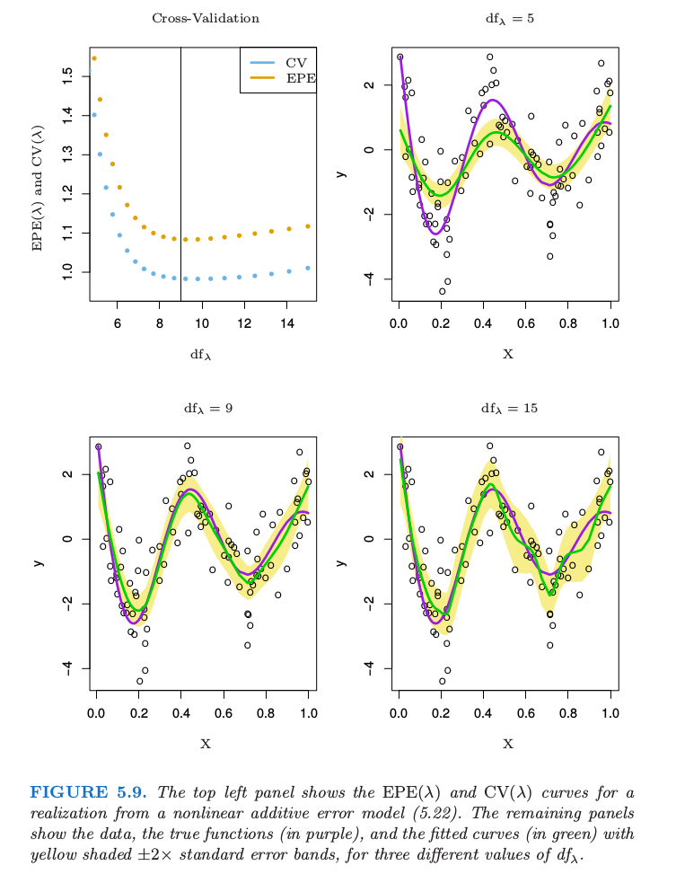

# 5.5 光滑参数的自动选择

| 原文   | [The Elements of Statistical Learning](https://web.stanford.edu/~hastie/ElemStatLearn/printings/ESLII_print12.pdf#page=175) |
| ---- | ---------------------------------------- |
| 翻译   | szcf-weiya                               |
| 发布 | 2017-12-06 |
| 更新| 2018-03-30|
| 状态 |Done|
|习题| [Ex. 5.10](https://github.com/szcf-weiya/ESL-CN/issues/111), [Ex. 5.13](https://github.com/szcf-weiya/ESL-CN/issues/112) |
| 模拟 | [Sim. 5.9](../notes/spline/sim-5-9/index.html)|

回归样条的光滑参数包括样条的 degree，结点的个数及位置．对于光滑样条，我们仅仅有惩罚参数 $\lambda$ 可以选择，因为结点是所有不同的 $X$ 取值，且在实际中 degree 经常取三 ．

选择回归样条结点的位置及数目是一项复杂的组合任务，除非强加一些简化．[第 9 章](../09-Additive-Models-Trees-and-Related-Methods/9.0-Introduction/index.html)的 MARS 过程采用贪婪算法以及额外的近似来达到实际的妥协．这里我们不会深入讨论．

## 固定自由度

因为对于光滑样条而言，$\df_\lambda=\trace(\mathbf S_\lambda)$ 是关于 $\lambda$ 的单调函数，这个关系是可逆的，并且通过固定自由度来确定 $\lambda$．实际中，这可以通过简单的数值方法实现．举个例子，在 `R` 中，可以采用 `smooth.spline(x,y,df=6)` 来确定光滑的程度．这鼓励更加传统的模型选择的模式，其中我们可能尝试一系列不同的自由度，然后根据近似的 $F$ 检验，残差图以及其它更客观的准则来选择．通过这种方式使用自由度提供了更加统一的方式来比较许多不同的光滑方法．在**广义可加模型 (generalized additive models)** 中特别有用（第 9 章），其中多种光滑方法可以同时应用在一个模型中．

## 偏差-方差的权衡

图 5.9 显示了在如下简单的模型中应用光滑样条 $df_\lambda$ 的选择的效果：

$$
\begin{align}
Y& =f(X)+\varepsilon\notag\\
f(X)&=\frac{\sin(12(X+0.2))}{X+0.2}\notag
\end{align}
\tag{5.22}
$$

其中 $X\sim U[0,1], \varepsilon\sim N(0, 1)$．我们的训练样本包含从该模型中独立抽取的 $N=100$ 个数据对 $x_i,y_i$．

图中显示了 3 个不同 $\df_\lambda$ 的拟合样条．图中黄色阴影部分表示 $\hat f_\lambda$ 的逐点标准误差，也就是，我们将区域 $\hat f_\lambda(x)\pm 2\cdot se(\hat f_\lambda(x))$ 画成阴影．因为 $\hat{\mathbf f}=\mathbf S_\lambda \mathbf y$，

$$
\Cov(\hat{\mathbf f})=\mathbf S_\lambda \Cov(\mathbf y)\mathbf S_\lambda^T=\mathbf S_\lambda\mathbf S_\lambda^T\tag{5.23}
$$

对角元包含训练点 $x_i$ 的逐点方差．偏差由下式给出

$$
\Bias(\hat{\mathbf f})=\mathbf f-\E(\hat{\mathbf f})=\mathbf f-\mathbf S_\lambda \mathbf f\tag{5.24}
$$

其中 $\mathbf f$ 是真实的 $f$ 在训练点 $X$ 处的取值得到的向量（未知）．期望和方差是从模型 (5.22) 中重复取样得到的大小为 $N=100$ 的样本．类似地，$\Var(\hat f_\lambda(x_0))$ 和 $\Bias(\hat f_\lambda(x_0))$ 可以在任意点 $x_0$ 处计算得到（[练习 5.10](https://github.com/szcf-weiya/ESL-CN/issues/111)）．

!!! info "weiya 注：Ex. 5.10"
    已解决，详见[Issue 111: Ex. 5.10](https://github.com/szcf-weiya/ESL-CN/issues/111)．

图中的三个拟合直观展示了与选择光滑参数有关的**偏差——方差权衡 (bias-variance tradeoff)**．

- $df_\lambda=5$: 样条欠拟合，并且很明显**坡顶被削减波谷被充填 (trims down the hills and fills in the valleys)**．这导致在高曲率的地方有更显著的偏差．标准误差带非常狭窄，所以我们估计了真实函数的一个相对稳定但偏差较大的版本．
- $df_\lambda=9$: 尽管少量的偏差看起来很明显，但这里拟合函数接近真实函数．方差没有明显地增长．
- $df_\lambda=15$: 拟合函数有点弯曲，但是接近真实函数．这种弯曲也意味着标准误差带宽度的增长——曲线开始紧密地跟随一些个别点

注意到在这些图中我们看到的是每种情形下数据的单个实现以及因此得到的拟合样条 $\hat f$ 的实现，但偏差会涉及到期望 $\E(\hat f)$．我们将这留作练习( [5.10](https://github.com/szcf-weiya/ESL-CN/issues/111)) 来绘制类似的图象，其中要求画出偏差．

!!! info "weiya 注：Ex. 5.10 模拟部分 & 模拟 Fig. 5.9"
    已解决，参考[模拟：Fig. 5.9](../notes/spline/sim-5-9/index.html)．

中间的曲线似乎恰恰实现了偏差与方差之间的平衡．

**积分平方预测误差 (EPE)** 用一个总结式结合了偏差和方差：

$$
\begin{align}
\EPE(\hat f_\lambda) &=\E(Y-\hat f_\lambda(X))^2\notag\\
&= \Var(Y)+\E[\Bias^2(\hat f_\lambda(X))+\Var(\hat f_\lambda(X))]\notag\\
&= \sigma^2+\MSE(\hat f_\lambda)\tag{5.25}
\end{align}
$$

注意到**这是在训练样本（得到 $\hat f_\lambda$ ）和（独立选择的）预测点 $(X,Y)$ 的值中进行平均**．

!!! note "weiya 注：计算 EPE"
    在重现 Fig. 5.9 时，计算 EPE 时踩过一些坑，具体见[模拟：Fig. 5.9](../notes/spline/sim-5-9/index.html)．

EPE 是一个很自然的感兴趣的量，而且确实能在偏差和方差之间创造平衡．图 5.9 的左上图中的蓝点表明正好满足 $\df_\lambda=9$ ！

因为我们不知道真实函数，所以无法得到 EPE，因此需要一个估计．这个话题将在第 7 章中详细展开，以及像 $K$ 折交叉验证，GCV 和 $C_p$ 等广泛使用的方法．在图 5.9 中我们展示了一个 $N$ 折（舍一法）交叉验证的曲线：

$$
\begin{align}
\CV(\hat f_\lambda) &=\frac 1N\sum\limits_{i=1}^N(y_i-\hat f_\lambda^{(-i)}(x_i))^2\tag{5.26}\\
&= \frac 1N\sum\limits_{i=1}^N(\frac{y_i-\hat f_\lambda (x_i)}{1-S_\lambda(i, i)})^2\tag{5.27}\\
\end{align}
$$

上式可以从原始的拟合数据中计算每个 $\lambda$ 值以及 $\mathbf S_\lambda$ 的对角元素（[练习 5.13](https://github.com/szcf-weiya/ESL-CN/issues/112)）来得到．

!!! info "weiya 注：Ex. 5.13"
    已解答，详细过程参见[练习 5.13](https://github.com/szcf-weiya/ESL-CN/issues/112)

EPE 和 CV 曲线有着相同的形状，但是整个 CV 曲线都是在 EPE 的下面．

!!! note "weiya 注：翻译相关"
    此处，原文为“ but the entire CV curve is above the EPE curve.” 很明显，这里应该是 CV 曲线在 EPE 曲线的下方．

对于有些正则化，则相反，而且总体来看，CV 曲线作为 EPE 曲线的估计是近似无偏的．
