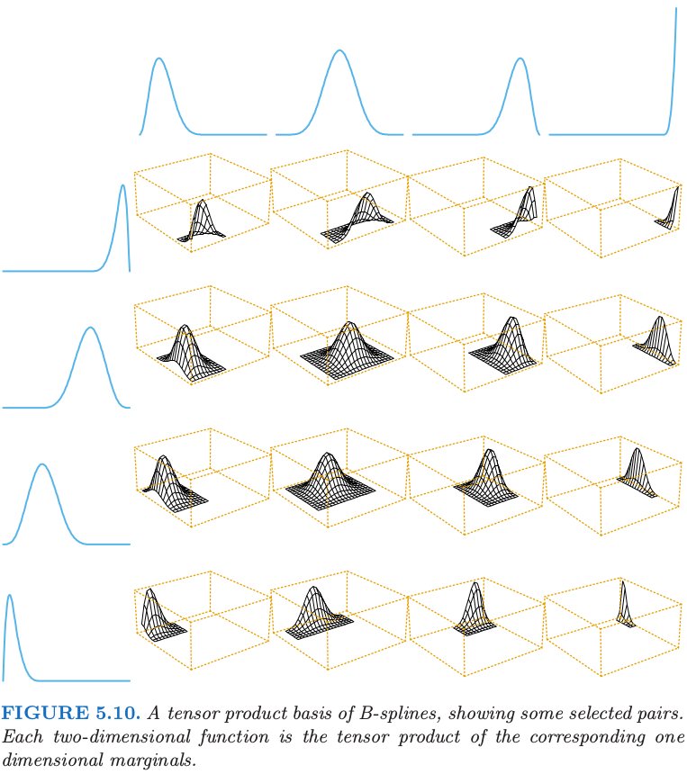
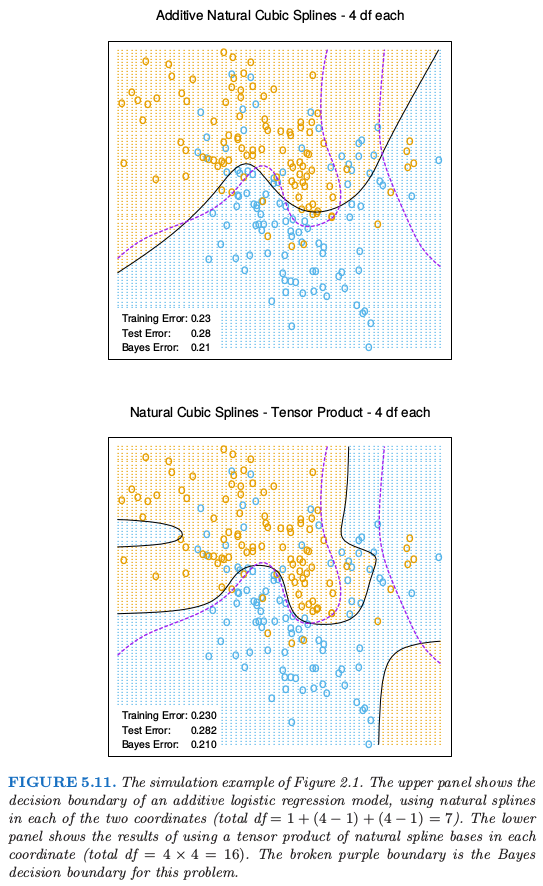
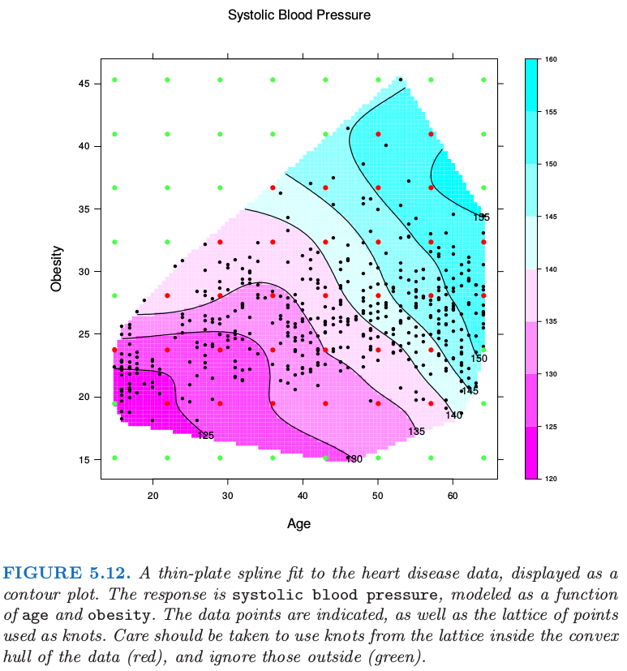

# 5.7 多维样条

| 原文   | [The Elements of Statistical Learning](../book/The Elements of Statistical Learning.pdf) |
| ---- | ---------------------------------------- |
| 翻译   | szcf-weiya                               |
| 时间   | 2017-02-09                               |
|  状态  | Done                              |

至今我们集中讨论了一维样条模型。每种方法都有类似的多维情形。假设，$X\in\IR$，我们有基函数$h_{1k}(X_1),k=1,\ldots,M_1$来表示坐标$X_1$的函数，同样地，$M_2$个表示坐标$X_2$的函数$h_{2k}(X_2)$。则$M_1\times M_2$维的张量积基地定义如下

$$
g_{jk}(X)=h_{1j}(X_1)h_{2k}(X_2),j=1,\ldots, M_1, k=1,\ldots,M_2\tag{5.35}
$$

可以用来表示二维函数

$$
g(X)=\sum\limits_{j=1}^{M_1}\sum\limits_{k=1}^{M_2}\theta_{jk}g_{jk}(X)\tag{5.36}
$$

图5.10展示了采用B样条的张量积的基底。系数和之前一样，可以采用最小二乘来拟合。这可以推广到$d$维的情形，但是注意到基底的位数会指数增长得很快——维数灾难的另一种表现形式。第9章讨论的MARS过程是一种将真正需要的张量积加入模型的贪婪向前算法。

图5.11展示了将可加样条和张量积（自然）样条应用到第2章中的模拟分类例子中的差异。逻辑斯底回归模型$\logit[Pr(T\mid x)]=h(x)^T\theta$是对二值响应变量拟合的模型，并且估计出的判别边界为等高线$h(x)^T\hat\theta=0$。在判别边界张量积的基底可以实现更多的灵活性，但同时也引入了一些假的结构。

一维光滑样条（通过正则化）也可以一般化为高维情形。假设我们有数据对$y_i,x_i$，其中$x_i\in \IR^d$，并且寻找$d$维回归函数$f(x)$。想法是求解下面问题

$$
\underset{f}{\min}\sum\limits_{i=1}^N\{y_i-f(x_i)\}^2+\lambda J[f]\tag{5.37}
$$

其中$J$是对$\IR^d$中的函数$f$标准化的合适的惩罚函数。举个例子，$IR^2$上一维光滑性惩罚(5.9)的自然推广为

$$
J[f]=\int\int_{\IR^2}\Big[
\Big(\frac{\partial^2f(x)}{\partial x_1^2}\Big)^2+
2\Big(\frac{\partial^2f(x)}{\partial x_1\partial x_2}\Big)^2+
\Big(\frac{\partial^2f(x)}{\partial x_2^2}\Big)^2
\Big]dx_1dx_2\tag{5.38}
$$

采用这个惩罚去优化(5.37)得到光滑的二维曲面，被称为thin-plate样条。这与一维三次光滑样条有许多相同的性质：

- 当$\lambda\rightarrow 0$，解近似为插值函数[类似最小惩罚(5.38)]
- 当$\lambda\rightarrow\infty$，解近似为最小二乘平面；
- 对于中等大小的$\lambda$，解可以便是成基函数的线性展开，其中系数可以通过广义的岭回归得到。

解有如下形式

$$
f(x)=\beta_0+\beta^Tx+\sum\limits_{j=1}^N\alpha_jh_j(x),\tag{5.39}
$$

其中$h_j(x)=\Vert x-x_j \Vert^2\LOG\Vert x-x_j\Vert$。这些$h_j$是径向基函数的例子，将在下一节中详细讨论。通过将(5.39)代入(5.37)可以得到系数，这退化为有限维带惩罚的最小二乘问题。对于有限的惩罚，系数$\alpha_j$必须满足一系列的线性约束；参见练习5.14。

对于任意维度的$d$，当采用合适的更一般的$J$，可以定义更一般的thin-plate样条。

实际中有许多流行的混合方法(hybrid approaches)，都是为了计算和概念上的简单性。不像一维的光滑样条，由于没有一般的稀疏结构可以采用，thin-plate的计算复杂度为$O(N^3)$。然而，和单变量光滑样条一样，我们可以用非常少于解(5.39)规定的$N$个结点。

实际中，采用覆盖定义域的网格通常就足够了。这个reduced版本的惩罚的计算和前面一样。采用$K$个结点，计算量降至$O(NK^2+K^3)$。

图5.12显示了对某些心脏病危险因子拟合thin-plate样条的结果，表示了等高图的表面。输入特征的位置已经表示处理，以及在拟合中采用的结点。注意到$\lambda$通过$\df_\lambda=\trace(S_\lambda)=15$。

更一般地，可以将$f\in\IR^d$表示成任意多基函数的展开，并且通过应用类似(5.38)的正则器来控制复杂度。举个例子，通过所有成对单变量光滑样条基函数(5.35)的张量积来构造基底，举个例子，可以采用5.9.2节推荐的单变量B样条基。这导致随着维数增大，基函数指数增长，一般地我们必须相应地减少每个坐标下的函数个数。

第9章讨论的可加样条模型是多维样条的限制版本。他们也可以用这种一般方式来表示；也就是，存在惩罚$J[f]$保证解的形式为$f(X)=\alpha+f_1(X_1)+\cdots+f_d(X_d)$，并且每个函数$f_j$是单变量样条。在这种情形下，惩罚有时候退化，而且假设$f$为可加的会更自然，接着简单地在每个组分函数上加上额外的惩罚

$$
\begin{align}
J[f] &= J(f_1+f_2+\cdots+f_d)\\
&=\sum\limits_{j=1}^d\int f_j^{(2)}(t_j)^2dt_j\tag{5.40}
\end{align}
$$

这写自然地推广到ANOVA样条分解，

$$
f(X)=\alpha+\sum_jf_j(X_j)+\sum\limits_{j < k}f_{jk}(X_j,X_k)+\cdots\tag{5.41}
$$

其中每个组分都是所要求维度下的样条。可以有许多选择：

- 交叉项的最大order——上面我们展示了order为2的情形
- 包含进模型的项——不是所有的主影响和交叉项都需要
- 表示方法——选择有：
  - 每个坐标采用相对较少的基函数且用它们的张量积作为交叉项的回归样条
  - 和光滑样条一样采用完整的基，并且在展开式中包含每一项的合适的正则器。

在许多情形下，当潜在维度(特征)很大，需要自动化的方法。MARS和MART（分别在第9章和第10章）都是这类方法。
