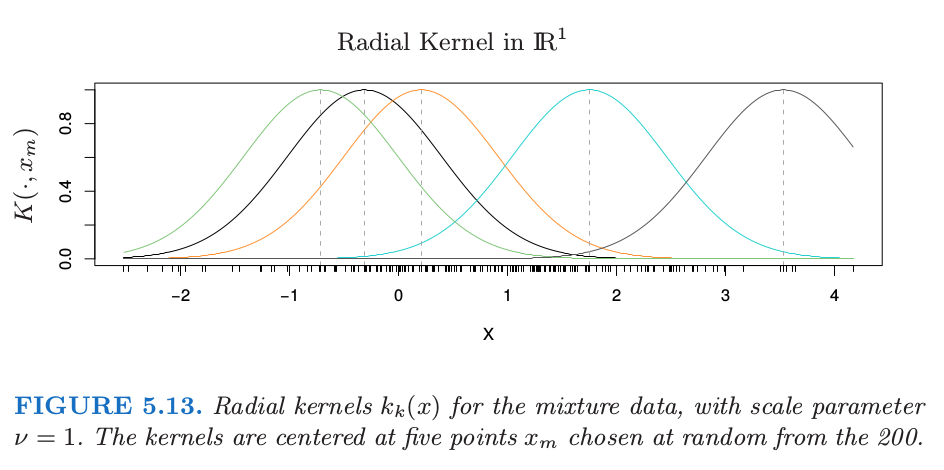
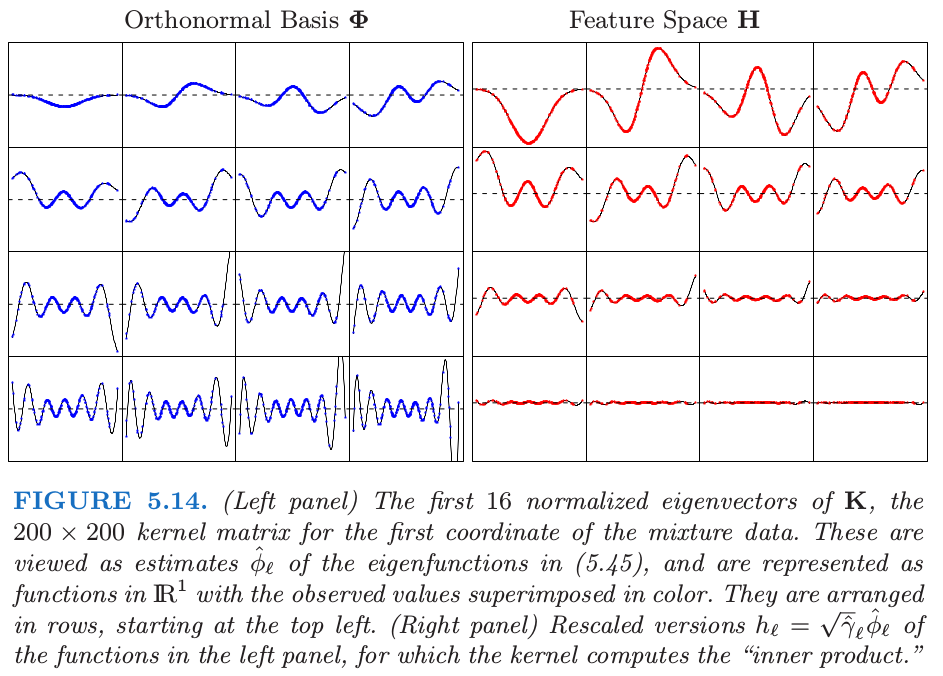
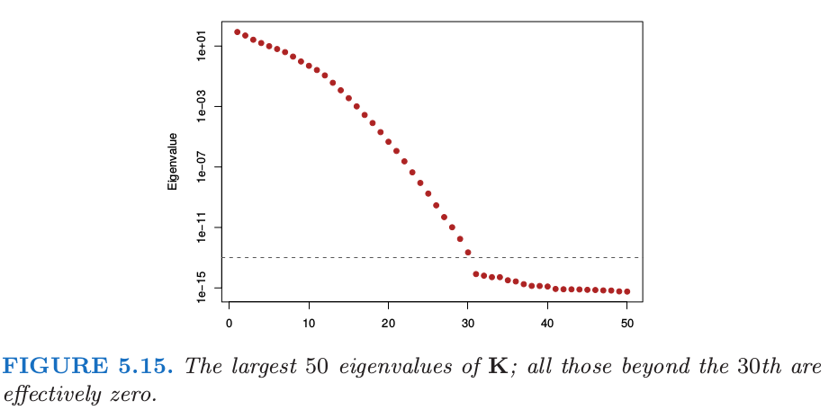

# 5.8 正则化和再生核希尔伯特空间理论

| 原文   | [The Elements of Statistical Learning](../book/The Elements of Statistical Learning.pdf) |
| ---- | ---------------------------------------- |
| 翻译   | szcf-weiya                               |
| 时间   | 2018-02-03; 2018-02-09                               |
|更新|2018-02-11|
| 状态 | Done |

在这部分我们将样条放进更大的正规方法框架下，并且再生出核希尔伯特空间(kernel Hilbert spaces)。这部分非常专业(quite technical)，因此不感兴趣或者畏惧的读者可以跳过。

一般的正则化问题形式如下

$$
\underset{f\in{\cal H}}{\min}\Big[
\sum\limits_{i=1}^NL(y_i,f(x_i))+\lambda J(f)
\Big]
\qquad (5.42)
$$

其中$L(y,f(x))$是损失函数，$J(f)$是惩罚函数，$\cal H$是$J(f)$有定义的函数空间。Girosi et al. (1995)[^1]描述了形如下式的非常一般的惩罚函数

$$
J(f)=\int_{\IR^d}\frac{\vert \tilde f(s)\vert^2}{\tilde G(s)}ds \qquad (5.43)
$$

其中$\tilde f$记为$f$的Fourier变换，并且$\tilde G$是当$\Vert s\Vert\rightarrow \infty$趋于0的正函数。上式想法是$1/\tilde G$加大对$f$的高频组分的惩罚。在一些额外的假设下，他们证明解有如下形式

$$
f(X)=\sum\limits_{k=1}^K\alpha_k\phi_k(X)+\sum\limits_{i=1}^N\theta_iG(X-x_i)\qquad (5.44)
$$

其中$\phi_k$张成惩罚函数$J$的零空间，并且$G$是$\tilde G$的逆Fourier变换。光滑样条和thin-plate样条都属于这个框架。这个解的显著特点是当准则(5.42)定义在无限维空间，解是有限维。在下一节我们考虑一些具体的例子。

## 核产生的函数空间

形如(5.42)的问题的一个重要子类是由正定核$K(x,y)$产生的，对应的函数空间${\cal H}_K$被称为再生核希尔伯特空间(reproducing kernel Hilbert space，简称为RKHS)。惩罚函数也是用核来定义的。我们对这个模型类进行一个简短的介绍，这取自Wahba (1990)[^2]和Girosi et al. (1995)[^1]，并且在Evgeniou et al. (2000)[^3]中有很好的总结。

令$x,y\in \IR^p$。我们考虑由$\\{K(\cdot, y), y\in \IR^p\\}$的线性张成的函数空间；比如，形如$f(x)=\sum_m\alpha_mK(x, y_m)$的任意线性组合，其中每个核可以看成第一个变量的函数，并且由第二个变量索引。假设$K$有特征值展开

$$
K(x, y)=\sum\limits_{i=1}^\infty \gamma_i \phi_i(x)\phi_i(y)\qquad (5.45)
$$

其中$\gamma_i\ge 0,\sum_{i=1}^\infty \gamma_i^2 < \infty$。${\cal H}_K$的元素有关于这些特征函数的展开

$$
f(x)=\sum\limits_{i=1}^\infty c_i\phi_i(x)\qquad (5.46)
$$

约束为

$$
\Vert f \Vert_{{\cal H}_K}\overset{def}{=}\sum\limits_{i=1}^\infty c_i^2/\gamma_i < \infty\qquad (5.47)
$$

其中$\Vert f\Vert_{{\cal H}\_K}$由$K$导出的范数。(5.42)中空间${\cal H}\_K$惩罚函数定义为二次范数$J(f)=\Vert f\Vert_{{\cal H}\_K}^2$。$J(f)$的值可以解释为广义岭惩罚，其中在展开式(5.45)中，大的特征值惩罚较小，反之亦然。

重写(5.42)，我们有

$$
\underset{f\in {\cal H}_K}{\min}\Big[\sum\limits_{i=1}^NL(y_i, f(x_i))+\lambda \Vert f\Vert_{{\cal H}_K}^2\Big]\qquad (5.48)
$$

或者等价地，

$$
\underset{\{c_j\}_1^\infty}{\min}\Big[\sum\limits_{i=1}^NL(y_i, \sum\limits_{j=1}^\infty c_j\phi_j(x_i))+\lambda \sum\limits_{j=1}^\infty c_j^2/\gamma_j\Big]\qquad (5.49)
$$

可以证明(Wahba, 1990[^2], 另见 练习 5.15)，(5.48)的解是有限的，并且如下形式

$$
f(x)=\sum\limits_{i=1}^N\alpha_i K(x, x_i)\qquad (5.50)
$$

基函数$h_i(x)=K(x,x_i)$（关于第一个变量的函数）被称作${\cal H}\_K$中$x_i$处的representer of evaluation，因为对于$f\in {\cal H}\_K$，容易看到$\langle K(\cdot, x_i)\rangle = f(x_i)$。

!!! question
    如何容易看到？

类似地，$\langle K(\cdot, x_i), K(\cdot,x_j)\rangle_{{\cal H}\_K}=K(x_i, x_j)$（${\cal H}\_K$的再生性质），也因此对于$f(x)=\sum_{i=1}^N\alpha_iK(x,x_i)$

$$
J(f)=\sum\limits_{i=1}^N\sum\limits_{j=1}^NK(x_i,x_j)\alpha_i\alpha_j\qquad (5.51)
$$

根据(5.50)和(5.51)，(5.48)退化为有限维准则

$$
\underset{\aalpha}{\min} L(\y+\K\aalpha)+\lambda\aalpha^T\K\aalpha\qquad (5.52)
$$

我们在使用向量记号，其中$\K$是第$ij$个元素为$K(x_i,x_j)$的$N\times N$的矩阵。简单的数值算法可以用来优化(5.52)。无限维问题(5.48)或(5.49)退化为有限维优化问题的现象在支持向量机（见第12章）中被称为核性质(kernel property)。

这类模型有一个贝叶斯解释，其中$f$被解释为零均值平稳高斯过程的实现，其中先验协方差函数为$K$。特征值分解得到一系列方差为$\gamma_j$的正交特征函数$\phi_j(x)$。一般的情形是，“光滑”函数$\phi_j$有更大的先验方差，而“粗糙”的$\phi_j$有较小的先验方差。(5.48)中的惩罚是先验对联合概率的贡献度，并且方差越小惩罚越大（与(5.43)相比）。

为了简便，我们这里处理所有$\cal H$中的成员都被惩罚的情形，如(5.48)。更一般地，$\cal H$中可能有些组分我们希望单独留下来，比如5.4节中的三次光滑样条的线性函数。5.7节的多维thin-plate样条以及张量积样条也都属于这类。在这些情形下，有个更方便的表示$\cal H=\cal H_0\oplus\cal H_1$，举个例子，其中零空间$\cal H_0$由没有被惩罚的$x$的低阶多项式组成。惩罚项变为$J(f)=\Vert P_1f\Vert$，其中$P_1$是$f$在$\cal H_1$上的正交投影。这个解形式为$f(x)=\sum_{j=1}^M\beta_jh_j(x)+\sum_{i=1}^N\alpha_iK(x,x_i)$，其中第一项表示$\cal H_0$中的展开。从贝叶斯的观点看，$\cal H_0$中组分的系数的先验的方差无穷大。

## RKHS的例子

上述的机理通过核$K$和损失函数$L$的选择导出。我们首先考虑采用平方误差损失的回归。将(5.48)中的惩罚特定为最小二乘，则解可以用对应(5.49)或(5.52)的两个等价方式进行描述：

无穷维的广义岭回归问题
$$
\underset{\{c_j\}_1^\infty}{\min}\sum\limits_{i=1}^N\Big(y_i-\sum\limits_{j=1}^\infty c_j\phi_j(x_i)\Big)^2+\lambda\sum\limits_{j=1}^\infty \frac{c_j^2}{\gamma_j}\qquad (5.53)
$$
或者
$$
\underset{\alpha}{\min}(\y-\K\alpha)^T(\y-\K\alpha)+\lambda \aalpha^T\K\aalpha\qquad (5.54)
$$

易得$\alpha$的解

$$
\hat\aalpha = (\K+\lambda\I)^{-1}\y\qquad (5.55)
$$

且

$$
\hat f(x)=\sum\limits_{j=1}^N\hat\alpha_jK(x,x_j)\qquad (5.56)
$$

$N$个拟合值的向量为

$$
\begin{align}
\hat{\f} &=\K\hat\aalpha\\
&=\K(\K+\lambda\I)^{-1}\y\qquad (5.57)\\
&=(\I+\lambda \K^{-1})^{-1}\y\qquad (5.58)
\end{align}
$$

估计值(5.57)也是稀疏统计(Cressie, 1993)[^4]中高斯随机域的kriging估计。其和(5.18)可以与光滑样条拟合(5.17)进行比较。

### 带惩罚的多项式回归

核$K(x,y)=(\langle x, y\rangle+1)^d$(Vapnik, 1996)[^5]，对于$x,y\in \IR^p$，有$M=\binom{p+d}{d}$个特征函数，它张成了$\IR^p$中总阶数为$d$的多项式空间。举个例子，当$p=2, d=2,M=6$，以及

$$
\begin{align}
K(x,y)&=1+2x_1y_1+2x_2y_2+x_1^2y_1^2+x_2^2y_2^2+2x_1x_2y_1y_2\qquad (5.59)\\
&=\sum\limits_{m=1}^Mh_m(x)h_m(y)\qquad (5.60)
\end{align}
$$

其中

$$
h(x)^T=(1,\sqrt{2}x_1, \sqrt{2}x_2, x_1^2, x_2^2, \sqrt{2}x_1x_2)\qquad (5.61)
$$

可以用$M$个$K$的特征函数和特征值来表示$h$

$$
h(x)=\V\D_\gamma^{\frac 12}\phi(x)\qquad (5.62)
$$

其中$\D_\gamma=\diag(\gamma_1,\gamma_2,\ldots, \gamma_M)$，并且$\V$是$M\times M$的，且为正交。

假设我们希望求解带惩罚的多项式回归问题

$$
\underset{\{\beta_m\}_1^M}{\min}\sum\limits_{i=1}^N\Big(y_i-\sum\limits_{m=1}^M\beta_mh_m(x_i)\Big)^2+\lambda \sum\limits_{m=1}^M\beta_m^2\qquad (5.63)
$$

将(5.62)代入(5.63)，我们得到(5.53)的展开实现来优化（练习5.16）。

基函数的个数$M=\binom{p+d}{d}$可以非常大，通常大于$N$。等式(5.55)告诉我们如果采用解函数的核表示，我们仅仅需要对核进行$N^2$次赋值，而且可以以$O(N^3)$的计算量得到解。

This simplicity is not without implications. (5.61)中的每个多项式$h_m$从$K$的特定形式继承了缩放因子，这对(5.63)的惩罚有影响。我们将在下一节详细讨论。

### 高斯径向基函数

在前面的例子中，选择核是因为它表示了多项式的一个展开，并且可以方便地计算高维内积。在这个例子中，选择核是因为(5.50)中的函数形式。

举个例子，平方误差损失的高斯核$K(x,y)=e^{-\nu \Vert x-y\Vert^2}$得到高斯径向基函数的展开式的回归模型，

$$
k_m(x)=e^{-\nu \Vert x-x_m\Vert^2},m=1,\ldots, N\qquad (5.64)
$$

每个都在训练特征向量$x_m$处中心化了。采用(5.54)来估计参数。

图5.13展示了采用第二章混合例子中第一个坐标的$\IR^1$中径向基。我们展示了200个核基$k_m(x)=K(x,x_m)$

图5.14展示了$x\in \IR^1$的径向核的隐式特征空间。我们计算$200\times 200$的核矩阵$\K$，以及其特征分解$\Phi\D_\gamma\Phi^T$。我们可以认为$\Phi$的列和$\D_\gamma$中对应的特征值是特征展开(5.45)中的经验估计。尽管特征向量是离散的，但我们还是可以将它们表示称$\IR^1$中的函数(练习5.17)。

图5.15展示了$\K$的最大的50个特征值。最大特征值对应的特征函数是光滑的，并且它们随着order增加变得更加弯曲。这使得(5.49)中的惩罚变成了可能，其中我们看到高阶函数的系数比低阶函数惩罚更多。图5.14中的右面板显示了下面特征函数对应的特征空间的表示

$$
h_\ell(x)=\sqrt{\hat{\gamma_\ell}}\hat\phi_\ell(x),\ell=1,\ldots, N\qquad (5.65)
$$

注意到$\langle h(x_i), h(x_{i'})\rangle=K(x_i, x_{i'})$。通过特征值来缩放快速将大部分的函数降为0，在这种情形下留下大约12个有效维度。对应的优化问题是如(5.63)中标准的岭回归。所以尽管原则上隐式的特征空间是无穷维的，但有效维度还是非常小的，因为对每个基函数应用相对大小的收缩。核缩放参数$\nu$在这里也起一定作用；更大的$\nu$意味着更多局部的$k_m$函数，并且也增加了特征空间的有效维度。更多细节参见Hastie and Zhu (2006)[^6]。

我们知道被称为thin-plate样条是关于径向可积函数的展开(Girosi et al., 1995)[^1]，它由下列核产生

$$
K(x, y)=\Vert x-y\Vert^2\LOG(\Vert x-y\Vert)\qquad (5.66)
$$

径向基函数将在6.7节详细讨论。

### 支持向量机

第12章中用于两个类别分类的支持向量机有形式$f(x)=\alpha_0+\sum_{i=1}^N\alpha_iK(x,x_i)$，其中的参数要最小化

$$
\underset{\alpha_0,\aalpha}{\min}\Big\{
  \sum\limits_{i=1}^N[1-y_if(x_i)]_+ + \frac{\lambda}{2}\aalpha^T\K\aalpha
\Big\}
\qquad (5.67)
$$

其中$y_i\in \\{-1, 1\\}$，并且$[z]_+$记做$z$的正值部分。这可以看成是带线性约束的二次优化问题，并要求该解的二次规划算法。支持向量(support vector)的名字来自这样一个事实： 一般有许多的$\hat\alpha_i=0$[因为(5.67)中损失函数的piecewise-zero特性]，也因此$\hat f$是$K(\cdot, x_i)$的子集的展开。更多细节见[12.3.3节](https://esl.hohoweiya.xyz/12%20Support%20Vector%20Machines%20and%20Flexible%20Discriminants/12.3%20Support%20Vector%20Machines%20and%20Kernels/index.html)。

[^1]: Girosi, F., Jones, M. and Poggio, T. (1995). Regularization theory and neural network architectures, Neural Computation 7: 219–269.
[^2]: Wahba, G. (1990). Spline Models for Observational Data, SIAM, Philadelphia.
[^3]: Evgeniou, T., Pontil, M. and Poggio, T. (2000). Regularization networks and support vector machines, Advances in Computational Mathematics 13(1): 1–50.
[^4]: Cressie, N. (1993). Statistics for Spatial Data (Revised Edition), Wiley-Interscience, New York.
[^5]: Vapnik, V. (1996). The Nature of Statistical Learning Theory, Springer, New York.
[^6]: Hastie, T. and Zhu, J. (2006). Discussion of “Support vector machines with applications” by Javier Moguerza and Alberto Munoz, Statistical Science 21(3): 352–357.
