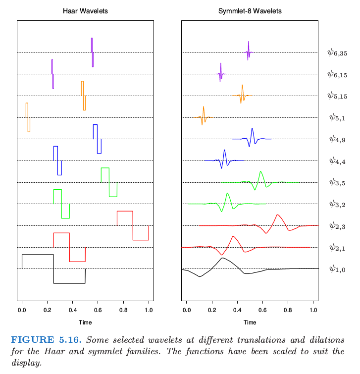
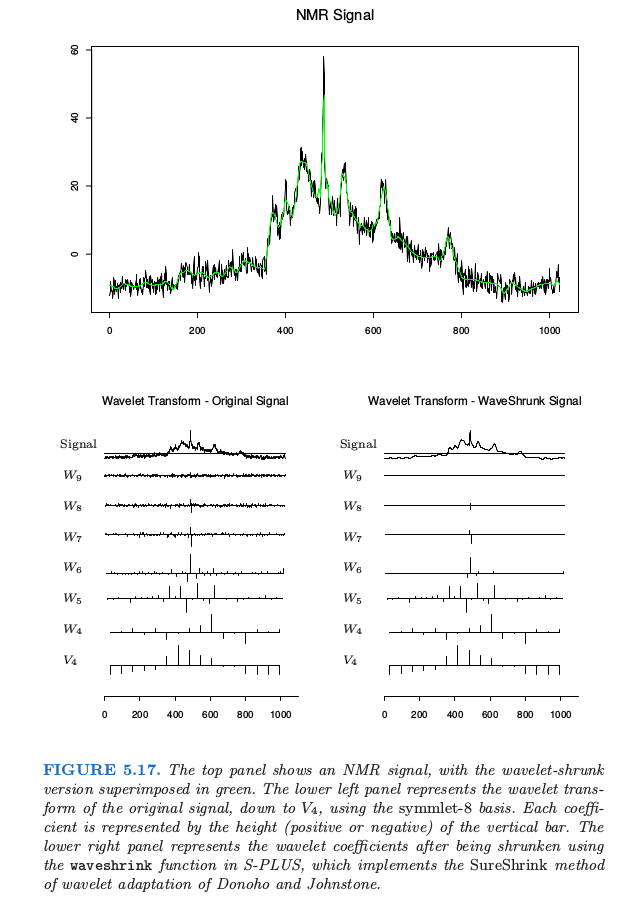
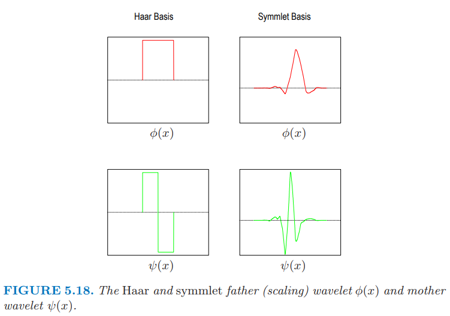
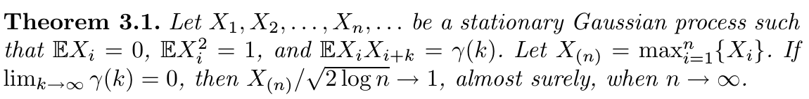
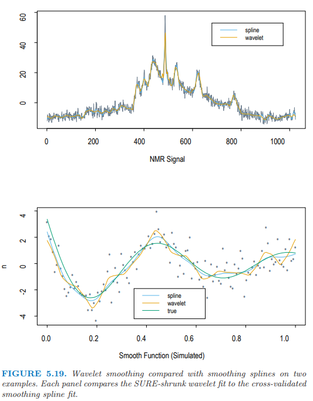

# 5.9 小波光滑

| 原文   | [The Elements of Statistical Learning](https://web.stanford.edu/~hastie/ElemStatLearn/printings/ESLII_print12.pdf#page=193) |
| ---- | ---------------------------------------- |
| 翻译   | szcf-weiya                               |
| 发布 | 2017-12-07 |
| 更新 | 2020-06-27 21:55:17|
| 状态 | Done|

我们已经看到，有两种操作的模式来处理**基函数的字典集 (dictionaries of basis functions)**．对于回归样条，我们运用专业相关的知识或者自动地来选择基底的子集．更自适应的过程比如 MARS（[第 9 章](../09-Additive-Models-Trees-and-Related-Methods/9.0-Introduction/index.html)）可以同时捕捉光滑和非光滑的行为．对于光滑样条，我们采用整个基底，然后将系数收缩到光滑．

小波法一般用整个正交基底来表示函数，但是会进一步对参数进行收缩或选择达到**稀疏 (sparse)** 表示．正如光滑函数可以用很少的样条基函数来表示，对于大部分都是平滑、包含很少的**独立凹凸块 (isolated bumps)** 函数可以用很少的（凹凸不平的）基函数来表示．小波基在信号处理和压缩中非常流行，因为他们可以有效地表示光滑和局部凹凸不平的函数——这被称为**时间和频率的局部化(time and frequency localization)**．相反，传统的 Fourier 仅仅允许频率的局部化．

在我们介绍具体细节前，先看看图 5.16 中左边的 Haar 小波来直观感受小波光滑是怎样实现的．

竖轴表示小波的尺度（频率），底部 **尺度最低 (low scale)**，顶端 **尺度最高 (high scale)**．在每个尺度下，小波并排着填充着时间轴：我们只展示出了一个子集．小波光滑通过最小二乘来拟合基底的系数，接着设置阈值来舍弃较小的系数．因为在每个尺度下都有很多的基函数，则可以在需要它的时候采用它，不需要它的时候舍弃它，这样来实现时间和频率的局部化．Harr 小波很容易理解，但是对大部分目标不够光滑．图 5.16 中右边的 symmlet 小波有着相同的正交性质，但是更加光滑．

图 5.17 展示了一个 **原子核偶磁共振 (nuclear magnetic resonance, NMR)** 信号，看上去由光滑的组分和单独的尖状物以及一些噪声组成．采用 symmlet 基底的小波变换显示在左下角的图中．小波的系数按行排列，从底部的最低尺度到顶部的最大尺度．每一条线段的长度表明了系数的大小．右下角显示了当设置阈值过滤时的小波系数．阈值过滤的过程由式 \eqref{5.69} 给出，是与线性回归中 lasso 一样的软阈值过程（[3.4.2 节](../03-Linear-Methods-for-Regression/3.4-Shrinkage-Methods/index.html)）．注意到许多较小的系数设为了 0．图中上边的绿色曲线显示了系数过滤后的 **向后转换 (back-transform)** 结果：这也就是原始信号的光滑版本．在下一节我们将给出这一过程的细节，包括小波的构造和阈值规则．

## 小波基和小波变换

!!! note "weiya 注"
    推荐 Guy Nason 的 [Wavelet Methods in Statistics with R](http://www.springer.com/gp/book/9780387759609)，其中第 2 节对 Wavelet 的介绍很通俗易懂，几乎不涉及定理，还在 R 中用具体例子说明．

这一节我们将给出小波的构造和过滤的具体细节．小波基通过单尺度函数 $\phi(x)$（也被称作 father）的 **平移 (translation)** 和 **伸缩 (dilation)** 生成．图 5.18 的红色曲线是 Haar 和 symmlet-8 的尺度函数．

Haar 基特别容易理解，特别是对于有着方差分析或者树的经验的人，因为它产生一个分段常值表示．因此如果 $\phi(x) = I(x\in [0,1])$，则 $\phi_{0,k}(x)=\phi(x-k)$，$k$ 是整数，生成在整数结点处跳跃的正交基函数．称这个为 **参考 (reference)** 空间 $V_0$．伸缩变换 $\phi_{1,k}=\sqrt{2}\phi(2x-k)$ 形成了在长度为 $\frac 12$ 的区间上取分段常值的函数空间 $V_1\supset V_0$．事实上，更一般地，我们有 $\cdots\supset V_1\supset V_0\supset V_{-1}\supset \cdots$ 其中每个 $V_j$ 由 $\phi_{j,k}=2^{j/2}\phi(2^jx-k)$ 张成．

现在来定义小波．在方差分析中，我们经常用总均值 $\mu=\frac 12(\mu_1+\mu_2)$ 来表示成对的均值 $\mu_1$ 和 $\mu_2$，以及差异 $\alpha=\frac 12 (\mu_1-\mu_2)$．如果 $\alpha$ 非常小，则可以进行简化，因为我们可以将之设为 0．类似的方式，我们可能用 $V_j$ 的组分加上 $V_j$ 关于 $V_{j+1}$ 的正交补中的组分 $W_j$ 来表示 $V_{j+1}$ 中的函数，写成 $V_{j+1} = V_j\oplus W_j$. $W_j$ 中的组分表示 **细节 (detail)**，而且我们可能希望将这些组分设为 0．容易看到由**母波 (mother wavelet)** $\psi(x) = \phi(2x)-\phi(2x-1)$ 生成的 $\psi (x-k)$ 构成了 Haar 族中 $W_0$ 的正交基．同样地，$\psi_{j,k}=2^{j/2}\psi(2^jx-k)$ 构成了 $W_j$ 的基．

现在 $V_{j+1}=V_j\oplus W_j=V_{j-1}\oplus W_{j-1}\oplus W_j$，所以除了用第 $j$ 层的 detail 和第 $j$ 层的 rough component 来表示一个函数，后者可以分解成第 $j-1$ 层的 detail 和 rough component，依次类推．最后我们得到表达式 $V_J=V_0\oplus W_0\oplus W_1\oplus \cdots\oplus W_{J-1}$．图 5.6 展示了特定的小波 $\psi_{j,k}(x)$．

注意到因为这些空间是正交的，则所有的基函数也都是正交的．事实上，如果定义域是离散的，且有 $N=2^J$ 个（时间）点，这是我们可以达到的最大值．在第 $j$ 层，我们有 $2^j$ 个基元素，加起来，则在 $W_j$ 中我们总共有 $2^J-1$ 个元素，还有 $V_0$ 中的一个元素．这个结构正交基允许 multiresolution analysis，我们将在下一节中介绍．

尽管 Haar 基可以帮助理解上述的构造过程，但具体情形下，Haar 基太粗糙了．幸运的是，已经发明了许多智能的小波基．图 5.16 和 5.18 作出了 Daubechies symmlet-8 基．这个基比对应的 Haar 基有更光滑的组分，但是存在 tradeoff：

- 每个小波的支撑集包含 15 个连续的时间间隔，而不像 Haar 基只包含一个．更一般地，symmlet-$p$ 族有 $2p-1$ 个连续间隔的支撑集．支撑集越宽，小波降至 0 所花费的时间越长，因此可以达到更光滑．注意到有效支撑集要窄很多．
- symmlet-$p$ 小波 $\psi(x)$ 有 $p$ 个 **消失的矩 (vanishing moments)**，也就是
$$
\int\psi (x)x^jdx=0,\; j=0,\ldots, p-1
$$
上式的其中一个意义是在 $N=2^J$ 个时间结点上产生的任意 order 为 $p$ 的多项式正好在 $V_0$ 中 ([习题 5.18](https://github.com/szcf-weiya/ESL-CN/issues/115)) 在这种情形下，$V_0$ 等价于光滑样条惩罚中的零空间．Haar 小波有一个消失的矩，且 $V_0$ 可以表示任意常值函数．

!!! note "weiya 注："
    已解决，详见 [Issue 115: Ex. 5.18](https://github.com/szcf-weiya/ESL-CN/issues/115)．

symmlet-$p$ 尺度函数是众多小波生成器族中的一个．操作类似 Haar 基：

- 如果 $V_0$ 由 $\phi(x-k)$ 展开，则 $V_1\supset V_0$ 由 $\phi_{1,k}(x)=\sqrt{2}\phi(2x-k)$ 展开，且对于某些过滤系数 $h(k)$，有 $\phi(x)=\sum_{k\in\cal Z}h(k)\phi_{1,k}(x)$．
- $W_0$ 由 $\psi(x) =\sum_{k\in\cal Z}g(k)\phi_{1,k}(x)$ 张成，其中过滤参数为 $g(k)=(-1)^{1-k}h(1-k)$．

## 自适应小波滤波

当数据在均匀格子上取值时，小波非常有用，比如数字化信号、图象，或者时间序列．我们将要关注一维的情形，假设总共有 $N=2^J$ 个格子点是很方便的．假设 $\mathbf y$ 是响应向量，$\W$ 是在 $N$ 个等距间隔观测上取值的 $N\times N$ 正交小波基矩阵．然后 $\y^\* = \W^T\y$ 被称作 $\y$ 的 **小波变换 (wavelet transform)** （这也是全最小二乘系数）．自适应小波拟合的流行方法被称作 SURE 收缩 (Stein Unbiased Risk Estimation, Donoho and Johnstone (1994)[^1])．我们以下面的准则开始

$$
\underset{\boldsymbol\theta}{\min}\Vert \y-\W\boldsymbol\theta\Vert^2_2+2\lambda\Vert \boldsymbol\theta\Vert_1\tag{5.68}\label{5.68}
$$

这与[第 3 章](../03-Linear-Methods-for-Regression/3.4-Shrinkage-Methods/index.html)中的 lasso 准则一样．因为 $\W$ 是正交的，所以导出下面简单的解：

$$
\hat\theta_j = \sign(y_j^*)(\vert y_j^*\vert-\lambda)_+\tag{5.69}\label{5.69}
$$

最小二乘系数平移至 0，且在 0 处截断．拟合后的函数（向量）则由**逆小波变换 (inverse wavelet transform)** $\hat{\mathbf f} = \W\hat\theta$ 给出．

$\lambda$ 的一个简单选择是 $\lambda = \sigma \sqrt{2\log N}$，其中 $\sigma$ 是噪声标准偏差的估计．我们可以给出这种选择一些理由．因为 $\W$ 是正交变换，如果 $\y$ 中的元素为白噪声（均值为 0 且方差为 $\sigma^2$ 的独立高斯随机变量），则 $\y^*$ 也是．而且如果随机变量 $Z_1,Z_2,\ldots,Z_N$ 是白噪声，$\vert Z_j\vert, j=1,\ldots, N$ 最大值的期望近似为 $\sigma\sqrt{2\log N}$．因此所有小于 $\sigma \sqrt{2\log N}$ 的系数可能为噪声，且设为 0．

!!! note "weiya 注："
    Guy Nason 的 [Wavelet Methods in Statistics with R](http://www.springer.com/gp/book/9780387759609) 提到如下定理直接说明了上述结论：
    

空间 $\W$ 可以是任意正交函数的基：多项式，自然样条或者 cosinusoids．让小波变得特殊的是采用的基函数的特定形式，它允许**在时间和在频率上局部化 (localized in time and in frequency)** 的表示．

让我们再次看一下图 5.17 的 NMR 信号．采用 symmlet-8 基来计算小波变换．注意到这些系数没有都降至 $V_0$，而是在 $V_4$ 停住，其中有 16 个基函数．当我们从小到大去看每一层的 detail，系数越来越小，除了在有尖状物的地方．小波的系数表示信号在时间上局部化（在每一层的基函数是其它函数的平移）以及在频率上局部化的特征．每个伸缩通过因子 2 来增长 detail，这种情形对应在传统的 Fourier 表示中对频率加倍．事实上，小波的更数学的理解揭示了在特定尺度上小波有一个限制在有限区域或频率的**信频 (octave)** 上的 Fourier 变换．

右图中的收缩、截断是通过 SURE 方法（在这一节的开头有介绍）实现的．$N\times N$ 的正交基矩阵 $\W$ 是在 $N$ 个时间点上取值的小波基函数．特别地，在图中情形下，有 16 列对应 $\phi_{4,k}(x)$，且剩余的贡献在 $\psi_{j,k}(x), j=4,\ldots,11$ 上．实际中，$\lambda$ 依赖噪声方差，而且必须从数据中估计出来（比如在最高层次的系数的方差）．

注意到 SURE 准则 \eqref{5.68} 和 光滑样条准则 \eqref{5.21} 的相似性：

!!! note "weiya 注：Recall"
    $$
    \underset{\mathbf\theta}{\mathrm{min}}\Vert \mathbf{y-U\theta}\Vert^2+\lambda \mathbf{\theta^TD\theta}\tag{5.21}\label{5.21}
    $$

- 两者都是从粗糙到细致的分层结构，尽管小波在每个分辨率上对时间也进行局部化．
- 样条通过强加不同的收缩常数 $d_k$ 来建立光滑函数的基．早期版本的 SURE 收缩对所有尺度同等对待． `S+wavelets` 函数 `waveshrink() ` 有许多选项，有些允许不同的收缩．
- 样条的 $L_2$ 惩罚只进行收缩，而 SURE 的 $L_1$ 的惩罚进行收缩和选择．

更一般地，光滑样条通过加上光滑度来实现原始信号的压缩，而小波是加上稀疏度．

图 5.19 在两个本质不同的数据集上比较了小波拟合 （采用 SURE 收缩） 和光滑样条拟合（采用交叉验证）．对于上图中的 NMR 数据，光滑样条到处引入 detail 来捕捉 isolated spike 的细节；小波拟合很好地局部化了 spike．在下图中，真实函数是光滑的，噪声相对较大、小波拟合引入了额外的不必要的 wiggle——这是为了额外的自适应性付出的代价．

小波变换不是通过 $\y^\*=\W\y$ 中的矩阵相乘来进行．事实上，采用更智能的 **金字塔算法 (pyramidal schemes)**, $\y^\*$ 会用 $O(N)$ 的计算量完成，这甚至比 **快速傅里叶变换 (FFT)** 的 $N\log N$ 还要快．尽管一般情形下的构造超出了本书的范围，但可以简单证明 Haar 基时的情形（[练习 5.19](https://github.com/szcf-weiya/ESL-CN/issues/116)）．同样地，逆小波变换 $\W\hat{\theta}$ 也是 $O(N)$ 的．

!!! info "weiya 注：Ex. 5.19"
    已解决，详见 [Issue 116: Ex. 5.19](https://github.com/szcf-weiya/ESL-CN/issues/116)．

这里只是对这个庞大且在发展的领域作非常简单的介绍．在小波上建立了非常大量的数学和计算基础．现代图象压缩通常采用二维小波表示来实现．

[^1]: Donoho, D. and Johnstone, I. (1994). Ideal spatial adaptation by wavelet shrinkage, Biometrika 81: 425–455.
