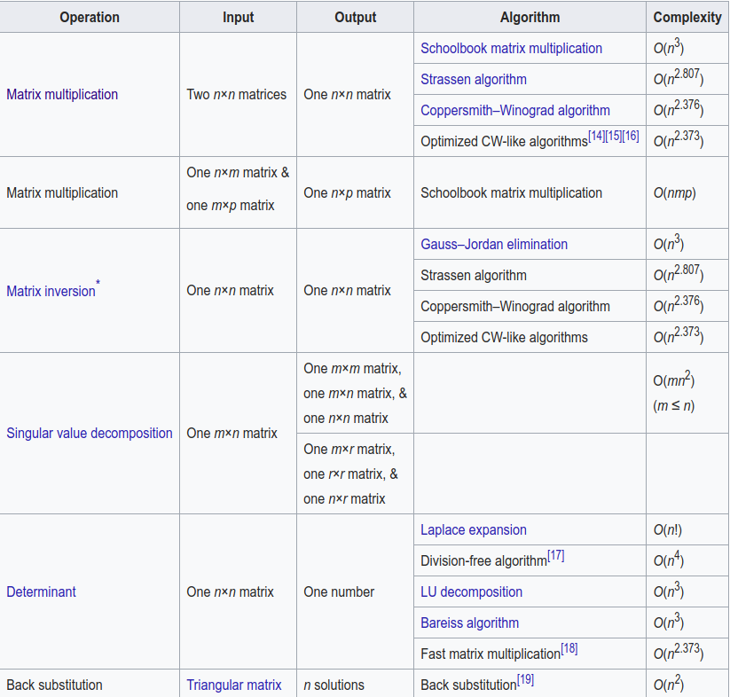

# 附录

| 原文   | [The Elements of Statistical Learning](https://web.stanford.edu/~hastie/ElemStatLearn/printings/ESLII_print12.pdf) |
| ---- | ---------------------------------------- |
| 翻译   | szcf-weiya                               |
| 发布 | 2017-10-22 |
| 更新 |2019-09-09 22:07:46|
| 状态 | Done |

!!! note "更新笔记"
    @2018-01-09 gsl实现B样条拟合的例子[代码](https://github.com/szcf-weiya/ESL-CN/blob/master/docs/notes/BS/ex_bs.cpp)

在附录里面，我们将要讨论表示多项式样条的 $B$ 样条基．我们也讨论它们在光滑样条中计算的应用．

## B样条

在我们开始之前，我们需要对 [5.2 节](5.2-Piecewise-Polynomials-and-Splines/index.html)定义的结点序列进行增广．令 $\xi_0<\xi_1$，和 $\xi_K<\xi_{K+1}$ 为两个边界结点，一般地它们定义了样条取值的定义域．我们现在定义增广的结点序列 $\tau$ 使得

- $\tau_1\le \tau_2\le \cdots\le \tau_M\le \xi_0$
- $\tau_{j+M}=\xi_j,j=1,\cdots,K$
- $\xi_{K+1}\le \tau_{K+M+1}\le \tau_{K+M+2}\le \cdots\le \tau_{K+2M}$

边界结点之外的这些额外结点的实际值是任意的，而且一般地令它们分别等于 $\xi_0$ 和 $\xi_{K+1}$．

!!! note "weiya 注"
    **差商 (divided differences)**: from [wiki](https://en.wikipedia.org/wiki/Divided_differences)
    给定 $k+1$ 个数据点 $(x_i,y_i),i=1,2,\ldots,k$
    向前差商定义为

    $$
    \begin{align*}
    [y_\nu]&:=y_\nu,\;\nu\in\{0,\ldots, k\}\\
    [y_\nu,\ldots,y_{\nu+j}]&:=\frac{[y_{\nu+1},\ldots,y_{\nu+j}]-[y_{\nu},\ldots,y_{\nu+j-1}]}{x_{\nu+j}-x_{\nu}},\;\nu\in\{0,\ldots,k-j\},j\in\{1,\ldots,k\}
    \end{align*}
    $$

    向后差商定义为

    $$
    \begin{align*}
    [y_\nu]&:=y_\nu,\;\nu\in\{0,\ldots, k\}\\
    [y_\nu,\ldots,y_{\nu-j}]&:=\frac{[y_{\nu},\ldots,y_{\nu-j+1}]-[y_{\nu-1},\ldots,y_{\nu-j}]}{x_{\nu}-x_{\nu-j}},\;\nu\in\{0,\ldots,k-j\},j\in\{1,\ldots,k\}
    \end{align*}
    $$

记 $B_{i,m}(x)$ 为结点序列 $\tau$ 的 order 为 $m$ 的第 $i$ 个 $B$ 样条基函数，$m\le M$．通过差商递归定义有:

$$
B_{i,1}(x)=\left\{
  \begin{array}{ll}
  1&\text{if }\tau_i\le x< \tau_{i+1}\\
  0&\text{otherwise}
  \end{array}
  \right.
  \;
  i=1,\ldots, K+2M-1
  \tag{5.77}
$$

这些也被称为 Haar 基函数．
$$
B_{i,m}(x)= \frac{x-\tau_i}{\tau_{i+m-1}-\tau_i}B_{i,m-1}(x)+\frac{\tau_{i+m}-x}{\tau_{i+m}-\tau_{i+1}}B_{i+1,m-1}(x), \; i=1, \ldots,K+2M-m\tag{5.78}
$$

因此当$M=4,B_{i,4},i=1,\cdots,K+4$是结点序列$\xi$的$K+4$个三次B样条基函数．

<!-- !!! note "weiya 注：Alternative Definition"
    在 [GSL: GNU Scientific Library](https://www.gnu.org/software/gsl/doc/html/index.html) 中的帮助文档中，$B$ 样条定义稍微有点区别：给定结点向量
    $$
    t=\{t_0,t_1,\ldots,t_{n+k-1}\}\,,
    $$
    order 为 $k$ 的 $n$ 个基函数定义为
    $$
    \begin{align*}
    B_{i,1}(x) &= \begin{cases}
    1 & t_i\le x < t_{i+1}\\
    0 & \text{else}
    \end{cases}\\
    B_{i,k}(x) &= \frac{x-t_i}{t_{i+k-1}-t_i}B_{i+1,k-1}(x)+\frac{t_{i+k}-x}{t_{i+k}-t_{i+1}}B_{i+1,k-1}(x)
    \end{align*}
    $$
    for $i=0,\ldots,n-1$，在这种定义下，order 为 $k$ 的 $B$ 样条基函数个数为 $n = nbreak-k$，其中 $nbreak$ 是内结点个数，而 $nbreak=n+2$ 为所有结点个数，则样条基函数个数也可以表示为 $nbreak+k-2$，这也是 `gsl` 中
    ```c
    gsl_bspline_workspace* gsl_bspline_alloc (const size_t k , const size_t nbreak )
    ```
    函数中参数的形式。 -->

这个递归可以继续，并且将会产生任意 order 样条的 $B$ 样条基．


!!! tip
    结合[Ex. 5.2](https://github.com/szcf-weiya/ESL-CN/issues/66#issue-296103785)来看 Fig. 5.20，更能加深对 B 样条基函数的理解．

图 5.20 显示了 order 至多为 4 的 $B$ 样条序列，其中结点在 $0.0,0.1,\ldots, 1.0$．因为我们构造了一些重复结点，所以需要注意避免分母为 0．如果我们约定当 $\tau_i=\tau_{i+1}$，有 $B_{i,1}=0$，于是可以归纳得到当 $\tau_i=\tau_{i+1}=\ldots=\tau_{i+m}$，有 $B_{i,m}=0$．注意到在上面的构造中，只要求子集 $B_{i,m},i=M-m+1,\ldots, M+K$ 用作结点为 $\xi$的order为 $m < M$ 的 $B$ 样条基．

<!-- !!! note "weiya 注："
    注意到 $B_{i,m},i=M-m+1,\ldots, M+K$ 中基函数个数刚好是 $K+m$，这与上文 Note 中提到的 GSL 中 $n+k$ 一致。 -->

为了全面理解这些函数的性质，并且为了证明它们确实张成了结点序列的三次样条空间，需要额外的数学知识，包括差商的性质．[练习5.2](https://github.com/szcf-weiya/ESL-CN/issues/66)探索了这些问题．

!!! note "weiya注：Ex. 5.2"
    目前完成了练习 5.2 的前三问的证明，还要两小问的证明待完成，具体证明过程见[Issue: Ex. 5.2](https://github.com/szcf-weiya/ESL-CN/issues/66)．练习 5.2 的结论如下：

    - 当 $x\not\in [\tau_i, \tau_{i+M}], B_{i,M}(x)=0$;
    - 当 $x\in (\tau_i,\tau_{i+M}), B_{i,M}(x) > 0$;
    - $\forall x\in [\xi_0,\xi_{K+1}], \sum_1^{K+M}B_{i,M}(x)=1$;
    - $B_{i,M}$ 是 $[\xi_0,\xi_{K+1}]$ 上 order 为 $M$ 的分段多项式，断点仅为 $\xi_1,\ldots, \xi_K$;
    - order 为 $M$ 的 B 样条基函数是 $M$ 个均匀随机变量的卷积(convolution)的密度函数

$B$ 样条实际上不仅限于这里讨论的内容，而且与结点复制(knot duplication)有关．如果我们在上面的 $\tau$ 序列的构造中复制一个内结点，像之前一样生成 $B$ 样条序列，则得到的基会在复制的结点处张成低一阶的连续可导分段多项式．一般地，除了复制边界点，我们可以将内结点 $\xi_j$ 复制 $1\le r_j\le M$ 次，则点 $x=\xi_j$ 处不连续可导的最低阶为 $M-r_j$．因此，对于无复制的三次样条，$r_j=1,j=1,\ldots,K$，并且在每个内结点处的三阶微分($4-1$)都是不连续的．复制第 $j$ 个结点三次，则一阶微分不连续；复制结点四次则零阶微分不连续，也就是，在 $x=\xi_j$ 处不连续．当我们复制结点 $M$ 次，则样条在边界点处不连续（比如，在边界点外无定义），这正是在边界点处发生的．

$B$ 样条局部支撑有重要的计算应用，特别当结点数 $K$ 很大时．$K+M$ 个变量的 $N$ 个观测的最小二乘计算量为 $O(N(K+M)^2+(K+M)^3)$ 次浮点运算(flops)．

!!! note "weiya注：flops"
    floating point operations 的简称，浮点运算．

如果 $K$ 是 $N$ 的若干分之一(some appreciable fraction)，则得到 $O(N^3)$ 的算法，这对于较大的 $N$ 是不能接受的．如果 $N$ 个观测已经排好序，则 $K+M$ 个基函数在 $N$ 个点上取值的 $N\times (K+M)$ 的回归矩阵有许多 0，可以利用这一点将计算复杂性降至 $O(N)$．我们在下一节详细讨论这一点．

!!! note "weiya注：复杂度"
    首先贴出[wiki: Computational complexity of mathematical operations](https://en.wikipedia.org/wiki/Computational_complexity_of_mathematical_operations)中给出的各种矩阵运算的复杂度：

    

    对于$N\times p$的设计矩阵$X$及$N\times 1$的响应变量向量$Y$，其最小二乘估计为$(X'X)^{-1}X'Y$，采用一般的Gauss-Jordan elimination的矩阵逆运算，则总复杂度为$O(Np^2+p^3)$，故$K+M$个变量的$N$个观测的最小二乘复杂度为$O(N(K+M)^2+(K+M)^3)$．

!!! note "weiya 注：B 样条在 R, C++, Python 中的实现"
    [这篇笔记](../notes/BS/bs.md)比较了 B 样条在 R，C++ 以及 Python 中的实现。


## 光滑样条的计算

尽管自然样条（[5.2.1节](5.2-Piecewise-Polynomials-and-Splines/index.html)）给出了光滑样条的基，但无约束的 $B$ 样条在较大空间中操作计算上更方便．

!!! note "Recall"
    含 $K$ 个结点的自然三次样条可以用 $K$ 个基函数表示：
    $$
    N_1(X)=1,\;N_2(X)=X,\; N_{k+2}(X)=d_k(X)-d_{K-1}(X),\tag{5.4}
    $$
    其中，
    $$
    d_k(X)=\frac{(X-\xi_k)_+^3-(X-\xi_K)_+^3}{\xi_K-\xi_k}\tag{5.5}
    $$


我们写成 $f(x)=\sum_1^{N+4}\gamma_jB_j(x)$，其中 $\gamma_j$ 是系数，$B_j$ 是三次 $B$ 样条基函数．这个解与之前看起来很像，

$$
\hat\gamma = (\B^T\B+\lambda\oomega_B)^{-1}\B^T\y\tag{5.79}
$$

!!! note "Recall"
    $$
    \hat\theta = (\mathbf N^T\mathbf N+\lambda\Omega_N)^{-1}\mathbf N^T\mathbf y\tag{5.12}
    $$

只不过现在 $N\times N$ 的矩阵 $\N$ 用 $N\times(N+4)$ 的矩阵 $\B$ 来替换，类似地，$(N+4)\times (N+4)$ 的惩罚矩阵 $\oomega_B$ 替换 $N\times N$ 的矩阵 $\oomega_N$．看上去似乎没有边界微分的约束，事实上惩罚项通过对边界外的点的任意非零微分加上了充分大的权重自动加上了这些约束．实际中，$\hat\gamma$ 限制在惩罚总是有限的线性子空间中．

!!! note "weiya 注："
    实际中，自然样条基函数矩阵 $\N$ 可以由 $B$ 样条基函数矩阵 $\B$ 导出，详见 [Issue 235](https://github.com/szcf-weiya/ESL-CN/issues/235)

因为 $\B$ 的列是从左到右在已经排序的 $X$ 的值上进行赋值的 $B$ 样条，并且三次 $B$ 样条有局部支撑，$\B$ 是 lower 4-banded．

!!! note "weiya 注：band matrix"
    对于矩阵$A=(a_{i,j})$，若

    $$
    a_{i,j}=0\;if\;j < i-k_1\; or\; j > i + k_2;\; k_1,k_2\ge 0
    $$
    则 $k_1$ 和 $k_2$ 分布被称为 lower bandwidth 和 upper bandwidth．

因此，矩阵 $\M=(\B^T\B)+\lambda\oomega$ 是 4-banded，则可以很简单地计算它的 cholesky 分解 $\M=\L\L^T$．接着，通过向后替换(back-substitution)求解 $\L\L^T\gamma=\B^T\y$ 得到 $\gamma$，则解 $\hat f$ 是 $O(N)$ 次运算量．

实际中，当 $N$ 很大，没必要使用所有的 $N$ 个内结点，并且任何合理的 thinning 策略都会在计算量有改善，并且在拟合值的影响可以忽略．举个例子，S-PLUS中的 `smooth.spline` 函数采用近似的对数策略：如果 $N < 50$，采用所有结点，但是在 $N=5000$ 时，只采用 204 个结点．
