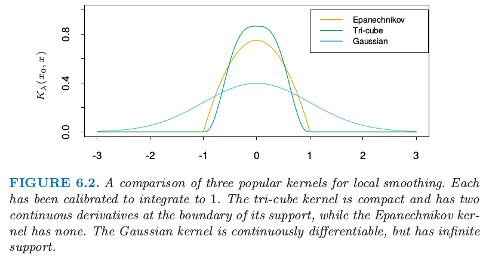
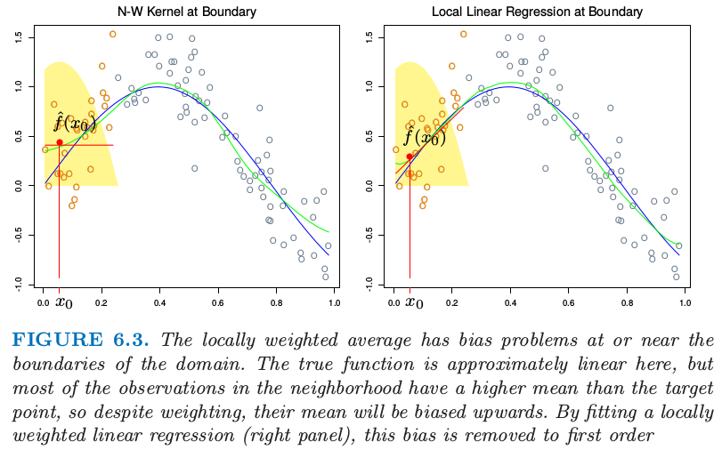
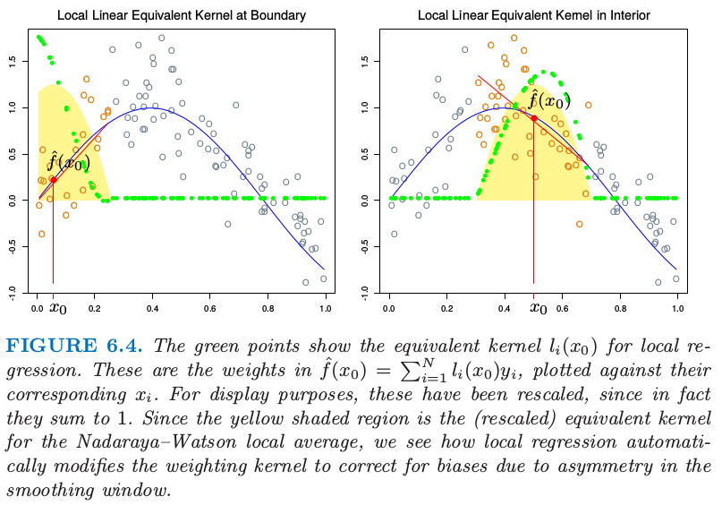

# 6.1 一维核光滑器

| 原文   | [The Elements of Statistical Learning](https://web.stanford.edu/~hastie/ElemStatLearn/printings/ESLII_print12.pdf) |
| ---- | ---------------------------------------- |
| 翻译   | szcf-weiya                               |
| 发布 | 2017-03-01 |
| 更新 | 2018-07-18|
| 状态 |Done|

第二章中，我们将 $k$-最近邻平均
$$
\hat f(x)=\mathrm{Ave}(y_i\mid x_i\in N_k(x))\tag{6.1}\label{6.1}
$$
作为回归函数 $\E(Y\mid X=x)$ 的估计．这里 $N_k(x)$ 为在平方距离下，离 $x$ 最近的 $k$ 个点的集合，并且 $\mathrm{Ave}$ 记为平均（均值）．这个想法是松弛条件期望的定义，正如图 6.1 的左图所示一样，并且计算目标点邻域的平均．这种情形下我们采用 30-最近邻—— $x_0$ 处的拟合值为离 $x_0$ 最近的 30 个点的平均．在不同的 $x_0$ 处应用这个定义则得到绿色曲线．绿色曲线是颠簸不平的，因为 $\hat f(x)$ 在 $x$ 处不连续．当我们将 $x_0$ 从左移到右，$k$ 最近邻保持一致，直到 $x_0$ 右侧的点 $x_i$ 变得比 $x_0$ 左侧的邻域的最远点 $x_i'$ 更近，这时 $x_i$ 换成 $x_i'$．\eqref{6.1} 的平均以离散的方式变换，得到离散的 $\hat f(x)$．

> 图6.1. 每张图中从蓝色曲线加上高斯误差中随机产生100个数据对 $x_i,y_i$：$Y=\sin(4X)+\varepsilon,X\sim U[0,1],\varepsilon\sim N(0,1/3)$．左图的绿色曲线是 30-最近邻滑动均值光滑器的结果．红色点是拟合的常数值 $\hat f(x_0)$，红色圆圈表明对 $x_0$ 处拟合有贡献的观测．实心黄色区域为赋予给观测的权重．右图中，绿色曲线是核权重平均，采用（半）窗宽度 $\lambda=0.2$ 的 Epanechnikov 核．

不连续是不好看并且不必要的．与其对邻域中的点赋予相等的权重，我们可以分配权重，使其随着与目标点的距离平滑降低．右图显示了这样的一个例子，使用被称作 Nadaraya–Watson 的核权重平均
$$
\hat f(x_0)=\frac{\sum_{i=1}^NK_{\lambda}(x_0,x_i)y_i}{\sum_{i=1}^NK_{\lambda}(x_0,x_i)}\tag{6.2}
$$
其中 Epanechnikov 平方核为
$$
K_\lambda(x_0,x) = D\left(\frac{\vert x-x_0\vert}{\lambda}\right)\tag{6.3}\label{6.3}
$$
其中
$$
D(t)=
\left\{
  \begin{array}{ll}
  \frac{3}{4}(1-t^2)&\text{if }\vert t\vert\le 1\\
  0&\text{otherwise}
  \end{array}
\right.
\tag{6.4}
$$
现在拟合函数为连续的，并且图 6.1 中的右图非常光滑．当我们将目标点从左移到右，进入邻域中的点初始化权重为 $0$，然后它们的贡献缓慢地增长（见[练习 6.1](https://github.com/szcf-weiya/ESL-CN/issues/147)）．

在右图中我们核拟合采用的度量窗口大小为 $\lambda=0.2$，当我们移动目标点 $x_0$ 时窗口大小不变，而 30 最近邻光滑窗口大小适应 $x_i$ 的局部密度．然而，核拟合也可以使用这种自适应的邻域，但是我们需要用更一般的记号．令 $h_\lambda(x_0)$ 为宽度函数（由 $\lambda$ 编号），它确定着 $x_0$ 处的邻域的宽度．于是更一般地我们有
$$
K_\lambda(x_0,x)=D\left(\frac{\vert x-x_0\vert}{h_\lambda(x_0)}\right)\tag{6.5}
$$
\eqref{6.3} 中，$h_\lambda(x_0)=\lambda$ 为常值．对于 $k$ 最近邻域，用邻域大小 $k$ 代替 $\lambda$，并且我们有 $h_k(x_0)=\vert x_0-x_{[k]}\vert$，其中 $x_{[k]}$ 是离 $x_0$ 的第 $k$ 个最近的点．

在实际中有许多细节需要注意：

- 需要确定光滑参数 $\lambda$，它决定了局部邻域的宽度．大 $\lambda$ 表明低方差（在更多的观测上平均）但高偏差（实质上假设在窗口中真实函数为常值的）．

- 度量窗口宽度（常值 $h_\lambda(x)$）趋向于保持估计的偏差为常值，但是方差与局部密度成反比．最近邻窗口宽度表现出相反地行为；方差为常值并且绝对偏差随局部密度反比例变化．

- 当在 $x_i$ 处出现 **结 (tie)**，最近邻出现了问题．大部分的光滑技巧，可以简单地通过在打结的 $X$ 值处对 $y_i$ 平均来减少数据集，并且对 $x_i$ 处新的唯一观测赋予额外的权重 $w_i$（这个乘以核权重）．

!!! note "weiya 注：tied data"
    简单理解为重复数据，参考 [ranking - What is tied data in the context of a rank correlation coefficient? - Cross Validated](https://stats.stackexchange.com/questions/7941/what-is-tied-data-in-the-context-of-a-rank-correlation-coefficient)．

- 有个更一般的问题需要处理：观测的权重 $w_i$．实际操作中我们在计算加权平均时简单地将它们乘上核权重．在最近邻中，保持邻域的总权重 $k$（与 $\sum w_i$ 相对）是自然的．在 **超出 (overflow)** 的情形中（邻域中最后一个需要的观测的权重 $w_j$ 会导致权重中和超出 $k$）,于是可以采用其中的一部分（也就相当于去掉超出的量）．

- 产生边界问题．度量邻域趋向于在边界处包含更少的点，而最近邻趋向于变得更宽．

- Epanechnikov 核有紧的支撑集（当与最近邻窗口宽度同时使用会需要）．另外一个受欢迎的紧核 (compact kernel) 基于三次立方函数
  $$
  D(t)=
  \left\{
    \begin{array}{ll}
    (1-\vert t\vert^3)^3&\text{if }\vert t\vert\le 1\\
    0&\text{otherwise}
    \end{array}
  \right.
  \tag{6.6}
  $$
  这在上面是平的（与最近邻盒子类似）并且在支撑集的边界是可导的．高斯密度函数 $D(t)=\phi(t)$ 是受欢迎的非紧核，其中标准误差扮演了窗口大小的角色．图 6.2 比较了这三个．

!!! note "weiya 注："
    **紧核 (compact kernel)** 应该是指支撑集为紧集的核．紧集或者紧致性的直观解释可以参见 [如何直观地解释「紧致性」？ - 包遵信的回答 - 知乎](https://www.zhihu.com/question/31734712/answer/72390708).

> 图 6.2 局部光滑的三个流行的核的比较．每个都已经经过校准使得积分为 $1$．三次立方核是紧的并且在支撑集的边界有二阶连续微分，而 Epanechnikov 没有．高斯核是连续可微的，但是有无限的支撑集．

## 局部线性回归

我们已经从原始的滑动平均进步到通过使用核权重实现的光滑变化局部加权平均．然而，光滑核拟合仍然有问题，正如图 6.3（左）显示的那样．局部加权平均会在定义域边界处有严重的偏差，因为这个区域内核的不对称性．通过拟合直线而不是局部的常值，我们可以将偏差降至一阶；见图 6.3（右）．实际上，如果 $X$ 值不是相等的间隔（基于同样的原因，但是通常没有那么严重），偏差也可以表现在定义域的中间．再一次局部加权线性回归会纠正为一阶误差．

> 图 6.3. 局部加权平均在定义域边界处或附近有着偏差问题．真实的函数在这里近似线性，但是邻域中大部分观测比目标点有更高的均值，所以尽管进行了加权，但是它们的均值将会向上偏．通过拟合局部的加权线性回归（右），这个偏差会降到一阶．

!!! note "weiya 注：不对称性"
    注意图中黄色阴影区域只有图 6.1 中右图的一半，对应的高度表示赋予给观测的权重。

局部加权回归解决了在每个目标点处独立的加权最小二乘问题：

$$
\underset{\alpha(x_0),\beta(x_0)}{\min}\sum\limits_{i=1}^NK_\lambda(x_0,x_i)[y_i-\alpha(x_0)-\beta(x_0)x_i]^2\tag{6.7}
$$
  
于是估计为 $\hat f(x_0)=\hat\alpha(x_0)+\hat\beta(x_0)x_0$．注意到尽管我们对区域内的数据拟合整个线性模型，但是我们只用它来确定单点 $x_0$ 处的函数值．

定义向量值函数为 $b(x)^T=(1,x)$．令 $\mathbf B$ 为 $N\times 2$ 的回归矩阵，第 $i$ 行为 $b(x_i)^T$，并且 $\mathbf W(x_0)$ 为 $N\times N$ 的对角矩阵，其中第 $i$ 个对角元为 $K_\lambda(x_0,x_i)$．于是
  
$$
  \begin{align}
  \hat f(x_0)&= b(x_0)^T(\mathbf {B^TW}(x_0)\mathbf B)^{-1}\mathbf B^T\mathbf W(x_0)\mathbf y\tag{6.8}\label{6.8}\\
  &=\sum\limits_{i=1}^Nl_i(x_0)y_i\tag{6.9}\label{6.9}
  \end{align}
$$

!!! note "weiya 注"
    **广义最小二乘估计 (GLSE)**
    线性模型为
    $$
    \mathbf{Y=X}\beta+e,\; \E(e)=0,\; \Cov(e)=\sigma^2\mathbf\Sigma
    $$
    $\beta$ 估计为
    $$
    \mathbf{\beta^*=(X'\Sigma^{-1}X)^{-1}X'\Sigma^{-1}Y}
    $$
    当
    $$
    \Cov(e)=\diag(\sigma_1^2,\cdots,\sigma^2_n)
    $$
    有**加权最小二乘估计 (WLSE)**

等式 \eqref{6.8} 给出了局部线性回归估计的显式表达，式 \eqref{6.9} 强调了估计关于 $y_i$ 为线性的（$l_i(x_0)$ 不涉及 $\mathbf y$）．这些权重 $l_i(x_0)$ 结合了核 $K_\lambda(x_0,\cdot)$ 和最小二乘估计，并且有时称作 **等价核 (equivalent kernel)**．图 6.4 说明了局部线性回归在等价核上的影响．从历史上看，Nadaraya–Watson 和其他局部平均核方法中的偏差是通过修改核本身进行纠正．这些修改基于理论渐近的均方误差，不仅很复杂，而且只对有限样本进行近似．局部线性回归自动地修改核将偏差矫正到恰好为一阶，这是被称为 **自动核作品 (automatic kernel carpentry)** 的现象．

!!! info "weiya 注：automatic kernel carpentry"
    更多细节可以参考 [T. Hastie and C. Loader (1993). Local Regression: Automatic Kernel Carpentry](https://projecteuclid.org/download/pdf_1/euclid.ss/1177011002)

考虑下面 $\E\hat f(x_0)$ 的展开，利用局部回归的线性和真实函数 $f$ 在 $x_0$ 处的展开，
$$
\begin{align}
\E\hat f(x_0)&=\sum\limits_{i=1}^Nl_i(x_0)f(x_i)\notag\\
&=f(x_0)\sum\limits_{i=1}^Nl_i(x_0)+f'(x_0)\sum\limits_{i=1}^N(x_i-x_0)l_i(x_0)\notag\\
&+\frac{f''(x_0)}{2}\sum\limits_{i=1}^N(x_i-x_0)^2l_i(x_0)+R\tag{6.10}\label{6.10}
\end{align}
$$
其中余项 $R$ 涉及 $f$ 的三阶微分和更高阶的微分，并且在合适的光滑性假设下一般是很小的．可以证明（[练习 6.2](https://github.com/szcf-weiya/ESL-CN/issues/148)）对于局部线性回归，$\sum_{i=1}^Nl_i(x_0)=1$ 并且 $\sum_{i=1}^N(x_i-x_0)l_i(x_0)=0$．因此中间项为 $f(x_0)$，并且因为偏差为 $\E\hat f(x_0)-f(x_0)$，我们看到它仅仅取决于 $f$ 的平方项或更高阶的项．

!!! info "weiya 注："
    已解决，详见 [Issue 148: Ex. 6.2](https://github.com/szcf-weiya/ESL-CN/issues/148)．

> 图 6.4. 绿色点显示了局部回归的等价核．这是 $\hat f(x_0)=\sum_{i=1}^Nl_i(x_0)y_i$ 中的系数，是关于对应 $x_i$ 的图像．为了展示的目的，这些已经进行了缩放，因为实际上它们相加等于 1．因为黄色阴影区域是 Nadaraya–Watson 局部平均的（缩放的）等价核，所以我们看到局部回归是怎样自动修改权重核来纠正由于光滑窗口的不对称窗口的偏差．

## 局部多项式回归

为什么止步于局部线性拟合处？其实我们可以拟合任意阶 $d$ 的局部多项式拟合，
$$
\underset{\alpha(x_0),\beta_j(x_0),j=1,\ldots,d}{\min}\sum\limits_{i=1}^NK_\lambda(x_0,x_i)\Big[y_i-\alpha(x_0)-\sum\limits_{j=1}^d\beta_j(x_0)x_i^j\Big]^2\tag{6.11}
$$
解为 $\hat f(x_0)=\hat \alpha(x_0)+\sum_{j=1}^d\hat\beta_j(x_0)x_0^j$．实际上，类似 \eqref{6.10} 的表达式将告诉我们偏差仅仅有 $d+1$ 阶和更高阶的组分（[练习 6.2](https://github.com/szcf-weiya/ESL-CN/issues/148)）．图 6.5 说明了局部二次回归．局部线性拟合趋向于在真实函数的区域中有偏差，这个现象被称作 **截断山坡 (trimming the hills)** 和 **填充山谷 (filling the valleys)**．局部二次回归一般可以纠正这个偏差．

> 图 6.5. 局部线性拟合在真实函数曲线区域中的偏差．局部二次拟合趋向于消除这个偏差．

当然为了减小这个偏差需要付出代价，也就是增加方差．图 6.5 的右图更摇摆，特别在尾巴处．假设模型 $y_i=f(x_i)+\varepsilon_i$，并且 $\varepsilon_i$ 独立，并且是均值为 $0$ 方差为 $\sigma^2$ 的同分布，$\Var(\hat f(x_0))=\sigma^2\Vert l(x_0)\Vert^2$，其中 $l(x_0)$ 是在 $x_0$ 处等价核权重的向量．可以证明（[练习 6.3](https://github.com/szcf-weiya/ESL-CN/issues/149)）$\Vert l(x_0)\Vert$ 随着 $d$ 增加而增加，所以在选择多项式次数时存在偏差和方差之间的权衡．

!!! info "weiya 注：Ex. 6.3"
    证明了 $W=I$ 的情形，但是对于一般的权重系数矩阵，卡住了。欢迎交流讨论，[Issue 149: Ex. 6.3](https://github.com/szcf-weiya/ESL-CN/issues/149).

图 6.6 说明了次数为 0,1 和 2 的局部多项式的方差曲线．总结一下这个问题上一些正确的做法：

- 局部线性拟合在边界处以适合的方差代价对偏差有显著的帮助．但局部二次拟合在边界处对偏差的贡献很少，而且大幅增加了方差．
- 局部二次拟合在定义域内部对于降低由于曲率造成的偏差趋向于是最有帮助的．
- 渐近分析表明奇数阶的局部多项式表现得比偶数阶要好．大部分是因为渐近情况下，MSE 由边界影响主导．

> 图 6.6. 对于度量窗口宽度（$\lambda=0.2$）的三次立方核方差函数 $\Vert l(x)\Vert^2$，局部常值，线性和二次回归的方差函数 $\Vert l(x)\Vert^2$．

尽管这对修补可能会有帮助，在边界处采用局部线性拟合然后在内部采用局部二次拟合，但是我们不推荐这种策略．通常具体的应用规定了拟合的阶数．举个例子，如果我们关心 **向外推断 (extrapolation)**，则我们对边界更感兴趣，此时局部线性拟合或许更可靠．
