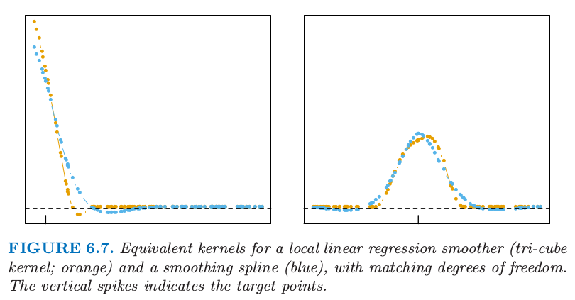

# 6.2 选择核的宽度 

| 原文   | [The Elements of Statistical Learning](https://web.stanford.edu/~hastie/ElemStatLearn/printings/ESLII_print12.pdf) |
| ---- | ---------------------------------------- |
| 翻译   | szcf-weiya                               |
| 发布 | 2017-03-01 |
| 更新 | 2018-07-18|
| 状态|Done|

在每个核 $K_\lambda$ 中，$\lambda$ 为控制宽度的参数：

- 对于有度量宽度的 Epanechnikov 或三次立方核，$\lambda$ 为支撑域的半径．
- 对于高斯核，$\lambda$ 为标准差．
- $\lambda$ 为 $k$-最近邻中最近邻的数目 $k$，经常表达成分数或者整个训练样本的跨距 $k/N$．

当我们改变平均窗口的宽度，存在很自然的**偏差和方差之间的权衡 (bias-variance tradeoff)**，对于局部平均是最显然的：

- 如果窗口较窄，$\hat f(x_0)$ 是离 $x_0$ 近的一小部分 $y_i$ 值的平均，则它的方差相对较大——与单个 $y_i$ 的方差相近．偏差会趋向于较小，这是因为 $\E(y_i)=f(x_i)$ 中的每一个应该与 $f(x_0)$ 相近．
- 如果窗口较宽，$\hat f(x_0)$ 的方差相对于任意 $y_i$ 的方差较小，这是因为平均的效应．偏差会较高，因为我们现在采用的是与 $x_0$ 离得较远的观测 $x_i$，而且不保证 $f(x_i)$ 离 $f(x_0)$ 较近．

相似的结论可以应用到局部回归估计，比如局部线性：当宽度趋于 $0$，估计量则近似为对训练数据插值得到的分段线性函数；当宽度趋于无穷大，则拟合值近似为对数据的整体最小二乘拟合．

!!! note "weiya 注：Recall"
    $$
    \begin{align}
    \hat f(x_0)&= b(x_0)^T(\mathbf {B^TW}(x_0)\mathbf B)^{-1}\mathbf B^T\mathbf W(x_0)\mathbf y\tag{6.8}\label{6.8}\\
    &=\sum\limits_{i=1}^Nl_i(x_0)y_i\tag{6.9}\label{6.9}
    \end{align}
    $$

这里应用[第五章](../05-Basis-Expansions-and-Regularization/5.1-Introduction/index.html)中选择光滑样条的正规化参数的讨论．局部回归光滑器是线性估计器；$\mathbf{\hat f=S_\lambda y}$ 中的光滑矩阵由等价核 \eqref{6.8} 构成，并且第 $ij$ 个元素值为 $\{\mathbf S\_\lambda\}\_{ij}=l\_{i}(x\_{j})$．舍一法交叉验证特别地简单（[练习 6.7](https://github.com/szcf-weiya/ESL-CN/issues/150)），广义交叉验证，$C_p$（[练习 6.10](https://github.com/szcf-weiya/ESL-CN/issues/151)），以及 $k$ 折交叉验证也很简单．有效自由度再一次定义为 $\trace(\mathbf S_\lambda)$，并且可以用来校准光滑的程度．

!!! info "weiya 注：Ex. 6.7"
    已解决，详见 [Issue 150: Ex. 6.7](https://github.com/szcf-weiya/ESL-CN/issues/150).

!!! info "weiya 注：Ex. 6.10"
    已解决，详见 [Issue 151: Ex. 6.10](https://github.com/szcf-weiya/ESL-CN/issues/151).

图 6.7 比较了光滑样条和局部线性回归的等价核．局部线性光滑器有 $40\%$ 的**跨度 (span)**，得到 $df=\trace(\mathbf S_\lambda)=5.86$．光滑样条进行校准后得到同样的 $df$，并且它们的等价核非常相似．

> 图 6.7.相同自由度下， 局部线性回归光滑器的等价核（三次立方核；橘黄色）以及光滑样条（蓝色）．竖直的钉表示目标点．