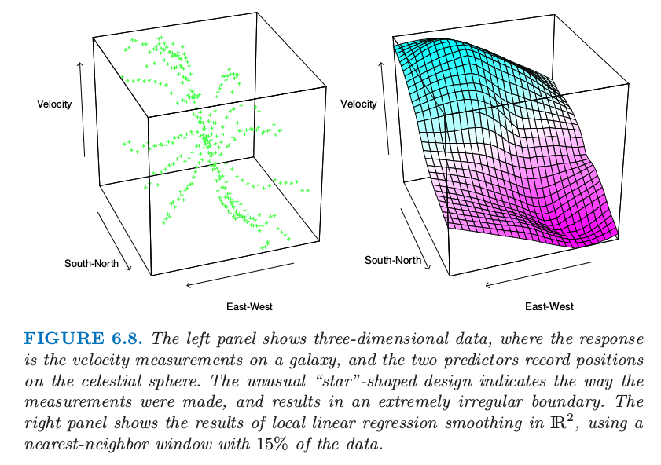

# $\IR^p$中的局部回归

| 原文   | [The Elements of Statistical Learning](../book/The Elements of Statistical Learning.pdf) |
| ---- | ---------------------------------------- |
| 翻译   | szcf-weiya                               |
| 时间   | 2017-03-01：2017-03-02                    |

核光滑和局部回归非常自然的 推广到二维或更高维空间中。Nadaraya–Watson核光滑器局部拟合常值，其中采用的参数为$p$维核。局部线性回归通过加权最小二乘来局部拟合$X$中的超平面，参数由$p$维核给出。这可以很简单地实现，并且一般偏向于边界处有良好表现的局部常值拟合。

令$b(X)$为$X$最大次数为$d$的多项式的向量。例如，$d=1,p=2$时有$b(X)=(1,X_1,X_2)$；$d=2$时我们得到$b(X)=(1,X_1,X_2,X_1^2,X_2^2,X_1X_2)$；并且在$d=0$的平方情形下我们得到$b(X)=1$。在每个$x_0\in R^p$求解
$$
\underset{\beta(x_0)}{\min}\sum\limits_{i=1}^NK_\lambda(x_0,x_i)(y_i-b(x_i)^T\beta(x_0))^2\qquad (6.12)
$$
得到拟合$\hat f(x_0)=b(x_0)^T\hat \beta(x_0)$。一般地核是径向函数，比如径向Epanechnikov或三次立方核
$$
K_\lambda(x_0,x)=D(\frac{\Vert x-x_0\Vert}{\lambda}),\qquad (6.13)
$$
其中$\Vert \cdot\Vert$是欧几里得范数。因为欧式范数屈居于每个左边的单位，所以对每个预测变量进行标准化是有意义的，举个例子，在光滑之前，对标准误差进行单位化。

尽管边界影响在一维光滑中是一个问题，但是在二维或者高维空间中是更大的问题，因为边界上点的分数较大。事实上，维数灾难的一个证明是附近点的分数随着维数的增大而增大。直接修改核 来适应二维边界变得很混乱，特别是对于不规则的边界。局部多项式回归完美地将任意维度中边界矫正为需要的阶数。图6.8显示了在天文研究中一些测量值上的局部线性回归，其中用了不常见的预测变量设计（星形）。这里边界特别不规则，并且当我们接近边界时拟合表面必须在数据稀疏度的区域中插值。

> 图6.8. 左图显示了三维数据，其中响应变量为星系速度的测量值，两个预测变量记录了在宇宙中的位置。罕见的星形设计表示衡量的方式，而且最终得到非常不规则的边界。右图显示了在$R^2$中局部线性拟合的结果，采用含15%数据的最近邻窗口。

局部回归在高于2或3维中不是很有用。例如，在第2章中，我们已经详细讨论了维数的问题。当维数增加时，同时维持局部（低偏差）并且邻域中相当大规模的样本是不可能的，总体数据大小没有关于$p$指数增长。$\hat f(X)$的可视化在高维中会变得困难，并且这通常是光滑的其中一个主要目标。尽管图6.8中的散点云(scatter-cloud)和线框(wire-frame)看起来很吸引人，除了在总量水平下解释结果是很困难的。从数据分析透视的角度，条件图象更有用。

图6.9 显示了三个预测变量的一些环境数据的分析。这里的网格显示出了在其他两个变量，温度和风速的条件下，臭氧作为辐射的函数。然而，在某变量的值的条件下意味着确实表明对这个值是局部的（正如在局部回归中一样）。图6.9中的每个图是在该图中在每个条件值下显示出值的范围。在图本身，显示了数据子集（响应变量相对于剩余变量），以及一个对数据的一维局部线性回归。尽管当观察拟合的3维表明不是完全一样的，但可能对理解数据的联合行为是有用的。

> 图6.9. 三维光滑例子。响应变量是臭氧集中的（立方根），而且这三个预测变量是温度，风速和辐射。网格显示了在温度区间和风速条件下（由深绿或橘黄阴影条表示）臭氧作为辐射的函数，。每个图包含每个条件变量的大概40%。每个图中的曲线是对图中数据的单变量局部线性回归拟合。