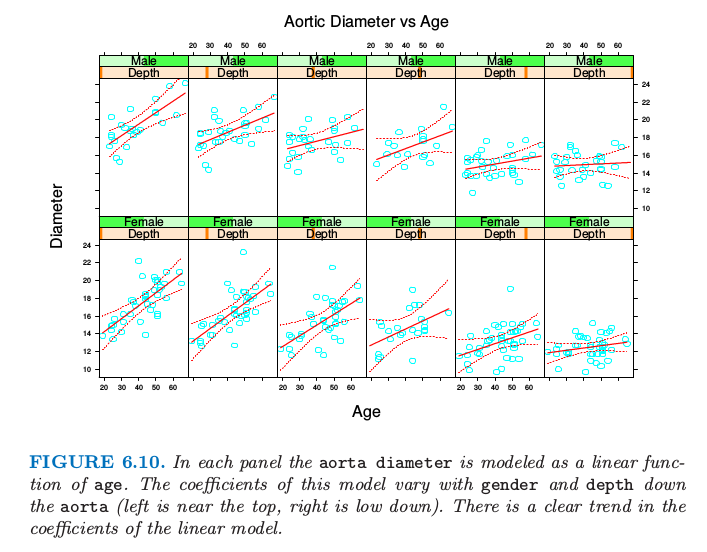

# $\IR^p$中结构化局部回归

| 原文   | [The Elements of Statistical Learning](https://web.stanford.edu/~hastie/ElemStatLearn/printings/ESLII_print12.pdf#page=220) |
| ---- | ---------------------------------------- |
| 翻译   | szcf-weiya                               |
| 发布 | 2016-09-30 |
| 更新|{{ git_revision_date }}|
| 状态| Done|

当维度与样本大小的比率不是很好，则局部回归对我们没有太大帮助，除非我们想要对模型做出一些结构化的假设．这本书的很多部分是关于结构化回归和分类模型的．这里我们关注一些与核方法直接相关的方法．

## 结构核

!!! note "weiya 注：Recall"
    $$
    K_\lambda(x_0,x)=D\left(\frac{\Vert x-x_0\Vert}{\lambda}\right)\tag{6.13}\label{6.13}
    $$

一种方式是修改核．默认的球面核 \eqref{6.13} 对每个坐标给出了相等的权重，所以一种自然的默认策略是对每个变量标准化得到单位标准误差．更一般的方式是使用半正定矩阵 $\mathbf A$ 来对不同的坐标进行赋予权重：

$$
K_{\lambda, A}(x_0,x)=D\left(\frac{(x-x_0)^T\mathbf A(x-x_0))}{\lambda}\right)\tag{6.14}
$$

整个坐标或者方向的影响可以通过在 $\mathbf A$ 上加入合适的限制来降低或者忽略．举个例子，如果 $\mathbf A$ 为对角矩阵，则我们可以通过增加或者减小 $A_{jj}$ 来增大或者减小单个预测变量 $X_j$ 的影响．预测变量很多通常都是高度相关的，比如从相似的数字信号或者图像中得到．预测变量的协方差函数可以用来修改矩阵 $\mathbf A$，使得在高频对比中关注更少（[练习 6.4](https://github.com/szcf-weiya/ESL-CN/issues/196)）．研究者们已经提出了多维核参数训练的方法．举个例子，第 11 章中讨论的投影寻踪回归模型是合适的，其中 $\mathbf A$ 的低阶形式表示 $\hat f(X)$ 的岭回归．关于 $\mathbf A$ 的更一般的模型是很复杂的，相反地，我们倾向于接下来讨论的结构形式的回归函数．

### 结构回归函数

我们试着在 $\IR^p$ 中拟合回归函数 $\E(Y\mid X)=f(X_1,X_2,\ldots,X_p)$，其中每一阶的交叉项都可能存在．很自然地可以考虑下列形式的方差分析 (ANOVA) 分解：

$$
f(X_1,X_2,\ldots,X_p)=\alpha+\sum\limits_jg_j(X_j)+\sum\limits_{k<\ell}g_{k\ell}(X_k,X_\ell)+\cdots\tag{6.15}
$$

并且接着引入消除一些高阶项的结构．可加性模型假设只有主要影响项 $f(X)=\alpha+\sum\limits_{j=1}^pg_j(X_j)$，二阶模型会有次数至多为 2 的交叉项，以此类推．在第 9 章中，我们描述了对于拟合这样低阶交叉模型的 **迭代向后拟合 (iterative backfitting)** 算法．在加性模型中，举个例子，如果所有但除了第 $k$ 项是已知的，则我们可以用 $Y-\sum_{j\neq k}g_j(X_j)$ 在 $X_k$ 上的局部回归来估计 $g_k$．这个依次对每个函数重复进行，直到收敛．重要的细节是，在每一步，一维局部回归是所有都需要的．同样的思想可以用来拟合低维 ANOVA 分解．

这些结构模型的一个重要的特殊情形是 **可变系数模型 (varying coefficient models)** 类．举个例子，假设我们将 $X$ 中的 $p$ 个预测变量分成集合 $(X_1,X_2,\ldots,X_q),q < p$，剩下的变量放进向量 $Z$ 中．接着我们假设条件线性模型

$$
f(X)=\alpha(Z)+\beta_1(Z)X_1+\cdots+\beta_q(Z)X_q\tag{6.16}
$$

对于给定的 $Z$，这是线性模型，但是每个参数可以随着 $Z$ 而改变．很自然地可以通过局部加权最小二乘拟合这个模型：

$$
\underset{\alpha(z_0),\beta(z_0)}{\min}\sum\limits_{i=1}^NK_\lambda(z_0,z_i)(y_i-\alpha(z_0)-x_{1i}\beta(z_0)-\cdots - x_{qi}\beta_q(z_0))^2\tag{6.17}
$$

图 6.10 说明了在人类大动脉测量数据上的想法．一个由来已久的说法是 **大动脉 (aorta)** 会随着 `age` 增长而变厚．这里我们将大动脉的 `diameter` 建立为 `age` 的线性函数，但是允许系数随着 `gender` 和 `depth` 的变化而变化．我们对男性和女性分别采用局部回归模型．尽管大动脉确实很明显地（在大动脉比较厚区域中）随着年龄而变厚，这种关系随着到大动脉的距离而减弱．图 6.11 显示了截距和斜率作为深度的函数．

> 图 6.11. 每张图中 `aorta diameter` 建立为 `age` 的线性函数模型．这个模型的系数随着 `gender `和到 `aorta` 的 `depth`（左边靠近顶端，右边靠近底端）变化．在线性模型中的系数有着明显的趋势．

> 图 6.11. 在男性和女性情形下，`age` 作为到 aorta 的 `distance` 的函数的截距和斜率．黄色带状表示一个标准误差．
