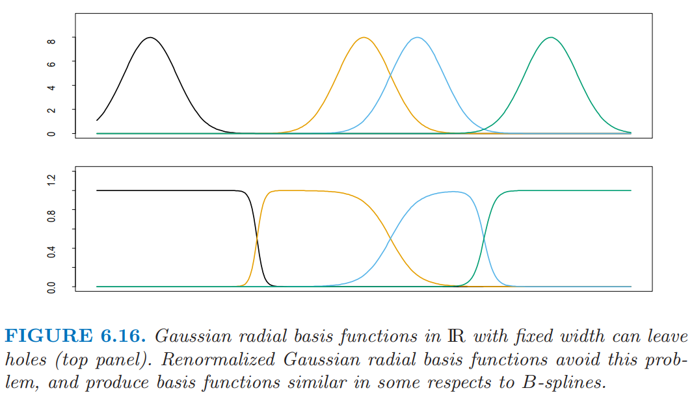

# 6.7 径向基函数和核

| 原文   | [The Elements of Statistical Learning](../book/The Elements of Statistical Learning.pdf#page=231) |
| ---- | ---------------------------------------- |
| 翻译   | szcf-weiya                               |
| 时间   | 2017-03-06：2017-03-06                    |
| 更新 | 2019-01-17|
| 状态 | Done|

在第五章中，函数表示成基函数展开的形式：$f(x)=\sum_{j=1}^M\beta_jh_j(x)$。采用基函数展开的灵活建模的艺术包含选取合适的基函数族，然后控制由选择，正则化（或者两者都有）表示的复杂度。部分基函数族的元素是局部定义的，比如，B 样条在 $\IR$ 中局部定义。如果在特定区域中需要更多的灵活性，接着这个区域需要用更多的基函数来表示（在 B 样条转换为更多结点的情形中）。$\IR$ 局部基函数的张量积实现了 $\IR^p$ 中的局部基函数。不是所有的基函数都是局部的——举个例子，对于样条的截断幂基，或者在神经网络中使用的 S 型基函数 $\sigma(\alpha_0+\alpha x)$（见[第 11 章](../11-Neural-Networks/11.1-Introduction/index.html)）。虽然如此，复合函数 $f(x)$ 可以显示出局部行为，因为参数的特定符号和值造成全局影响的抵消。举个例子，对于同样的函数空间截断幂基有等价的 B 样条基；抵消恰恰就是这种情形。

核方法通过在目标点 $x_0$ 局部的区域中拟合简单的模型来实现灵活性。局部化通过加权核 $K_\lambda$ 来实现，并且单个观测权重为 $K_\lambda(x_0,x_i)$。

通过将核函数 $K_\lambda(\xi,x)$ 看成基函数，径向基函数结合这些想法。这得到模型
$$
\begin{align}
f(x) &= \sum\limits_{j=1}^MK_{\lambda_j}(\xi_j,x)\beta_j\notag\\
&= \sum\limits_{j=1}^MD(\frac{\Vert x-\xi_j\Vert}{\lambda_j})\beta_j\tag{6.28}
\end{align}
$$
其中每个基元素由位置或者原型参数 $\xi_j$ 以及缩放参数 $\lambda_j$。 $D$ 的一个流行的选择是标准高斯密度函数。有许多方式来学习参数 $\\{\lambda_j,\xi_j,\beta_j\\},j=1,\ldots,M$。为了简化，我们关注回归的最小二乘方法，并且采用高斯核。

- 优化关于所有参数的平方和
$$
\underset{\{\lambda_j,\xi_j,\beta_j\}_1^M}{\min}\sum\limits_{i=1}^M(y_i-\beta_0-\sum\limits_{j=1}^M\beta_jexp\{-\frac{(x_i-\xi_j)^T(x_i-\xi_j)}{\lambda_j^2}\})^2\tag{6.29}
$$

​		这个模型一般称为 RBF 网络，这是 S 型神经网络的替代选择，将在第 11 章讨论；$\xi_j$ 和 $\lambda_j$ 在参数中有重要作用。这个准则是有着多重局部最小点的非凸函数，并且优化的算法类似神经网络中的算法。

- 分开估计 $\\{\lambda_j,\xi_j\\}$ 和 $\beta_j$。给定前者，后者的估计是简单的最小二乘问题。通常单独用 $X$ 的分布，以非监督的方式选择核参数 $\lambda_j$ 和 $\xi_j$。其中一种方式是在给定中心 $\xi_j$ 和缩放 $\lambda_j$ 时，对训练 $x_i$ 拟合高斯混合密度模型。更特别指定（adhoc）的方式使用聚类方法来确定原型 $\xi_j$，并且将 $\lambda_j=\lambda$ 看成是超参数。这些方式的显然缺点是条件分布 $\Pr(Y\mid X)$，并且特别地，$\E(Y\mid X)$ 在集中的地方是没有作用的。在正的一侧，可以更简单地实现。

尽管看起来降低参数集，并且假设 $\lambda_j=\lambda$ 为常数，但是这会带来糟糕的副作用——产生 **洞 (holes)**，如图 6.16（上）所示，也就是没有核有合适的支撑的区域。对径向基函数重标准化，

$$
h_j(x)=\frac{D(\Vert x-\xi_j\Vert/\lambda)}{\sum_{k=1}^MD(\Vert x-\xi_k\Vert/\lambda)}\,,\tag{6.30}
$$

可以避免这个问题（图 6.16（下））。

$\IR^p$ 中的 Nadaraya-Watson 核回归估计量 (6.2) 可以看成是重标准化后径向基函数的展开，

$$
\begin{align*}
\hat f(x_0) &= \sum_{i=1}^Ny_i\frac{K_\lambda(x_0,x_i)}{\sum_{i=1}^NK_\lambda(x_0,x_i)}\\
&=\sum_{i=1}^Ny_ih_i(x_0)\tag{6.31}
\end{align*}
$$

其中基函数 $h_i$ 确定了每个观测的位置以及系数；也就是说，$\xi_i=x_i,\hat\beta_i=y_i,i=1,\ldots,N$.

注意到展开式 (6.31) 与由 $K$ 导出的正则化问题的解 (5.50) 间的相似性。径向基函数搭建了现代“核方法”与局部拟合技巧间的桥梁。

!!! note "weiya 注：Recall"
    $$
    f(x)=\sum\limits_{i=1}^N\alpha_i K(x, x_i)\tag{5.50}
    $$