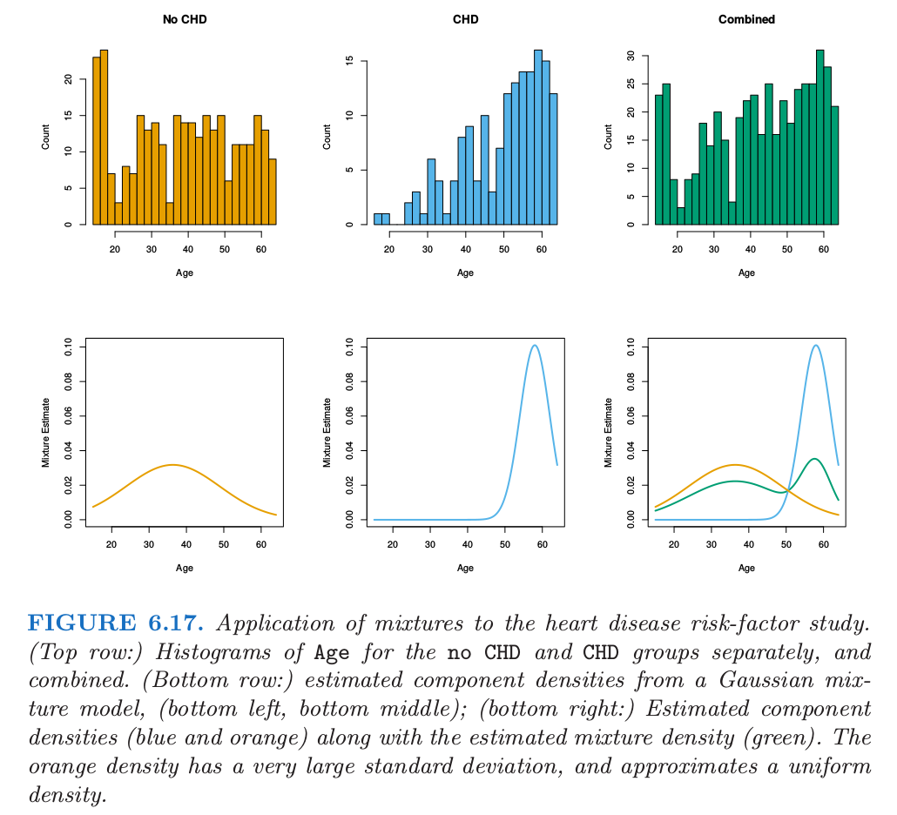

# 6.8 混合模型的密度估计和分类

| 原文   | [The Elements of Statistical Learning](https://web.stanford.edu/~hastie/ElemStatLearn/printings/ESLII_print12.pdf) |
| ---- | ---------------------------------------- |
| 翻译   | szcf-weiya                               |
| 发布 | 2017-12-29 |
| 更新 | 2019-10-24 19:15:19|
| 状态 | Done|

混合模型是用于密度估计的有力工具，而且可以看成一种核方法．高斯混合模型有如下形式

$$
f(x)=\sum\limits_{m=1}^M\alpha_m\phi(x;\mu_m,\Sigma_m)\tag{6.32}\label{6.32}
$$

其中混合比例 $\alpha_m$ 满足 $\sum_m\alpha_m=1$，并且每个高斯密度均值为 $\mu_m$，协方差阵为 $\Sigma_m$．一般地，混合模型可以用任意组分来替换式 \eqref{6.32} 的高斯密度：高斯混合模型是至今最受欢迎的．

这些参数通常用极大似然法来拟合，采用 [第 8 章](/08-Model-Inference-and-Averaging/8.5-The-EM-Algorithm/index.html) 中描述的 EM 算法．下面是一些特殊情形：

- 如果协方差阵约束为标量：$\bSigma_m=\sigma_m\I$，则式 \eqref{6.32} 有径向基展开的形式．
- 如果另外固定 $\sigma_m=\sigma>0$，并且 $M\uparrow N$，则 \eqref{6.32} 的极大似然估计会近似 $\hat\alpha_m=1/N,\hat\mu_m=x_m$ 时的核密度估计 \eqref{6.22}．

!!! note "weiya 注: Recall"
    $$
    \hat f(x_0)=\frac{1}{N\lambda}\sum\limits_{i=1}^NK_\lambda(x_0,x_i)\tag{6.22}\label{6.22}
    $$

利用贝叶斯定理，将每个类别的混合密度分离开，则得到 $\Pr(G\mid X)$ 的灵活模型；这将在 [第 12 章](/12-Support-Vector-Machines-and-Flexible-Discriminants/12.1-Introduction/index.html) 详细讨论．

图 6.17 展示了混合模型应用到心脏病风险因子研究中．最上面一行是 `no CHD`、`CHD` 关于 `Age` 的直方图，然后结合起来得到最右边的直方图．采用结合后的数据，我们拟合形如 \eqref{6.32} 的两组分混合模型，其中（标量）协方差阵 $\bSigma_1$ 和 $\bSigma_2$ 不要求相等．通过 EM 算法来拟合：注意到过程中没用到 `CHD` 标签的信息．估计的结果为

$$
\begin{array}{lll}
\hat\mu_1=36.4,&\hat\Sigma_1=157.7,&\hat\alpha_1=0.7\\
\hat\mu_2=58.0,&\hat\Sigma_2=15.6,&\hat\alpha_2=0.3
\end{array}
$$

组分密度 $\phi(\hat\mu_1,\hat\Sigma_1)$ 和 $\phi(\hat\mu_2,\hat\Sigma_2)$ 展示在图 6.17 中第二行的前两幅图中．右下角的图展示了组分密度（橘黄色和蓝色）以及估计的混合密度(绿色)．

混合模型同样给出了观测 $i$ 属于组分 $m$ 的概率的估计

$$
\hat\gamma_{im}=\frac{\hat\alpha_m\phi(x_i;\hat\mu_m,\hat\Sigma_m)}{\sum_{k=1}^M\hat\alpha_k\phi(x_i;\hat\mu_k,\hat\Sigma_k)}\tag{6.33}
$$

其中在我们例子中 $x_i$ 是 `Age`．假设对每个 $\hat\gamma_{i2}$ 设阈值，并且定义 $\hat\delta_i=I(\hat\gamma_{i2}>0.5)$．接着我们比较根据 `CHD` 和混合模型分类的结果

尽管混合模型没有用到 `CHD` 标签，但还是较好地发现了两个 `CHD` 子总体．线性逻辑斯蒂回归当采用 `CHD` 作为响应变量，用极大似然拟合数据达到相同的误差率 $(32\%)$．
