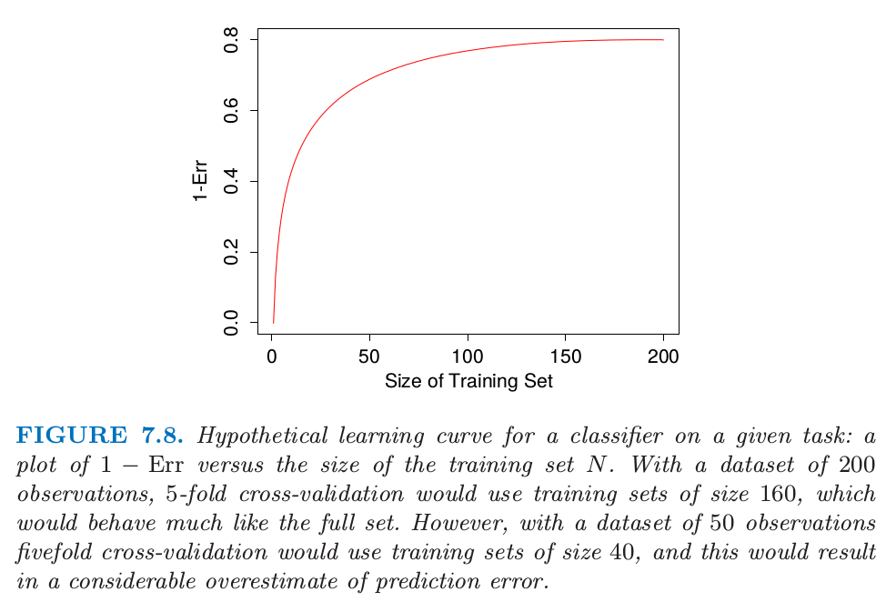
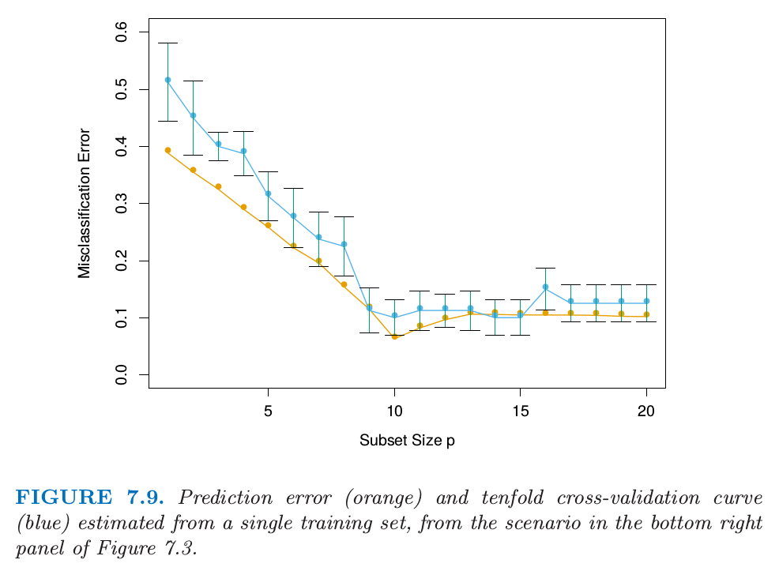
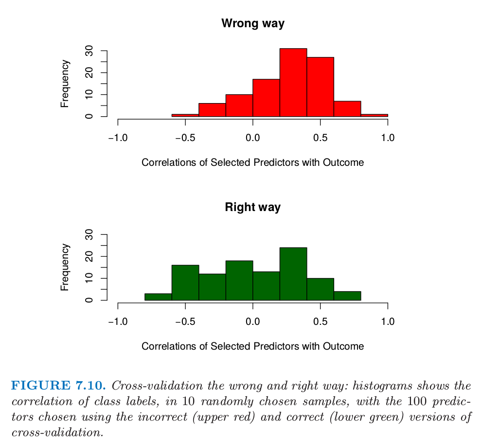
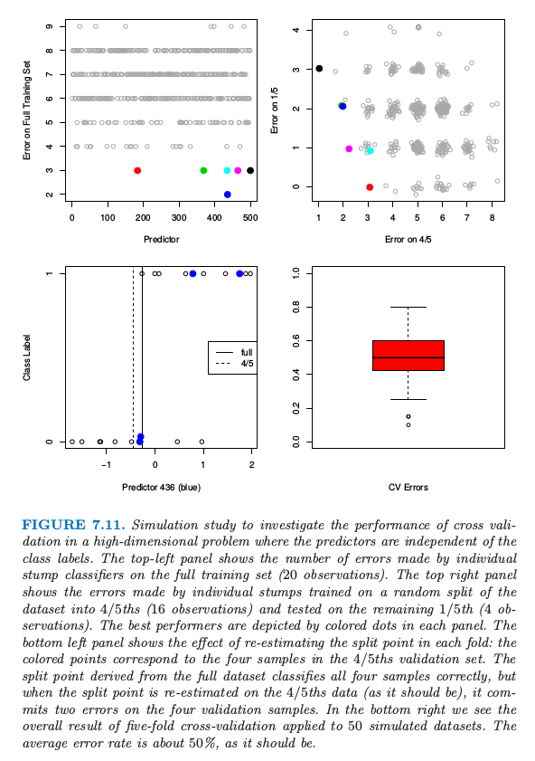

# 7.10 交叉验证

| 原文   | [The Elements of Statistical Learning](https://web.stanford.edu/~hastie/ElemStatLearn/printings/ESLII_print12.pdf) |
| ---- | ---------------------------------------- |
| 翻译   | szcf-weiya                               |
| 发布 | 2016-09-30 |
|更新 |2018-01-09, 2018-01-12, 2018-03-18, 2018-03-19|
|状态|Done|

!!! note "更新笔记"
    Hastie 和 Tibshirani 他们的 [HumanitiesSciences's StatLearning](https://lagunita.stanford.edu/courses/HumanitiesSciences/StatLearning/Winter2016/info) 课程是基于ISLR 这本书，其中有采用 cv 来解决具体问题的代码，可以在[这里](https://github.com/szcf-weiya/ESL-CN/tree/master/code/Resampling)找到．

    @2018-01-12 更新 Ex. 7.7 的解答．

估计预测误差的最简单的并且使用最广泛的方法大概是交叉验证．这个方法直接估计 **样本外 (extra-sample)** 误差期望值 $\Err=\E[L(Y,\hat f(X))]$，当方法 $\hat f(X)$ 应用到与 $X$ 和 $Y$ 联合分布独立采样的测试样本中，该值是广义误差的平均值．正如前面提到的，我们可能希望交叉验证估计当测试集 $\cal T$ 固定时的条件误差．但是正如我们将在 [7.12 节](7.12-Conditional-or-Expected-Test-Error/index.html)看到的那样，交叉验证一般仅仅对预测误差的期望值有良好的估计．

!!! note "weiya 注：Recall"
    在 7.2 节，详细讨论了我们实际上最需要当训练集 $\cal T$ 固定时的条件误差，而非预测误差的期望值．

## K 折交叉验证

理论上，如果我们有足够的数据，我们可以设置一个验证集并且用它去评估我们预测模型的好坏．因为数据经常是稀缺的，所以这种方式通常是不可能的．为了巧妙地解决这个问题，$K$ 折交叉验证采用部分可用数据去拟合模型，然后用不同的部分数据去测试．我们将数据分成 $K$ 个大致相等的部分；举个例子，当 $K=5$，情形就像这样：

对于第 $k$ 部分（上面的第三个），我们用剩下的 $K-1$ 个部分数据来拟合模型，然后计算预测第 $k$ 部分的数据时模型的预测误差．对 $k=1,2,\ldots,K$ 做类似的工作并且将 $K$ 个预测误差的估计值结合起来．

下面介绍更多的细节．令 $\kappa:\\{1,\ldots,N\\}\mapsto\\{1,\ldots,K\\}$ 是指示函数，它指示了观测值 $i$ 被随机分配到哪的划分．用 $\hat f^{-k}(x)$ 记拟合函数，是利用除掉第 $k$ 部分的数据计算得到的．则预测误差的交叉验证估计为

$$
\mathrm{CV}(\hat f)=\frac{1}{N}\sum\limits_{i=1}^NL(y_i,\hat f^{-\kappa (i)}(x_i))\tag{7.48}
$$

一般地选择 $K$ 为 5 或 10（见下）．$K=N$ 的情形也称作 **舍一法交叉验证**．在 $\kappa(i)=i$ 的情形中，对于第$i$ 个观测的拟合是利用不包含第 $i$ 个观测的全部数据进行计算的．

!!! tip "weiya 注：LOOCV"
    一般地，舍一法交叉验证缩写为 LOOCV，在 R 等机器学习包中，经常作为参数，比如 `caret` 包中采用舍一法交叉验证的参数形式为`method = "LOOCV"`

给出一系列模型 $f(x,\alpha)$，它是由调整参数 $\alpha$ 来编号，记 $\hat f^{-k}(x,\alpha)$ 为去除第 $k$ 部分数据的第 $\alpha$ 个模型的拟合．则对于这一系列模型我们定义

$$
\mathrm{CV}(\hat f,\alpha)=\frac{1}{N}\sum\limits_{i=1}^NL(y_i,\hat f^{-\kappa (i)}(x_i,\alpha))\tag{7.49}
$$

函数 $\mathrm{CV}(\hat f,\alpha)$ 给出了测试误差曲线的一个估计，而且我们可以找到调整参数 $\hat\alpha$ 使其最小化．我们最终选择的模型是 $f(x,\alpha)$，接着我们对所有数据进行拟合．

有趣的是，$K$ 折交叉验证估计的到底是什么量．$K=5$ 或 $10$ 时，我们可能猜测它估计了期望误差 $\Err$，因为每一折的训练集不同于原始训练集．另一方面，如果 $K=N$ 我们可能会猜测交叉验证估计了条件误差 $\Err_{\cal T}$．事实是交叉验证仅仅有效地估计出平均误差 $\Err$，正如将在 [7.12 节](7.12-Conditional-or-Expected-Test-Error/index.html)讨论的那样．

那我们应该为 $K$ 取什么值呢？$K=N$ 时，交叉验证估计对于真实（期望的）预测误差近似无偏的，但是可能导致高方差，因为 $N$ 个训练集彼此是很相似的．计算量也是很大的，要应用该学习方法 $N$ 次．在特定的问题中，这个计算可以很快地完成——见[练习 7.3](https://github.com/szcf-weiya/ESL-CN/issues/90) 和[练习 5.13](https://github.com/szcf-weiya/ESL-CN/issues/93)．

!!! info "weiya 注：Ex. 7.3"
    已完成，具体证明过程见[Issue 90: Ex. 7.3](https://github.com/szcf-weiya/ESL-CN/issues/90)．需要说明的是，对于 (c) 小问要求提出的光滑器的一般形式，不确定，欢迎讨论．

另一方面，比如 $K=5$ 时，交叉验证有较低的方差．但是偏差便是一个问题了，这取决于当训练集大小变化时学习方法的表现效果．图 7.8 显示了在给定任务下某分类器的假定的“学习曲线”，$1-\Err$ 关于训练集大小 $N$ 的曲线．当训练集大小增长到 100 前观测时分类器的效果不断在改善；当增长到 200 个观测时改进的效果很小．如果我们的训练集有 200 个观测，5 折交叉验证会估计 160 个训练样本时分类器的效果，从图 7.8 可以看到同训练集大小为 200 时的效果是一样的．因此交叉验证不会有太大的偏差．然而，如果训练集只有 50 个观测，5 折交叉验证会估计 40 个训练样本时分类器的效果，而且从图中可以看出对 $1-\Err$ 会有一个偏低的估计．因此作为 $\Err$ 的估计，交叉验证会有上偏．

> 图 7.8. 在给定任务下某分类器假定的学习曲线：$1-\Err$ 关于训练集大小 $N$ 的曲线．含有 200 个观测的数据集，5 折交叉验证会使用大小为 160 的训练集，这与全数据集表现很相似．然而，含有 50 个观测的数据集，5 折交叉验证会使用大小为 40 的训练集，这会导致预测误差有一个相当大的高估．

总结一下，如果学习曲线在给定训练集大小处有相当大的斜率，5 或 10 折交叉验证将会高估真实的预测误差．实际问题中偏差是否是一个缺点取决于目标．另一方面，舍一法交叉验证有低偏差但会有高方差．总的来说，5 或 10 折交叉验证是推荐的一个好的妥协方式：见Breiman and Spector（1992）[^1]以及 Kohavi（1995）[^2]．

图 7.9 显示了预测误差和从单个训练集估计的 10 折交叉验证曲线，这来源于图 7.3 右下图的情形．这是两个类别的分类问题，采用子集大小为 $p$ 的最优子集回归的线性模型．图中显示了标准差，它是 10 个部分中的单个部分的个体误分类误差率的标准差．两条曲线都在 $p=10$ 处有最小值，尽管 CV 曲线在 10 以后更加平坦．经常将**“一个标准差（one-standard error）”**准则和交叉验证一起使用，我们选择最简模型，它的误差不超过最佳模型的误差以上的一个标准差．这里看起来像是选择 $p=9$ 个预测变量的模型，而真实模型采用 $p=10$．

> 图 7.9. 预测误差（橘黄色）和从单个训练集估计的10折交叉验证曲线（蓝色），来自图7.3中右下图的情形．

!!! info "weiya 注：Fig. 7.9"
    [此笔记](../notes/ModelSelection/sim7_9/index.html)重现了该图．

!!! note "weiya 注：one standard error rule"
    首先定义，对于 $k=1,\ldots,K$，令
    $$
    \mathrm{CV}_k(\theta)=\frac{1}{n_k}\sum\limits_{\kappa(i)=k}(y_i-\hat f_\theta^{-k}(x_i))^2
    $$
    然后计算 **样本标准偏差 (sample standard deviation)**，
    $$
    \mathrm{SD}(\theta)=\sqrt{\mathrm{var}(\mathrm{CV}_1(\theta),\ldots, \mathrm{CV}_K(\theta))}
    $$
    则**标准误差 (standard error)**为
    $$
    \mathrm{SE}(\theta)=\mathrm{SD}(\theta)/\sqrt{K}
    $$
    在交叉验证中，当我们计算完
    $$
    \hat\theta=\underset{\theta\in\{\theta_1,\ldots,\theta_m\}}{\mathrm{argmin}}\;\mathrm{CV}(\theta)
    $$
    可以采用 one standard error rule 选择 **最简单的** 模型（正则化强度最大的模型），也就是将 $\theta$ 往正则化程度增加的方向移动，直到下式不再成立
    $$
    \mathrm{CV}(\theta)\le \mathrm{CV}(\hat\theta)+\mathrm{SE}(\hat\theta)
    $$
    *参考 [Ryan Tibshirani, Slides for Model selection and validation](http://www.stat.cmu.edu/~ryantibs/datamining/lectures/19-val2.pdf#page=6-7)*．

对于在平方误差损失下的线性拟合，广义交叉验证提供了舍一法交叉验证的一个方便的估计．正如在 [7.6 节](7.6-The-Effective-Number-of-Parameters/index.html)中定义的，线性拟合方法可以写成

$$
\mathbf{\hat y=Sy}\tag{7.50}
$$

现在对于许多线性拟合方法，

$$
\frac{1}{N}\sum_{i=1}^N\left[y_i-\hat f^{-i}(x_i)\right]^2 = \frac{1}{N}\sum_{i=1}^N\left[\frac{y_i-\hat f(x_i)}{1-S_{ii}}\right]^2\tag{7.51}
$$

其中 $S_{ii}$ 是 $\mathbf S$ 的第 $i$ 个对角元（见[练习 7.3](https://github.com/szcf-weiya/ESL-CN/issues/90)）．GCV 近似为

$$
\mathrm{GCV}(\hat f)=\frac{1}{N}\sum_{i=1}^N\left[\frac{y_i-\hat f(x_i)}{1-trace(\mathbf S)/N}\right]^2\tag{7.52}
$$

$\trace(\mathbf S)$ 的值是有效参数个数，在[ 7.6 节](7.6-The-Effective-Number-of-Parameters/index.html)定义．

GCV 在一些设定下有计算上的优点，其中 $\mathbf S$ 的迹计算起来比单个元素 $S_{ii}$ 更简单．在光滑问题中，GCV也可以减轻交叉验证趋向于**欠光滑 (undersmooth) **的趋势．GCV 和 AIC 的相似性可以从近似等式 $1/(1-x)^2\approx 1+2x$ 得到（[练习 7.7](https://github.com/szcf-weiya/ESL-CN/issues/92)）．

!!! info "weiya 注：Ex. 7.7"
    $$
    \begin{align}
    GCV(\hat f)&=\frac{1}{N}\sum\limits_{i=1}^N[\frac{y_i-\hat f(x_i)}{1-\trace(\mathbf S)/N}]^2\notag\\
    &=\frac 1N\sum\limits_{i=1}^N(y_i-\hat f(x_i))^2(1+\frac{2\trace(S)}{N})\notag\\
    &=\overline{err} + \frac{2\trace(S)}{N}\overline{err}\notag
    \end{align}
    $$
    而
    $$
    AIC=\overline{err}+2\cdot\frac{d}{N}\hat \sigma^2_\varepsilon
    $$
    显然，它们的区别在于 $\sigma^2_{\varepsilon}$ 的估计方法不同．
    毕．

## 做交叉验证的错误与正确方式

考虑有许多预测变量的分类问题，举个例子，可能在基因与蛋白质的应用中．一般的分析技巧或许如下：

1. 筛选预测变量：选择与类别有着相当强（单变量）相关性的“好”预测变量的一个子集
2. 运用这个预测变量的子集，建立多维变量分类器．
3. 采用交叉验证来估计未知调整参数并且估计最终模型的预测误差．

这是正确地应用交叉验证吗？考虑 $N=50$ 样本的情形，这些样本分成两个相同大小的类别，而且有 $p=5000$ 个独立于类别的定量预测变量（标准高斯分布）．真实的（测试）误差是 $50\%$．我们应用上面的方法，步骤（1）中选择 100 个与类别有强相关性的预测变量，然后在步骤（2）中仅仅基于 100 个预测变量采用 1 最近邻分类器．对这个设定下的 50 个仿真数据求平均得到平均 CV 误差为 $3\%$．这远远低于真实预测误差率 $50\%$．

发生了什么？问题在于预测变量有着不公平的优势，因为在步骤（1）中选择它们是基于所有的样本．在选择变量后丢弃样本不能正确地模拟分类器对完全独立的测试集的应用，因为这些预测变量“已经看到了”丢弃的样本．

> 图 7.10 交叉验证的错误和正确方式：直方图显示了10个随机选择的样本中，类别标签的相关性，以及采用不正确（上图红色）和正确（下图绿色）的交叉验证选择的100个预测变量．

图 7.10（上）说明了这个问题．我们选择 100 个在 50 个样本上与类别标签有着最大相关性的预测变量．因为我们将要做 5 折交叉验证，所以随机选择 10 个样本，然后计算预先选择的 100 个预测变量仅仅在 10 个样本上与类别标签的相关性（上图）．我们看到平均相关性大约为 0.28，而不是期望中的 0．

下面是在这个例子中正确使用交叉验证的方式：

1. 将样本随机分成 $K$ 个交叉验证折（群）．
2. 对于每一折 $k=1,2,\ldots,K$
    1. 利用除了第 $k$ 折的所有样本找到与类别标签有相对强（单变量）的相关性的“好”预测变量的一个子集．
    2. 利用除了第 $k$ 折的所有样本仅仅运用找到的预测变量来建立多元分类器．
    3. 运用分类器来预测第 $k$ 折中样本的类别．

在第 2(c) 步的误差估计接着在所有 $K$ 折上进行累积，得到预测误差的交叉验证估计．图 7.10 的下图显示了在某个特定的 $k$ 折样本上，正确步骤的第 2(a) 步选择的 100 个预测变量与类别的相关性．我们看到它们平均值近似为 0，恰恰是它们应该取的值．

一般地，在多步建模过程中，交叉验证必须应用到整个模型步骤的序列中．特别地，“丢弃”样本必须在任何选择或者过滤之前．有一个条件：初始非监督筛选步骤可以在丢弃样本之前完成．举个例子，开始交叉验证前，我们可以选择 1000 个在 50 个样本上有着最大方差的预测变量．因为这个过滤不涉及到类别，所以它不会给预测变量不公平的好处．

尽管这点对于读者来说是显然的，但是我们看到这个错误在顶级期刊中发表的文章中犯了很多次．因为大量预测变量在基因和其他领域是很常见的，这个错误潜在的后果也显著增加；见 Ambroise and McLachlan(2002)[^3] 对这个问题的详细讨论．

## 交叉验证是否真的有用？

我们再一次在高维分类问题中检验交叉验证的效果．考虑 $N=20$ 个样本的情形，样本被均分为两个类别，而且有 $p=500$ 个与类别独立的定量变量．同样，任一分类器的真实误差率为 $50\%$．考虑一个简单的单变量分类器：最小化误差率的单分割（“stump”）．Stumps 是一棵单分割的树，而且应用在增强方法中（[第 10 章](/10-Boosting-and-Additive-Trees/10.1-Boosting-Methods/index.html)）．一个简单的论断称交叉验证在这种设定下不会很好地起作用

> 对全数据集进行拟合，我们将会发现一个对数据集分离得很好的预测变量．如果我们做 5 折交叉验证，同样的预测变量应该对数据的 4/5 和 1/5 都分离得很好，因此交叉验证误差率会很小（远远小于 $50\%$ ）．因此 CV 不能给出一个准确的误差估计．

!!! note "weiya 注：原书脚注"
    这个论断是在蛋白质实验室会议上一名科学家向我们提出来的，于是便有了这一节的内容．

为了研究该论断是否正确，图 7.11 展示了该设定下的仿真结果．500 个预测变量和 20 个样本，两个类别大小相同，所有预测变量服从标准正态分布．左上图显示了对训练数据的 500 个 stumps 的每个训练错误的个数．我们已经用颜色标记了 6 个产生最小误差的预测变量．在右上图中，显示了对数据随机的 4/5 处划分（16 个样本）的 stump 拟合的测试误差，以及在剩下 1/5（4 个样本）中的测试误差．<!--用相同颜色标记的点表示与左上图中同种颜色点对应的预测变量-->每种颜色的点与左上图对应颜色的预测变量相对应．我们看到对于蓝色预测变量的 stump（它的 stump 在左上图中是最好的），得到 2/4 的测试误差（50%），但这并不比随机选择更好．

> 图 11.7 在预测变量独立于类别标签的高维问题中，通过仿真来研究交叉验证的表现．左上图显示了通过在全数据集（20 个观测）应用单个 stump 分类器的误差个数．右上图显示了在随机分成的 4/5 数据集（16 个观测）上训练的 stump 的误差以及在剩下 1/5 数据集上测试的误差（4 个观测）．最优的预测变量都用颜色标出来了．左下图显示了对每一折重新估计分离点的效果：带颜色的点对应与 4/5 部分的验证集的 4 个样本．从全数据集导出的分离点正确将四个点分类正确，但是当分离点是在 4/5 的数据上重新估计的（正如它应该有的表现一样），在 4 个验证样本点上有两个误差点．在右下图中我们看到对 50 个仿真的数据集应用 5 折交叉验证的整体结果．平均误差率大概为 50%，正如它应该有的误差率一样．

发生了什么？先前的论断忽略了交叉验证的事实——对每一折，模型必须全部重新训练．当前例子中，这意味着最优预测变量和对应的分离点是在 4/5 的数据中找到的．选择这个预测变量的效果可以在左上图中看出来．因为类别标签是独立于预测变量的，在 4/5 的训练数据上的 stump 的表现不包含它在剩余 1/5 中表现的信息．分离点选择的效果显示在左下图中．这里我们看到第 436 个预测变量的数据，对应左上图的蓝色点．带颜色的点表示 1/5 的数据，而剩余数据表示 4/5 的部分．图中标出来该预测变量基于全训练集和基于 4/5 部分的训练集得到的最优分离点．基于全数据的分类点在 1/5 的数据上没有作出错误预测．但是交叉验证必须基于 4/5 的数据点上得到分离点，这在4 个样本中作出了两个错误预测．

对 50 个仿真的数据集的每一个数据集应用 5 折交叉验证的结果显示在右下图中．正如我们希望的那样，平均交叉验证误差在 $50\%$ 附近，这也是该分类器的真实预测误差的期望值．因此交叉验证表现出它应有的样子．另一方面，误差有相当大的易变性，强调了报告 CV 估计的标准误差估计的重要性．这个问题的另一个变形见[练习 7.10](https://github.com/szcf-weiya/ESL-CN/issues/91)．

[^1]: Breiman, L. and Spector, P. (1992). Submodel selection and evaluation in regression: the X-random case, International Statistical Review 60: 291–319.
[^2]: Kohavi, R. (1995). A study of cross-validation and bootstrap for accuracy estimation and model selection, International Joint Conference on Artificial Intelligence (IJCAI), Morgan Kaufmann, pp. 1137–1143.
[^3]: Ambroise, C. and McLachlan, G. (2002). Selection bias in gene extraction on the basis of microarray gene-expression data, Proceedings of the National Academy of Sciences 99: 6562–6566.
