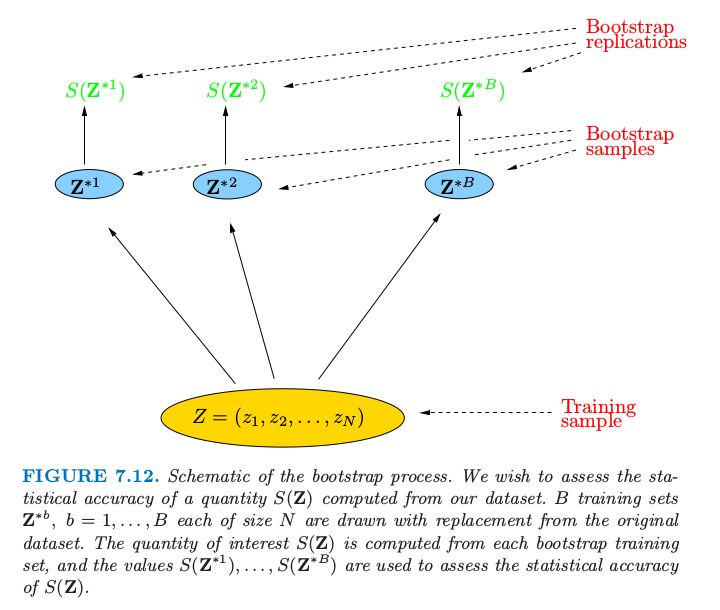

# 7.11 自助法

| 原文   | [The Elements of Statistical Learning](https://web.stanford.edu/~hastie/ElemStatLearn/printings/ESLII_print12.pdf) |
| ---- | ---------------------------------------- |
| 翻译   | szcf-weiya                               |
| 发布 | 2017-02-20 |
| 更新   | 2019-07-27 22:07:23|
|状态| Done|

> 写在前面
>
> 自助法我觉得是最“独立”，最“自强”的方法了
>
> 无论是那个传说中的 Baron pick himself up by his own bootstraps
>
> 还是被作者称为 poor man's Bayes posterior（8.4节）
>
> 所以这也是我最喜欢的统计方法了．:grinning:
>
> 另外，参照Hastie和Tibshirani他们 [HumanitiesSciences's StatLearning](https://lagunita.stanford.edu/courses/HumanitiesSciences/StatLearning/Winter2016/info)课程，[这里](https://github.com/szcf-weiya/ESL-CN/tree/master/code/Resampling) 有bootstrap解决具体问题的代码．

自助法是评价统计精确性的通用工具．首先我们描述一般的自助法，接着介绍它怎么用来估计 **样本外预测误差 (extra-sample prediction error)**．如同交叉验证一样，自助法力求估计条件误差 $\Err_{\cal T}$，但一般只对期望预测误差 $\Err$ 有良好的估计．

假设我们有一个根据训练数据拟合的模型．训练集记为 $\mathbf Z=(z_1,z_2,\ldots,z_N)$，其中 $z_i=(x_i,y_i)$．基本思想是从训练集中有放回地随机选取数据集，每个样本的大小与原始数据集相同．做 $B$ 次（如 $B=100$）选取的操作，得到 $B$ 个自助训练集，正如图 7.12 显示的那样．接着我们对每个自助法数据集重新拟合模型，并且检验在 $B$ 个复制集上拟合的表现．

> 图 7.12. 自助法过程的原理图．我们希望评估根据数据集计算的 $S(\mathbf Z)$ 值的统计精确性．$B$ 个训练集为$\mathbf Z^{\*b},b=1,\ldots,B$，每个都是从原始数据集中有放回抽取的样本．我们感兴趣的 $S(\mathbf Z)$ 值是从每个自助法训练集中计算得到，而且值 $S(\mathbf Z^{\*1}),\ldots,S(\mathbf Z^{\*B})$ 用来评估 $S(\mathbf Z)$ 的统计精确性．

在图中，$S(\mathbf Z)$ 是根据数据 $\mathbf Z$ 计算的任意值，例如，在部分输入点的预测值．从自助法采样我们可以估计 $S(\mathbf Z)$ 分布的任意统计量，例如，它的方差，

!!! note "weiya 注：关于翻译"
    原文为“any aspect of the distribution”，考虑易读性，这里将“any aspect”具体翻译为“统计量”．

$$
\widehat{\Var}[S(\mathbf Z)]=\frac{1}{B-1}\sum\limits_{i=1}^B(S(\mathbf Z^{*b})-\bar S^*)^2,\tag{7.53}
$$
其中 $\bar S^\*=\sum_b S(\mathbf Z^{\*b})/B$．注意到 $\widehat{\Var}[S(\mathbf Z)]$ 可以认为是从数据 $(z_1,z_2,\ldots,z_N)$ 的经验分布 $\hat F$ 中取样对 $S(\mathbf Z)$ 的方差的蒙特卡洛估计．

我们怎样应用自助法来估计预测误差？一种方式是在自助样本集合上拟合问题中的模型，然后跟踪它预测原始训练集的好坏．如果 $\hat f^{\*b}(x_i)$ 是在 $x_i$ 处根据第 $b$ 个自助法数据集拟合出的模型的预测值，我们的估计为
$$
\widehat{\Err}_{boot}=\frac{1}{B}\frac{1}{N}\sum\limits_{b=1}^B\sum\limits_{i=1}^NL(y_i,\hat f^{*b}(x_i))\tag{7.54}
$$
然而，可以简单地看到一般情形下 $\widehat{\Err}\_{boot}$ 不会给出良好估计．原因在于自助法数据集是作为训练样本，而原始训练集是作为测试样本，而且这两个样本有共同的观测．这种重合会使得过拟合的预测看起来不可思议地好，这也是交叉验证为什么明确地使用非重合的数据作为训练和测试样本．考虑二分类问题中应用 1 最近邻分类器的例子，每个类有相同数目的观测值，预测变量和类别标签实际上是独立的．于是真实误差率为 0.5．但是对自助法估计 $\widehat{\Err}\_{boot}$ 的贡献值会是 0，除非观测 $i$ 不出现在自助法样本 $b$ 中．后一种情形中会有正确的期望值 0.5．现在
$$
\begin{align}
\Pr\{\text{观测}i\in\text{自助法样本}b\}&=1-(1-\frac{1}{N})^N\notag\\
&\approx 1-e^{-1}\notag\\
&=0.632\tag{7.55}\label{7.55}
\end{align}
$$
因此 $\widehat{\Err}_{boot}$ 的期望为 $0.5\times 0.368=0.184$，远远低于正确的误差率 0.5．

通过模仿交叉验证，可以得到更好的自助法估计．对于每个观测，我们仅仅跟踪自助法样本中不包含该观测的预测．这个舍一法预测误差的自助法估计由下式定义
$$
\widehat{\Err}^{(1)}=\frac{1}{N}\sum\limits_{i=1}^N\frac{1}{\vert C^{-i}\vert}\sum\limits_{b\in C^{-i}}L(y_i,\hat f^{*b}(x_i))\tag{7.56}\label{7.56}
$$
这里 $C^{-i}$ 是不包含观测 $i$ 的自助法样本 $b$ 的指标集，而且 $\vert C^{-i}\vert$ 为这些样本的个数．在计算 $\widehat{\Err}^{(1)}$ 时，我们要么必须选择充分大的 $B$ 来保证所有的 $\vert C^{-i}\vert$ 都大于 0，或者我们可以直接删掉 \eqref{7.56} 式中 $\vert C^{-i}\vert=0$ 的项．

舍一自助法解决了 $\widehat{\Err}_{boot}$ 遭受的过拟合问题，但是会有在讨论交叉验证中提到的 **训练集大小偏差 (training-set-size)** 问题．每个自助法样本中不同观测的平均个数大约为 $0.632\cdot N$，所以它的偏差会大致表现得和两折交叉验证一样．因此如果学习曲线在样本大小为 $N/2$ 时有相当大的斜率，则舍一自助法作为真实误差的估计会有一个 **向上的偏差 (upward bias)**．

“.632 估计”是为了减轻偏差而设计的．由下式定义
$$
\widehat{\Err}^{(.632)}=.368\cdot\overline{\err}+.632\cdot\widehat{\Err}^{(1)}\tag{7.57}
$$
0.632 估计的来源是很复杂的；直观上它将舍一自助的估计向训练误差率靠近，也因此降低了向上的偏差．常值 .632 与式 \eqref{7.55} 有关．

.632 估计在“**轻拟合 (light fitting)**”情形下表现很好，但是在过拟合情形下会变糟．Breiman et al. (1984) [^1]有一个例子．假设我们有两个相同大小的类，目标变量与类别标签独立，而且我们采用 1 最近邻规则．则 $\overline{\err}=0,\widehat{\Err}^{(1)}=0.5$，而且因此 $\widehat{\Err}^{(.632)}=.632\times 0.5=.316$．然而，真实误差率为0.5．

可以通过考虑过拟合的程度来改善 .632 估计．首先我们定义 $\gamma$ 为 **无信息误差率 (no-information error rate)**：这是如果输入变量与类别标签独立时的预测规则的误差率．$\gamma$ 的估计可以通过在所有可能的目标 $y_i$ 和预测 $x_{i'}$ 的组合上应用预测规则得到
$$
\hat\gamma = \frac{1}{N^2}\sum\limits_{i=1}^N\sum\limits_{i'=1}^NL(y_i,\hat f(x_{i'}))\tag{7.58}
$$
举个例子，考虑二分类问题：令 $\hat p_1$ 为响应变量 $y_i=1$ 的观测比例，令 $\hat q_1$ 为 $\hat f(x_{i'})=1$ 的观测比例．于是
$$
\hat\gamma = \hat p_1(1-\hat q_1)+(1-\hat p_1)\hat q_1\tag{7.59}\label{7.59}
$$
像 1-最近邻的规则，$\hat q_1=\hat p_1$，则$\hat \gamma$值为$2\hat p_1(1-\hat p_1)$．\eqref{7.59} 的多类别推广形式为 $\hat \gamma=\sum_\ell \hat p_\ell(1-\hat q_\ell)$.

用这些来定义**相对过拟合率 (relative overfitting rate)**：
$$
\hat R=\frac{\widehat{\Err}^{(1)}-\overline{\err}}{\hat\gamma-\overline{\err}}\tag{7.60}
$$
这是一个取值为 0 到 1 的量，当不存在过拟合时等于 0 ($\widehat{\Err}^{(1)}=\overline{\err}$)，当过拟合等于无信息值 $\hat\gamma-\overline{\err}$ 时则等于 1．最后，我们定义“.632+”如下
$$
\begin{align}
\widehat{\Err}^{(.632+)}&=(1-\hat w)\cdot \overline{err}+\hat w\cdot \widehat{\Err}^{(1)}\tag{7.61}\label{7.61}\\
\text{其中}\hat w &=\frac{.632}{1-.368\hat R}\notag
\end{align}
$$
系数 $w$ 取值为 0.632（若 $\hat R=0$）到 1（若$\hat R=1$），所以 $\widehat{\Err}^{(.632+)}$ 取值为 $\widehat{\Err}^{(.632)}$ 到 $\widehat{\Err}^{(1)}$．同样地，\eqref{7.61} 的来源也是很复杂的：大致来讲，它得到舍一自助法和训练误差率之间的权衡，权衡依赖于模型过拟合的程度．对于类别标签与输入独立的 1 最近邻问题，$\hat w=\hat R=1$，因此 $\widehat{\Err}^{(.632+)}=\widehat{\Err}^{(1)}$，有正确的期望值0.5．在其它不太过拟合的问题中，$\widehat{\Err}^{.632+}$ 会在 $\overline{\err}$ 和 $\widehat{\Err}^{(1)}$ 之间取值．

!!! tip "R Programming"
    R 语言中 `caret` 包中的函数 `trainControl()`，其输入参数 `method` 定义重采样方法，有`boot`，`boot632`， `cv`， `LOOCV`， `LGOCV`，具体方法名称如下

    - `boot`：自助法 (bootstrap)
    - `boot632`：.632 自助法
    - `cv`：$K$ 折交叉验证
    - `LOOCV`：舍一交叉验证 (leave-one-out cross validation)
    - `LGOCV`：LOOCV 应用于分层数据的变种 leave-group-out cross validation

    参考[r - Caret re-sampling methods - Cross Validated](https://stats.stackexchange.com/questions/17602/caret-re-sampling-methods/17610)

## 例子（继续）

> 图 7.13. 箱线图显示了图 7.3 的四种情形下相对误差 $100\cdot [\Err_{\hat \alpha}-\min_\alpha \Err(\alpha)]/[\max_\alpha \Err(\alpha)-\min_\alpha \Err(\alpha)]$ 的分布．这是使用选择的模型相对于使用最优模型的误差．每个箱线图中有 100 个训练集．

图 7.13 显示了图 7.7 中同样的 4 个问题应用 10 折交叉验证和 .632+ 自助法估计的结果．正如图中所示，图 7.13 展示了 $100\cdot [\Err_{\hat \alpha}-\min_\alpha \Err(\alpha)]/[\max_\alpha \Err(\alpha)-\min_\alpha \Err(\alpha)]$ 的箱线图，这是使用选择的模型相对于使用最优模型的误差．每个箱线图表示 100 个不同的训练集．整体上看两种方式都表现不错，或许和图 7.7 的 AIC 一样或者略差点．

我们的结论是，对于这些特定的问题和拟合方法，AIC 和交叉验证的最小化，或者自助法都得到相当接近最好的可行模型．注意到模型选择的目的，这些衡量方式可能都有偏差，但是这不会有影响，只要偏差不会改变这些方法的相对表现．举个例子，对所有的衡量方式都加上常数不会改变最终选择的模型．然而，对于许多自适应非线性技巧（比如树），估计参数的有效个数是非常困难的．这使得像 AIC 之类的方法不可行，只留下交叉验证和自助法供我们选择．

换个不同的问题：每个方法对测试误差估计得有多好？平均上看，四种情形下 AIC 准则分别高估了所选模型的预测误差 38%，37%，51% 和 30%，BIC表现也类似．而交叉验证高估了 1%，4%，0% 和 4%，自助法表现也相同．因此如果需要正确估计测试误差，计算交叉误差或者自助法的衡量的额外工作是值得的．像树之类的其它拟合方法，交叉验证和自助法可以低估真实误差 10%．在这些情形下，只有分离的测试集会提供测试误差的无偏估计．

[^1]: Breiman, L. and Ihaka, R. (1984). Nonlinear discriminant analysis via scaling and ACE, Technical report, University of California, Berkeley.