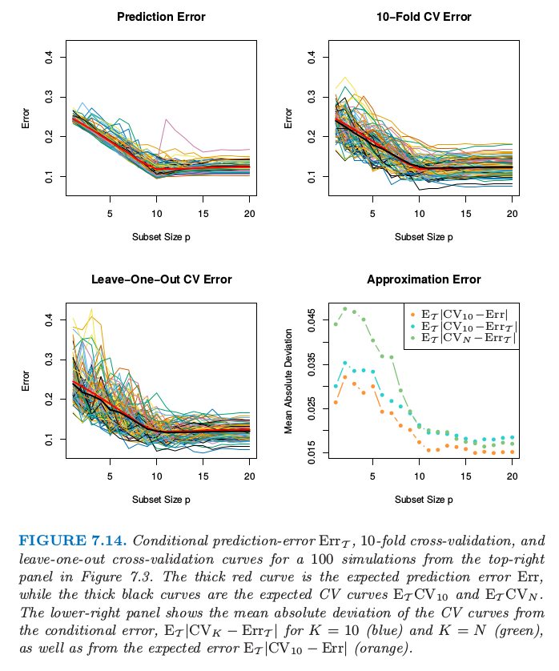
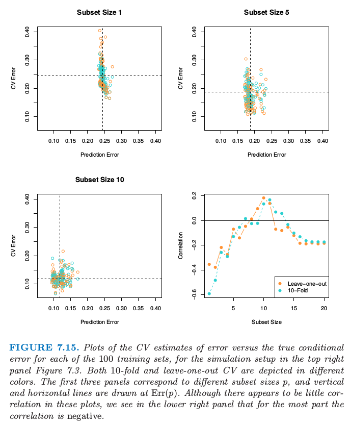

# 7.12 条件测试误差或期望测试误差？

| 原文   | [The Elements of Statistical Learning](https://web.stanford.edu/~hastie/ElemStatLearn/printings/ESLII_print12.pdf) |
| ---- | ---------------------------------------- |
| 翻译   | szcf-weiya                               |
| 发布 | 2017-02-20 |
| 更新 | 2018-03-20|
|状态|Done|

图 7.14 和 7.15 检验了交叉验证是否能很好地估计 $\Err_{\cal T}$ 的问题，其中 $\Err_{\cal T}$ 表示**给定训练集 $\cal T$ 上的误差**<!--（228页的式（7.15））-->，它与**期望预测误差**相对．

!!! note "weiya 注：Recall"
    $$
    \Err_{\cal T} = \mathrm E_{X^0,Y^0}[L(Y^0,\hat f(X^0))\mid {\cal T}]\tag{7.15}
    $$

> 图 7.14. 从图 7.3 的右上图得到的 100 个模拟值的条件预测误差 $\Err_{\cal T}$，10 折交叉验证，以及舍一交叉验证的曲线．红色粗线为期望预测误差 $\Err$，而黑色粗线为期望 CV 曲线 $\E_{\cal T}CV_{10}$ 和 $\E_{\cal T}CV_N$．右下图显示了 CV 曲线与条件误差的绝对偏差的期望 $\E_{\cal T}\vert CV_k-\Err_{\cal T}\vert$，$K=10$（蓝色）以及 $K=N$（绿色），并且也显示了 CV 曲线与期望误差之间绝对偏差的期望 $\E_{\cal T}\vert CV_{10}-\Err\vert$（橘黄色）．

对于图 7.3 中右上图的 “reg/linear” 的设定中产生的 100 个训练集中的每一个训练集，图 7.14 展示了条件误差 $\Err_{\cal T}$ 作为子集大小的函数图象（左上图）．接下来两张图显示了 $10$ 折交叉验证和 $N$ 折交叉验证，后者也称作**舍一法 (LOO)**．每张图的红色粗线表示**期望（预测）误差** $\Err$，而黑色粗线表示**期望交叉验证**．右下图则显示了交叉验证近似**条件误差**和**期望误差**的程度．

可能会认为 $N$ 折交叉验证能很好地近似 $\Err_{\cal T}$，因为它几乎用了整个训练样本来拟合新的测试点．另一方面，可能会期望 $10$ 折交叉验证会很好地估计 $\Err$，因为它平均了不同的训练集．从图中看到估计 $\Err_{\cal T}$ 时 $10$ 折交叉验证比 $N$ 折做得更好，对 $\Err$ 的估计甚至更好．确实如此，两条黑色曲线与红色曲线的相似性表明两个 CV 曲线对 $\Err$ 近似无偏，且 $10$ 折有更小的方差．类似的趋势由 Efron (1983)[^1] 给出．

> 图 7.15.  对 100 个训练集的每个 CV 估计误差关于真实条件误差的图象，模拟的设定与图 7.3 的右上图相同．前三张图对应不同的子集大小 $p$，且水平直线和垂直直线是在 $\Err(p)$ 处画的．尽管看起来这些图象没有多大的关联，但是我们从右下图看到大部分是负相关的．

图 7.15 显示了 100 次模拟中，10 折交叉验证和 $N$ 折交叉验证对误差的估计关于真实条件误差的散点图．尽管散点图没有表明太多的相关性，但右下图表明对于大部分来说是呈负相关的，这正是之前已经观察到的神奇现象．这种负相关解释了为什么任意形式的 CV 都**不能**很好地估计 $\Err_{\cal T}$．每张图的虚线是在 $\Err(p)$ 处画的，$\Err(p)$ 是最优子集大小 $p$ 时的期望误差．我们再一次看到两种形式的 CV 对于期望误差是近似无偏的，但是对于不同训练集的测试误差的方差是相当不同的．

在 7.3 的四种实验条件下，“reg/linear” 条件表现出实际测试误差与预测测试误差最高的相关性．这个现象也发生在误差的自助法估计中，而且我们猜测，对条件预测误差的其他估计都成立．

我们得出结论，仅仅给出从与训练集相同的数据时，一般情况下得到特定训练集的测试误差的估计不是很容易的．相反地，交叉验证和相关的方法可能可以对期望误差 $\Err$ 给出合理的估计．

[^1]: Efron, B. (1983). Estimating the error rate of a prediction rule: some improvements on cross-validation, Journal of the American Statistical Association 78: 316–331.