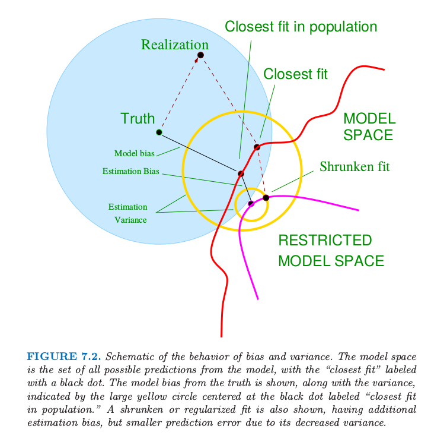
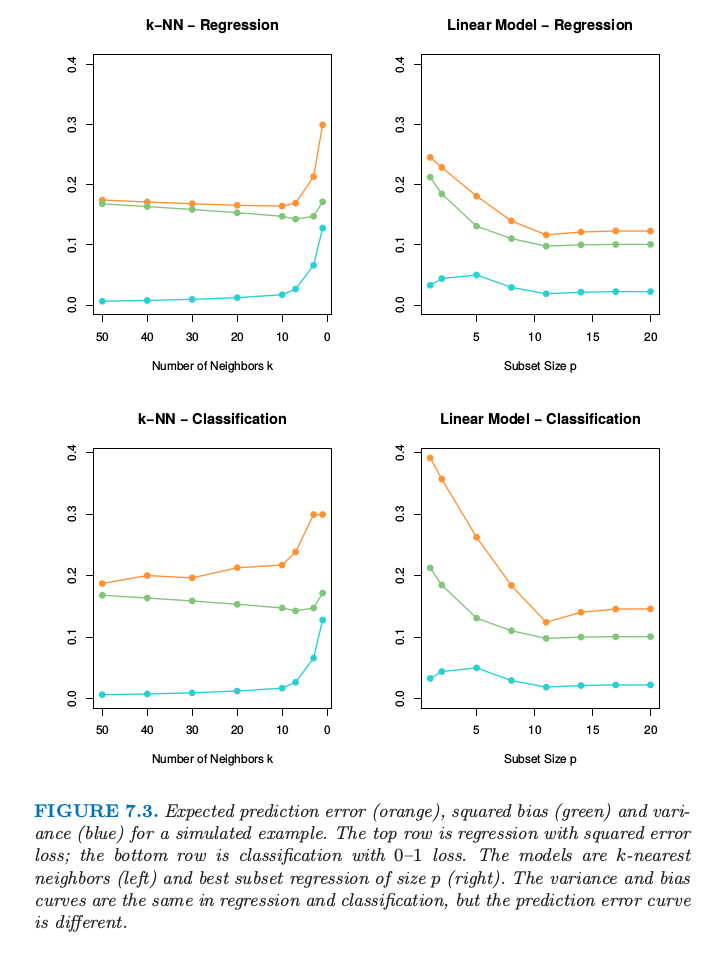

# 7.3 偏差-方差分解

| 原文   | [The Elements of Statistical Learning](https://web.stanford.edu/~hastie/ElemStatLearn/printings/ESLII_print12.pdf#page=242) |
| ---- | ---------------------------------------- |
| 翻译   | szcf-weiya                               |
| 发布 | 2016-09-30 |
|更新|2019-03-28 16:53:59|
|状态| Done|

!!! note "更新笔记"
    @2018-01-06 完成了图 7.3 的模拟，[这里](../notes/ModelSelection/sim7_3/index.html)记录了具体模拟过程，很好地重现了图中曲线的变化趋势．

和 [第 2 章](../02-Overview-of-Supervised-Learning/2.4-Statistical-Decision-Theory/index.html) 一样，如果我们假设 $Y=f(X)+\varepsilon$，其中 $\E(\varepsilon)=0$，并且 $\Var(\epsilon)=\sigma_\varepsilon^2$，我们可以导出在使用平方误差损失的情形下，在输入点 $X=x_0$ 处回归拟合值 $\hat f(X)$ 的期望预测误差，
$$
\begin{align}
\Err(x_0)&=\E[(Y-\hat f(x_0))^2\mid X=x_0]\notag\\
&=\sigma_\varepsilon^2+[\E\hat f(x_0)-f(x_0)]^2+\E[\hat f(x_0)-E\hat f(x_0)]^2\notag\\
&=\sigma_\varepsilon^2+\Bias^2(\hat f(x_0))+\Var(\hat f(x_0))\notag\\
&=\text{Irreducible Error} + \text{Bias}^2+\text{Variance}\tag{7.9}
\end{align}
$$

!!! note "weiya 注：推导 (7.9)"
    <!--
    (7.9) 其实暗含 $\E f(x_0)\E\hat f(x_0)=\E(f(x_0)\hat f(x_0))$，这显然成立，因为我们训练 $\hat f$ 时，完全不知道真实的 $f$，故它们独立．
    $$
    \begin{align}
    \Err(x_0)&=E[(Y-\hat f(x_0))^2\mid X=x_0]\\
    &=E[(f(x_0)+\varepsilon-\hat f(x_0))^2\mid X=x_0]\\
    &=\sigma_\varepsilon^2 + E[f(x_0)-E\hat f(x_0)+E\hat f(x_0)-\hat f(x_0)]^2\\
    &=\sigma_\varepsilon^2+[E\hat f(x_0)-f(x_0)]^2+E[\hat f(x_0)-E\hat f(x_0)]^2+Ef(x_0)E\hat f(x_0)-E(f(x_0)\hat f(x_0))\\
    &=\sigma_\varepsilon^2+[E\hat f(x_0)-f(x_0)]^2+E[\hat f(x_0)-E\hat f(x_0)]^2\\
    &=\sigma_\varepsilon^2+Bias^2(\hat f(x_0))+Var(\hat f(x_0))\\
    &=\text{Irreducible Error} + \text{Bias}^2+\text{Variance}
    \end{align}
    $$
    -->
    直接根据均方误差分解 (3.20)，
    $$
    \begin{align*}
    \Err(x_0)&=\E[(Y-\hat f(x_0))^2\mid X=x_0]\\
    &=\E[(f(x_0)+\varepsilon-\hat f(x_0))^2\mid X=x_0]\\
    &=\sigma_\varepsilon^2 + \MSE(\hat f(x_0))\\
    &=\sigma_\varepsilon^2+\Bias^2(\hat f(x_0))+\Var(\hat f(x_0))\,.
    \end{align*}
    $$
    或者更具体地，
    $$
    \begin{align}
    \Err(x_0)&=\E[(Y-\hat f(x_0))^2\mid X=x_0]\\
    &=\E[(f(x_0)+\varepsilon-\hat f(x_0))^2\mid X=x_0]\\
    &=\sigma_\varepsilon^2 + \E[f(x_0)-\E\hat f(x_0)+\E\hat f(x_0)-\hat f(x_0)]^2\\
    &=\sigma_\varepsilon^2+[\E\hat f(x_0)-f(x_0)]^2+\E[\hat f(x_0)-\E\hat f(x_0)]^2+2\E\{[f(x_0)-\E \hat f(x_0)][\E\hat f(x_0)-\hat f(x_0)]\}\\
    &=\sigma_\varepsilon^2+[\E\hat f(x_0)-f(x_0)]^2+\E[\hat f(x_0)-\E\hat f(x_0)]^2+2[f(x_0)-\E \hat f(x_0)]\cdot\E[\E\hat f(x_0)-\hat f(x_0)]\\
    &=\sigma_\varepsilon^2+[\E\hat f(x_0)-f(x_0)]^2+\E[\hat f(x_0)-\E\hat f(x_0)]^2+2[f(x_0)-\E \hat f(x_0)]\cdot[\E\hat f(x_0)-\E\hat f(x_0)]\\
    &=\sigma_\varepsilon^2+[\E\hat f(x_0)-f(x_0)]^2+\E[\hat f(x_0)-\E\hat f(x_0)]^2\\
    &=\sigma_\varepsilon^2+\Bias^2(\hat f(x_0))+\Var(\hat f(x_0))\\
    &=\text{Irreducible Error} + \text{Bias}^2+\text{Variance}
    \end{align}
    $$

第一项是目标在真实均值 $f(x_0)$ 处的方差，无论我们对 $f(x_0)$ 的估计有多好，这是不可避免的，除非 $\sigma_\varepsilon^2=0$．第二项是偏差的平方，是我们估计的均值与真实的均值间的偏差量；最后一项是方差，是估计的 $\hat f(x_0)$ 在其均值处的平方偏差的期望值．一般地，我们建立的模型 $\hat f$ 越复杂，（平方）偏差越低但是方差越大．

对于 $k$-最近邻回归拟合，这些表达式有简单的形式

$$
\begin{align}
\Err(x_0)&=\E[(Y-\hat f_k(x_0))^2\mid X=x_0]\notag\\
&= \sigma_\varepsilon^2+\left[f(x_0)-\frac{1}{k}\sum\limits_{\ell=1}^k f(x_{(\ell)})\right]^2+\frac{\sigma_\varepsilon^2}{k}\tag{7.10}
\end{align}
$$

这里为了简单我们假设训练输入 $x_i$ 为固定的，则随机性来自 $y_i$．邻居的个数 $k$ 与模型复杂度负相关．对于较小的 $k$，估计出的 $\hat f_k(x)$ 可以对潜在的函数 $f(x)$ 可能有更好的适应性．当 $k$ 增大，偏差—— $f(x_0)$ 与 $k$-最近邻中的 $f(x)$ 平均值的差的平方——一般会增大，而方差会降低．

对于线性模型拟合 $\hat f_p(x)=x^T\hat\beta$，其中含有 $p$ 个组分的参数向量 $\beta$ 是通过最小二乘拟合的，我们有

$$
\begin{align}
\Err(x_0)&=\E[(Y-\hat f_p(x_0))^2\mid X=x_0]\notag\\
&=\sigma^2_\varepsilon+[f(x_0)-E\hat f_p(x_0)]^2+\Vert\mathbf h(x_0)\Vert^2\sigma_\varepsilon^2\tag{7.11}\label{7.11}
\end{align}
$$

这里 $\mathbf h(x_0)=\mathbf{X(X^TX)^{-1}}x_0$，是得到拟合 $\hat f_p(x_0)=x_0^T\mathbf{(X^TX)^{-1}X^Ty}$ 的 $N$ 维线性权重，因此 $\mathrm{Var}[\hat f_p(x_0)]=\Vert \mathbf h(x_0)\Vert^2\sigma_\varepsilon^2$．尽管方差随着 $x_0$ 变化，但它的平均（当 $x_0$ 取遍样本值 $x_i$）为 $(p/N)\sigma^2_\varepsilon$，

!!! note "weiya 注"
    记 $\X=[x_1',x_2',\ldots,x_N']'$，则
    $$
    \begin{align}
    \sum\limits_{i=1}^N\Vert\mathbf h(x_i)\Vert^2
    &=\sum\limits_{i=1}^N\mathbf h^T(x_i)\mathbf h(x_i)\notag\\
    &=\sum\limits_{i=1}^Nx_i^T(\mathbf{X^TX})^{-1}x_i\notag\\
    &=\trace[\X(\X^T\X)^{-1}\X^T]\notag\\
    &=\trace[(\X^T\X)^{-1}\X^T\X]\notag\\
    &=p\notag
    \end{align}
    $$
    则方差的平均为 $(p/N)\sigma_\varepsilon^2$．

因此有
$$
\frac{1}{N}\sum\limits_{i=1}^N\mathrm{Err}(x_i)=\sigma_\varepsilon^2+\frac{1}{N}\sum\limits_{i=1}^N[f(x_i)-\E\hat f(x_i)]^2+\frac{p}{N}\sigma_\varepsilon^2\tag{7.12}
$$

这称作 **样本内 (in-sample)** 误差．这里模型复杂度直接与参数个数 $p$ 有关．

对于岭回归估计 $\hat f_\alpha(x_0)$ 的测试误差 $\Err(x_0)$ 与 \eqref{7.11} 式相同，除了方差项的线性系数不一样：$\mathbf h(x_0)=\mathbf X(\mathbf {X^TX}+\alpha\mathbf I)^Tx_0$．偏差项也会不一样．

对于线性模型族比如岭回归，我们可以更精细地分解偏差．令 $\beta_*$ 为 $f$ 的最优线性估计的参数：

$$
\beta_*=\mathrm{arg}\;\underset{\beta}{\mathrm{min}}\;E(f(X)-X^T\beta)^2\tag{7.13}
$$

这里期望是对输入变量 $X$ 的分布取的．接着我们可以将 **偏差平方的平均 (average squared bias)** 写成

$$
\begin{align}
&\E_{x_0}[f(x_0)-E\hat f_\alpha(x_0)]^2\notag\\
&=\E_{x_0}[f(x_0)-x_0^T\beta_*]^2+\E_{x_0}[x_0^T\beta_*-\E x_0^T\hat\beta_\alpha]^2\notag\\
&=\text{Ave[Model Bias]}^2+\text{Ave[Estimation Bias]}^2\tag{7.14}
\end{align}
$$

右侧的第一项是 **模型偏差 (model bias)** 平方的平均，它是最优线性近似和真实函数之间的误差．第二项是 **估计偏差 (estimation bias)** 平方的平均，它是估计的平均值 $\E(x_0^T\hat\beta)$ 与最优线性近似之间的误差．

对于通过普通最小二乘拟合的线性模型，估计量的偏差为 0．对于约束的拟合，比如岭回归，它是正的，而且我们用减小方差的好处进行交易．模型偏差只可能通过将线性模型类扩大为更广的模型类才能降低，或者通过在模型中加入变量的交叉项以及变换项（通过变量的变换得到的）来降低．

图 7.2 显示了偏差和方差之间的权衡的原理图．在线性模型的情形下，模型空间是根据 $p$ 个输入变量进行线性预测的集合，标为 “closest fit” 的黑点是 $x^T\beta_*$．蓝色阴影部分区域表示训练样本与真实值（图中的 truth）之间的误差 $\sigma_\varepsilon$．

> 图 7.2. 偏差和方差行为的原理图．模型空间是模型的所有可能的预测的集合，“closest fit”用黑点标出．图中显示了偏离真实值的模型偏差，以及用圆心在标记为“closest fit in population”的黑点处的黄色大圆来表示方差．图中也显示了收缩或者正则化的拟合，它们有额外的估计偏差，但是因为方差的减小导致了更小的预测误差．

图中也显示了最小二乘的方差，用圆心在标记为“closest fit in population”的黑点处的黄色大圆来表示．现在如果我们用更少的预测变量来拟合模型，或者通过将它们向 0 收缩来正则化系数，我们会得到图中的 “shrunken fit”．这个拟合有额外的估计偏差，因为它不是模型空间的最近拟合 (closest fit)．另一方面，它有更小的方差．如果方差的减少大于（平方）偏差的增大，则是值得的．

## 例子： 方差-偏差之间的权衡

> 图 7.3. 某模拟例子的预测误差的期望（橘黄色），平方偏差（绿色）以及方差（蓝色）．上面两张图为平方误差损失的回归；下面两张图为0-1损失的分类．模型是 $k$ 最近邻（左边）以及大小为$p$的最优子集回归（右）．在回归和分类中的方差和偏差曲线是一样的，但是预测误差曲线是不同的．

图 7.3. 显示了两个模拟例子的偏差-方差之间的权衡．有 80 个观测，20 个预测变量，在超立方体 $[0,1]^{20}$ 中均匀分布．这些情形如下：

**左图：** 若 $X_1\le 1/2$，$Y=0$，且若 $X_1>1/2$，$Y=1$，而且应用 $k$-最近邻模型．

**右图：** 若 $\sum_{j=1}^{10}X_j>5$，$Y=1$，否则 $Y=0$，且采用大小为 $p$ 的最优子集回归．

上面一行的图是平方误差损失的回归；下面一行的图是 0-1 损失的分类．图中显示了预测误差（红色）、平方误差（绿色）和方差（蓝色），所有都是用大的测试样本来计算的．

在回归问题中，偏差和方差相加得到预测误差曲线，对于 $k$ 最近邻在 $k=5$ 处有最小值，对于线性模型 $p\ge 10$ 有最小值．对于分类损失（下图），可以看到一些有趣的现象．偏差和方差曲线与上面的图象相同，而且预测误差指的是误分类比率．我们看到预测误差不再是偏差平方与方差的和．对于 $k$ 最近邻分类器，当邻居个数增长到 20，预测误差降低或者保持不变，尽管偏差平方仍在增大．对与线性模型分类器最小值和回归一样出现在 $p\ge 10$，但是在 $p=1$ 处模型的改进是很显著的．我们看到偏差和方差是相互影响来确定预测误差．

为什么会这样？第一个现象可以很简单的解释．假设在一个给定的输入点，类别 1 的真实概率为 0.9，而我们估计出的期望值为 0.6．则偏差平方——$(0.6-0.9)^2$——是相当大的，但是预测误差为 0，因为我们作出了正确的判断．换句话说，使得我们处于判别边界正确一侧的估计误差是没有影响的．[练习 7.2](https://github.com/szcf-weiya/ESL-CN/issues/26) 从分析角度论证这个现象，而且展示了偏差与方差之间的相互影响．

!!! info "weiya 注：Ex. 7.2"
    已解决，详见 [Issue 26: Ex. 7.2](https://github.com/szcf-weiya/ESL-CN/issues/26)．

整体思想是偏差方差间的权衡在 0-1 损失的表现与在平方误差损失的表现不一样．反过来意味着调整参数的最优选择可能在两种设定下本质上不同．正如后面章节中描述的那样，我们应该将调整参数的选择建立于对预测误差的估计之上．
