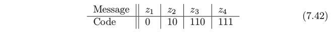

# 7.8 最小描述长度

| 原文   | [The Elements of Statistical Learning](https://web.stanford.edu/~hastie/ElemStatLearn/printings/ESLII_print12.pdf) |
| ---- | ---------------------------------------- |
| 翻译   | szcf-weiya                               |
| 发布 | 2016-09-30 |
|更新 |2019-07-27 18:44:16|
|状态|Done|

**最小描述长度 (MDL)**方法给出与 BIC 形式上等价的选择准则，但是它是从最优编码角度出发的．我们首先回忆数据压缩的编码理论，接着将其应用到模型选择中．

我们将数据 $z$ 看成是想要编码并且发给其他人（接受者）的信息．我们将模型看成是对数据编码的一种方式，然后选择最简模型，也就是传输的最短编码．

首先假设我们可能想要传送的信息为 $z_1,z_2,\ldots,z_m$．我们的编码采用长度为 $A$ 的有限字母表：举个例子，我们可能采用长度为 $A=2$ 的二进制编码 $\\{0,1\\}$．这里是 4 个可能信息以及二值编码的例子：

这个编码也被称作 **瞬时前缀码 (instantaneous prefix code)**：没有编码是其它任意码的前缀，并且接受者（知道所有可能编码的人）当信息完全发送后知道精确的信息．我们将接下来的讨论限制在瞬时前缀码上．

可以采用 (7.42) 的编码或者交换编码，举个例子，对于 $z_1,z_2,z_3,z_4$ 编码为 $110,10,111,0$．我们怎么决定采用哪一个？这取决于我们发送每条信息的次数．举个例子，如果我们发送 $z_1$ 最多，对 $z_1$ 采用最短编码 $0$ 是有意义的．采用这种策略——最频繁的信息采用最短的编码——平均信息长度将会缩短．

一般地，如果以概率 $\Pr(z_i),z_i=1,2,\ldots,4$ 来发送信息， Shannon 的著名定理说我们应该采用长度为 $l_i=-\mathrm{log}_2 \Pr(z_i)$ 的编码，并且平均信息长度满足

$$
\E(\mathrm{length}) \ge -\sum \Pr(z_i)\log_2(\Pr(z_i))\tag{7.43}
$$

上面的右侧项也被称作 $\Pr(z_i)$ 分布的熵．当 $p_i=A^{-l_i}$ 时上面不等式等号成立．在我们例子中，如果 $\Pr(z_i)=1/2,1/4,1/8,1/8$，则 (7.42) 的编码是最优的而且达到了熵的下界．

一般地下界不能达到，但是像 Huffman 编码模型的过程可以接近下界．注意到对于无限的信息集合，熵替换成 $-\int \Pr(z)\log_2\Pr(z)dz$．

从这个结果我们得到以下结论：

> 为了传送概率密度函数为 $\Pr(z)$ 的随机变量 $z$，我们需要 $-\log_2\Pr(z)$ 位信息．

从现在开始我们将记号 $\log_2\Pr(z)$ 换成 $\log\Pr(z)=\log_e \Pr(z)$；这是很方便的，因为仅仅引入了不重要的常数因子．

现在我们将这个问题的结果应用到模型选择．我们有参数为 $\theta$ 的模型 $M$，以及包含输入和输出的数据 $\mathbf{Z=(X,y)}$．令在模型条件下的输出的（条件）概率为 $\Pr(\mathbf y\mid\theta,M,\mathbf X)$，假设接受者知道所有的输入，而且我们希望传送输出值．传送输出要求的信息长度为

$$
\mathrm{length} = -\log \Pr(\mathbf y\mid \theta,M,\mathbf X)-\log \Pr(\theta\mid M)\tag{7.44}\label{7.44}
$$

这是在给定输入的情况下目标值的对数似然．

!!! note "weiya 注："
    这里我理解为其实就是 
    $$
    \Pr(y,\theta\mid M, \X) = \Pr(y\mid \theta,M,\X)\Pr(\theta\mid M)\,,
    $$
    其中 $y$ 和 $\theta$ 是目标值，而 $\X$ 和 $M$ 都是输入。

第二项是传递模型参数 $\theta$ 的平均编码长度，而第一项是传递模型与真实目标值之间差异的平均编码长度．举个例子假设我们有单目标 $y\sim N(\theta,\sigma^2)$，参数为 $\theta\sim N(0,1)$，并且没有输入（为了简单）．则模型长度为
$$
\mathrm{length} = constant + \log\sigma + \frac{(y-\theta)^2}{2\sigma^2} + \frac{\theta^2}{2}\tag{7.45}
$$
注意到 $\sigma$ 越小，平均信息长度越短，因为 $y$ 更集中在 $\theta$ 附近．

MDL 准则说我们应该选择最小化 \eqref{7.44} 的模型．我们将 \eqref{7.44} 看成（负）对数后验分布，因此最小化描述长度等价于最大化后验概率．因此，作为近似对数后验概率导出的 BIC 准则，也可以看成是通过最小描述长度来（近似）模型选择的工具．

注意到我们忽略随机变量 $z$ 编码的精确性．我们不可能使用有限的编码长度对连续变量进行精确地编码．然而，如果我们对编码 $z$ 有容忍度 $\delta z$，需要的信息长度是在区间 $[z,z+\delta z]$ 中概率的对数，如果 $\delta z$ 很小，可以用 $\delta z\Pr(z)$ 来近似．因为 $\log\delta z\mathrm{Pr}(z)=\mathrm{log}\delta z + \mathrm{log}\;\mathrm{Pr}(z)$，这意味着我们可以仅仅忽略掉常数 $\mathrm{log}\;\delta z$，并且使用 $\mathrm{log\; \Pr}(z)$ 来作为我们信息长度的衡量，就像我们上面做的那样．

用于模型选择的 MDL 的上述观点表明我们应该选择后验概率达到最大的模型．然而，许多贝叶斯学家倾向于通过从后验分布中采样来做推断．
