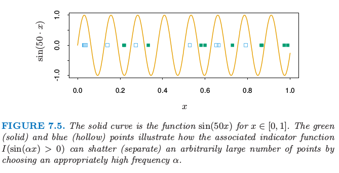
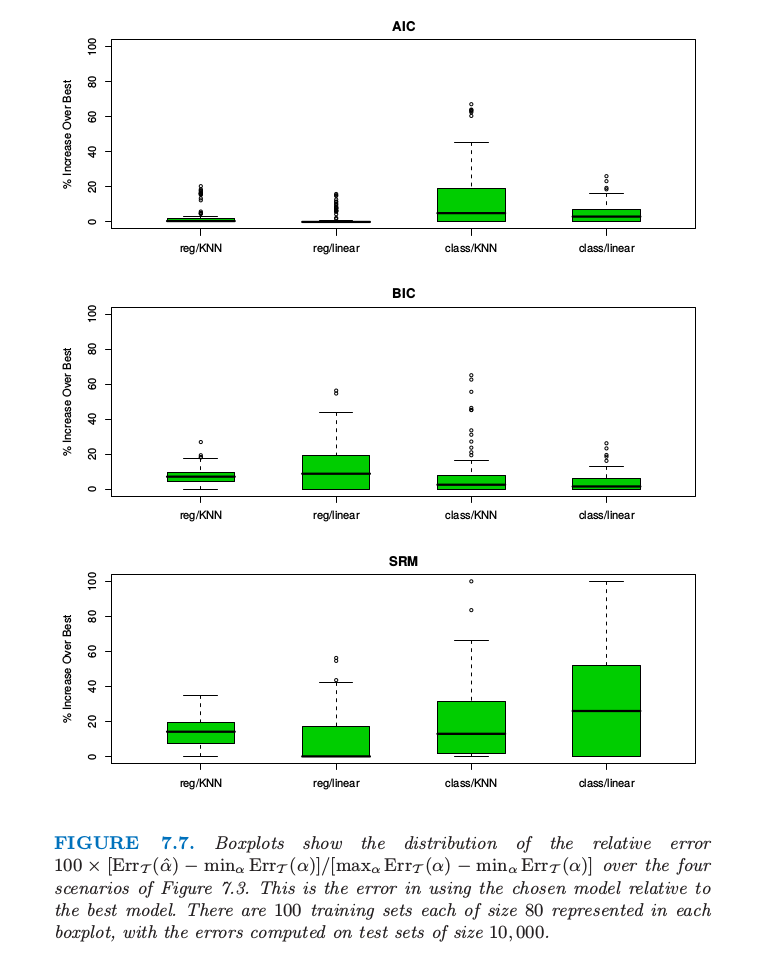

# 7.9 VC维

| 原文   | [The Elements of Statistical Learning](https://web.stanford.edu/~hastie/ElemStatLearn/printings/ESLII_print12.pdf#page=256) |
| ---- | ---------------------------------------- |
| 翻译   | szcf-weiya                               |
| 发布 | 2016-09-30 |
|更新|2019-07-27 19:02:08|
|状态|Done|

!!! note "更新笔记"
    @2018-01-07 完成了图7.7的部分模拟，即 AIC 和 BIC 下 kNN 回归与分类的情形，其它情形待完成．具体模拟细节记录在了[这个 R Notebook](http://rmd.hohoweiya.xyz/sim7_7.html)中．

使用样本内误差估计的困难在于需要确定在拟合中使用的参数（或复杂度）个数 $d$．尽管 [7.6 节](7.6-The-Effective-Number-of-Parameters/index.html)引入的有效参数个数对部分非线性模型是有用的，但是不太普遍．Vapnik-Chervonenkis (VC) 理论提供了对复杂度更一般的度量，而且给出了相应的 optimism 估计．这里我们简短介绍这个理论．

假设我们有由参数 $\alpha$ 编码的函数类 $\\{f(x,\alpha)\\},x\in \IR^p$．现在假设 $f$ 为指示函数，也就是取值为 0 或 1．如果 $\alpha=(\alpha_0,\alpha_1)$，且 $f$ 为线性指示函数 $I(\alpha_0+\alpha_1^Tx>0)$，则说函数 $f$ 的复杂度是参数个数 $p+1$ 似乎是合理的．但是如果 $f(x,\alpha)=I(\sin\alpha\cdot x),x\in \IR$， $\alpha$ 为任意实数会怎么样呢？图 7.5 显示了函数 $\sin(50\cdot x)$ 的图象．

> 实线是函数 $\sin(50x),x\in [0,1]$．绿点（实心）和蓝色（空心点）说明了相应的指示函数 $I(\sin(\alpha x)>0)$ 如何通过选择合适高的频率 $\alpha$ 来打散（分离）任意多的点．

这是个非常弯曲的函数，当频率 $\alpha$ 增大变得更粗糙，但是它仅仅有一个参数 $\alpha$：尽管这样，它比 $p=1$ 时的线性指示函数 $I(\alpha_0+\alpha_1x)$ 复杂度更低的结论似乎是不合理的．

Vapnik-Chervonenkis 维度是衡量函数类的复杂度的一种方式，它通过评估函数类中的成员的弯曲程度实现的．

> 函数类 $\\{f(x,\alpha)\\}$ 的 VC 维定义为可以被 $\\{f(x,\alpha)\\}$ 的成员打散的点的最多数目（在一定条件下）．

点集被函数类打散是指无论我们对每个点如何赋予二值标签，都有类中的一个函数完美地将它们分隔开．

> 图 7.6. 前三张图显示了平面中的直线类可以打散 3 个点．最后一张图显示了这个类不能打散 4 个点，因为没有直线可以使得空心点在一侧而实心点在另一侧．因此平面中直线类的 VC 维是 3．注意到非线性曲线类可以打散 4 个点，也因此有比 3 更高的 VC 维．

图 7.6 显示了在平面中线性指示函数的 VC 维是 3 而非 4，因为没有 4 个点可以被直线集打散．一般地，$p$ 维线性指示函数的 VC 维为 $p+1$，这也是自由参数的个数．另一方面，可以证明 $\sin(\alpha x)$ 函数类有无穷的 VC 维，正如图 7.5 显示的那样．通过合适的 $\alpha$，任何点集都可以被这个函数类打散（[练习 7.8](https://github.com/szcf-weiya/ESL-CN/issues/130)）．

!!! note "weiya 注：Ex. 7.8"
    已解决，详见 [Issue 130: Ex. 7.8](https://github.com/szcf-weiya/ESL-CN/issues/130).

目前我们仅仅讨论了指示函数的 VC 维，但这个可以推广到实值函数中．实值函数类 $\\{g(x,\alpha)\\}$ 的 VC 维定义为指示类 $\\{I(g(x,\alpha)-\beta > 0)\\}$ 的 VC 维，其中 $\beta$ 在 $g$ 的值域中取值．

可以使用 VC 维来构造（样本外）预测误差的估计；不同类型的结果都是可以的．当使用函数类时，采用 VC 维的概念，可以证明训练误差的 **乐观 (optimisim)** 的结果．这样的结果的例子如下．如果我们采用 VC 维为 $h$ 的类函数 $\\{f(x,\alpha)\\}$ 来拟合 $N$ 个训练点，于是在训练集上至少以 $1-\eta$ 的概率成立下式：

$$
\begin{align}
\Err_{\cal T}&\le \overline{\err} + \frac{\epsilon}{2}(1+\sqrt{1+\frac{4\cdot\overline{err}}{\epsilon}})\;(\text{二分类})\notag\\
\Err_{\cal T}&\le \frac{\overline{\err}}{(1-c\sqrt{\epsilon})_+}\; (\text{回归})\notag\\
& \text{其中 }\epsilon=a_1\frac{h[\log(a_2N/h)+1]-\log(\eta/4)}{N}\notag\\
& 0 < a_1\le 4,\;0 < a_2\le 2\notag
\end{align}
\tag{7.46}\label{7.46}
$$

这些界对 $\\{f(x,\alpha)\\}$ 的所有成员都同时成立，这归功于 Cherkassky and Mulier (2007)[^1]．他们建议 $c=1$．对于回归他们建议 $a_1=a_2=1$，对于分类他们没有给出推荐，因为 $a_1=4,a_2=2$ 对应最坏的情形．它们也给出了回归的另一个实用 (practical) 的界
$$
\Err_{\cal T}\le \overline{\err}\left(1-\sqrt{\rho-\rho \mathrm{log}\rho}+\frac{\mathrm{log}N}{2N}\right)^{-1}_+\tag{7.47}\label{7.47}
$$
其中 $\rho=\frac{h}{N}$，不含调整常数．这个界表明随着 $h$ 增大 $N$ 减小，optimism 会增大，这与式 \eqref{7.24} 给出的 AIC 调整值 $d/N$ 数值上是一致的．

!!! note "weiya 注：Recall"
    $$
    \E_{\mathbf y}(\Err_{in})=\E_{\mathbf y}(\overline{\err})+2\cdot\frac{d}{N}\sigma_\varepsilon^2\tag{7.24}\label{7.24}
    $$

然而，\eqref{7.46} 结果更强：不是给出每个固定函数 $f(x,\alpha)$ 的 optimism 的期望值，而是给出对于所有函数 $f(x,\alpha)$ 的概率上限，也因此可以对函数类进行搜索．

Vapnik 的 **结构风险最小化 (SRM, structural risk minimization)** 方法拟合嵌套的 VC 维递增 $h_1 < h_2 < \cdots$ 的模型序列，接着选择有最小上界的模型．

我们注意到类似 \eqref{7.46} 中的上界通常是非常不精确的，但是这并不会妨碍它们成为模型选择的良好准则，其中相对（不是绝对）的测试误差的大小是重要的．这种方法的主要不足是计算类函数的 VC 维的困难．通常只能得到粗糙的 VC 维上界，这可能不是充分的．结构风险最小化程序可以成功运行的例子是支持向量分类器，将在 [12.2 节](../12-Support-Vector-Machines-and-Flexible-Discriminants/12.2-The-Support-Vector-Classifier/index.html)讨论．

## 例子（继续）

> 图 7.7. 在图 7.3 的四种情形下，用箱线图显示相对误差 $100\times [\Err_{\cal T}(\hat\alpha)-min_\alpha \Err_{\cal T}(\alpha)]/[max_\alpha \Err_{\cal T}(\alpha)-min_\alpha \Err_{\cal T}(\alpha)]$ 的分布．这是选择的模型相对于最优模型的误差．每个箱线图表示大小为 80 的 100 个训练集，误差是在大小为 10000 的测试集上计算的．

图 7.7 显示了当采用 AIC，BIC 和 SRM 来对图 7.3 的例子来选择模型大小的结果．对于标着 KNN 的例子，模型指标$\alpha$ 指的是邻居的个数，而对于标着 REG 的来说 $\alpha$ 为子集大小．采用每个选择方法（例如，AIC），我们估计最优模型 $\hat \alpha$ 并且在测试集上找到真实的预测误差 $\Err_{\cal T}(\hat\alpha)$．对于同样的训练集，我们计算最优和最坏可能的模型选择的预测误差：$\min_\alpha \Err_{\cal T}(\alpha)$ 和 $max_\alpha \Err_{\cal T}(\alpha)$．箱线图显示了下面值的分布
$$
100\times \frac{\Err_{\cal T}(\hat \alpha)-\min_\alpha \Err_{\cal T}(\alpha)}{\max_\alpha \Err_{\cal T}(\alpha)-\min_\alpha \Err_{\cal T}(\alpha)}
$$
它表示选定的模型相对于最优模型的误差．对于线性回归，模型复杂度由特征的个数度量；正如在 [7.5 节](7.5-Estimates-of-In-Sample-Prediction-Error/index.html)提到的那样，它低估了 $\df​$，因为它没有考虑该大小下对最优模型的搜索．这对线性分类器的 VC 维也同样适用．对于 $k​$ 最近邻，模型复杂度取 $N/k​$．在加性误差模型回归模型下，这个可以证明为真正的有效自由度个数（[练习 7.6](https://github.com/szcf-weiya/ESL-CN/issues/131)）；但我们不知道它是否对应 VC 维．

!!! info "weiya 注：Ex. 7.6"
    已解决，详见 [Issue 131: Ex. 7.6](https://github.com/szcf-weiya/ESL-CN/issues/131).

我们取 \eqref{7.46} 中常数为 $a_1=a_2=1​$；SRM 的结果随着不同的常数值而变化，而且这个选择给出了最有利的结果．我们运用另一个实用的界 \eqref{7.47} 来重复 SRM 的选择过程，并且得到几乎一样的结果．对于误分类误差，我们在最少限制的模型上（对于 KNN 取 $k=5​$，因为 $k=1​$ 会导致 0 训练误差）采用 $\hat\sigma_\varepsilon^2=[N/(N-d)]\cdot \overline{err}(\alpha)​$．AIC 准则对于四种情形都适用，尽管在 0-1 损失时缺少理论支撑．BIC 表现也近似一样，但 SRM 的表现有好有坏．

[^1]: Cherkassky, V. and Mulier, F. (2007). Learning from Data (2nd Edition), Wiley, New York.