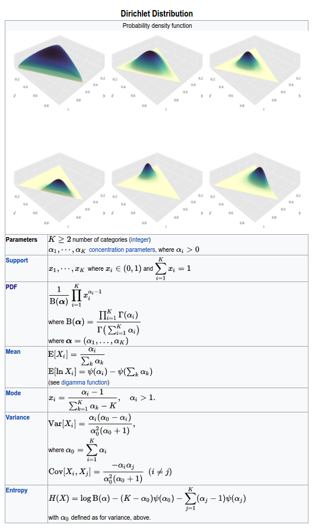
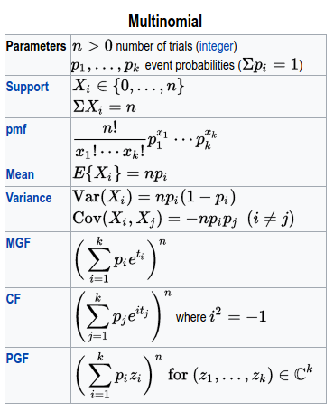

# 自助法和贝叶斯推断之间的关系

| 原文   | [The Elements of Statistical Learning](../book/The Elements of Statistical Learning.pdf) |
| ---- | ---------------------------------------- |
| 翻译   | szcf-weiya                               |
| 时间   | 2017-02-01                               |

首先考虑一个非常简单的例子，例子中我们从一个正态分布中观察单个的观测$z$
$$
z\sim N(\theta,1)\qquad (8.29)
$$
为了完成关于$\theta$的贝叶斯分析，我们需要确定一个先验。最方便和普遍的选择是$\theta\sim N(0, \tau)$,给出后验分布
$$
\theta\mid z\sim N(\frac{z}{1+1/\tau},\frac{1}{1+1/\tau})\qquad (8.30)
$$
于是我们选择的$\tau$越大，后验在最大似然估计$\hat\theta=z$附近越集中。当$\tau\longrightarrow\infty$时，我们得到一个无信息（常值）先验，后验分布为
$$
\theta\mid z\sim N(z,1)\qquad (8.31)
$$
这与我们通过样本密度为$N(z,1)$的最大似然估计产生自助法值$z^*$的参数自助法分布是相同的。

有三个步骤需要完成对应的工作。

1. 选择$\theta$的无信息先验
2. 在数据$\mathbf Z$上的对数似然函数$\ell(\theta;\mathbf Z)$的独立性仅仅与最大似然估计$\hat\theta$有关。因此我们可以将对数似然函数写成$\ell(\theta;\hat\theta)$
3. 关于$\theta$和$\hat\theta$的对数似然函数存在对称性，这就是，$\ell(\theta;\hat\theta)=\ell(\hat\theta;\theta)+\text{constant}$

性质（2）和（3）本来只有当为高斯分布时才满足。然而，对于多项式分布也近似满足，导出非参自助法和贝叶斯推断之间的对应，我们将在下面阐述要点。

假设我们有$L$个类别的离散样本空间。令$w_j$为样本点落入第$j$类的概率，而$\hat w_j$为第$j$类的观测比例。令$w=(w_1,w_2,\ldots,w_L),\hat w=(\hat w_1,\hat w_2,\ldots, \hat w_L).$记我们的估计为$S(\hat w)$;取参数为$a$的对称Dirichlet分布作为$w$的先验分布：
$$
w\sim \mathrm{Di}_L(a1)\qquad (8.32)
$$

> weiya注：[from wiki](https://en.wikipedia.org/wiki/Dirichlet_distribution)
>
> 

也就是，先验概率质量函数与$\prod_{\ell=1}^Lw_\ell^{a-1}$成比例。则$w$的后验密度为
$$
w\sim \mathrm{Di}_L(a1+N\hat w)\qquad (8.33)
$$
其中$N$为样本大小。令$a\rightarrow 0$得到无信息先验
$$
w\sim \mathrm{Di}_L(N\hat w)\qquad (8.34)
$$
现在通过有放回取样得到的自助法分布可以表示成从多项式分布中对类别比例进行取样。特别地，
$$
N\hat w^*\sim \mathrm{Mult}(N,\hat w)\qquad (8.35)
$$
其中，$\mathrm {Mult}(N,\hat w)$为多项式分布，有概率质量函数$\binom{N}{N\hat w_1^*,\ldots,N\hat w_L^*}\prod\hat w_\ell^{N\hat w_\ell^*}$.这个分布与上面的后验分布很相似，有着同样的支撑集，同样的均值，以及近似一样的协方差矩阵。因此$S(\hat w^*)$的自助法分布近似为$S(w)$的后验分布。

> weiya注：[from wiki](https://en.wikipedia.org/wiki/Multinomial_distribution)
>
> 

从这点看，自助法分布表示关于我们参数的一个（近似的）非参、无信息后验分布。但是自助法分布可以很方便地得到——不需要正式地确定一个先验而且不需要必须从后验分布中取样。因此我们或许把自助法分布看成一个“穷人的”贝叶斯后验。通过扰动数据，自助法近似出扰动参数后的贝叶斯影响。而且一般地很容易实施。