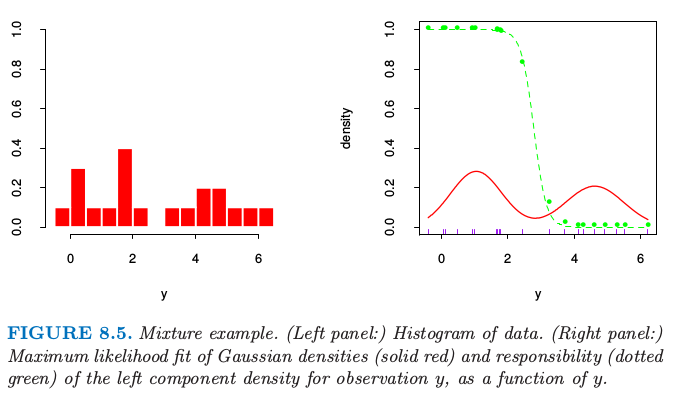
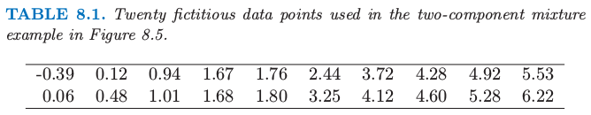
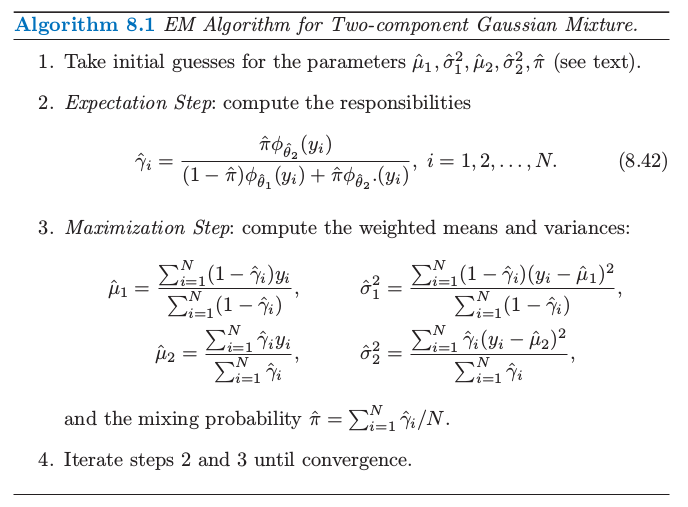
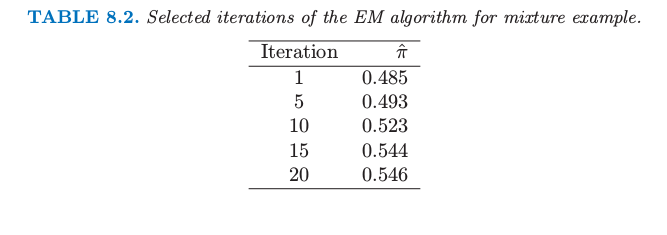
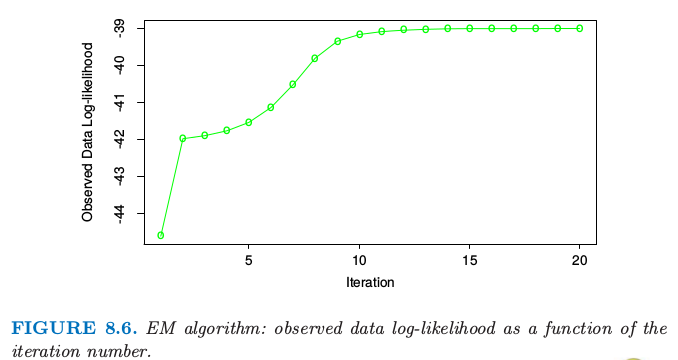
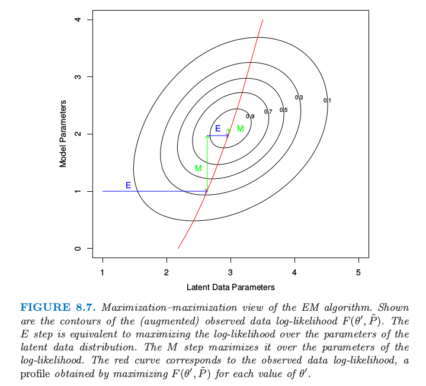

# EM算法

| 原文   | [The Elements of Statistical Learning](../book/The Elements of Statistical Learning.pdf) |
| ---- | ---------------------------------------- |
| 翻译   | szcf-weiya                               |
| 时间   | 2016-12-20 & 2017-02-01:2017-02-03       |

EM算法是简化复杂极大似然问题的一种很受欢迎的工具。我们首先在一个简单的混合模型中讨论它。

## 两个组分的混合模型

这一节我们描述一个估计密度的简单混合模型，以及对应的求解极大似然估计的EM算法。这与贝叶斯推断中的Gibbs取样方法有着本质的联系。混合模型将在本书其他部分的章节讨论和演示，特别是6.8，12.7和13.2.3节。

!!! note "weiya注："
	Gibbs sampling：

	假设我们需要从$\mathbf X=(x_1,x_2,\ldots,x_n)$中得到$k$个样本，联合分布为$p(x_1,x_2,\ldots,x_n)$。

	记第$i$个样本为$\mathbf X^{(i)}=(x_1^{(i)},\ldots,x_n^{(i)})$.我们按下列步骤进行：

	1. 以初始值$X^{(i)}$开始

	2. 需要下一个样本，记为$X^{(i+1)}$.因为$\mathbf X^{(i+1)}=(x_1^{(i+1)},\ldots,x_n^{(i+1)})$是向量，我们需要对向量的每一个组分进行抽样，基于$p(x_j^{(i+1)}\mid x_1^{(i+1)},\ldots,x_{j-1}^{(i+1)},x_{j+1}^{(i)},\ldots,x_n^{(i)})$的分布对$x_j^{(i+1)}$抽样.

	3. 重复上述步骤$k$次。

图8.5的左图显示了20个在表8.1中的20个模拟数据的直方图。

> 图8.5. 混合模型的例子。（左图：）数据的直方图。（右图：）高斯密度的最大似然拟合（红色实线）和观测值$y$的左边成分的解释度（绿色点线）作为$y$的函数。

> 表8.1. 图8.5中两个组分混合的例子中使用的20个模拟数据。

我们想要建立数据点的密度模型，然后由于数据点呈现明显的双峰，高斯分布不是合适的选择。这里似乎有两个潜在的分开的形式，所以我们将$Y$作为两个正态分布混合的模型：
$$
\begin{align}
Y_1&\sim N(\mu_1,\sigma^2_1)\\
Y_2&\sim N(\mu_2,\sigma_2^2)\qquad \qquad \qquad\qquad(8.36)\\
Y&=(1-\Delta)\cdot Y_1 + \Delta\cdot Y_2
\end{align}
$$
其中$\Delta\in \{0,1\}$,且$Pr(\Delta =1)=\pi$. 产生过程是很显然的：以概率$\pi$产生$\Delta\in\\{0,1\\}$,然后根据输出结果，分配给$Y_1$或$Y_2$.令$\phi_{\theta}(x)$记为参数为$\theta=(\mu,\sigma^2)$的正态分布。则$Y$的密度为
$$
g_Y(y)=(1-\pi)\phi_{\theta_1}(y)+\pi\phi_{\theta_2}(y)\qquad (8.37)
$$
现在假设我们希望通过极大似然估计来拟合图8.5中数据的模型。参数为
$$
\theta=(\pi,\theta_1,\theta_2)=(\pi,\mu_1,\sigma^2_1,\mu_2,\sigma_2^2)\qquad (8.38)
$$
基于$N$个训练集的对数概率为
$$
\ell(\theta;\mathbf Z)=\sum\limits_{i=1}^Nlog[(1-\pi)\phi_{\theta_1}(y_i)+\pi\phi_{\theta_2}(y_i)]\qquad (8.39)
$$
直接对$\ell(\theta;\mathbf Z)$进行最大化在数值上是很困难的，因为求和项在log函数里面。然而，这里有一个更简单的方式。我们考虑一个类似（8.36）中取0或1的潜变量$\Delta_i$：若$\Delta_i=1$则 $Y_i$来自模型2，否则来自模型1.假设我们已经知道了$\Delta_i$的值。则对数概率为
$$
\begin{align}
\ell_0(\theta;\bf Z,\bf{\Delta})&=\sum\limits_{i=1}^N[(1-\Delta_i)log\phi_{\theta_1}(y_i)+\Delta_ilog\phi_{\theta_2}(y_i)]\\
&+\sum\limits_{i=1}^N[(1-\Delta_i)log(1-\pi)+\Delta_ilog\pi]\qquad(8.40)
\end{align}
$$

!!! note "weiya 注："
	假设我们已经知道$\Delta_i$的值，设$\Delta_i=0,i\in \cal I$，且$ \Delta_i=1,i\in\cal J$。注意到$p(\Delta_i=0)=1-\pi;p(\Delta_i=1)=\pi$，则似然函数为
	$$
	L(\theta,\mathbf{Z,\Delta}) = \prod\limits_{i\in \cal I} (1-\Delta_i)(1-\pi)\phi_{\theta_1}(y_i)\prod\limits_{i\in \cal J}\Delta_i\pi\phi_{\theta_2}(y_i)
	$$
	上式$i\in \cal I$部分，乘以$(1-\Delta_i)$也就相当于乘以1，同理对于$i\in \cal J$。这样取对数似然便有(8.40)式。

而且$\mu_1$和$\sigma_1^2$的极大似然估计为$\Delta_i=0$时样本均值和方差，类似地对于$\mu_2$和$\sigma_2^2$的极大似然估计为$\Delta_i=1$时的样本均值和方差。$\pi$的估计为$\Delta_i=1$的比例。

因为$\Delta_i$的值实际上是不知道的，我们用一种迭代方式，替换（8.40）中的每个$\Delta_i$，它的期望值
$$
\gamma_i(\theta)=E(\Delta_i\mid\theta,\mathbf Z)=Pr(\Delta_i=1\mid \theta,\mathbf Z)\qquad (8.41)
$$
也称为模型2对于每个观测$i$的责任（responsibility）。我们用一种称作EM算法（算法8.1中给出）的过程来求解这个特殊的高斯混合模型。在期望（expectation）这一步，我们对每一个模型的每一个观测做一个软赋值：根据每个模型下训练集点的相对密度，参数的当前估计用来给responsibilities赋值。在最大化（maximization）那一步，加权极大似然估计中使用的responsibilities用来更新参数估计。

构造初始的$\hat\mu_1$和$\hat\mu_2$的一种很好的方式便是简单地随机选择$y_i$中的两个值。$\hat\sigma^2_1$和$\hat\sigma^2_2$都等于整体的样本方差$\sum_{i=1}^N(y_i-\hat y)^2/N$.最大比例的$\hat\pi$可以从0.5开始。

注意到实际中概率的最大值发生在当我们固定一个数据点，换句话说，对于一些$i$令$\hat\mu_1=y_i$,$\hat\sigma^2_1=0$.这给出了无限大的概率，但是这不是一个有用的解。因此实际上我们寻找概率的一个良好的局部最大值，满足$\hat\sigma^2_1,\hat\sigma^2_2>0$。进一步，可以有多个局部最大值满足$\hat\sigma^2_1,\hat\sigma^2_2>0$.在我们例子中，我们用一系列不同的初始参数值来运行EM算法，所有的都满足$\hat\sigma^2_k>0.5$,然后选择使得概率最大的那个。图8.6显示了在最大化对数概率的EM算法的过程。表8.2显示了在给定迭代次数的EM过程下$\hat\pi=\sum_i\hat\gamma_i/N$是类别2中观测值比例的极大似然估计。

> 表8.2. 对于混合模型选定的几次迭代的EM算法结果

> 图8.6. EM算法：观测数据的对数似然关于迭代次数的函数

最后的极大似然估计为
$$
\hat\mu_1=4.62\qquad \sigma^2_1=0.87\\
\hat\mu_2=1.06\qquad \sigma^2_2=0.77\\
\hat\pi=0.546
$$
图8.5的右图显示了从这个过程估计的混合高斯分布的密度（实心红色曲线），以及responsibilities（绿色点曲线）。注意到混合在监督学习中也很有用；在6.7节我们显示了高斯混合模型怎样导出radial基函数的版本。

!!! note "weiya注"
		自己实现了上述的模拟过程，具体R代码在[这里](https://github.com/szcf-weiya/ESL-CN/blob/master/code/EM/em.R)

## 一般情形下的EM算法

上面的过程是对于特定问题的类别下最大化概率的EM（或者Baum-Welch）算法。这些问题的概率最大化是困难的，但是通过运用潜在数据（未观测）增大样本会变得简单。这也称作数据增广。这里潜在数据是模型成员$\Delta_i$.在其它问题中，潜在数据是理应被观测到的实际数据但是缺失了。

算法8.2给出了EM算法的一般形式。我们的观测数据是$\mathbf Z$,其对数概率$\ell(\theta;\mathbf Z)$取决于参数$\theta$.潜在数据或者缺失数据为$\mathbf Z^m$,因此完整数据为$\mathbf {T=(Z,Z^m)}$,对数似然函数为$\ell_0(\theta;\mathbf T)$,$\ell_0$基于完整的密度函数。在混合问题中，$(\mathbf{Z,Z^m)=(y,}\Delta)$,且$\ell_0(\theta;\mathbf T)$由（8.40）式给出。

在我们的混合例子中，$E(\ell_0(\theta';\mathbf T)\mid \mathbf Z,\hat \theta^{(j)})$仅仅将式（8.40）中的$\Delta_i$替换成解释度$\hat\gamma_i(\hat \theta)$.第三步的最大化仅仅是加权均值和方差。

我们现在给出一个为什么一般情况下EM算法有用的解释。

因为
$$
Pr(\mathbf Z^m\mid \mathbf Z,\theta')=\frac{Pr(\mathbf Z^m,\mathbf Z\mid \theta')}{Pr(\mathbf Z\mid \theta')}\qquad (8.44)
$$
我们可以写成
$$
Pr(\mathbf Z\mid \theta')=\frac{Pr(\mathbf T\mid \theta')}{Pr(\mathbf Z^m\mid \mathbf Z,\theta')}\qquad (8.45)
$$
表示成对数似然函数，我们有$\ell(\theta';\mathbf Z)=\ell_0(\theta';\mathbf T)-\ell_1(\theta';\mathbf{Z^m\mid Z})$，其中$\ell_1$是基于条件密度$Pr(\mathbf{Z^m\mid Z,\theta'})$.取关于由参数$\theta$确定的$\mathbf{T\mid Z}$分布的条件期望有
$$
\begin{align}
\ell(\theta';\mathbf Z)&=E[\ell_0(\theta';\mathbf T)\mid \mathbf Z,\theta]-E[\ell_1(\theta';\mathbf{Z^m\mid Z)\mid Z,\theta}]\\
&\equiv Q(\theta',\theta)-R(\theta',\theta)\qquad\qquad (8.46)
\end{align}
$$
在最大化那一步，EM算法最大化关于$\theta'$的$Q(\theta',\theta)$,而不是实际的目标函数$\ell(\theta';\mathbf Z)$.为什么这样能成功地最大化$\ell(\theta';\mathbf Z)$?注意到$R(\theta^*,\theta)$是相对于由$\theta$索引的相同密度的密度（由$\theta^*$索引）的对数似然函数的期望，因此（由琴生不等式）当$\theta^*=\theta$时（见练习8.1）最大化关于$\theta^*$的函数。所以如果$\theta'$最大化$Q(\theta',\theta)$,我们可以看到
$$
\begin{align}
\ell(\theta';\mathbf Z) - \ell(\theta;\mathbf Z) &= [Q(\theta',\theta)-Q(\theta,\theta)]-[R(\theta',\theta)-R(\theta,\theta)]\\
&\ge 0\qquad\qquad\qquad \qquad (8.47)
\end{align}
$$
因此EM迭代不会降低对数似然值。

这个论据也让我们明白在最大化那一步整体最大化不是必要的：我们仅仅需要找到一个值$\hat\theta^{(j+1)}$使得$Q(\theta',\hat\theta^{(j)})$关于第一个变量是增的，也就是$Q(\hat\theta^{(j+1)},\hat\theta^{(j)}) > Q(\hat\theta^{(j)},\hat\theta^{(j)})$.这一过程称之为GEM（广义EM）算法。EM算法也可以看成是最小化的过程：见练习8.7.

## EM作为一个最大化-最大化的过程

这里从一个不同的角度来看EM过程，作为一个联合最大化算法。考虑函数
$$
F(\theta',\tilde P) = E_{\tilde P}[\ell_0(\theta';\mathbf T)] - E_{\tilde P}[\mathrm{log}\tilde P(\mathbf Z^m)]\qquad (8.48)
$$
这里$\tilde P(\mathbf Z^m)$是关于潜在数据$\mathbf Z^m$的任意分布。在混合例子中，$\tilde P(\mathbf Z^m)$包含概率集合$\gamma_i=Pr(\Delta_i=1\mid \theta,\mathbf Z)$.注意到当$F$在$\tilde P(\mathbf Z^m)=Pr(\mathbf Z^m\mid \mathbf Z,\theta')$取值时是观察数据的对数似然函数（（8.46）式对所有$\theta$都成立，包含$\theta=\theta'$）。函数$F$扩大了对数似然的定义域来帮助最大化。

EM算法可以看成$F$关于$\theta'$和$\tilde P(\mathbf Z^m)$的联合最大化，通过固定一个变量来最大化另外一个变量。固定$\theta'$来对$\tilde P(\mathbf Z^m)$最大化可以证明是
$$
\tilde P(\mathbf Z^m) = Pr(\mathbf Z^m\mid \mathbf Z,\theta')\qquad (8.49)
$$
（练习8.2）.这是在求期望的步骤E计算得到的分布，举个例子，如在混合的例子中计算得到的（8.42）。在最大化的步骤M，我们固定$\tilde P$来对$\theta'$最大化$F(\theta',\tilde P)$：因为第二项不涉及$\theta'$,所以这与最大化第一项$E_{\tilde P}[\ell_0(\theta';\mathbf T)\mid \mathbf Z,\theta]$是一样的。

> 图8.7. EM算法的最大化-最大化角度。图中画出了（增广）观测数据对数似然函数$F(\theta',\tilde P)$的等高线。步骤E等价于在潜在数据分布的参数上最大化对数似然函数。步骤M在对数似然参数上进行最大化。红色曲线对应观测数据的对数似然函数，这是对每个$\theta'$值进行最大化$F(\theta',\tilde P)$得到的曲线。

最后，因为当$\tilde P(\mathbf Z^m)=Pr(\mathbf Z^m\mid \mathbf Z,\theta')$时，$F(\theta',\tilde P)$和观测数据的对数似然函数是一致的，对前者的最大化也实现了对后者的最大化。图8.7展现了这一过程的整体角度。EM算法的这个角度导致了另一个最大化过程。举个例子，不需要立刻对所有潜在数据参数进行最大化，但是可以每次最大化其中的一个，通过在步骤M来轮流实现。
