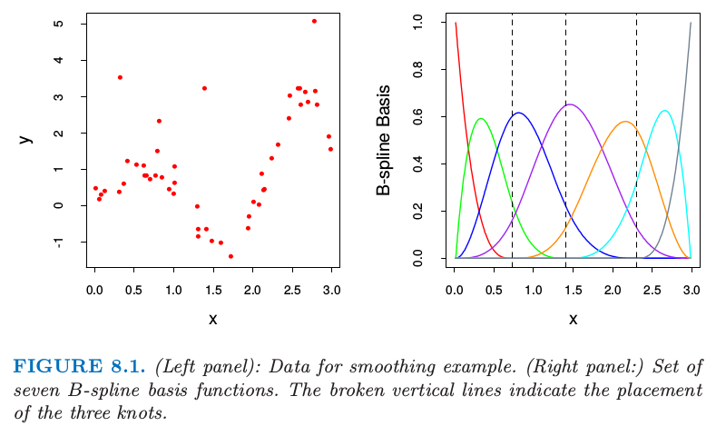

# 8.2 自助法和最大似然法

| 原文   | [The Elements of Statistical Learning](https://web.stanford.edu/~hastie/ElemStatLearn/printings/ESLII_print12.pdf#page=280) |
| ---- | ---------------------------------------- |
| 翻译   | szcf-weiya                               |
| 发布 | 2017-02-08 |
| 更新   | 2019-05-10 23:46:09                               |
| 状态| Done|

## 平滑的例子

自助法提供了一个通过在训练数据中取样来评估不确定性的直接计算的方式．这里我们用一个简单的一维平滑问题来解释自助法，并且展示它与最大似然之间的联系．

> 图 8.1. (左图)：光滑例子的数据．（右图：）7 个 B-样条基函数的集合．垂直虚线为放置树结点的地方．

用 $\mathbf Z=\\{z_1,z_2,\ldots,z_N\\}$ 表示训练数据，其中 $z_i=(x_i,y_i),i=1,2,\ldots,N.$ 这里 $x_i$ 是一维输入，$y_i$ 为输出，可以是连续的也可以是离散的．举个例子，考虑在图 8.1 的左图中展示的 $N=50$ 个数据点．

假设我们决定用三次样条去拟合数据，三个结点放置在 $X$ 的分位数上．这是一个七维线性函数空间．

!!! note "weiya 注"
    含 $K$ 个结点的普通三次样条有 $K+4$ 个基函数，而自然三次样条有 $K$ 个基函数．

举个例子，可以通过 B-样条基函数的线性展开来表示（见 [5.9.2 节](../05-Basis-Expansions-and-Regularization/5.9-Wavelet-Smoothing/index.html)）：
$$
\mu(x)=\sum\limits_{j=1}^7\beta_jh_j(x).\tag{8.1}
$$
这里 $h_j(x),j=1,2,\ldots,7$ 是在图 8.1 右图展示的 7 个函数．我们可以将 $\mu(x)$ 看成是条件期望 $\E(Y\mid X=x)$.

令 $\mathbf H$ 为 $N\times 7$ 的矩阵，且第 $ij$ 个元素为 $h_j(x_i)$．$\beta$ 的一般估计通过最小化训练集上的均方误差得到，由下式给出
$$
\hat \beta=\mathbf{(H^TH)^{-1}H^Ty}\tag{8.2}\label{8.2}
$$

对应的拟合值 $\hat \mu(x)=\sum_{j=1}^7\hat \beta_jh_j(x)$ 显示在图8.2的左上图．

$\hat\beta$ 的协方差矩阵估计为
$$
\widehat{\Var}(\hat\beta)=\mathbf{(H^TH)}^{-1}\hat\sigma^2\tag{8.3}\label{8.3}
$$
其中白噪声方差的估计值由 $\hat\sigma^2=\sum_{i=1}^N(y_i-\hat\mu(x_i))^2/N$ 给出．令 $h(x)^T=(h_1(x),h_2(x),\ldots,h_7(x))$,预测值 $\hat\mu(x)=h(x)^T\hat\beta$ 的标准误差为
$$
\widehat{se}[\hat\mu(x)]=[h(x)^T\mathbf{(H^TH)^{-1}}h(x)]^{\frac{1}{2}}\hat{\sigma}\tag{8.4}\label{8.4}
$$

> 图 8.2. (左上图：)数据点的B-样条光滑．（右上图：）B-样条光滑加减1.96倍的标准误差得到的带状区域．（左下图：）B-样条光滑的自助法重复取样．（右下图：）从自助法的分布计算得到的B-样条和95%的标准误差区域带．

在图 8.2 的右上图中我们画出了 $\hat\mu(x)\pm 1.96\cdot\widehat{se}[\hat\mu(x)]$,因为 1.96 是标准正态分布函数 97.5% 的那个点，这表示 $\mu(x)$ 的近似 $100-2\times 2.5\%=95\%$ 逐点置信域．

这里我们介绍怎么在这个例子中运用自助法．我们从训练集中有放回抽取 $B$ 个大小均为 $N=50$ 的数据集，取样单元为数据对 $z_i=(x_i,y_i)$．对于每一个自助法的数据集 $\mathbf Z^\*$ 我们拟合三次样条 $\hat \mu^\*(x)$；从 10 个这样的自助样本中得到的拟合曲线如图 8.2 的左下图所示．利用 $B=200$ 个自助法样本集，我们可以得到每个 $x$ 处的 95% 置信区间：我们在每个 $x$ 处找到第 $2.5\%\times 200=5$ 大（小）的值．这在图 8.2的右下图画出来了．这些带状与右上角的带状显示，不过在终点处更宽点．

实际上最小二乘估计 \eqref{8.2} 和 \eqref{8.3}，自助法和最大似然法有着很紧密的联系．进一步假设模型误差为高斯分布，
$$
\begin{align}
Y&=\mu(X)+\varepsilon;\; \varepsilon\sim N(0,\sigma^2),\notag\\
\mu(X)&=\sum\limits_{j=1}^7\beta_jh_j(x)\notag
\end{align}
\tag{8.5}
\label{8.5}
$$
上面描述的自助法，通过从训练集中有放回地采样，称作 **非参自助法(nonparametric bootstrap)**．这实际上意味着这个方法是与模型无关的，因为它使用原始数据来得到新的数据集，而不是一个特定的含参数的模型．考虑到自助法的一种变形，称为 **参数自助法 (parametric bootstrap)**，它通过对预测值加上高斯噪声模拟新的响应：
$$
y_i^*=\hat\mu(x_i)+\varepsilon_i^*;\qquad \varepsilon_i^*\sim N(0,\hat\sigma^2);\qquad i=1,2,\ldots,N\tag{8.6}
$$
这一过程重复 $B$ 次，这里 $B=200$．得到的自助法数据集形式为 $(x_1,y_1^\*),\ldots,(x_N,y_N^\*)$，而且我们可以重新对每一个计算 $B$-样条光滑．这种方法得到的置信域实际上等于当自助法样本数趋于无穷时右上图的最小二乘置信域．自助法样本 $\mathbf y^\*$ 的函数估计由 $\hat\mu^\*(x)=h(x)^T\mathbf{(H^TH)^{-1}H^Ty^\*}$ 给出，而且服从分布
$$
\hat\mu^*(x)\sim N(\hat \mu(x), h(x)^T\mathbf{(H^TH)^{-1}}h(x)\hat\sigma^2)\tag{8.7}
$$
注意到该分布的均值是最小二乘估计，标准误差和近似公式 \eqref{8.4} 相同．

## 最大似然推断

结果证明在前面的例子中参数自助法和最小二乘是一致的，因为模型 \eqref{8.5} 有可加的高斯误差．一般地，参数自助法跟最小二乘不一致，但跟最大似然一致，我们现在再检验一下．

首先确定我们观测值的概率密度或者概率质量函数
$$
z_i\sim g_\theta(z)\tag{8.8}
$$
这个表达式中 $\theta$ 表示一个或多个未知的决定 $Z$ 分布的参数．这称为 $Z$ 的参数模型．举个例子，如果 $Z$ 服从均值为 $\mu$、方差为 $\sigma^2$ 的正态分布，则
$$
\theta=(\mu, \sigma^2)\tag{8.9}
$$
和
$$
g_\theta(z)=\frac{1}{\sqrt{2\pi}\sigma}e^{-\frac{1}{2}(z-\mu)^2/\sigma^2}\tag{8.10}
$$
最大似然基于似然函数，似然函数由下式给出
$$
L(\theta;\mathbf Z)=\prod\limits_{i=1}^Ng_\theta(z_i)\tag{8.11}
$$

这也是观测数据在模型 $g_\theta$ 下的概率．这个似然是在忽略正乘数情形下定义的，这里我们取为 1．我们将 $L(\theta;\Z)$ 看成当 $\Z$ 固定时 $\theta$ 的函数．

记 $L(\theta;\mathbf Z)$ 的对数为
$$
\begin{align}
\ell(\theta;\mathbf Z)&=\sum\limits_{i=1}^N\ell(\theta;z_i)\notag\\
&=\sum\limits_{i=1}^N\log g_\theta(z_i)\qquad \tag{8.12}
\end{align}
$$
有时简记为 $\ell(\theta)$. 该表达式称为对数似然，并且每个值 $\ell(\theta;z_i)=\mathbb{log} g_\theta(z_i)$ 称为对数似然组分．最大似然法选择 $\theta=\hat\theta$ 来最大化 $\ell(\theta;\mathbf Z)$.

似然函数可以被用来评估 $\hat\theta$ 的准确性．我们需要更多的定义，**得分函数 (score function)** 由下式给出
$$
\dot\ell(\theta;\mathbf Z)=\sum\limits_{i=1}^N\dot \ell(\theta;z_i)\tag{8.13}
$$
其中 $\ell(\theta;z_i)=\partial \ell(\theta;z_i)/\partial \theta$．假设概率在参数空间的内部取得最大值，则 $\dot\ell(\hat\theta,\mathbf Z)=0$．信息矩阵为
$$
\mathbf I(\theta)=-\sum\limits_{i=1}^N\frac{\partial ^2\ell(\theta;z_i)}{\partial \theta\partial \theta^T}\tag{8.14}
$$
当 $\mathbf I(\theta)$ 在 $\theta=\hat\theta$ 处取值，则通常称为观测信息量．Fisher 信息量（或者期望信息量）是
$$
\mathbf i(\theta)=E_\theta[\mathbf I(\theta)]\tag{8.15}
$$

<!--**weiya**注:
> 设随机变（向）量$X$来自分布族$\cal F=\{p(x;\theta):\theta\in\Theta\}$,其中$p(x;\theta)$为其概率密度函数，$\Theta$为开区间，假设$p(x;\theta)$关于$\theta$可导，且
> $$
> \begin{align}
> 0&=\frac{d}{d\theta}\int_{-\infty}^\infty p(x;\theta)dx\\
> &=\int_{-\infty}^\infty \frac{\partial p(x;\theta)}{\partial \theta}dx\\
> &=\int_{-\infty}^\infty\frac{\partial \mathbb{log}p(x;\theta)}{\partial\theta}p(x;\theta)dx\\
> &=E_\theta[\frac{\partial \mathbb{log}p(X;\theta)}{\partial \theta}]
> \end{align}
> $$
> 从而
> $$
> \begin{align}
> I(\theta):&=\mathrm{Var}_\theta\{\frac{\partial \mathrm{log}p(X;\theta)}{\partial \theta}\}\\
> &=E_\theta[\frac{\partial\mathrm{log}p(x;\theta)}{\partial\theta}]^2\\
> &=\int_{-\infty}^\infty(\frac{\partial \mathrm{log}p(x;\theta)}{\partial \theta})^2p(x;\theta)dx
> \end{align}
> $$
> $I(\theta)$称为$X$或分布族$\cal F$的Fisher Information．
>
> 如果$\frac{\partial^2}{\partial\theta^2}p(x;\theta)$对任意的$\theta\in\Theta$都存在，且积分与求导可以交换，则
> $$
> \begin{align}
> 0&=\frac{d^2}{d\theta^2}\int_{-\infty}^\infty p(x;\theta)dx\\
> &=\int_{-\infty}^{\infty}\frac{\partial}{\partial \theta}[\frac{\partial \mathrm{log }p(x;\theta)}{\partial \theta}p(x;\theta)]dx\\
> &=\int_{-\infty}^\infty[\frac{\partial^2\mathrm{log}p(x;\theta)}{\partial \theta^2}p(x;\theta)]dx+\int_{-\infty}^\infty[\frac{\partial\mathrm{log} p(x;\theta)}{\partial \theta}]^2p(x;\theta)dx
> \end{align}
> $$
> 从而
> $$
> I(\theta)=-E_\theta[\frac{\partial^2\mathrm{log}p(X;\theta)}{\partial \theta^2}]
> $$
>
-->

!!! note "weiya 注"
    设随机变（向）量 $X$ 来自分布族 $\cal F=\\{p(x;\theta):\theta\in\Theta\\}$，其中 $p(x;\theta)$ 为其概率密度函数，$\Theta$为开区间，假设 $p(x;\theta)$ 关于 $\theta$ 可导，且
    $$
    \begin{align*}
    0&=\frac{d}{d\theta}\int_{-\infty}^\infty p(x;\theta)dx\\
    &=\int_{-\infty}^\infty \frac{\partial p(x;\theta)}{\partial \theta}dx\\
    &=\int_{-\infty}^\infty \frac{\partial \log p(x;\theta)}{\partial\theta}p(x;\theta)dx\\
    &=E_\theta\left[\frac{\partial \log p(X;\theta)}{\partial \theta}\right]
    \end{align*}
    $$
    从而
    $$
    \begin{align*}
    I(\theta):&=\Var_\theta\left\{\frac{\partial \log p(X;\theta)}{\partial \theta}\right\}\\
    &=E_\theta\left[\frac{\partial\log p(x;\theta)}{\partial\theta}\right]^2\\
    &=\int_{-\infty}^\infty\left(\frac{\partial \log p(x;\theta)}{\partial \theta}\right)^2p(x;\theta)dx
    \end{align*}
    $$
    $I(\theta)$ 称为 $X$ 或分布族 $\cal F$ 的 Fisher Information．

    如果 $\frac{\partial^2}{\partial\theta^2}p(x;\theta)$ 对任意的 $\theta\in\Theta$ 都存在，且积分与求导可以交换，则
    $$
    \begin{align*}
    0&=\frac{d^2}{d\theta^2}\int_{-\infty}^\infty p(x;\theta)dx\\
    &=\int_{-\infty}^{\infty}\frac{\partial}{\partial \theta}\left[\frac{\partial \log p(x;\theta)}{\partial \theta}p(x;\theta)\right]dx\\
    &=\int_{-\infty}^\infty\left[\frac{\partial^2\log p(x;\theta)}{\partial \theta^2}p(x;\theta)\right]dx + \int_{-\infty}^\infty\left[\frac{\partial\log p(x;\theta)}{\partial \theta}\right]^2p(x;\theta)dx
    \end{align*}
    $$
    从而
    $$
    I(\theta)=-E_\theta\left[\frac{\partial^2\log p(X;\theta)}{\partial \theta^2}\right]\,.
    $$

最后，记 $\theta$ 的真值为 $\theta_0$.

一个标准的结果表明最大似然估计量的样本分布渐近服从正态分布
$$
\hat\theta\longrightarrow N(\theta_0,\mathbf i(\theta_0)^{-1})\tag{8.16}
$$
当 $N\longrightarrow \infty$．这表明 $\hat\theta$ 的样本分布可能近似服从
$$
N(\hat\theta,\mathbf i(\hat\theta)^{-1})\text{   or   }N(\hat{\theta},\mathbf I(\hat\theta)^{-1})\tag{8.17}\label{8.17}
$$
其中，$\hat\theta$ 表示由观测数据得到的最大似然估计．

$\hat\theta_j$ 的标准误差对应的估计由下式给出
$$
\sqrt{\mathbf i(\hat\theta)_{jj}^{-1}}\text{ and }\sqrt{\mathbf I(\hat\theta)^{-1}_{jj}}\tag{8.18}
$$
$\theta_j$ 的置信点可以通过 \eqref{8.17} 的任意一个近似得到．这样的置信点分别有如下形式
$$
\hat\theta_j-z^{(1-\alpha)}\cdot\sqrt{\mathbf i(\hat\theta)_{jj}^{-1}}\text{ or }\hat\theta_j-z^{(1-\alpha)}\cdot\sqrt{\mathbf I(\hat\theta)_{jj}^{-1}}
$$
其中 $z^{(1-\alpha)}$ 为标准正态分布的 $1-\alpha$ 分位数．更精确的置信区间可以由似然函数得到，通过利用卡方分布的近似
$$
2[\ell(\hat\theta)-\ell(\theta_0)]\sim \chi_p^2\tag{8.19}
$$
其中 $p$ 为 $\theta$ 组分的个数．$1-2\alpha$ 置信区间是所有满足 $2[\ell(\hat\theta)-\ell(\theta_0)]\le {\chi_p^2}^{(1-2\alpha)}$ 的集合，其中，${\chi_p^2}^{(1-2\alpha)}$ 是自由度为 $p$ 的卡方分布的 $1-2\alpha$ 分位数．

回到光滑化的例子看看最大似然法的结果．参数为 $\theta=(\beta,\sigma^2)$．对数似然为
$$
\ell(\theta)=-\frac{N}{2}\mathbb{log}\sigma^22\pi-\frac{1}{2\sigma^2}\sum\limits_{i=1}^N(y_i-h(x_i)^T\beta)^2\tag{8.20}
$$
最大似然估计由 $\partial \ell/\partial \beta=0$ 和 $\partial \ell/\partial \sigma^2$ 给出
$$
\begin{align*}
\hat\beta&=\mathbf{(H^TH)^{-1}H^Ty}\\
\hat\sigma&=\frac{1}{N}\sum{(y_i-\hat\mu(x_i))^2}
\end{align*}
\tag{8.21}
$$
这与 \eqref{8.2} 给出的一般估计和 \eqref{8.3} 是一样的．

对于 $\theta=(\beta,\sigma^2)$ 的信息矩阵是分块对角，对应于 $\beta$ 的对角元为
$$
\mathbf I(\beta)=\mathbf{(H^TH)}/\sigma^2\tag{8.22}
$$
因此估计的方差 $\mathbf{(H^TH)}^{-1}\hat\sigma^2$ 与最小二乘一致．

## 自助法和最大似然法 

本质上自助法是非参最大似然或者参数最大似然法的计算机实现．

!!! note "weiya 注：nonparametric MLE"
    [Theory of Point Estimation (2nd Eds) p519](https://www.ctanujit.org/uploads/2/5/3/9/25393293/_theory_of_point_estimation.pdf) 中也写道：

    > The bootstrap can be thought of as a “nonparametric” MLE.

与最大似然法相比自助法的好处是允许我们在没有公式的情况下计算标准误差和其他一些量的最大似然估计．

在我们的例子中，假设我们通过对定义了 B 样条的结点的数目和位置进行交叉验证来自适应地选择，而不是事先固定住．记 $\lambda$ 为结点和它们位置的集合．则标准误差和置信域说明了 $\lambda$ 的自适应选择，但是没有分析的方法可以实现．有了自助法，我们通过对每个自助法样本进行自适应选择来计算B-样条光滑．最终曲线的分位数既捕捉目标里面的噪声变化以及 $\hat\lambda$ 的变化．在这个例子中置信域（没有显示出来）看起来与固定 $\lambda$ 后的置信域没有太大不同．但是在其他问题里面，当使用更多的自适应，可以得到更多重要的结果．
