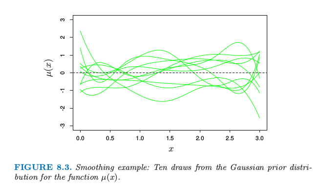
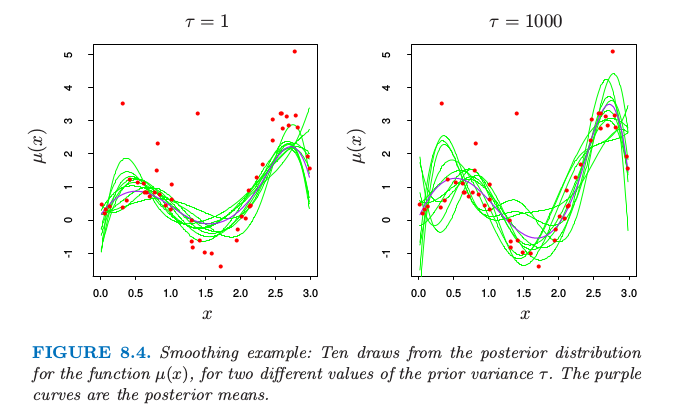

# 8.3 贝叶斯方法

| 原文   | [The Elements of Statistical Learning](https://web.stanford.edu/~hastie/ElemStatLearn/printings/ESLII_print12.pdf#page=286) |
| ---- | ---------------------------------------- |
| 翻译   | szcf-weiya                               |
| 发布 | 2017-02-08 |
| 更新   | 2019-07-28 10:07:58                               |
| 状态 | Done|

!!! note "更新笔记"
    @2017.09.13当时翻译的时候对贝叶斯了解也不深，公式那一块压根就没太看懂．现在更新的时候，才发现其实挺好懂的．大概是之前看了Peter D. Hoff的[《A First Course in Bayesian Statistical Methods》](../references/A_First_Course_in_Bayesian_Statistical_Methods.pdf)中部分的章节，我觉得Peter的这本书挺好的，很适合入门！！

贝叶斯推断中，我们需要确定一个在给定参数时数据的采样模型 $\Pr(\mathbf Z;\theta) $(密度函数或者概率质量函数)，以及反映我们在得到数据之前对于 $\theta$ 认知的先验分布 $\Pr(\theta)$．然后计算后验分布
$$
\Pr(\theta\mid\mathbf Z)=\frac{\Pr(\mathbf Z\mid\theta)\cdot \Pr(\theta)}{\int \Pr(\mathbf Z\mid \theta)\cdot \Pr(\theta)d\theta}\tag{8.23}
$$

它表示当我们知道数据后更新对 $\theta$ 的认知．为了理解这一后验分布，可以从中抽取样本或者通过计算均值或众数来描述它．贝叶斯方法与一般推断方法的不同之处在于，用先验分布来表达知道数据之前的这种不确定性，而且在知道数据之后允许不确定性继续存在，将它表示成后验分布．

后验分布也提供了预测未来观测 $z^{new}$ 值的基础，通过 **预测分布 (predictive distribution)** 实现：
$$
\Pr(z^{new}\mid \mathbf  Z)=\int \Pr(z^{new}\mid \theta)\cdot \Pr(\theta\mid \mathbf Z)d\theta\tag{8.24}\label{8.24}
$$
而最大似然方法会使用在最大概率估计那个点的密度 $\Pr(z^{new}\mid \hat\theta)$ 来预测未来的数据．不同于 \eqref{8.24} 的预测分布，它不能说明估计 $\theta$ 的不确定性．

让我们在光滑化例子中采用贝叶斯方法．首先从由 \eqref{8.5} 式给出的参数模型开始，然后假设 $\sigma^2$ 是已知的．

!!! note "weiya 注：Recall"
    $$
    \begin{align}
    Y&=\mu(X)+\varepsilon;\; \varepsilon\sim N(0,\sigma^2),\notag\\
    \mu(X)&=\sum\limits_{j=1}^7\beta_jh_j(x)\notag
    \end{align}
    \tag{8.5}\label{8.5}
    $$

我们假设观测的特征 $x_1,x_2,\ldots,x_N$ 是固定的，因此数据的随机性仅仅来源于 $y$ 与均值 $\mu(x)$ 间的偏差．

第二步我们需要先验分布．函数的分布是相当复杂的：一种方式是使用先验高斯过程，其中我们指定任何两个函数值 $\mu(x)$ 和 $\mu(x')$ 的先验协方差．（Wahba,1990[^1]; Neal, 1996[^2]）

这里我们采取一个简单的方法：考虑 $\mu(x)$ 的有限 $B$ 样条基，并且给出系数 $\beta$ 的先验分布，而且这隐式地定义了 $\mu(x)$ 的先验分布．我们选取中心化的先验高斯分布
$$
\beta\sim N(0,\tau\mathbf \Sigma)\tag{8.25}\label{8.25}
$$
先验协方差矩阵 $\mathbf \Sigma$ 和方差 $\tau$ 将在下面讨论．$\mu(x)$ 隐式的先验过程因此是高斯的，其中协方差核为
$$
\begin{align}
K(x,x')&= \cov[\mu(x),\mu(x')]\notag\\
&=\tau\cdot h(x)^T\mathbf\Sigma h(x').\tag{8.26}
\end{align}
$$
$\beta$ 的后验分布也是高斯的，均值和方差分别为
$$
\begin{align}
\E(\beta\mid \mathbf Z)&=(\mathbf{H^TH}+\frac{\sigma^2}{\tau}\mathbf\Sigma^{-1})^{-1}\mathbf{H^Ty}\notag\\
\Cov(\beta\mid\mathbf Z)&=(\mathbf{H^TH}+\frac{\sigma^2}{\tau}\mathbf \Sigma^{-1})^{-1}\sigma^2\notag
\end{align}
\tag{8.27}\label{8.27}
$$
后验 $\mu(x)$ 对应的相应值为
$$
\begin{align}
\E(\mu(x)\mid\mathbf Z)&=h(x)^T(\mathbf{H^TH}+\frac{\sigma^2}{\tau}\mathbf\Sigma^{-1})^{-1}\mathbf{H^Ty}\notag\\
\cov[\mu(x),\mu(x')\mid\mathbf Z]&=h(x)^T(\mathbf{H^TH}+\frac{\sigma^2}{\tau}\mathbf\Sigma^{-1})^{-1}h(x')\sigma^2\notag
\end{align}
\tag{8.28}
$$
我们应该怎样选取先验协方差矩阵 $\mathbf \Sigma$ 呢？在某些设定下先验可以从对参数的主观感受来选择．这里我们想说函数 $\mu(x)$ 应该为光滑的，而且已经通过将 $\mu$ 表示成低纬度的 $B$-样条的基来保证．因此我们可以选取先验协方差阵为单位阵 $\mathbf {\Sigma=I}$．当基函数的个数很多，这或许不是充分的，通过对 $\mathbf\Sigma$ 上加限制条件来保证更多的光滑；这恰巧是光滑样条的情形（[5.8.1 节](../05-Basis-Expansions-and-Regularization/5.8-Regularization-and-Reproducing-Kernel-Hibert-Spaces/index.html)）．

> 图 8.3. 光滑例子：十条函数 $\mu(x)$ 高斯先验分布的曲线．

图 8.3 显示了 10 个 $\mu(x)$ 对应的先验分布．为了产生函数 $\mu(x)$ 后验的值，我们从后验 \eqref{8.27} 式得到 $\beta'$，给出对应后验的值 $\mu'(x)=\sum_1^7\beta_j'h_j(x)$．十条这样的后验曲线如图 8.4 所示．取了两个不同的先验方差 $\tau$ 的值，1 和 1000．注意到右图与图 8.2 的左下图的相似度．这种相似性不是偶然的．当 $\tau\longrightarrow \infty$，后验分布 \eqref{8.27} 和自助法分布 \eqref{8.7} 相同．

!!! note "weiya 注：Recall"
    $$
    \hat\mu^*(x)\sim N(\hat \mu(x), h(x)^T\mathbf{(H^TH)^{-1}}h(x)\hat\sigma^2)\tag{8.7}\label{8.7}
    $$

另一方面，对于$\tau=1$，图 8.4 左图的后验曲线 $\mu(x)$ 比自助法曲线更加光滑，因为我们在光滑性上面强加了更多先验权重．

> 图 8.4. 光滑例子：对于两个不同的先验方差 $\tau$，十条函数 $\mu(x)$ 后验分布的曲线．紫色的曲线是后验均值．

当 $\tau\rightarrow \infty$ 时的分布 \eqref{8.25} 称为 $\theta$ 的 **无信息先验 (noninformative prior)**，在高斯模型中，极大似然和参数自助法趋向于与对自由参数使用了无信息先验的贝叶斯保持一致．因为在常值先验情况下，后验分布与似然函数成比例，所以这些方法趋向于一致．这种对应也可以推广到非参的情形．其中非参自助法近似于一个无信息先验的贝叶斯分析；[8.4 节](8.4-Relationship-Between-the-Bootstrap-and-Bayesian-Inference/index.html)将详细介绍．

然而，我们已经做了一些从贝叶斯观点来看不是很恰当的事情．我们已经用了 $\sigma^2$ 的无信息（常值）先验，而且在后验中换成了最大似然估计 $\hat\sigma^2$．一个更加标准的贝叶斯分析也会在 $\sigma$ 上加先验（一般地，$g(\sigma)\propto 1/\sigma$）,计算 $\mu(x)$ 和 $\sigma$ 的联合后验分布，然后把 $\sigma$ 积分出来，而不是仅仅提取后验分布的最大值（“MAP (maximum of the posterior distribution)”估计）

[^1]: Wahba, G. (1990). Spline Models for Observational Data, SIAM, Philadelphia.
[^2]: Neal, R. (1996). Bayesian Learning for Neural Networks, Springer, New York.
