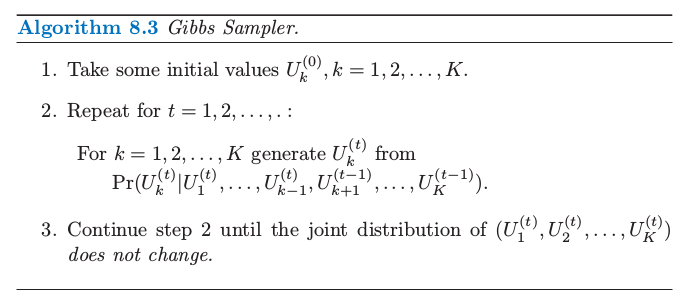
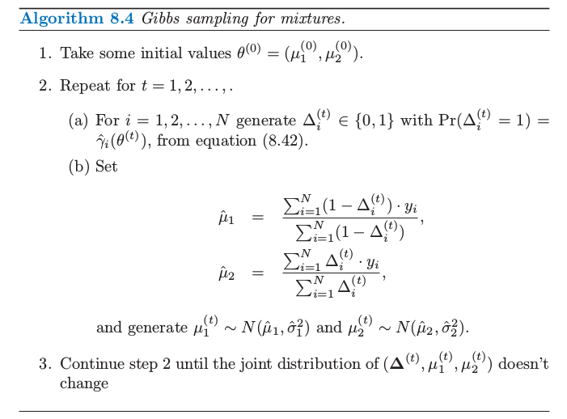

# 8.6 从后验分布采样的 MCMC

| 原文   | [The Elements of Statistical Learning](https://web.stanford.edu/~hastie/ElemStatLearn/printings/ESLII_print12.pdf#page=298) |
| ---- | ---------------------------------------- |
| 翻译   | szcf-weiya                               |
| 发布 | 2017-02-08 |
|更新|2017-12-27, 2018-07-17|
|状态|Done|

!!! note "更新笔记"
    @2017-12-27 若 $r\sim U[0,1]$，则 $\Pr(r < c)=c$，其中 $c$ 为常值．

在定义了一个贝叶斯模型后，有人便想要从得到的后验分布中采样来对参数进行推断．除了简单的模型，这通常是一个很困难的计算问题．

!!! note "weiya 注"
    在贝叶斯分析中，计算后验分布时经常涉及复杂的积分运算，比如
    $$
    \Pr(\theta\mid x)=\frac{\Pr(x\mid \theta)\Pr(\theta)}{\Pr(x)}
    $$
    而参数推断的目标是计算后验分布 $\Pr(\theta\mid x)$，困难在于 $\Pr(x)$, 因为
    $$
    \Pr(x) = \int \Pr(x, \theta)d\theta
    $$
    有人会想到用 Monte Carlo 来近似上述的积分值（关于应用 Monte Carlo 进行积分近似，可以参见 [The Applications of Monte Carlo](https://stats.hohoweiya.xyz//montecarlo/2017/09/07/The-Need-of-Monte-Carlo/)），进而采用下式进行近似
    $$
    \hat \Pr(x) = \int d\theta\cdot \frac{1}{m}\sum\limits_{i=1}^m\Pr(x, \theta^{(m)})
    $$
    但一般很难从联合分布中采样出样本来。幸好可以通过构造一个 Markov chain 来进行 Monte Carlo 近似，称为 MCMC．在 [MCMC_example.ipynb](http://nbviewer.jupyter.org/github/szcf-weiya/MonteCarlo/blob/master/MCMC/MCMC_example.ipynb) 里面用一个例子说明了怎么用 MCMC 得到参数的后验分布．
    更多 Monte Carlo 方法的细节可以参见 [Notes: Monte-Carlo](https://mc.hohoweiya.xyz/).

这节我们讨论用于后验采样的 **马尔科夫蒙特卡洛法 (Markov chain Monte Carlo)**．我们将要看到吉布斯采样（一个 MCMC 过程）与 EM 算法非常相关：主要的区别在于前者从条件分布中采样而非对它们最大化．

首先考虑下面的抽象问题．我们有随机变量 $U_1,U_2,\ldots,U_K$，而且希望从他们的联合分布中采样．假设这很难实现，但是从条件分布 $\Pr(U_j\mid U_1,U_2,\ldots,U_{j-1},U_{j+1},\ldots,U_K),j=1,\ldots,K$ 中模拟是非常简单的．吉布斯采样过程也可以从他们的每个分布来模拟，而且当这个过程稳定下来，吉布斯采样得到了需要的联合分布中的一个样本．这个过程表现在算法 8.3 中．

!!! note "weiya 注"
    实际操作中，通过均匀分布来实现，因为对于 $r\sim U[0,1]$，我们有 $\Pr(r < c)=c$．所以只需要知道边缘概率，便可以进行采样．

在正规化条件下可以证明这一过程最终稳定，得到的随机变量实际上是从 $U_1,U_2,\ldots,U_K$ 联合分布中取的一个样本．尽管对于不同的 $t$，样本 $(U_1^{(t)},U_2^{(t)},\ldots,U_K^{(t)})$ 显然不独立．更正式地，吉布斯采样得到一个马尔科夫链，该马尔科夫链的平稳分布是真正的联合分布，因此称之为“马尔科夫链蒙特卡洛法”．在这个过程下真实的联合分布是平稳的并不奇怪，因为连续的步骤使得 $U_k$ 的边缘分布不变．

注意到我们不需要知道条件密度的显式形式，但是仅仅需要能够从中取样．经过这一过程达到平稳，变量的任意子集的边缘密度可以通过应用到样本值上的密度估计来近似．然而，如果条件密度 $\Pr(U_k\mid U_\ell,\ell\neq k)$ 的显式形式是知道的，则 $U_k$ 的边缘密度的一个良好估计可以从下式得到（[练习 8.3](https://github.com/szcf-weiya/ESL-CN/issues/145)）：
$$
\widehat{\Pr}_{U_k}(u)=\frac{1}{(M-m+1)}\sum\limits_{t=m}^M\Pr(u\mid U_\ell^{(t)},\ell\neq k)\tag{8.50}
$$
这里我们对序列的 $M-m+1$ 个成员平均，使得达到平稳之前允许初始的“**老化 (burn-in)**”期．

!!! info "weiya 注："
    已解决，详见 [Issue 145: Ex. 8.3](https://github.com/szcf-weiya/ESL-CN/issues/145)．

现在回到贝叶斯推断，我们的目标是在给定数据 $\mathbf Z$ 情况下，从参数的联合后验分布中采样．如果从每个参数的条件分布（在给定其他参数和 $\mathbf Z$）中取样很简单，则吉布斯取样会很有帮助．接下来详细讨论一个高斯分布混合问题的例子．

在指数族模型中，从后验的吉布斯采样与 EM 算法有着紧密的联系．关键在于将 EM 过程的潜在数据 $\mathbf Z^m$ 看成是吉布斯采样的另一个参数．为了让高斯混合问题中这一点更明确，我们取参数为 $(\theta,\mathbf Z^m)$．为了简便，我们固定方差 $\sigma_1^2,\sigma^2_2$ 以及最大似然时的混合比例 $\pi$，使得 $\theta$ 中未知的参数仅仅是均值 $\mu_1$ 和 $\mu_2$．此混合问题的吉布斯采样在算法 8.4 中给出．我们看到第 2(a) 和 2(b) 步与 EM 过程中的 E 和 M 一样，除了这里我们是取样而非最大化．在第 2(a) 步，不是计算最大似然的 **责任 (responsibilities)** $\gamma_i=\E(\Delta_i\mid \theta,\mathbf Z)$，吉布斯采样过程从 $\Pr(\Delta_i\mid \theta,\mathbf Z)$ 的分布中模拟潜在数据 $\Delta_i$．在第 2(b) 步，不是计算后验  $\Pr(\mu_1,\mu_2,\Delta\mid \mathbf Z)$ 的最大值，而是从条件分布 $\Pr(\mu_1,\mu_2\mid \Delta,\mathbf Z)$ 中模拟（采样）．

图 8.8 显示了吉布斯抽样的 200 个迭代，左图显示了均值参数 $\mu_1$（小）和 $\mu_2$（大），右图是类别 2 的观测的占比 $\sum_i\Delta_i/N$．在每个情形下画出了在最大似然估计值 $\hat\mu_1,\hat\mu_2$ 和 $\sum_i\hat\gamma_i/N$ 的虚线．值似乎很快就稳定下来，而且在最大似然值附近均匀地分布．

!!! note "weiya 注："
    吉布斯采样中的条件分布可以直接根据联合分布
    $$
	L(\theta,\mathbf{Z,\Delta}) = \prod\limits_{i=1}^n[(1-\pi)\phi_{\theta_1}(y_i)]^{1-\Delta_i}[\pi\phi_{\theta_2}(y_i)]^{\Delta_i}.
	$$
    快速写出来。

> 图 8.8. 混合的例子．（左图：）从吉布斯采样中得到的两个均值参数的 200 个值；在最大似然估计的 $\hat\mu_1,\hat\mu_2$ 画了水平直线．（右图：）对于 200 次吉布斯采样迭代中的每个迭代，$\Delta_i=1$ 的占比；在 $\sum_i\hat\gamma_i/N$ 画了水平直线．

上面的混合模型被简化了，是为了清楚地看到吉布斯采样和 EM 算法的关联．更实际点，可以在方差 $\sigma^2_1,\sigma^2_2$ 和混合比例上添加先验分布，而且包含从它们在其他参数条件下的后验分布中进行独立的吉布斯采样．也可以对均值参数结合恰当的（有信息的）先验．这些先验决不能选得不合适，因为这会导致退化的后验（所有的混合系数都在一个组分上）．

吉布斯采样是最近发展的一系列从后验分布中采样过程中的一个方法．它运用某个参数在给定其它参数情况下的条件采样，然后当问题的结构使得采样很容易进行时，这个方法是非常有用的．其它的方法不要求这样的结构，举个例子如 Metropolis–Hastings 算法．这些和其它计算的贝叶斯方法已经应用到复杂的学习算法中，比如高斯过程模型和神经网络．细节可以在本章后面的文献笔记中的参考文献中找到．
