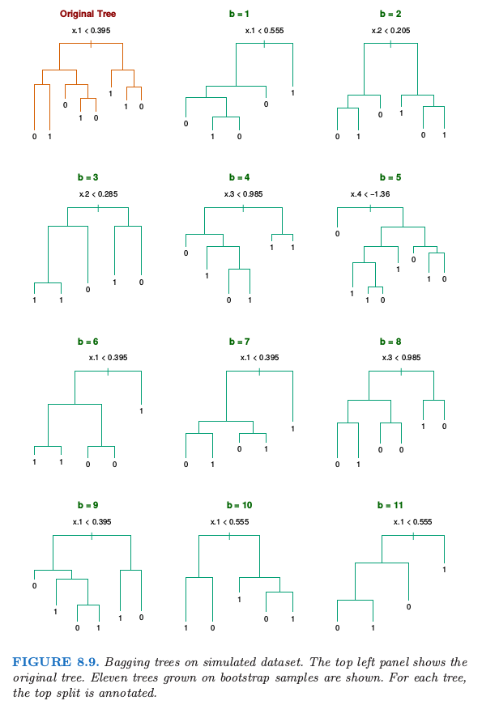
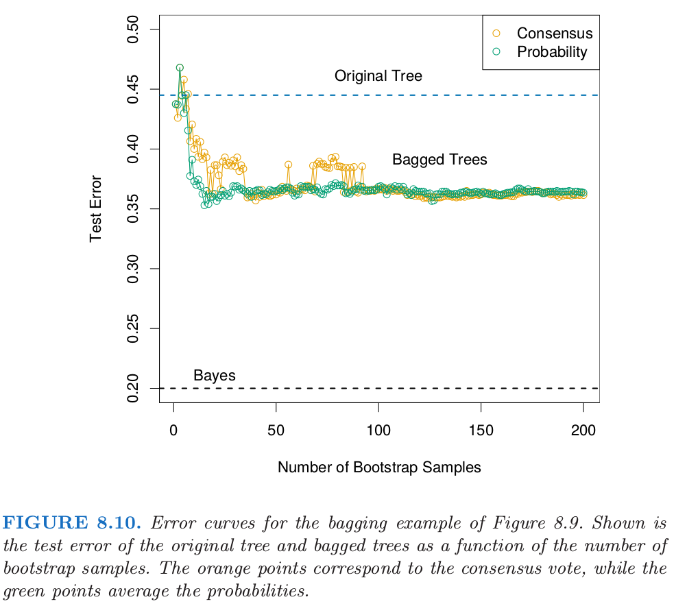
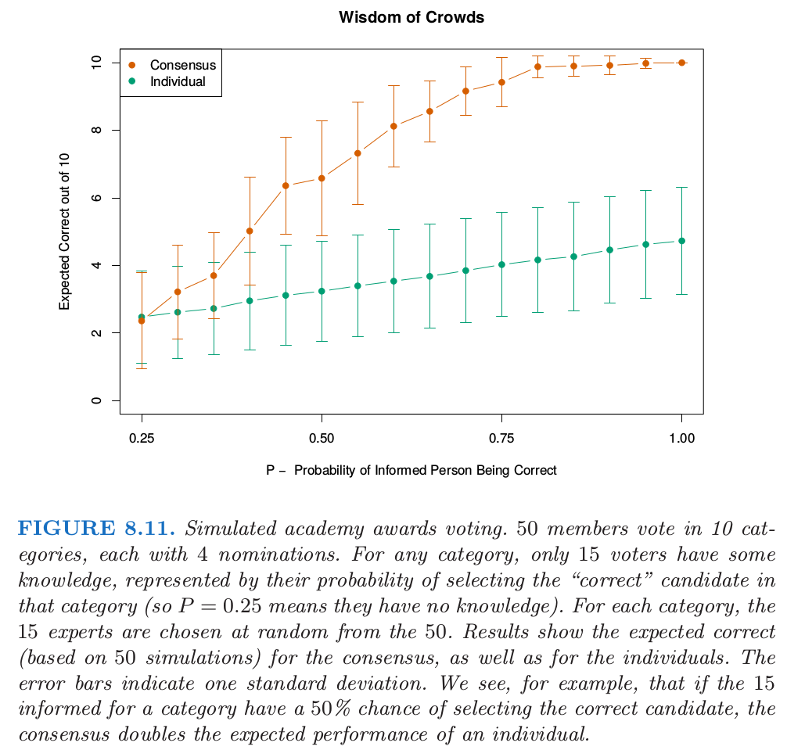
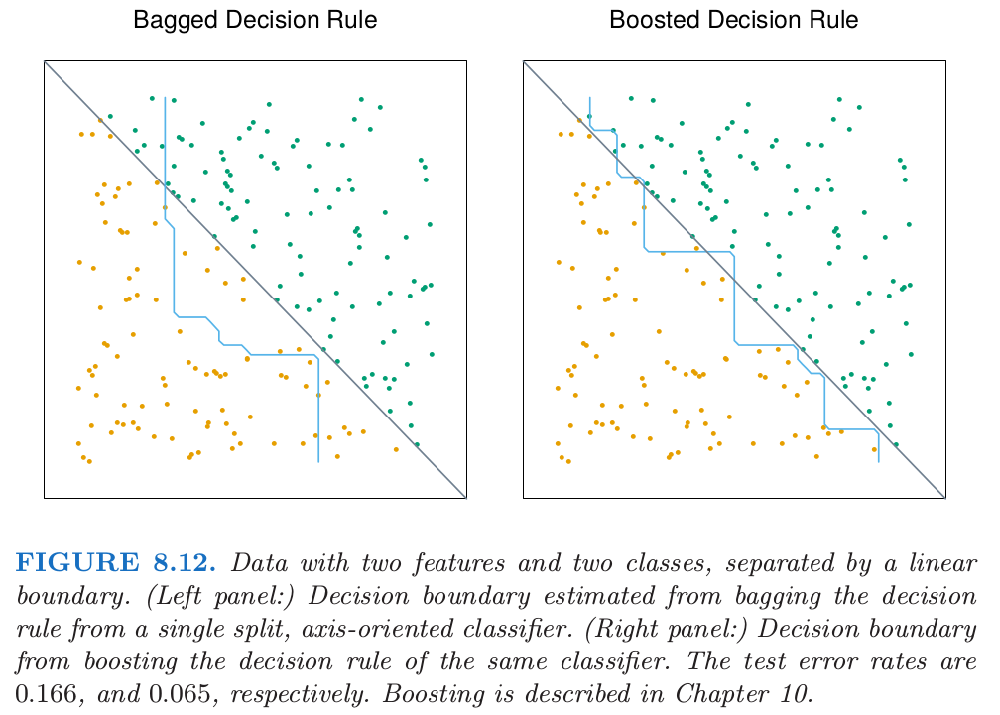

# 8.7 Bagging

| 原文   | [The Elements of Statistical Learning](https://web.stanford.edu/~hastie/ElemStatLearn/printings/ESLII_print12.pdf#page=301) |
| ---- | ---------------------------------------- |
| 翻译   | szcf-weiya                               |
| 发布 | 2017-02-08 |
| 更新 | 2020-02-22 23:10:28|
|状态|Done| 

!!! note "更新笔记"
    @2017-12-31 本节中提到了随机森林和 boosting 方式．ISLR 在讲基于树的方法时是将这两种方式与 bagging 一起介绍的，有个读书笔记及有关 R 代码参见[这里](https://stats.hohoweiya.xyz/rmd/Tree-Based%20Methods.html)．简单来说，bagging 和随机森林都是针对 bootstrap 样本，且前者可以看成后者的特殊形式；而 boosting 是针对残差样本．

前面我们已经介绍了 **自助法 (bootstrap)** 可用来评估参数估计或预测的正确性．这里我们展示怎么使用自助法去改善估计或者预测本身．在 [8.4 节](8.4-Relationship-Between-the-Bootstrap-and-Bayesian-Inference/index.html)我们研究了自助法和贝叶斯方法之间的关系，而且发现自助法均值近似于一个后验平均．Bagging 进一步探索这之间的联系．

首先考虑一个回归问题．假设我们根据我们的训练数据 $\mathbf Z=\\{(x_1,y_1),(x_2,y_2),\ldots,(x_N,y_N)\\}$ 拟合一个模型，得到在输入 $x$ 处的预测值 $\hat f(x)$．**自助法整合 (Bootstrap aggregation)**或者 bagging 在自助法样本的集合中平均了这个预测值，因此降低了它的方差．对于每个自助法样本 $\mathbf Z^{\*b},b=1,2,\ldots,B$，拟合我们的模型得到预测值 $\hat f^{\*b}(x)$．bagging 估计定义为

$$
\hat f_{bag}(x)=\frac{1}{B}\sum\limits_{b=1}^B\hat f^{*b}(x)\tag{8.51}\label{8.51}
$$

记 $\hat{\cal P}$ 为在每个数据点 $(x_i,y_i)$ 上赋予相同概率 $1/N$ 的经验分布．实际上，“真正”的 bagging 估计由 $\E_{\hat{\cal P}}\hat f^\*(x)$ 定义，其中 $\mathbf Z^\*=\\{(x_1^\*,y_1^\*),(x_2^\*,y_2^\*),\ldots,(x_N^\*,y_N^\*)\\}$，并且每个 $(x_i^\*,y_i^\*)\in \hat{\cal P}$．当$B\rightarrow \infty$，表达式 \eqref{8.51} 是真实 bagging 估计的蒙特卡洛估计．

bagged 估计 \eqref{8.51} 与原始估计 $\hat f(x)$ 仅仅当后者是数据的非线性或者数据的自适应函数才有区别．举个例子，为了 **打包 (bag)** [8.2.1 节](8.2-The-Bootstrap-and-Maximum-Likelihood-Methods/index.html)的 B 样条光滑器，我们对图 8.2 的左下图中的曲线在每个 $x$ 处进行平均．

!!! note "Recall"
    

!!! note "Recall"
    $$
    y_i^*=\hat\mu(x_i)+\varepsilon_i^*;\qquad \varepsilon_i^*\sim N(0,\hat\sigma^2);\qquad i=1,2,\ldots,N\tag{8.6}\label{8.6}
    $$

如果我们固定输入则 $B$ 样条光滑器关于数据是线性的，因此如果我们采用式 \eqref{8.6} 给出的参数自助法，则当 $B\rightarrow \infty$ 时，$\hat f_{bag}(x)\rightarrow \hat f(x)$（[练习 8.4](https://github.com/szcf-weiya/ESL-CN/issues/146)）．因此 bagging 刚好重现了图 8.2 的左上图中的原光滑曲线．如果我们使用非参自助法来 bagging 结论也近似正确．

!!! info "weiya 注：Ex. 8.4"
    已解决，详见 [Issue 146: Ex. 8.4](https://github.com/szcf-weiya/ESL-CN/issues/146). 

一个更有趣的例子是回归树，其中 $\hat f(x)$ 记为在每个输入向量 $x$ 处树的预测（回归树在第九章中讨论）．每个自助法树跟比原始特征相比，涉及不同的特征，而且可能会有不同的终止结点．bagged 估计是在 $x$ 处这 $B$ 棵树的平均预测值．

现在假设我们的树产生一个用于 $K$ 个类别响应变量的分类器 $\hat G(x)$．这里考虑一个潜在的指示向量函数 $\hat f(x)$（$K$ 维向量，其中有一个 $1$ 和 $K-1$ 个 $0$）使得 $\hat G(x)=\mathrm{arg \; max}\_k\;\hat f(x)$ 是很有用的．则袋装估计 $\hat f_{bag}(x)$ \eqref{8.51} 是一个 $K$ 维向量 $[p_1(x),p_2(x),\ldots,p_K(x)]$，其中 $p_k(x)$ 等于在 $x$ 处预测为类别 $k$ 的树的比例．bagged 分类器从 $B$ 棵树中选择得“票”最多的类别，也就是 $\hat G_{bag}(x)=\mathrm{arg \; max}\_k\; \hat f_{bag}(x)$．

经常我们需要在 $x$ 的估计类别概率，而不是分类自身．将投票比例 $p_k(x)$ 看成是这些概率的估计是很吸引人的．一个简单的二分类的例子显示了它们在这种情形下的失败．假设在 $x$ 处类别 $1$ 的真实概率为 $0.75$，而且每个 bagging 分类器准确地预测了 $1$．于是 $p_1(x)=1$，这是不正确的．然而，对于许多分类器 $\hat G(x)$，已经有一个估计了 $x$ 处类别概率的潜在函数 $\hat f(x)$（对于树而言，类别的比例即为末结点处的类别比例）．另一种 bagging 策略是对这些结点处的比例取平均而不是对得分指示向量取平均．这个过程不仅仅改善了类别概率的估计，而且趋向于产生低方差的 bagging 分类器，特别是对于小 $B$（见下一个例子的图 8.10）

<!--
!!! note "weiya 注："
    本书很多部分都有这样处理：
    如[混合模型的密度估计和分类](https://esl.hohoweiya.xyz/06%20Kernel%20Smoothing%20Methods/6.8-Mixture-Models-for-Density-Estimation-and-Classification/index.html)中
    $$
    \hat\gamma_{im}=\frac{\hat\alpha_m\phi(x_i;\hat\mu_m,\hat\Sigma_m)}{\sum_{k=1}^M\hat\alpha_k\phi(x_i;\hat\mu_k,\hat\Sigma_k)}\tag{6.33}
    $$
    又如[对角线性判别分析和最近收缩重心](https://esl.hohoweiya.xyz/18%20High-Dimensional%20Problems/18.2%20Diagonal%20Linear%20Discriminant%20Analysis%20and%20Nearest%20Shrunken%20Centroids/index.html)中
    $$
    \hat p_k(x^*)=\frac{e^{\frac{1}{2}\delta_k(x^*)}}{\sum_{\ell=1}^Ke^{\frac{1}{2}\delta_\ell(x^*)}}\tag{18.8}
    $$
-->

## 例子： 树与模拟数据

我们生成规模为 $N=30$，两个类别，以及有 $p=5$ 个特征的样本，每个样本服从标准高斯分布，并且成对相关系数为 $0.95$．根据 $\Pr(Y=1\mid x_1\le 0.5)=0.2$，$\Pr(Y=1\mid x_1> 0.5)=0.8$ 生成响应变量 $Y$．贝叶斯误差率为 $0.2$．同时从相同的总体中生成大小为 $2000$ 的测试集合．我们对训练样本和 $200$ 个自助样本拟合分类树（分类树在第九章中有描述）．不使用剪枝技巧．图 8.9 显示了原始的树和 $11$ 个自助树．

注意到这些树是怎样完全不同的，既有不同的分割特征，也有不同的截断点．原始分类树和 bagged 树的测试误差展现在图 8.10．

在这个例子中，由于预测变量间的相关性，树有很高的方差．Bagging 成功光滑掉方差，也因此降低了测试误差．

Bagging 可以显著降低不稳定的过程的方差得到更好的预测，比如说树．一个简单的论据说明了为什么 bagging 在平方误差损失下有效果，简单来说是因为它保持偏差不变降低了方差．

假设我们的训练样本 $(x_i, y_i),i=1,\ldots,N$ 是从分布 $\cal P$ 中独立采样的，并且考虑理想的整合估计器 $f_{ag}(x)=\E_{\cal P}\hat f^\* (x)$．这里 $x$ 是固定的，并且自助数据集 $\mathbf Z^\*$ 包含从 $\cal P$ 中采样的的观测 $x_i^\*, y_i^*, i=1,2,\ldots, N$．注意到 $f_{ag}(x)$ 是从实际总体 $\cal P$ 中而不是数据中采样得到一个 bagging 估计．实际中这并不是我们可以用的估计，但是用于分析这是很方便的．我们可以写出如下关系

$$
\begin{align}
\E_{\cal P}[Y-\hat f^*(x)]^2 &= \E_{\cal P}[Y-f_{ag}(x)+f_{ag}(x)-\hat f^*(x)]^2\notag\\
& = \E_{\cal P}[Y-f_{ag}(x)]^2+\E_{\cal P}[\hat f^*(x) - f_{ag}(x)]^2\notag\\
& \ge \E_{\cal P}[Y-f_{ag}(x)]^2\tag{8.52}
\end{align}
$$

右侧额外的误差来自 $\hat f^\*(x)$ 在 $f_{ag}(x)$ 附近的方差．因此真实的总体整合不会增加 **均方误差 (mean squared error)**．这表明从训练样本中采样的 bagging 将会经常降低均方误差．

上面的论据对于 0-1 损失下的分类并不能保证，因为偏差和方差的不可加性．在那种情形下，对一个较好的分类器进行 bagging 会变得更好，但是 bagging 一个差的分类器会变得更差．举个简单采用随机化规则的例子．假设对于所有的 $x$ 我们都有 $Y=1$，并且分类器 $\hat G(x)$ 以概率 $0.4$ 预测 $Y=1$（对所有 $x$），并且以 $0.6$ 的概率预测$ Y=0$（对所有 $x$）．则 $\hat G(x)$ 的误分类率为 $0.6$，但是 bagged 分类器的误差率为 $1.0$．

!!! question "weiya 注："
    所以这个例子失败的原因还是因为对 voting label 进行 bagging？如果像上文所说的对 class probability 进行 bagging，是不是应该就没有这个问题了？

对于分类，我们可以就一个独立 **弱学习器 (weak learners)** 的共识来理解 bagging 的效应 (Dietterich, 2000a[^1])．令在两类别例子中 $x$ 处的贝叶斯最优边界为 $G(x)=1$．假设每个弱分类器 $G_b^\*$ 的误差率为 $e_b=e<0.5$，并令 $S_1(x)=\sum_{b=1}^BI(G_b^\*=1)$ 是类别 $1$ 的 **共识投票 (consensus vote)**．因为弱分类器假设是独立的，则 $S_1(x)\sim B(B, 1-e)$，并且当 $B$ 变大时，$\Pr(S_1>B/2)\rightarrow 1$．这个概念已经作为“Wisdom of Crowds”流行于统计学之外了 (Surowiecki, 2004[^2]) ——多样且独立的人们的群体知识一般会超出任何单个的个体，而且可以用于投票．当然，最主要的警告是“独立”，但 bagged 树不是．图 8.11 说明了在模拟例子中 **投票共识 (consensus vote)** 的力量，其中只有 $30\%$ 的投票者对候选者有一些了解．

[第 15 章](../15-Random-Forests/15.1-Introduction/index.html)中我们将看到随机森林通过降低被采样的树的相关性来改善bagging．

注意到当我们 bag 一个模型时，模型中任何简单的结构都会丢失．举个例子，bagged 树不再是一棵树．对于模型的解释性来说，这显然是一个缺点．更稳定的过程，如最近邻，一般不会被 bagging 所影响．不幸的是，大都被 bagging 改善的不稳定的模型其实是不稳定的，因为对解释性的重视，而且这在 bagging 过程中会丧失掉．

图 8.12 展示了一个 bagging 不起作用的例子．这 100 个数据点有两个特征和两个类别，被灰色线性边界 $x_1+x_2=1$ 分隔开．我们选择单个坐标轴定向的分隔作为我们的分类器 $\hat{\cal G(x)}$，选择沿着 $x_1$ 或 $x_2$ 那个使得训练误分类误差有最大下降的分割点．

在 50 个自助样本上的 0-1 判别规则进行 bagging 得到的判别边界用蓝色曲线显示在图 8.12 的左面板．在捕捉真实的边界方面做得很差．从训练数据中得到的单个判别规则，分割点在 0 附近（$x_1$ 或 $x_2$ 中间的值），因此对于远离中心有很小的贡献．对概率进行平均而不是对分类平均在这里并没有帮助．bagging 从单个分隔规则估计类别的期望概率，也就是，对许多重复实验进行平均．注意到通过 bagging 计算得到的期望类别概率不能被任意单个的实验所重现，这跟一个妇女不能有 2.4 个孩子的道理是一样的．在这个意义下，bagging 以某种方式增加了单个基分类器的模型空间．然而，在这里并没有帮助，而许多其它的例子是需要更大程度地扩大模型类．<!--所以这里的意思是bagging扩大的还不够吗？-->“boosting”是这样一种方式，这将在[第 10 章](../10-Boosting-and-Additive-Trees/10.1-Boosting-Methods/index.html)讨论．图中右面板的判别边界是 boosting 过程的判别边界，而且其大致捕捉到了对角边界．

[^1]: Dietterich, T. (2000a). Ensemble methods in machine learning, Lecture Notes in Computer Science 1857: 1–15.
[^2]: Surowiecki, J. (2004). The Wisdom of Crowds: Why the Many are Smarter than the Few and How Collective Wisdom Shapes Business, Economics, Societies and Nations., Little, Brown.