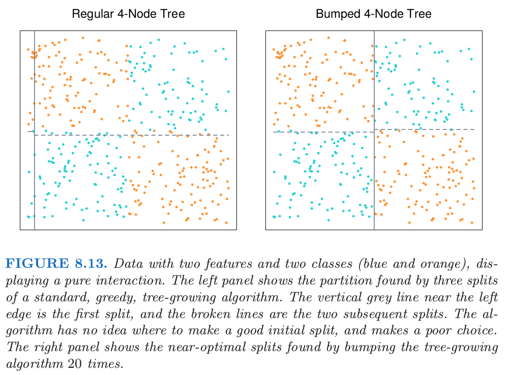

# 8.9 随机搜索： Bumping

| 原文   | [The Elements of Statistical Learning](../book/The Elements of Statistical Learning.pdf) |
| ---- | ---------------------------------------- |
| 翻译   | szcf-weiya                               |
| 时间   | 2018-01-02                               |

这章描述的最后一个方法不涉及平均或者结合模型，但是是寻找一个更好单模型的方法。Bumping采用bootstrap采样在模型空间中随机移动。对于拟合方法经常会找到许多局部最小值的问题，bumping可以帮助这些方法避免陷入坏的解。

在bagging中，我们抽取自助样本并且对每个样本拟合模型。但是不是对这些预测值进行平均，我们而是选择拟合训练数据最好的自助样本的模型。具体地，我们抽取自助样本$Z^{\*1}, \ldots, Z^{\*B}$，并且给出在输入点$x$处的预测$\hat f^{*b},n=1,2,\ldots,B$，对每个样本拟合我们的模型。我们在原始训练集上平均选择产生最小预测误差的模型。举个例子，对于平方误差，我们选择从自助样本$\hat b$中得到的模型，其中

$$
\hat b=\text{arg }\underset{b}{\text{min}}\sum\limits_{i=1}^N[y_i-\hat f^{*b}(x_i)]^2\qquad (8.60)
$$

对应的模型预测为$\hat f^{*\hat b}(x)$。按照约定，我们也把原始训练样本包含进自主样本的集合中，所以如果原始模型有更低的训练误，这种方法也能选择原始模型。

通过打乱数据，bumping试图将拟合过程移动到模型空间的好区域中。举个例子，如果只有少数的数据点会导致这个过程找到差的解，则任意删除掉这些数据点的自助样本应该会产生更好的解。

举另一个例子，考虑图8.13中的分类数据，臭名昭著的异或(exclusive or)(XOR)问题。其中有两个类别（蓝色和橘黄色）以及两个输入特征，并且特征间存在单纯的交叉。

通过先在$x_1=0$处分离数据，然后在每个分层的$x_2=0$处分离数据（或者反过来），一个基于树的分类器可以达到完美的判别。然而，贪婪的、见识短的CART算法（9.2节）试图寻找任意一个特征上的最优分割，接着再对得到的分层进行分割。由于数据的平衡特性，所有在$x_1$或$x_2$上的初始分割似乎无用，而且这个过程本质上在第一层产生随机的分割。对于这些数据找到的实际分割展示在图8.13的左图。通过对数据bootstrap采样，bumping打破了类别之间的平衡，以一个合理大小的自助样本（这里是20），这至少会随机产生一个初始分割点在$x_1=0$或$x_2=0$附近的树。仅仅使用20个自助样本，bumping找到了图8.13的右图中展示的接近最优的分割。如果我们添加一系列独立于类别标签的噪声特征，贪婪的生成树的算法的缺点会被加重。则生成树的算法不能区分$x_1$或$x_2$，并且将会更加迷路。

因为bumping在训练数据上比较了不同的模型，必须保证模型近似有相同的复杂度。在树的情形下，这意味着以相同的种植结点在每个自助样本上生成树。bumping在很难最优化拟合准则的情形的问题中也有帮助，或许是因为缺少光滑性。技巧是在自助样本上优化一个不同的，更方便的准则，接着选择在训练样本上对于期望的准则产生最优结果的模型。
