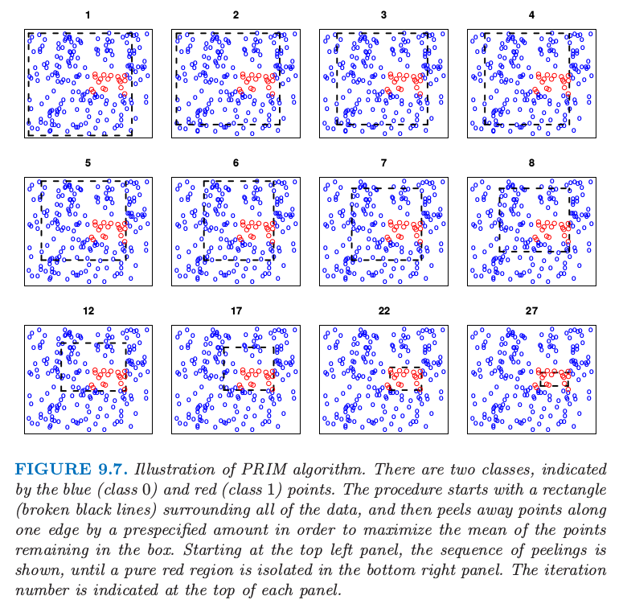
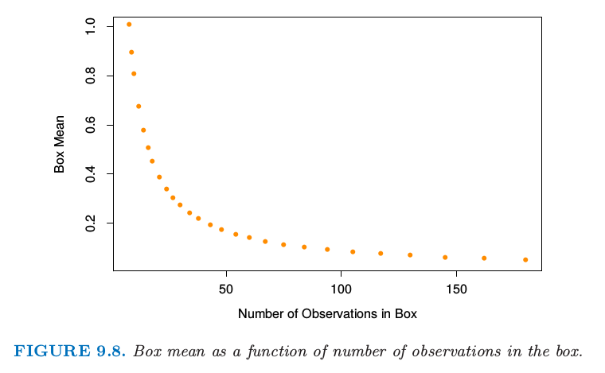
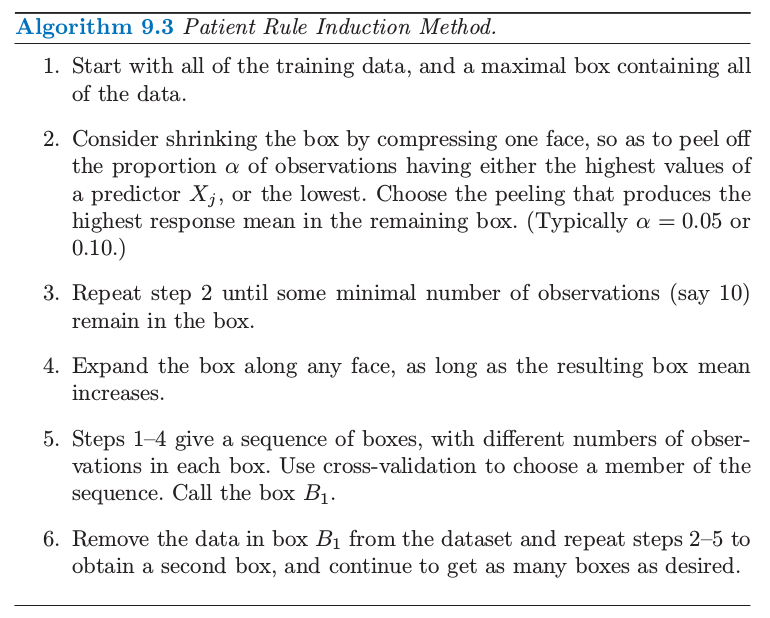
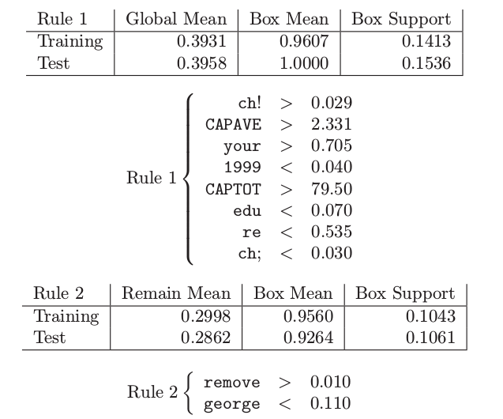

# 9.3 PRIM

| 原文   | [The Elements of Statistical Learning](https://web.stanford.edu/~hastie/ElemStatLearn/printings/ESLII_print12.pdf#page=336) |
| ---- | ---------------------------------------- |
| 翻译   | szcf-weiya                               |
| 发布 | 2018-03-17 |
| 更新 |2018-03-17|
|状态|Done|
|备注| 1 note; 1 question; 1 simulation|

基于树的方法（用于回归）将特征空间分成盒状的区域，来试图使每个盒子中的响应变量尽可能不同．通过二叉树定义了与每个盒子相关的分割规则，这有利于它们的解释性．

**耐心规则归纳法 (PRIM)** 也在特征空间中找盒子，但是它是寻找具有高平均响应的盒子．因此它是在寻找目标函数的最大值，称为**bump hunting**．（如果需要最小值而非最大值，可以简单地用负的响应变量值来转化．）

!!! note "weiya 注：翻译相关"
    PRIM 全称为 The patient rule induction method，这里按照字面意思翻译成了“耐心规则归纳法“，依据是下文提到了其优点`patience`，所以这里翻译为“耐心”，而非“病人”．

PRIM 区别于基于树的分割方法也因为盒子的定义不是通过二叉树来描述的．这使得**规则集合 (collection of rules)**的解释更加困难；然而，通过移除二叉树的限制，单个规则经常会更加简单．

PRIM 中构造盒子的主要方法是自上而下，以包含所有数据的盒子开始．这个盒子沿着一个面被逐渐压缩，接着观测落在盒子外的观测点被**剔除(peeled)** 掉．用于压缩的面要使得压缩过后盒子均值最大．接着重复这个过程，直到当前的盒子包含最小数目的数据点．

这个过程在图 9.7 中进行了图示．200 个数据点在单位方格中均匀分布．用颜色编码的图象表明当 $0.5<X_1<0.8,0.4<X_2<0.6$ 时，响应变量 $Y$ 取值 1（红色），否则取值为 0（蓝色）．这个面板显示了通过自上而下的剔除过程而逐步找到的盒子，每一步剔除的剩余数据点的比例为 $\alpha=0.1$．

> 图9.7. PRIM算法的图解．有两个类别，用蓝色（类别 0）和红色（类别 1）的点来表示．这个过程以包含所有数据的长方形（黑色虚线）开始，接着沿着某条边剔除预定量的点，使得留在盒子中的点的均值最大．从左上图开始，显示了这个剔除序列，直到右下图中纯红色区域被隔离开．这个迭代次数由每张图上面的数字表示．

图9.8 显示了当盒子被压缩后，盒子中响应变量的均值．

> 图9.8. 盒子中盒子的均值作为观测数目的函数．

!!! info "weiya 注：模拟 Fig. 9.7 & 9.8"
    利用 R 语言重现了图 9.7 和图 9.8，具体过程参见[模拟：Fig. 9.7](../notes/tree/sim-9-7/index.html)

计算完自上而下的序列之后，沿着任意边进行展开，如果这样的展开能够增大盒子均值的话，PRIM 则回溯这个过程．这称为 **pasting**．因为自上而下的过程在每一步是贪婪的，所以这样的展开经常是可行的．

这些步骤的结果是盒子的序列，每个盒子中含有不同数目的观测点．通过交叉验证，并结合数据分析家的判断，来选择最优的盒子大小．

用 $B_1$ 记在第一步中找到的盒子的观测的指标集．PRIM 过程接着从训练集中移除 $B_1$ 的观测，并且这两步的过程——先自上而下剔除，后自下而上pasting——在剩下的数据集中重复．整个过程重复若干次，得到盒子序列 $B_1,B_2,\ldots,B_k$．每个盒子由关于预测变量的子集的规则集
$$
(a_1\le X_1\le b_1)\text{ and } (b_1\le X_3\le b_2)
$$
来定义．PRIM 过程在算法9.3中进行了总结．

PRIM 可以通过考虑所有预测变量的划分来处理类别型变量，这正如 CART 中一样．缺失值也通常以一种类似 CART 的方式进行处理．PRIM 是为回归（定量响应变量）而设计的；两个类别的输出可以简单地编码成 0 和 1 来处理．没有简单的方式来同时处理 $k > 2$ 个的类别的情形：一种方式是分别对每个类别相对基准类别采用 PRIM．

PRIM 与 CART 相比的优点是它的 **耐心 (patience)**．因为 CART 的二值分割快速地将数据分割开．假设等大小的分割，有 $N$ 个观测情况下，在使用完数据之前，只能进行 $\log_2(N)-1$ 次分割．如果 PRIM 在每一步剔除掉训练点的比例为 $\alpha$，则在用完数据之前大约需要 $-\log(N)/\log(1-\alpha)$ 次剔除步骤．举个例子，如果 $N=128,\alpha=0.10$，则 $\log_2(N)-1=6$，而$-\log(N)/\log(1-\alpha)\approx 46$．考虑每一步需要整数个的观测，PRIM 实际上可以剔除 29 次．在任何情形下，PRIM 的能力更加耐心，这应该帮助自上而下的贪婪算法找到更好的解．

## 垃圾邮件的例子（继续）

我们对 `spam` 数据应用 PRIM，对 `spam` 编码为 1，对 `email` 编码为 0．
 
通过 PRIM 最初找到的两个盒子如下：

盒子的**支撑 (support) **为观测值落入盒子的比例．第一个盒子是纯 `spam`，并且大约包含 15% 的测试数据．第二个盒子包含 10.6% 的测试观测，其中 92.6% 为 `spam`．加起来两个盒子包含数据的 26%，以及大约 97% 的 `spam`．接下来一些盒子（没有显示出来）相当小，仅仅包含数据的 3%．

!!! question "weiya 注：数据比例"
    注意 `spam` 的比例是相对这两个盒子而言的，所以对于原文中的 $3\%$ 有点疑惑
    $$
    \frac{10.6\%\times 92.6\%+15\%\times100\%}{15\%+10.6\%}=96.9\%
    $$

预测变量按照重要性列出来．有趣的是在 CART 树（图 9.5）中最上面的分割变量没有出现在 PRIM 的第一个盒子中．
