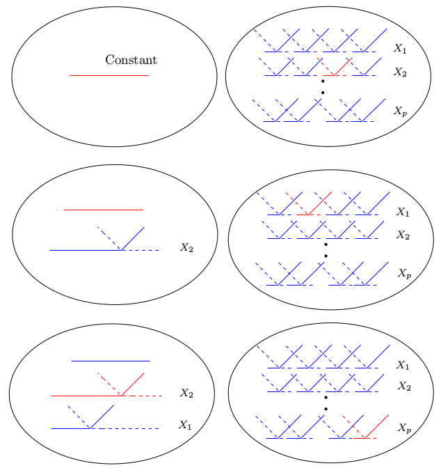
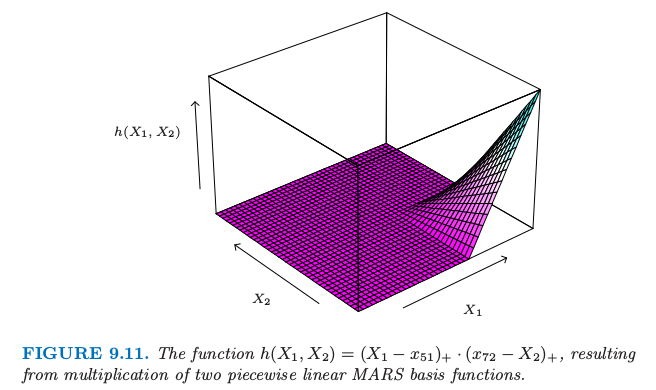
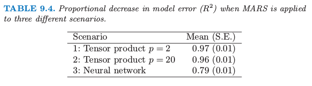

# 9.4 MARS: 多变量自适应回归样条

| 原文   | [The Elements of Statistical Learning](https://web.stanford.edu/~hastie/ElemStatLearn/printings/ESLII_print12.pdf#page=340) |
| ---- | ---------------------------------------- |
| 翻译   | szcf-weiya                               |
| 发布 | 2017-03-14 |
| 更新   | 2019-05-10 23:14:29                               |
|状态|Done|

> 写在前面
>
> MARS 应该算是我接触得比较早的统计学习方法，大二的时候曾经在医学院某实验室搬砖，是关于基因数据的项目，具体项目记不太清，毕竟最后这个项目夭折了．但记得很清楚的是，我尝试使用 MARS 来建模，那时我还没有开始看 ESL，是在 Max Kuhn · Kjell Johnson 的 Applied Predictive Modeling 这本书中初识了 MARS．这本书介绍了一系列统计学习方法，以及如何利用 R 语言来实现．然后我就依葫芦画瓢学习了其中的例子，应用到了基因数据中，但基因数据实在太大了，跑啊跑啊，但由于种种原因，最后不了了之，与 MARS 挥手告别．
>
> 第二次与 MARS 相见就是着手翻译这一章节，必须得承认，首次翻译实在太粗糙，既没有好好理解 MARS 的精髓，也没有好好注意译文的语句．
>
> 第三次是在处理 soda 项目的时候，用到 MARS，以及与其它方法的对比，跟 Professor Liu 的 soda 还真是有异曲同工之妙．
>
> 今天更新 MARS 这一章节算是第四次与 MARS 的正式重逢吧．@2017.08.25

**多变量自适应回归样条 (Multivariate Adaptive Regression Splines, MARS)** 是回归的自适应过程，非常适合高维问题（即，存在大量的输入）．可以从两个角度来理解它，首先，它可以看成是逐步线性回归的推广，其次，也可以看成是为了提高 CART 在回归中的效果而进行的改进．我们从第一种观点引入 MARS，接着与 CART 联系起来．

MARS 采用形式为 $(x-t)\_+, (t-x)\_+$ 的分段线性基函数的展开．“+”表示正的部分，所以

$$
(x-t)_+=\left\{
\begin{array}{ll}
x-t& \text{if }x>t\\
0&\text{otherwise}
\end{array}
\right.
\text{  and  }
(t-x)_+=\left\{
\begin{array}{ll}
t-x& \text{if }x<t\\
0&\text{otherwise}
\end{array}
\right.
$$

举个例子，图 9.9 展示了函数 $(x-0.5)\_+, (0.5-x)\_+$ 的图象．

> 图 9.9. MARS 采用的基函数 $(x-t)\_+$（实心橘黄色）和 $(t-x)\_+$（蓝色虚线）

每个函数是分段线性的，在值 $t$ 处有一个 **结点 (knot)**．用[第五章](/05-Basis-Expansions-and-Regularization/5.1-Introduction/index.html)的术语说它们是线性样条．在下面的讨论中我们将这两个函数称为 **反射对 (reflected pair)**．想法是，对于每个输入变量 $X_j$，将该输入变量的所有观测值作为结点．因此，基函数集合为

$$
{\cal C}=\{(X_j-t)_+,(t-X_j)_+\}_{t\in\{x_{1j},x_{2j},\ldots,x_{Nj}\},j=1,2,\ldots,p}\tag{9.18}
$$

如果所有的输入变量的观测值都不同，则总共有 $2Np$ 个基函数．注意到尽管每个基函数仅仅取决于单个的 $X_j$，举个例子，$h(X)=(X_j-t)_+$，但还是被看成是整个输入空间 $\IR^p$ 中的函数．

建立模型的策略类似向前逐步线性回归，但不是使用原始输入，而使用集合 $\cal C$ 中的基函数及其基函数间的乘积．因此模型有如下形式

$$
f(X)=\beta_0+\sum\limits_{m=1}^M\beta_mh_m(X)\tag{9.19}
\label{9.19}
$$

其中每个 $h_m(X)$ 是 $\cal C$ 中的基函数，也可能是两个或者更多这样基函数的乘积．

给定 $h_m$，通过最小残差平方和来估计系数 $\beta_m$，也就是，通过标准线性回归．然而，构造函数 $h_m(x)$ 是“真正的艺术”．在我们的模型中以常数函数 $h_0(X)=1$ 开始，集合 $\cal C$ 中的所有函数都是候选函数．图 9.10 图示了这一过程

> 图 9.10. MARS 向前建模的过程示意图．左边是已经在模型中的基函数：初始时，是常值函数 $h(X)=1$．右图中是所有考虑加进模型的候选基函数．这些候选基函数是如图 9.9 所示的成对分段线性基函数，其中结点 $t$ 为每个输入变量 $X_j$ 的所有观测值 $x_{ij}$．在每一步，我们考虑模型中的基函数和候选反射对间的所有乘积．将使得残差下降最多的乘积加进当前模型中．图中显示了这个过程的前三步，被选择的函数用红色标出．

在每一步我们将模型集合 $\cal M$ 中函数 $h_m$ 的与 $\cal C$ 中某个反射对的所有乘积看成是新的基函数．我们往模型 $\cal M$ 中加入如下形式的项，该项使得训练误差有最大下降．

$$
\hat\beta_{M+1}h_\ell(X)\cdot (X_j-t)_++\hat\beta_{M+2}h_\ell(X)\cdot(t-X_j)_+,h_\ell\in \cal M
$$

这里 $\hat\beta_{M+1}$ 和 $\hat \beta_{M+2}$ 和模型中其他的 $M+1$ 个系数一样，都是通过最小二乘估计的．接着使得训练误差有最大下降的乘积被加入到模型中，这个过程不断继续直到模型集合 $\cal M$ 中项的个数达到预设的最大值．

举个例子，在第一步我们考虑往模型中加入形如 $\beta_1(X_j-t)\_++\beta_2(t-X_j)\_+;t\in\\{x\_{ij}\\}$ 的函数，因为一个函数乘以常值函数等于该函数．假设最优选择为 $\hat\beta_1(X_2-x_{72})_++\hat\beta_2(x\_{72}-X_2)\_+$．则这个基函数对加入到模型 $\cal M$ 中，并且在下一步我们考虑加入如下形式的乘积对

$$
h_m(X)\cdot(X_j-t)_+\text{     and    }h_m(X)\cdot (t-X_j)_+,t\in\{x_{ij}\}
$$

其中对于 $h_m$ 我们有如下选择
$$
\begin{align*}
h_0(X)&=1\\
h_1(X)&=(X_2-x_{72})_+\\
h_2(X)&=(x_{72}-X_2)_+
\end{align*}
$$

第三个选择得到形如 $(X_1-x_{51})\_+\cdot (x_{72}-X_2)\_+$ 的函数，如图 9.11 所示．

> 图 9.11. 函数 $h(X_1,X_2)=(X_1-x_{51})\_+\cdot (x_{72}-X_2)_+$，由两个分段线性的 MARS 基函数相乘得到．

这个过程的最后我们有形如 \eqref{9.19} 的大模型．这些模型一般对数据过拟合，所以应用向后删除过程．每一步中，删掉的项使得残差平方和增长最小，得到每个 $\lambda$（项的个数）下的最优模型的估计 $\hat f_\lambda$．可以采用交叉验证来估计最优的 $\lambda$，但是为了节省计算，MARS 过程采用的是广义交叉验证．广义交叉验证准则定义为
$$
\GCV(\lambda)=\frac{\sum_{i=1}^N(y_i-\hat f_\lambda(x_i))^2}{(1-M(\lambda)/N)^2}\tag{9.20}
$$
$M(\lambda)$ 是模型中有效参数的个数：它等于模型中项的个数，加上在选择最优结点位置的参数个数．

一些理论的证明和实际的拟合结果表明在分段线性回归中每选择一个结点，应当增加三个有效参数．所以，如果模型中含有 $r$ 个线性独立基函数，并且在向前过程中选择 $K$ 个结点，则有 $M(\lambda)=r+cK$，其中 $c=3$．（当模型限定为加性时，$c=2$）．在向后删除变量的过程中，计算 $\GCV(\lambda)$，选择使得 $\GCV(\lambda)$ 最小的模型．

!!! note "weiya 注：$M(\lambda)=r+cK$?"
	[@Xiaolin So](http://disq.us/p/1ne2w82) 和 [@yvlian](http://disq.us/p/27pn018) 在评论中讨论这个复杂度公式，由于理解不够透彻，有些回复可能有偏差，特此查阅[MARS 原文](https://projecteuclid.org/euclid.aos/1176347963)试图在这里解释清楚. 

	> Only the coefficients $(a_0, \ldots, a_M)$ (对应这里的 $(\beta_0,\ldots,\beta_M)$), the complexity cost function is
	>
	$$
	C(M) = \trace(\B(\B^T\B)^{-1}\B^T) + 1\,,
	$$
	where $\B$ is the $M\times N$ data matrix of the $M$ (nonconstant) basis functions, $B_{ij} = B_i(\x_j)$. **This is equal to the number of linearly independent basis functions.**（这对应 [7.10 节](/07-Model-Assessment-and-Selection/7.10-Cross-Validation/index.html) 中对 GCV 的近似 $\trace(\mathbf S)$, 其中 $\S$ 是线性算子）But with an increased cost complexity function $\tilde C(M)$ to reflect the additional (basis function) parameters that, 
	>
	$$
	\tilde C(M) = C(M) + d\cdot M
	$$
	where $M$ is the number of nonconstant basis functions and $d$ represents a cost for each basis function optimization.

	对比一下，不难发现，这里的 $c$ 其实就是 $d$，$r$ 为 $C(M)$，且 $\lambda$ 即为原文的 $M$. 但还是有一点区别, 原文是说每个**基函数**需要 $d$ 个单位的 cost，但是这里是说每个**结点**需要 $c$ 个单位的 cost，当只考虑一阶的情况，结点数和基函数个数是相等的，但是如果考虑高阶，这两个似乎并不等价？还是我漏掉了什么？

为什么是这些分段线性函数，为什么是这个特定的模型策略？图 9.9 中函数的关键性质是它可以局部计算；在它们的定义域中有一部分为 0．当它们乘起来，如图 9.11，非零的结果仅仅占特征空间的一小部分，当函数的公共部分为非零．这样便可以非常简约地建立起回归曲面（如图 9.11），只需要采用局部非零的部分．这是很重要的，因为在高维问题中应该小心地使用参数，因为它们很快就会用光．其它比如多项式的基函数会在任意地方产生非零乘积，而很多非零乘积也不会起作用（相当于浪费了参数）．

这种分段线性基函数的第二个重要优点是计算上的．考虑 $\cal M$ 中的函数和输入变量 $X_j$ 的 $N$ 个反射对的乘积．似乎需要拟合 $N$ 个单输入的线性回归模型，每个需要 $O(N)$ 的操作，总共需要 $O(N^2)$ 的操作．然而，我们利用分段线性函数的简单形式的特点，首先用最右端结点的反射对．当这个结点每次依次向左移动一个位置，基函数在结点左边的值为 0，在右边部分值为常数．每次移动后会以 $O(1)$ 的操作更新拟合值．所以我们仅仅需要 $O(N)$ 的操作来遍历每个结点．

!!! note "weiya 注"
		对于单输入线性回归
		$$
		Y_i\sim h_{\ell}(X)(X_{ij}-t_r), \; r=1,2,\ldots, N; i=1,2,\ldots, N
		$$
		不考虑截距的情况下，记
		$$
		\hat \beta^{(r)} = \left(\sum\limits_{i=1}^Nh_\ell(X)^2(X_{ij}-t_r)^2\right)^{-1}\left(\sum\limits_{i=1}^Nh_\ell(X)(X_{ij}-t_r)Y_i\right)=W_rZ_r
		$$
		计算量为 $O(N)$（考虑截距时，多了 $O(1)$ 的 2 阶矩阵的求逆操作，故也是 $O(N)$ 的计算量）．
		若首先从最右端的结点开始计算，则
		$$
		\hat\beta^{(r)} = \left(W_{r+1}+h_\ell^2(X)(X_{r+1,j}-t_r)^2\right)^{-1}\left(Z_{r+1}+h_\ell(X)(X_{r+1,j}-t_r)Y_{r+1}\right)
		$$
		即仅需要 $O(1)$ 的更新操作，则原来 $O(N^2)$（$N$ 个 $O(N)$）的操作采用这种更新策略只需要 $O(N)$ 的计算量．

MARS 中向前建模的策略是层次性的，因为多重乘积是从已经在模型中的项来建立的．举个例子，仅仅当 4 重乘积中的一个 3 重乘积已经在模型中，才会加入该四重乘积．这里的哲学是，高阶交叉项仅仅当其中的低阶项存在才会存在．这个需求不是正确的，但是是合理的假设，并且避免了在可行选择数目呈指数增长的空间中的搜索．

在模型的项构造时有一个约束：每个输入变量在一个乘积中至多可以出现一次．这预防了输入变量的高阶幂的形成，这导致参数空间的边界会有剧烈的增大或下降．这样的幂次可以通过分段线性函数以一种更稳定的方式来近似．

MARS 过程中的一个有用选项是在交叉项的阶数上设置上界．举个例子，可以设置上界为 2，允许成对的分段线性函数的乘积，但是不允许 3 次或更高次的乘积．这个可以帮助最终模型的解释．含有上界得到加性模型．

## 垃圾邮件的例子（继续）

我们对垃圾邮件的数据应用 MARS，本章前面已经分析了这个数据集．为了增强解释性，我们限制 MARS 到 2 阶交叉项．尽管响应变量是取值为两个类别的类别型变量，但我们还是采用平方误差损失函数（见 9.4.3 节）．图 9.12 显示了模型中测试误差误分类率作为秩（独立基函数的个数）的函数．误差率约为5.5%，这比前面讨论的广义加性模型的误差率(5.3%)稍高一点．GCV 选择大小为 60 的模型，近似给出了最优表现的最小模型．通过 MARS 找到的主要交叉项涉及(ch\$, remove),(ch\$, free)和(hp, CAPTOT)．然而，这些交叉项没有提高广义加性模型中的表现．

> 垃圾数据：MARS 过程的测试误差误分类率，作为模型的秩（独立基函数的个数）的函数．

## 例子（模拟数据）

这里我们在三种不同的情形下验证 MARS 的表现．$N=100$ 个观测，预测变量 $X_1,X_2,\ldots,X_p$ 和误差 $\varepsilon$ 服从独立标准正态分布．

### 情形1：

数据产生模型为

$$
Y=(X_1-1)_++(X_1-1)_+\cdot (X_2-.8)_++0.12\cdot\varepsilon\tag{9.21}
$$

选择噪声标准误差 0.12 使得信噪比约为 5．我们称这个为张量积情形；乘积项给出类似图 9.11 的表面．

### 情形2：

同情形 1，但是总共 $p=20$ 个预测变量，也就是，有 18 个独立于响应变量的输入．

### 情形3：

有神经网络的结构：
$$
\begin{align*}
\ell_1 &= X_1+X_2+X_3+X_4+X_5\\
\ell_2 &= X_6-X_7+X_8-X_9+X_{10}\\
\sigma(t) &=1/(1+e^{-t})\\
Y&=\sigma(\ell_1)+\sigma(\ell_2)+0.12\cdot \varepsilon
\end{align*}
\tag{9.22}
$$

情形 1 和 2 完美地适合 MARS，而情形 3 包含高阶交叉项，可能很难用 MARS 来近似．我们对每个模型跑了 5 个模拟，并且记录结果．

情形 1 中，MARS 一般几乎完美地找到模型．情形 2 中，找到正确的结构但是找到一些涉及其它预测变量的多余项．

!!! note "weiya 注"
		自己编写 R 程序对这三种情形进行模拟，代码可以在[这里](https://github.com/szcf-weiya/ESL-CN/blob/master/code/MARS/simulation.R)找到，模拟结果也表明情形 1 和情形 2 能够很好地捕捉到模型结构，而很难对情形 3 进行建模．

令 $\mu(x)$ 为 $Y$ 的真实均值，并且令
$$
\begin{align*}
\MSE_0&=\ave_{x\in \Test}(\bar y-\mu(x))^2\\
\MSE&= \ave_{x\in \Test}(\hat f(x)-\mu(x))^2
\end{align*}
\tag{9.23}
$$

这些表示了常值模型和拟合 MARS 模型的均方误差，通过对 $x$ 的 1000 次测试值进行平均来估计．表 9.4 显示了每个情形中模型误差或者 $R^2$ 的下降比例．

$$
R^2=\frac{\MSE_0-\MSE}{\MSE_0}\tag{9.24}
$$

显示的值是五次模拟的均值和标准差．情形 2 中因为加入了无用的输入略微降低了 MARS 的效果；在情形 3 中表现得很差．

!!! note "weiya 注"
		利用`earth`包拟合出的 MARS 模型，编写 R 代码进行测试，结果表明，对于情形 1 和情形 2 的 $R^2$ 而言，与书中的结果一致；而情形 3 则相差较多，在我的程序中为负值，也就是表明情形 3 的 MARS 还不如利用均值直接估计．代码可以在[这里](https://github.com/szcf-weiya/ESL-CN/blob/master/code/MARS/simulation.R)找到．

## 其他的问题

### MARS 用于分类

MARS 方法和算法可以拓展到处理分类问题．已经提出了几种策略．

对于两个类别，可以将输出编码为0/1，并且将其看成是回归问题；我们在 spam 例子中已经这样做了．对于多类别情形，可以采用 [4.2 节](../04-Linear-Methods-for-Classification/4.2-Linear-Regression-of-an-Indicator-Matrix/index.html)描述的指示响应变量的方法．用 0/1 来编码 $K$ 个响应类别，接着采用多重响应的 MARS 回归．对于后者我们对所有的响应变量采用共同的基函数集合．分类使得类别有最大的预测向量的值．然而，正如 4.2 中描述的那样，这种方法存在潜在的掩盖问题．一般更好的方式是在 [12.5 节](../12-Support-Vector-Machines-and-Flexible-Discriminants/12.5-Flexible-Disciminant-Analysis/index.html)讨论的 optimal scoring.

Stone et al. (1997)[^1] 发展了 MARS 的混合版本 PolyMARS，是为了处理分类问题特别设计的．它采用在 [4.4 节](../04-Linear-Methods-for-Classification/4.4-Logistic-Regression/index.html)描述的多重逻辑斯蒂回归框架．以类似 MARS 的向前逐步方式来建立模型，但是在每一步多多变量对数似然作二次近似来寻找下一个基函数对．一旦找到，则通过极大似然扩大模型，并且这个过程重复进行．

### MARS 和 CART 的关系

尽管它们看起来相当不同，但是 MARS 和 CART 策略实际上有很强的相似性．假设我们进行了 MARS 过程，并且作出下面改变：

- 用阶跃函数 $I(x-t>0)$ 和 $I(x-t\le 0)$ 来替换分段线性基函数．
- 当模型中的项与候选项相乘，替换成交叉项，因此不允许该项与其它候选项进行交叉．

有了这些改变，MARS 向前过程与 CART 构造树的算法是一样的．乘上一对反射阶跃函数等价于在阶跃点分割开．第二条限制表明一个结点可能不会被分割成多次，因此使得 CART 模型能用（吸引人的）二叉树表示．另一方面，也是这条限制使得 CART 很难对加性结构进行建模．MARS 放弃树结构并且得到捕捉加性影响的能力．

### 混合输入

MARS 可以用一种自然的方式处理混合预测变量——定量和定性变量，这非常像 CART．对于一个定性变量，MARS 考虑将该定性变量的类别分成两块的所有可能的二叉分割．每个这样的分割产生成对分段常值基函数——关于两个类别集的指示函数．这个基对现在被看成和其他的一样，并且用它和其它已经在模型中的基函数来构造张量积．

[^1]: Stone, M. (1977). An asymptotic equivalence of choice of model by crossvalidation and Akaike’s criterion, Journal of the Royal Statistical Society Series B. 39: 44–7.