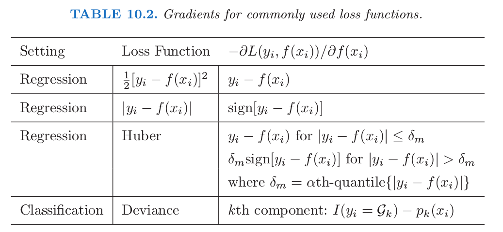
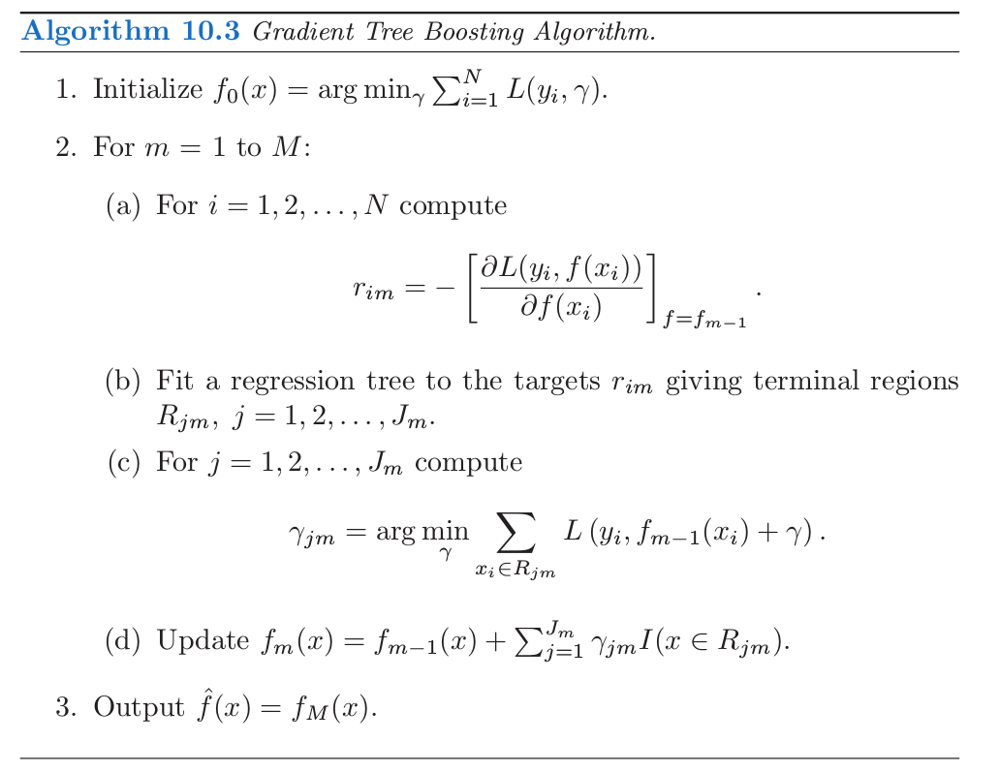

# 10.10 Gradient Boosting的数值优化

| 原文   | [The Elements of Statistical Learning](https://web.stanford.edu/~hastie/ElemStatLearn/printings/ESLII_print12.pdf) |
| ---- | ---------------------------------------- |
| 翻译   | szcf-weiya                               |
| 发布 | 2017-08-27 |
| 更新   | 2020-01-13 14:57:32                               |
| 状态 | Done|

!!! note "Recall"
    $$
    \hat\Theta_m = \text{arg }\underset{\Theta_m}{\text{min}}\sum\limits_{i=1}^NL(y_i,f_{m-1}(x_i)+T(x_i;\Theta_m))\tag{10.29}\label{10.29}
    $$

采用任意可导损失准则的 \eqref{10.29} 的快速近似算法可以类比数值优化导出．在训练数据上用 $f(x)$ 来预测 $y$ 的损失为

$$
L(f) = \sum\limits_{i=1}^NL(y_i, f(x_i))\tag{10.33}\label{10.33}
$$

目标是最小化关于 $f$ 的函数 $L(f)$，其中 $f(x)$ 限定为树的和 \eqref{10.28}，

!!! note "Recall"
    $$
    f_M(x)=\sum\limits_{m=1}^MT(x;\Theta_m)\tag{10.28}\label{10.28}
    $$

忽略这个限定，最小化 \eqref{10.33} 可以看成数值优化

$$
\hat{\mathbf f} = \text{arg }\underset{\mathbf f}{\min}L(\mathbf f)\tag{10.34}\label{10.34}
$$

其中参数 $\mathbf f\in \IR^N$ 是在 $N$ 个数据点 $x_i$ 的近似的函数值 $f(x_i)$：

$$
\mathbf f=\{f(x_1),f(x_2),\ldots,f(x_N)\}^T
$$

数值优化过程是将 \eqref{10.34} 看成向量的和来求解

$$
\mathbf f_M=\sum\limits_{m=1}^M\mathbf h_m,\qquad \mathbf h_m\in \IR^N
$$

其中 $\mathbf f_0=\mathbf h_0$ 是初始化的猜测，接下来每个 $\mathbf f_m$ 基于当前的参数向量 $\mathbf f_{m-1}$（此前已经更新的和）导出．

!!! note "weiya 注："
    这里 $\mathbf h_m$ 即对应 $\\{T(x_1;\Theta_m),\ldots, T(x_N;\Theta_m)\\}^T$.

不同数值优化方法的区别在于它们采用不同的方法来计算每个增长向量 $\mathbf h_m$．

## 最速下降

**最速下降 (steepest descent)** 选择 $\mathbf h_m=-\rho_m \mathbf g_m$，其中 $\rho_m$ 为标量值，$\mathbf g_m\in \IR^N$ 是在 $\mathbf f=\mathbf f_{m-1}$ 取值的 $L(\mathbf f)$ 的梯度．$\mathbf g_m$ 的组分为

$$
g_{im}=\Big[\frac{\partial L(y_i, f(x_i))}{\partial f(x_i)} \Big]_{f(x_i)=f_{m-1}(x_i)}\tag{10.35}\label{10.35}
$$

**步长 (step length)** $\rho_m$ 是下式的解
$$
\rho_m = \text{arg }\underset{\rho}{\text{min}}L(\mathbf f_{m-1}-\rho \mathbf g_m)\tag{10.36}\label{10.36}
$$
当前的解则更新为

$$
\mathbf f_m = \mathbf f_{m-1}-\rho_m\mathbf g_m
$$

这个过程一直重复直到下一次迭代．最速下降可以看成是非常贪婪的策略，因为 $-\mathbf g_m$ 是 $\IR^N$ 空间中 $L(\mathbf f)$ 在 $\mathbf f= \mathbf f_{m-1}$ 处最速下降的局部方向．

## Gradient Boosting

**Forward stagewise boosting**（算法 10.2）也是非常贪婪的策略．每一步中，在给定当前模型 $f_{m-1}$ 以及其拟合值 $f_{m-1}(x_i)$ 下，得到的解是在最大程度上降低 \eqref{10.29} 的树．

因此，树的预测值 $T(x_i;\Theta_m)$ 与负梯度 \eqref{10.35} 的组分类似．本质区别在于树的组分 $\mathbf t_m=\\{T(x_1;\Theta_m),\ldots,T(x_N;\Theta_m)\\}$ 不是独立的．它们限定为终止结点个数为 $J_m$ 的树的预测值，然而负梯度是没有任何限制的最速下降方向．

!!! note "Recall"
    $$
    \hat \gamma_{jm}=\text{arg }\underset{\gamma_{jm}}{\text{min}}\sum\limits_{x_i\in R_{jm}}L(y_i,f_{m-1}(x_i)+\gamma_{jm})\tag{10.30}\label{10.30}
    $$

向前逐步方法中 \eqref{10.30} 的解类似于在最速下降方向对 \eqref{10.36} 进行 **线搜索(line search)**．区别在于 \eqref{10.30} 中对  $\mathbf t_m$ 的组分进行单独的线搜索，这里的组分是对应每个单独的终止结点 $\\{T(x_i;\Theta_m)\\}\_{x_i\in R_{jm}}$，换句话说，就是对每个终止结点应用一次线搜索．

如果在训练数据上最小化损失 \eqref{10.33} 是唯一的目标，则最速下降是更好的策略．梯度 \eqref{10.35} 对于任意可导的损失函数 $L(y,f(x))$ 是很容易计算的，然而对于 [10.6 节](10.6-Loss-Functions-and-Robustness/index.html)中讨论的鲁棒的准则来求解 \eqref{10.29} 是很困难的．很不幸的是梯度 \eqref{10.35} 仅仅在训练数据点 $x_i$ 处有定义，然而最终的目标是将 $f_M(x)$ 一般化到新数据，而不是仅仅是出现在训练集中的数据．

解决这个困境的一种可能方案是在第 $m$ 次迭代中构造 $T(x;\Theta_m)$，其预测值 $\mathbf t_m$ 与负梯度尽可能接近．采用平方误差来衡量近似程度，则有

$$
\hat\Theta_m = \text{arg }\underset{\Theta}{\text{min}}\sum\limits_{i=1}^N(-g_{im}-T(x_i;\Theta))^2\tag{10.37}\label{10.37}
$$

也就是，用最小二乘对负梯度值 \eqref{10.35} 进行拟合．如 [10.9 节](10.9-Boosting-Trees/index.html)提到的，对于最小二乘决策树生长(induction)存在快速算法．尽管 \eqref{10.37} 的解 $\hat R_{jm}$ 会与求解 \eqref{10.29} 得到的 $R_{jm}$ 不同，但一般而言它们已经足够近似来实现同样的目的．在任何情形下，向前逐步 boosting 过程，自上而下决策树生长(induction)，都是近似过程．当构造完树 \eqref{10.37}，对应的每个区域的常数值由 \eqref{10.30} 给出．

表 10.2 总结了通常使用的损失函数的梯度．对于平方误差损失，负梯度恰恰是普通的残差 $-g_{im}=y_i-f_{m-1}(x_i)$，所以 \eqref{10.37} 等价于标准的最小二乘 boosting．在绝对值损失下，负梯度为残差的符号，所以在每次迭代，\eqref{10.37} 利用最小二乘对当前的残差的符号进行拟合．对于 Huber M-回归，负梯度是这两者的综合（详见表 10.2）．

对于分类，损失函数是多项偏差 \eqref{10.22}，

!!! note "weiya 注：Recall"
    $$
    \begin{align*}
    L(y,p(x))&=-\sum\limits_{k=1}^KI(y=\cal G_k)\log p_k(x)\\
    &=-\sum\limits_{k=1}^KI(y={\cal G_k})f_k(x)+\log \left(\sum\limits_{\ell=1}^Ke^{f_\ell(x)}\right)\tag{10.22}\label{10.22}
    \end{align*}
    $$

并且在每次迭代过程中构造 $K$ 棵最小二乘树．每棵树 $T_{km}$ 是对各自负梯度向量 $g_{km}$ 的拟合，

$$
\begin{align}
-g_{ikm} &= \Big[\frac{\partial L(y_i, f_1(x_i),\ldots, f_K(x_i))}{\partial f_k(x_i)}\Big]_{\mathbf f(x_i)=\mathbf f_{m-1}(x_i)}\notag\\
&=I(y_i={\cal G_k})-p_k(x_i)\tag{10.38}\label{10.38}
\end{align}
$$

其中 $p_k(x)$ 由 \eqref{10.21} 给出．尽管在每次迭代时，分别构造 $K$ 棵树，但是它们通过式 \eqref{10.21} 关联起来．

!!! note "weiya 注：Recall"
    $$
    p_k(x) = \frac{e^{f_k(x)}}{\sum_{\ell=1}^Ke^{f_\ell(x)}}\tag{10.21}\label{10.21}
    $$

对于二值分类($K=2$)，仅仅需要一棵树．

!!! note "weiya 注"
    对于二值分类，多项式偏差简单化为逻辑斯蒂损失函数
    考虑
    $$
    z = \logit(p) = \log\frac{p}{1-p}
    $$
    我们有 $p=\frac{1}{1+e^{-z}}$，则二项分布似然函数为
    $$
    f=p^y(1-p)^{1-y},\; y=0,1
    $$
    其负对数似然为
    $$
    L(p, y) = -\log(f)=-(y\log p+(1-y)\log (1-p))
    $$
    也称为 logit 损失函数．
    Logit 损失函数的负梯度为
    $$
    -\frac{y-p}{p(1-p)}
    $$

<!--
将上述几种损失函数及其梯度用如下的Julia程序表达出来．

-->

!!! info
    笔记[损失函数的梯度总结及Julia实现](../notes/boosting/summary-loss-function/index.html)用Julia表达了表10.2中的各个损失函数及其梯度．

## Gradient Boosting 的实现

上图中的算法 10.3 展示了用于回归的 **gradient tree-boosting** 的通用算法．特定的算法可以通过插入不同的损失准则 $L(y, f(x))$ 得到．算法第一行初始化为最优的常数模型，也就是单终止结点的树．第 $2(a)$ 行的负梯度计算的组分被称为广义残差或 **伪残差(pseudo residuals)**，$r$．通常使用的损失函数的梯度已经总结在表 10.2 中．

用于分类的算法是类似的．第 $2(a)$-$(d)$ 行每次迭代时重复 $K$ 次，每次对每个类用 \eqref{10.38} 计算负梯度．第 3 行的结果是 $K$ 个不同的树的展开 $f_{kM}(x), k=1,2,\ldots, K$．这通过 \eqref{10.21} 得到概率或者像 \eqref{10.20} 一样做分类．

!!! note "weiya 注：Recall"
    $$
    G(x)={\cal G_k}\;\text{where }k=\mathrm{arg}\;\underset{\ell}{\mathrm{max}}p_\ell(x)\tag{10.20}\label{10.20}
    $$

细节在[练习 10.9](https://github.com/szcf-weiya/ESL-CN/issues/76)中给出，两个基本的调整参数为迭代次数 $M$ 和每个组分树的大小 $J_m,m=1,2\ldots,M$.

这个算法原始实现称为 MART，指的是“**多重可加回归树(multiple additive regression trees)**”．这章中很多图是用 MART 得到的．这里描述的**gradient boosting** 在 `R` 语言的 `gbm` 包中有实现(Ridgeway, 1999[^1], “Gradient Boosted Models”)，可以免费使用．[10.14.2 节](10.14-Illustrations/index.html)中用了 `gbm` 包，在[第 16 章](16.1-Introduction/index.html)和[第 15 章](15.1-Introduction/index.html)有详细介绍．另外，还有个 boosting 算法的 `R` 语言实现是 `mboost`(Hothorn and Bühlmann, 2006[^2])．有个 gradient boosting/MART 的商业实现称为 TreeNet (Salford Systems, Inc.)

[^1]: Ridgeway, G. (1999). The state of boosting, Computing Science and Statistics 31: 172–181.
[^2]: Hothorn, T. and B¨uhlmann, P. (2006). Model-based boosting in high dimensions, Bioinformatics 22(22): 2828–2829.