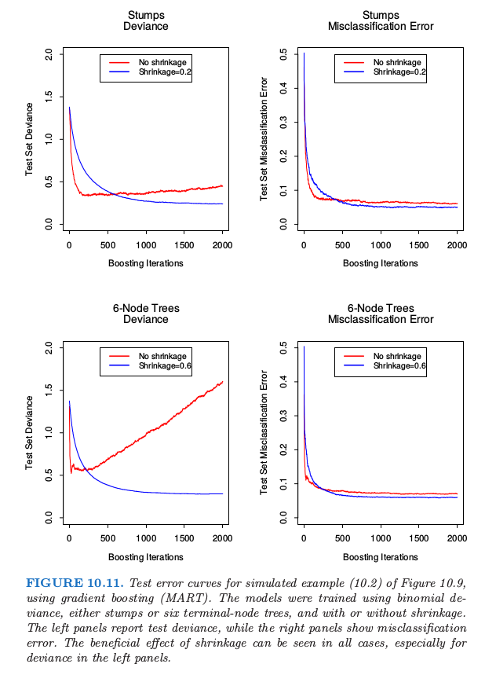
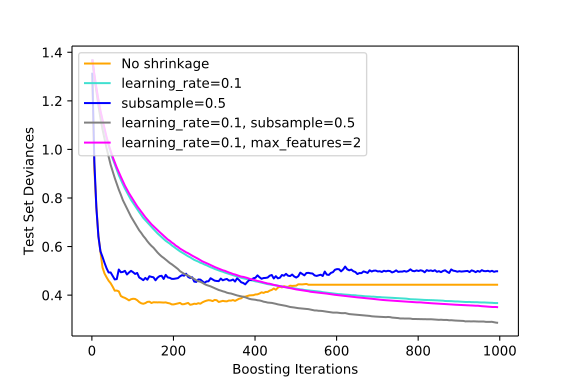

# 10.12 正则化

| 原文   | [The Elements of Statistical Learning](https://web.stanford.edu/~hastie/ElemStatLearn/printings/ESLII_print12.pdf) |
| ---- | ---------------------------------------- |
| 翻译   | szcf-weiya                               |
| 发布 | 2017-10-09 |
| 更新   | 2020-01-10 11:30:03                               |
| 状态 | Done|

除了候选树的大小 $J$，梯度 boosting 的另一个元参数 (meta-parameter) 是 boosting 的迭代次数 $M$．每一次迭代通常会降低训练风险 $L(f_M)$，所以对于充分大的 $M$，误差可以达到任意小．然而，对训练数据拟合得太好会导致过拟合，它会降低预测未来数据的效果．因此，存在一个最小
化未来预测风险的最优大小 $M^\*$，它依赖于具体应用．估计 $M^\*$的一种方便方式是在验证样本上将预测风险看成是关于 $M$ 的函数．最小化风险的 $M$ 值则作为 $M^\*$ 的一个估计．这类似于经常用在神经网络中的 **早停 (early stopping)** 策略（[11.4 节](/11-Neural-Networks/11.4-Fitting-Neural-Networks/index.html)）．

## 收缩

控制 $M$ 的值并不是唯一正则化的策略．与岭回归和神经网络一样，也可以应用收缩策略（见 [3.4.1 节](/03-Linear-Methods-for-Regression/3.4-Shrinkage-Methods/index.html)和 [11.5 节](/11-Neural-Networks/11.5-Some-Issues-in-Training-Neural-Networks/index.html)）．Boosting 中收缩最简单的实现方式是使用因子 $0 < \nu < 1$ 来收缩每棵树的贡献．也就是，算法 10.3 的第 2(d) 行用下式代替

$$
f_m(x)=f_{m-1}(x)+\nu\cdot \sum\limits_{j=1}^J\gamma_{jm}I(x\in R_{jm})\tag{10.41}
$$

参数 $\nu$ 可以看成是控制 boosting 过程的学习速率．较小的 $\nu$（更多的收缩）会导致同样大小的迭代次数 $M$ 下更大的训练风险．因此，$\nu$ 和 $M$ 都控制了训练数据的预测风险．然而，这些参数并不单独作用．对于同样的训练风险较小的 $\nu$ 会导致较大的 $M$，所以它们之间存在权衡．

经验上，(Friedman, 2001[^1]) 已经发现较小的 $\nu$ 会得到更好的测试误差，并且需要更大的 $M$ 与之对应．事实上，最好的策略是将 $\nu$ 设得很小($\nu < 0.1$)，然后通过 **早停 (early stopping)** 来选择 $M$．这会给回归和概率估计带来重大的改善（与没有收缩时相比，$\nu = 1$）．通过 \eqref{10.20} 式改善对应的误分类风险虽然很小，但是仍然显著．

!!! note "Recall"
    $$
    G(x)={\cal G_k}\;\text{where }k=\mathrm{arg}\;\underset{\ell}{\mathrm{max}}p_\ell(x)\tag{10.20}\label{10.20}
    $$

这个改善需要以计算量为代价：较小的 $\nu$ 得到较大的 $M$，并且计算量与后者成比例．然而，将在下面看到，许多迭代的计算即使是在非常大的数据集上也是可行的．部分原因是每一步生成的树是没有剪枝的．

图 10.11 显示了图 10.2 的模拟例子 \eqref{10.2} 的测试误差曲线．

!!! note "Recall: \eqref{10.2}"
    $$
    Y=
    \left\{
    \begin{array}{ll}
    1&\text{if } \sum_{j=1}^{10}X_j^2>\chi_{10}^2(0.5)\\
    -1 & \text{otherwise}
    \end{array}
    \right.
    \tag{10.2}\label{10.2}
    $$

Gradient boosted 模型(MART)通过采用二项偏差来训练，分 stump 和 6 个终止结点树的情况讨论，以及分有无收缩进行讨论．收缩的好处是很显然的，特别是当跟踪二项偏差时．有了收缩，每个测试误差曲线达到较低的值，并且在许多迭代中保持不变．

[16.2.1 节](/16-Ensemble-Learning/16.2-Boosting-and-Regularization-Paths/index.html)将 boosting 的向前逐步收缩和为了正则化模型参数使用的 $L_1$ 惩罚(lasso)联系起来．我们认为 $L_1$ 惩罚可能会比用在一些方法（比如支持向量机）中的 $L_2$ 惩罚要更好．

## 子采样

我们在 [8.7 节](/08-Model-Inference-and-Averaging/8.7-Bagging/index.html)看到bootstrap averaging (bagging) 通过 averaging 提高了噪声分类器的表现效果．[第 15 章](/15-Random-Forests/15.1-Introduction/index.html)详细讨论了通过平均实现的降低方差的机制．我们也可以在gradient boosting 中采用这一方法，同时提高了效果和计算效率．

采用 stochastic gradient boosting (Friedman, 1999[^2])，在每一步我们采样 $\eta$ 倍的训练观测值（无放回），并且采用这种子采样来生成下一棵树．剩下的算法同样．一般可以取 $\eta$ 为 $\frac{1}{2}$，尽管对于大的 $N$，$\eta$ 可以比 $\frac{1}{2}$ 小很多．

这种采样不仅仅降低了 $\eta$ 倍的计算时间，在很多情况下也实际上得到了更精确的模型．

图 10.12 说明了采用模拟例子 \eqref{10.2} 的子采样的效果，既可以看成是分类的例子，也可以看成是回归的例子．我们看到这两种情形下，采用收缩的的子采样比剩下的表现要好．似乎没有收缩的子采样会表现得很差．

缺点是我们现在需要设置四个参数：$J,M,\nu$ 和 $\eta$．一般地，通过前期的尝试确定合适的 $J,\nu$ 和 $\eta$，将 $M$ 留作主要的参数．

!!! info "weiya 注："
    [Gradient Boosting regularization -- scikit-learn](https://scikit-learn.org/stable/auto_examples/ensemble/plot_gradient_boosting_regularization.html) 比较了不同学习速率 $\nu$ 和子采样 $\eta$ 在例 \eqref{10.2} 上的表现，
    
    链接中有具体实现代码。
    

[^1]: Friedman, J. (2001). Greedy function approximation: A gradient boosting machine, Annals of Statistics 29(5): 1189–1232.
[^2]: Friedman, J. (1999). Stochastic gradient boosting, Technical report, Stanford University.
