# 10.14 例子

| 原文   | [The Elements of Statistical Learning](https://web.stanford.edu/~hastie/ElemStatLearn/printings/ESLII_print12.pdf) |
| ---- | ---------------------------------------- |
| 翻译   | szcf-weiya                               |
| 发布 | 2018-12-30 |
| 更新 | 2018-12-30|
| 状态| Done|

这一节我们在几个大型数据集上采用合适的损失函数应用 Gradient Boosting 方法．

## 加利福利亚住宅

数据集 (Pace and Barry, 1997)[^1] 可以在 CMU StatLib 仓库中找到．

!!! note "weiya 注："
    原书作者脚注给出的链接是 [http://lib.stat.cmu.edu](http://lib.stat.cmu.edu)，但无法访问，应该是 [http://lib.stat.cmu.edu/datasets/ ](http://lib.stat.cmu.edu/datasets/)．

数据中包含加利福利亚 20460 个小区（1990 年人口普查块群）的 **聚合数据 (aggregated data)**．响应变量 $Y$ 是每个小区的房子价值的中位数（单位为 $100,000）．预测变量是 **人口统计数据 (demographics)**，比如收入的中位数 `MedInc`，用房子个数 `House` 表征的房屋密度，以及每个房子平均占用面积 `AveOccup`．另外还有的预测变量是每个校区的位置（经度 `longitude` 和纬度 `latitude`），以及一些反映小区中房子特点的量：房间个数的平均值 `AveRooms` 以及卧室个数的平均值 `AveBedrms`．因此总共有 8 个预测变量，都是数值型的．

!!! note "weiya 注："
    这里书中列出的其实只有 7 个，查阅原数据集，发现漏掉的一个是 `housing median age`．当然，其实原数据集本来是有 9 个预测变量，另外一个是 `population`，而且给出了 `total rooms`, `total bedrooms`，但没有 `AveRooms` 和 `AveBedrms`，所以这里作者大概是直接取平均数省掉了一个变量 `population`．

我们采用 MART 过程来拟合 Gradient Boosting 模型，其中有 $J=6$ 个终止结点，学习速率 (10.41) 取 $\nu=0.1$，并且采用 Huber 损失来预测数值型响应变量．我们随机将数据集分成训练集 (80%) 和测试集 (20%)．

图 10.13 展示了作为在训练数据和测试数据上迭代次数 $M$ 的函数的平均绝对误差

$$
\mathrm{AAE} = \E\vert y-\hat f_M(x)\vert \tag{10.53}
$$

测试误差看起来随着 $M$ 的增大单调降低，并且在早期迅速下降然后随着迭代增加渐渐变成常值．因此，$M$ 的具体选择不重要，只要它不要太小．在许多应用中都趋向于是这种形式．收缩策略 (10.41) 趋向于消除过拟合的问题，特别是对于较大的数据集．

800 次迭代之后的 AAE 为 0.31．这个可以跟最优常值预测变量的中值 $\{y_i\}$ （0.89）进行比较．用更熟悉的相似性的量，这个模型的多相关系数的平方是 $R^2=0.84$．Pace and Barry (1997)[^1] 采用一个很复杂巧妙的空间自回归过程，其中每个小区的预测是基于周围小区的 **房子价值的中位数 (median house values)**，并将其他预测变量看成协变量得到的．变换后预测 $\log Y$ 时他们达到 $R^2=0.85$．将 $\log Y$ 看成响应变量，gradient boosting 对应的值为 $R^2=0.86$．

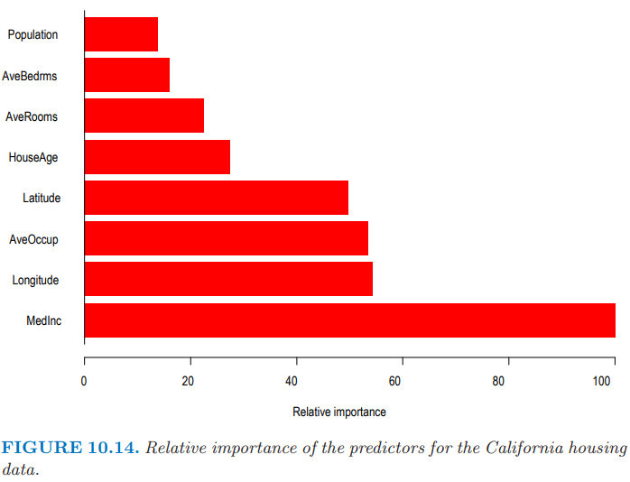

图 10.14 展示了每个预测变量的相对变量重要度．意料之中，小区中收入的中位数 (median income) 是最相关的预测变量．经度 (longitude)， 纬度 (latitude)，以及平均占用面积 (occupancy) 大致都有收入一半的重要度，而剩下的则没多大影响了．

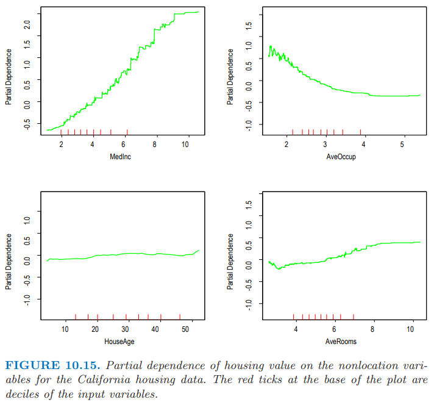

图 10.15 展示了单变量在最相关的非位置预测变量上的偏相依性图．注意到这些图并不是严格的光滑．这是采用基于树模型的后果．决策树产生了不连续的分段线性模型 (10.25)．多棵树的和 (10.28) 也继承了这个特点，而且自然地有更多的分段．与本书中讨论的其他方法不一样，这里的结果没有任何光滑约束．任意尖锐 (sharp) 的不连续都可以被建模．这些曲线一般呈现出光滑趋势的事实是因为这估计问题中的响应变量的最好的估计值．通常是这种情形．

每幅图中很轴上的短竖线标记了对应变量分布的 **十分位数 (deciles)**．注意到数据的密度在边处较低，特别是对于较大的值．这导致在这些区域曲线不能很好地确定出来．这些图的竖轴尺度是一样的，因此可以直观地比较不同变量的相对重要度．

房屋价值的中位数在收入的中位数上的偏相依性是单调递增的，在整个数据取值范围内几乎成一条直线．房屋价值大体上随着平均占用面积的增长而单调下降，除了当平均占用率小于 1 的情形．房屋价值的中位数对平均房间数不是单调的．近似在 3 个房间数时有个最小值，并且对于较大和较小的房间数都会增大．

房屋价值的中位数看起来对房屋年龄有很弱的偏相依性，但这个与其重要度排名（图 10.14）不一致．这表明这个弱影响可能掩盖掉了与其他变量间更强的交叉影响．

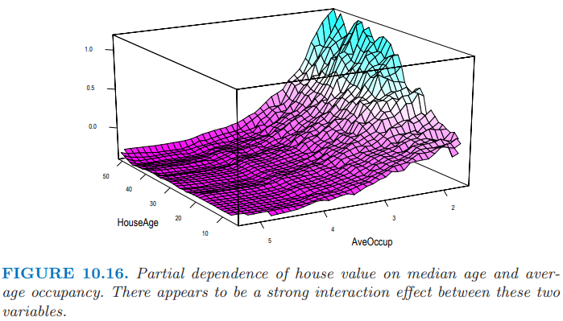

图 10.16 展示了房屋价值在房屋年龄中位数和平均占有率的联合偏相依性．对于平均占有率大于 2 的小区，房屋价值近似与房屋年龄独立，然而对于占有率小于 2 的值，对年龄有很强的相依性．

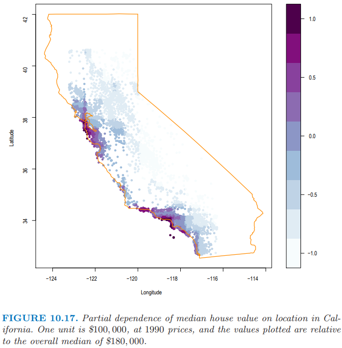

图 10.17 用带阴影的等高图展示了拟合模型在经度和纬度上的联合偏相依性．很显然在加利福利亚，房屋价值中位数对小区的位置有很强的相依性．注意到图 10.17 不是房屋价值在忽略其他预测变量影响后对位置的影响 (10.49)．和所有偏相依性图一样，它表示了在考虑完其他小区和房屋特征后位置的影响 (10.47)．这可以看成需要对位置支付额外的费用．这个额外的费用在 **太平洋沿岸 (Pacific coast)** 会相对更大，特别是在 **海湾地区 (Bay Area)** 以及 **洛杉矶 - 圣地亚哥 (Los Angeles–San Diego)** ．在加利福利亚的北方，中央山谷，以及东南沙漠地区，位置费用相当地少．

[^1]: Pace, R. K. and Barry, R. (1997). Sparse spatial autoregressions, Statistics and Probability Letters 33: 291–297.

## 新西兰鱼

植物和动物生态学家采用关于环境变量的回归模型来预测物种是否存在，以及 **多度 (abundance)** 和 **丰度 (richness)**．

!!! note "weiya 注：abundance 和 richness"
    参考 [赵斌：森林土壤碳封存：枯枝落叶同根与真菌的较量](http://blog.sciencenet.cn/home.php?mod=space&uid=502444&do=blog&id=675964)，文章将 abundance 翻译成“多度”，并且在评论中指出

    > abundance 是某一物种在群落内个体数目多少的，理应翻译成多度，而不是丰度．species richness 是指群落中的物种数目，物种数目越多，越丰富多彩，用丰度来翻译很到位，如果翻译成富集，就不知道什么含义了．我相信英语单词采用这两个词本身是没有用错的，只是以前我们在理解这两个词的时候没有足够注意而已．

尽管许多年来，简单的线性回归和参数模型很受欢迎，但是最近的文献表明对更复杂的模型越来越感兴趣，比如广义可加模型（[9.1 节](../09-Additive-Models-Trees-and-Related-Methods/9.1-Generalized-Additive-Models/index.html)的 GAM），多元自适应回归样条（[9.4 节](../09-Additive-Models-Trees-and-Related-Methods/9.4-MARS/index.html)的 MARS）以及 boosted regression trees (Leathwick et al., 2005[^2]; Leathwick et al., 2006[^3])．这里我们对一种叫做 Black Oreo Dory 的海洋鱼类（在新西兰附近海域发现）的存在性以及多度进行建模．

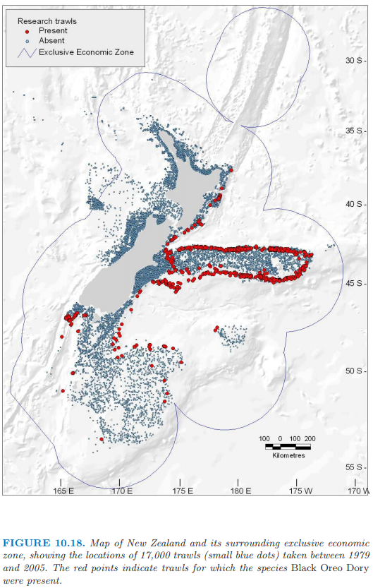

图 10.18 展示了 17000 个拖网渔船（深水网捕鱼，最大深度为 2km）的位置，并且其中红色点表示其中 2353 个拖网渔船发现了 Black Oreo，通常记录了 100 个物种中的其中一个．对于每个拖网渔船，记录的捕捞量的单位为千克 (kg)．除了捕捉的物种，还测量了每个拖网渔船一系列的环境因素．这些因素包括平均捕捞深度 `AvgDepth`，水温和 **盐度 (salinity)**．因为后两者与深度强相关，Leathwick et al. (2006)[^3] 导出根据深度调整（通过单独的非参回归）这两个测量值后得到的残差 `TempResid` 和 `SalResid`．`SSTGrad` 是海表面温度的梯度，而 `Chla` 是通过卫星图象测量的生态产量的一个广泛指标．`SusPartMatter` 提供了悬浮颗粒的度量，特别是对于沿海水域，这个量也是基于卫星测量的．

这个分析的目标是估计在一个拖网渔船中发现 Black Oreo 的概率，以及预期的捕捞量，通过考虑拖网渔船的速度以及距离进行标准化，以及渔网的网格大小．作者们采用 logistic 回归来估计这些概率．对于捕捞量，很自然地假设服从 Poisson 分布，并且对平均量的对数进行建模，但是这通常不是很合适，因为有很多 0．尽管有许多特殊的方法，比如 zero-inflated Poisson (Lambert, 1992[^4])，他们选择更简单的方式．

!!! note "weiya 注：Zero-inflated Models"
    常见的有两种．

    Zero-inflated Poisson (ZIP): 
    
    $$
    y\sim \pi I(y=0) + (1-\pi)\mathrm{Poisson}(y; \lambda)
    $$
    其中 $\pi$ 是产生额外 0 的概率．

    Zero-inflated negative binomial (ZINB):

    $$
    y\sim \pi I(y=0) + (1-\pi)\mathrm{NB}(y; r, p)
    $$
    其中 $r, p$ 是标准负二项分布的参数．

如果 $Y$ 是（非负）捕捞量，

$$
\E(Y\mid Y>0,X)\cdot \Pr(Y>0\mid X)\tag{10.54}
$$

其中第二项通过 logistic 回归估计，而且第一项可以仅用 2353 个有正捕捞量的拖网渔船来估计．

对于 logistic 回归，作者采用二项偏差损失函数的 Gradient boosted model (GBM)，其中树的深度为 10，并且收缩因子 $\nu = 0.025$．对于正捕捞回归，他们采用平方误差损失的 GBM 对 $\log(Y)$ 进行建模（树的深度同样为 10，但是 $\nu=0.01$），并且未记录预测值．两种情形下他们都采用 10 折交叉验证来选择项的个数和收缩因子．

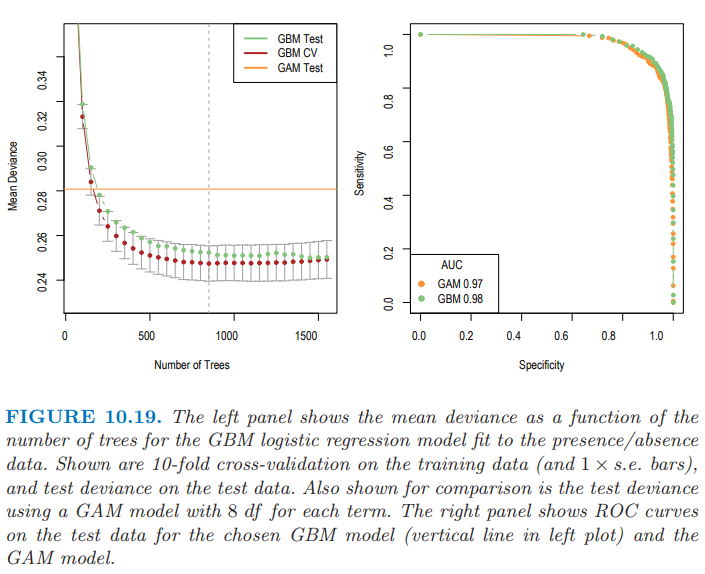

图 10.19（左图）展示了 GBM 模型序列对于 10 折 CV 和测试数据的二项偏差的均值，这比 GAM 模型（每一项采用 8 个自由度的光滑样条）的表现有较大程度的改善．右图展示了两个模型的 ROC 曲线（[9.2.5 节](../09-Additive-Models-Trees-and-Related-Methods/9.2-Tree-Based-Methods/index.html)），用来衡量预测效果．从这点看，效果似乎差不多，不过正如 AUC（曲线下面的面积）表现的那样，GBM 或许略有优势．对于 sensitivity 和 specificity 相等的点，GBM 达到 $91\%$，而 GAM 达到 $90\%$．

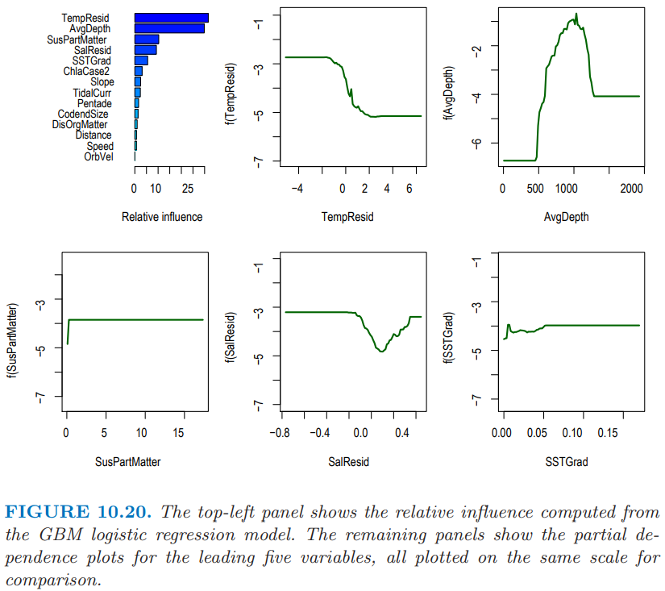

图 10.20 总结了 logistic GBM 拟合中变量的贡献．我们看到存在一个良好定义的深度范围使得能够捕到 Black Oreo，并且在越冷的水中捕捉得会越频繁．我们不会给出定量捕捉模型的细节；重要的变量大部分是一样的．

在这些模型中使用的所有预测变量在很好的地理网格上都可用；事实上，它们是从环境地图集，卫星图象等中导出——更多细节详见 Leathwick et al. (2006)[^3]．这也意味着预测值可以在网格中进行，并且导入到 GIS 地图系统．

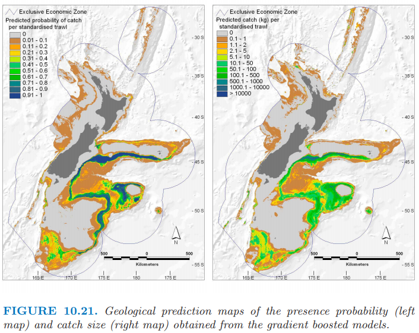

图 10.21 展示了存在性和捕捉量的预测地图，并且都标准化为相同的拖网渔船条件；因为预测变量随着地理位置而连续变化，所以预测值也是一样．

因为 GBM 模型对交叉影响建模、以及自动选择变量的能力，以及对离群值和确实数据的鲁棒性，所以 GBM 模型在这个数据丰富且充满热情的社区中迅速普及．

## 人口数据

这一节我们用 MART 举例说明 Gradient Boosting 在多类别分类问题中的应用．数据来自由  San Francisco Bay Area 的超市顾客填写的 9243 份问卷 (Impact Resources, Inc., Columbus, OH)．这些问题涉及 14 个人口统计量．在这个例子中，目标是将其他 13 个变量看成预测变量来预测职业，并且因此找出区分不同职业类的人口统计量．我们随机将数据分成训练集 (80%) 和测试集 (20%)，并且采用 $J=6$ 个结点的树，且学习速率为 $\nu = 0.1$．

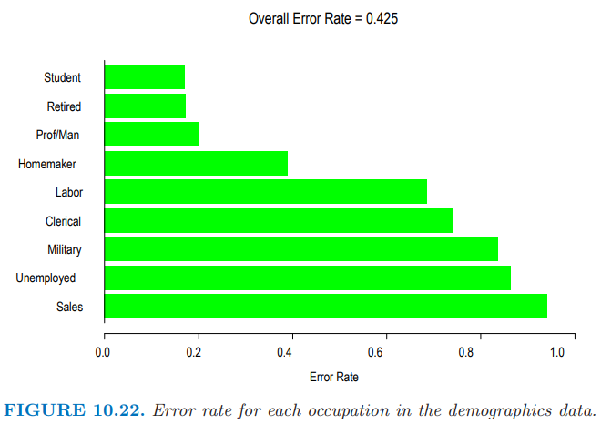

图 10.22 展示了 $K=9$ 个职业类以及它们对应的误差率．总体误差率为 42.5%，这可以与 69% 的 **零分布误差率 (null rate)** （预测最多的类 `Prof/Man` (Professional/Managerial)）．预测效果最好的四个类别似乎是  `Retired`，`Student`，`Prof/Man`，和 `Homemaker`．

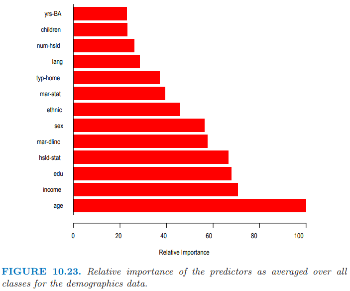

图 10.23 展示了对所有类别平均后的相对预测变量重要度 (10.46)．

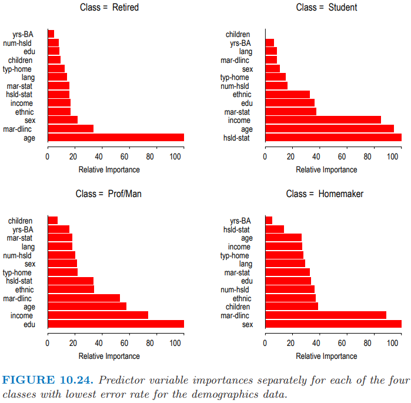

图 10.24 展示了四个最优预测类别的单个重要度分布 (10.45)．可以看到对于每个单独的类其最重要的预测变量通常都是不一样的．一个例外是 `age`，在预测 `Retired`，`Student` 和 `Prof/Man` 时，它的重要度都是排名前三的．

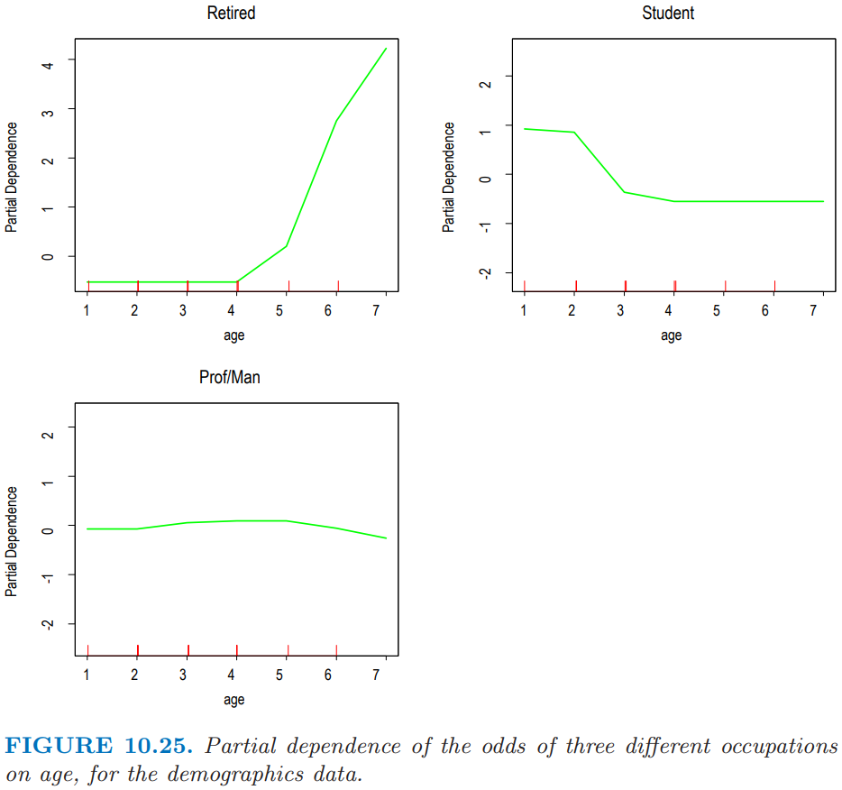

图 10.25 展示了 `age` 对这三个类别的对数几率 (10.52)的偏相依性．横坐标的值是相应等距排列的年龄区间的有序编号．可以看到再考虑完其他变量的贡献度后，对于年龄较大者，退休的几率很高，与之相反的是学生．对于中年人来说，成为专业人才/管理人才 (professional/managerial) 的几率最高．这些结果当然是意料之中的．他们说明了观察单独地观察每一类的偏独立性能够得出合理的结果．

[^2]: Leathwick, J., Rowe, D., Richardson, J., Elith, J. and Hastie, T. (2005). Using multivariate adaptive regression splines to predict the distributions of New Zealand’s freshwater diadromous fish, Freshwater Biology 50: 2034–2051.
[^3]: Leathwick, J., Elith, J., Francis, M., Hastie, T. and Taylor, P. (2006). Variation in demersal fish species richness in the oceans surrounding new zealand: an analysis using boosted regression trees, Marine Ecology Progress Series 77: 802–813.
[^4]: Lambert, D. (1992). Zero-inflated Poisson regression, with an application to defects in manufacturing, Technometrics 34(1): 1–14.