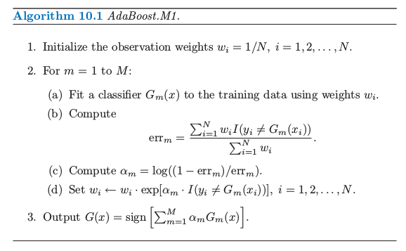
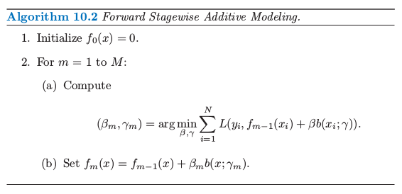
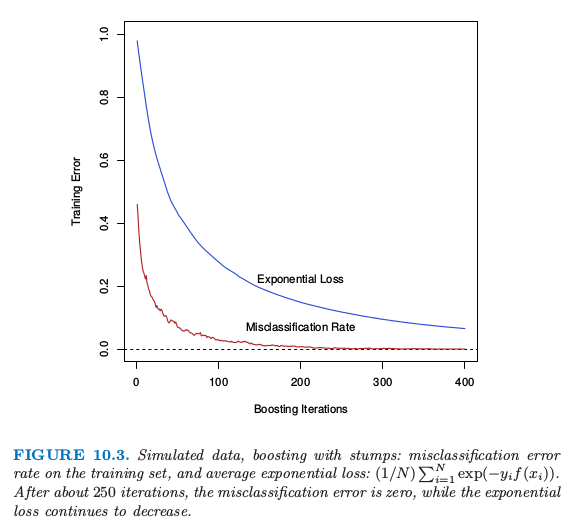
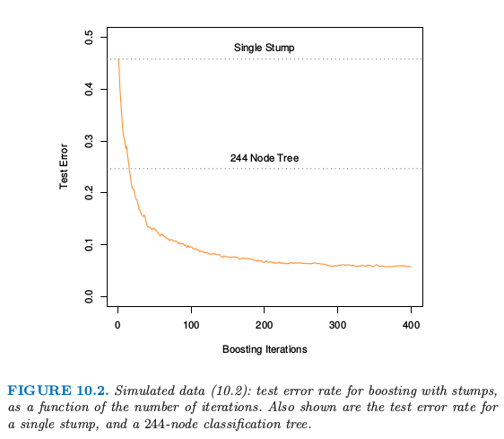

# 10.4 指数损失和AdaBoost

| 原文   | [The Elements of Statistical Learning](https://web.stanford.edu/~hastie/ElemStatLearn/printings/ESLII_print12.pdf#page=362) |
| ---- | ---------------------------------------- |
| 翻译   | szcf-weiya                               |
| 发布 | 2018-02-28 |
| 更新   | 2018-02-28, 2018-05-17@xinyu-intel,2018-06-09                               |
| 状态 | Done|

我们现在证明 AdaBoost.M1 算法（算法 10.1）等价于使用下列损失函数的向前逐步加法建模
$$
L(y,f(x))=\exp(-yf(x))\tag{10.8}
$$
这个准则的合理性将在下一节中讨论

<!--
!!! note "weiya注：Recall"
    

-->

AdaBoost 基函数是单个分类器 $G_m(x)\in \\{-1,1\\}$．采用指数损失函数，需要在每一步求解下面优化问题，从而得到需要加入到模型的分类器 $G_m$ 和对应的系数 $\beta_m$
$$
(\beta_m,G_m)=\mathrm{arg}\;\underset{\beta,G}{\mathrm {min}}\sum\limits_{i=1}^N\exp[-y_i(f_{m-1}(x_i)+\beta G(x_i))]
$$
上式可以写成
$$
(\beta_m,G_m)=\mathrm{arg}\;\underset{\beta, G}{\mathrm{min}}\sum\limits_{i=1}^N\omega_i^{(m)}\exp(-\beta y_iG(x_i))\tag{10.9}\label{10.9}
$$
其中，$w^{(m)}\_i=\exp(-y\_if_{m-1}(x))$．因为每个 $w^{(m)}\_i$ 既不依赖 $\beta$ 也不依赖 $G(x)$，可以看成是应用到每个观测上的权重．权重取决于 $f_{m-1}(x_i)$，因此个体的权重值随着迭代次数 $m$ 而变化．

\eqref{10.9} 式的解可以通过两步得到．首先，对于任意 $\beta > 0$，\eqref{10.9} 式 $G_m(x)$ 的解为
$$
G_m=\mathrm{arg}\;\underset{G}{\mathrm{min}}\sum\limits_{i=1}^N\omega_i^{(m)}I(y_i\neq G(x_i))\tag{10.10}\label{10.10}
$$
这是使得在预测 $y$ 时加权误差率最小化的分类器．这个可以通过将 \eqref{10.9} 的准则表达成下式看出来
$$
e^{-\beta}\sum\limits_{y_i=G(x_i)}\omega_i^{(m)}+e^\beta\sum\limits_{y_i\neq G(x_i)}\omega_i^{(m)}
$$

进一步，这个也可以写成
$$
(e^{\beta}-e^{-\beta})\sum\limits_{i=1}^N\omega_i^{(m)}I(y_i\neq G(x_i)) + e^{-\beta}\sum\limits_{i=1}^N\omega_i^{(m)}\tag{10.11}\label{10.11}
$$

!!! note "weiya 注：求解 $G_m$"
    因为此处 $G_m(x)\in\\{-1,1\\}$，则当 $y_i=G_i(x)$ 时，$y_iG_i(x)=1$，否则 $y_iG_i(x)=-1$．从式 \eqref{10.11} 显然可以看出\eqref{10.10} 是 $G_m(x)$ 的解．

将 $G_m$ 代入到 \eqref{10.9}，可以求解 $\beta$
$$
\beta_m=\frac{1}{2}\log\frac{1-\err_m}{\err_m}\qquad \tag{10.12}
$$
其中 $\err_m$ 为最小化的加权误差率
$$
\err_m=\frac{\sum_{i=1}^N \omega_i^{(m)}I(y_i\neq G_m(x_i))}{\sum_{i=1}^N\omega_i^{(m)}}\tag{10.13}
$$

!!! note "weiya 注：求解 $\beta_m$"
    求解关于 $\beta$ 的函数的最小值，于是只要对 \eqref{10.11} 关于 $\beta$ 求导并令导数等于 0．

由近似过程更新
$$
f_m(x)=f_{m-1}(x)+\beta_mG_m(x)
$$
导出下一次迭代的权重为
$$
\omega_i^{(m+1)}=\omega_i^{(m)}\cdot e^{-\beta_my_iG_m(x_i)}\tag{10.14}\label{10.14}
$$
使用 $-y_iG_m(x_i)=2\cdot I(y_i\neq G_m(x_i))-1$ 的事实，\eqref{10.14} 式变成
$$
\omega_i^{(m+1)}=\omega_i^{(m)}\cdot e^{\alpha_mI(y_i\neq G_m(x_i))}\cdot e^{-\beta_m}\tag{10.15}\label{10.15}
$$
其中 $\alpha_m=2\beta_m$ 是 AdaBoost.M1 算法（算法 10.1）中第 2(c) 行定义的常数．\eqref{10.15} 式的因子 $e^{-\beta_m}$ 对所有的权重都乘以同样的值，所以没有影响．因此 \eqref{10.15} 等价于算法 10.1 中的第 2(d) 行．

我们可以把 AdaBoost.M1 算法的第 2(a) 行看成近似求解 \eqref{10.11} 最小化问题的方法，从而得到 \eqref{10.10} 式．因此我们将 AdaBoost.M1 总结为通过向前逐步加法建模方式来最小化指数损失函数．

> 图10.3. boosting with stump 的模拟数据：训练集上的误分类误差率，以及平均指数损失：$(1/N)\sum_{i=1}^N\exp(-y_if(x_i))$．经过大约 250 次迭代之后，误分类误差率为 0，而指数损失继续下降．

图 10.3 展示了图 10.2 中模拟数据问题 (10.2) 的训练集误分类错误率和平均指数损失．训练集误分类错误率在大概250次迭代时下降为0且保持不变．但是指数损失保持下降．注意到在图10.2中测试集误分类误差率在250次迭代之后继续改善．显然AdaBoost不再优化训练集的误分类误差；指数损失对与估计类别概率的变化更加敏感．

<!--

> 图10.2. （10.2）的模拟数据：对stumps进行boosting的测试误差率作为迭代次数的函数．图中也显示了单个stump和244个结点的分类树的测试误差率．
-->

