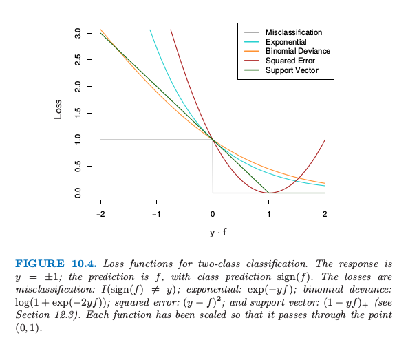

# 10.6 损失函数和鲁棒性

| 原文   | [The Elements of Statistical Learning](https://web.stanford.edu/~hastie/ElemStatLearn/printings/ESLII_print12.pdf#page=365) |
| ---- | ---------------------------------------- |
| 翻译   | szcf-weiya                               |
| 发布 | 2018-03-01 |
| 更新   | 2020-01-13 21:53:17                               |
| 状态 | Done|

这一节我们进一步讨论分类和回归中不同的损失函数，并且用它们对极端数据的鲁棒性来描述．

## 鲁棒的分类损失函数

!!! note "weiya 注: Recall"
    $$
    L(y,f(x))=\exp(-yf(x))\tag{10.8}\label{10.8}
    $$

    $$
    -l(Y,f(x))=\log(1+e^{-2Yf(x)})\tag{10.18}\label{10.18}
    $$

尽管指数损失 \eqref{10.8} 和二项偏差 \eqref{10.18} 当应用到总体的联合分布时会得到同样的解，但对于有限的数据集并不一样．两个准则都是“边缘(margin)” $yf(x)$ 的单调递减函数．在分类问题中（响应变量为 $-1/1$），$yf(x)$ 类似回归中的残差 $y-f(x)$．分类准则 $G(x)=\mathrm{sign}[f(x)]$ 表明有正边缘 $y_if(x_i)>0$ 的观测被分类正确，而有负边缘 $y_if(x_i)<0$ 的观测被错误分类．判别边界定义为 $f(x)=0$．分类算法的目标是得到尽可能频繁的正边缘．任何用于分类的损失标准应该惩罚负边缘比正边缘更重，因为正边缘的观测值已经被正确分类．

图 10.4 展示了指数 \eqref{10.8} 和二项偏差的标准作为边缘 $y\cdot f(x)$ 的函数的图象．也显示了误分类损失 $L(y,f(x))=I(y\cdot f(x) < 0)$，它给出了负边缘的单位惩罚，而对所有的正值没有惩罚．指数损失和二项偏差都可以看成是误分类损失的单调连续近似．它们不断地惩罚越来越大的负边际值，惩罚力度比它们回报越来越大的正边际值更重．它们的区别在于程度上．二项偏差的惩罚对于大的增加的负边缘线性增长，而指数标准对这样观测的影响指数增长．

> 图10.4. 两个类别分类的损失函数．响应变量为 $y=\pm 1$；预测值是 $f$，类别的预测为 $\sign(f)$．错误分类的损失：$I(\sign(f)\neq y)$；指数型：$\exp(-yf)$；二项偏差: $\log(1+\exp(-2yf))$；平方误差: $(y-f)^2$；以及支持向量：$(1-yf)_+$（见 [12.3 节](/12-Support-Vector-Machines-and-Flexible-Discriminants/12.3-Support-Vector-Machines-and-Kernels/index.html)）．每个函数已经进行了按照比例缩放使得过点 $(0,1)$．

在训练过程的任一个时刻，指数标准对具有大的负边际的观测值上有更大的影响．二项偏差相对地在这些观测上影响较小，在所有数据上的影响分散更均匀．也因此在白噪声设定（贝叶斯误差率不接近于0）中更加鲁棒，特别在训练数据中存在误分类标签的情形中．在这些情形下，AdaBoost 的表现从经验上看显著退化．

图中也显示了平方误差损失．在总体上对应风险的最小值点为
$$
f^*(x)=\mathrm{arg}\;\underset{f(x)}{\mathrm{min}}\E_{Y\mid x}(Y-f(x))^2=\E(Y\mid x)=2\cdot \Pr(Y=1\mid x)-1\tag{10.19}\label{10.19}
$$

和前面一样，分类的规则为 $G(x)=\sign[f(x)]$．平方误差损失不是误分类误差很好的选择．如图 10.4 所示，它不是关于 $yf(x)$ 的单调递减函数．对于边界值 $y_if(x_i)>1$ 平方增长，从而对正确分类为增加确定性的观测结果产生越来越大的影响（误差），所以降低了未正确分类的 $y_if(x_i) < 0$ 的相对影响．因此，如果目标是类别划分，则一个更好的损失函数要满足单调下降的准则．第12章的图 12.4 包括对平方损失的一个改动，“Huberized”平方铰链损失 (Rosset et al.，2004b[^1])，结合了二项偏差、平方损失和 SVM 铰链损失优良的性质．它与平方损失 \eqref{10.19} 有相同的总体最小值，当 $y\cdot f(x) > 1$为 0，当 $y\cdot f(x) < -1$ 变成线性．因为二项函数比指数更容易计算，我们的经验表明这是二项偏差的一个有用替代．

在 $K$ 分类问题中，响应变量 $Y$ 在无序集 $\cal G=\\{\cal G_1,\ldots,\cal G_k\\}$ 中取值．我们已经在 $\cal G$ 中寻找到了一个分类器 $G(x)$．若知道类别条件概率为 $p_k(x)=\Pr(Y={\cal G}\_k\mid x),k=1,2,\ldots,K$，则贝叶斯分类器为
$$
G(x)={\cal G_k}\;\text{where }k=\mathrm{arg}\;\underset{\ell}{\mathrm{max}}p_\ell(x)\tag{10.20}
$$
尽管原则上我们不需要知道 $p_k(x)$，只需要知道哪个最大．然而，在数据挖掘应用中，我们感兴趣的经常是类别概率 $p_\ell(x),\ell=1,\ldots,K$ 本身，而不是进行类别划分．像在 [4.4 节](../04-Linear-Methods-for-Classification/4.4-Logistic-Regression/index.html)中那样，逻辑斯蒂回归可以很自然地推广到 $K$ 个类别的情形，

$$
p_k(x) = \frac{e^{f_k(x)}}{\sum_{\ell=1}^Ke^{f_\ell(x)}}\tag{10.21}
$$

其中保证 $0\le p_k(x)\le 1$ 且和为 $1$．注意到这里我们有 $K$ 个函数，每个类别一个函数．函数 $f_k(x)$ 存在一个冗余，因为对每个加上任意函数 $h(x)$，模型不会改变．习惯上，设其中一个为 $0$：举个例子，$f_K(x)=0$，就像 \eqref{4.17} 式一样．

!!! note "weiya注：Recall"
    $$
    \begin{array}{ll}
    \log\dfrac{\Pr(G=1\mid X=x)}{\Pr(G=K\mid X=x)}&=\beta_{10}+\beta_1^Tx\\
    \log\dfrac{\Pr(G=2\mid X=x)}{\Pr(G=K\mid X=x)}&=\beta_{20}+\beta_2^Tx\\
    &\ldots\\
    \log\dfrac{\Pr(G=K-1\mid X=x)}{\Pr(G=K\mid X=x)}&=\beta_{(K-1)0}+\beta_{K-1}^Tx\\
    \end{array}
    \tag{4.17}\label{4.17}
    $$

这里我们更喜欢保持对称性，而且加上约束条件 $\sum_{k=1}^Kf_k(x)=0$．二项偏差可以自然地扩展到 $K$ 个类别的 **多项偏差 (multinomial deviance)** 损失函数：
$$
\begin{align}
L(y,p(x))&=-\sum\limits_{k=1}^KI(y=\cal G_k)\mathrm{log}p_k(x)\notag\\
&=-\sum\limits_{k=1}^KI(y={\cal G_k})f_k(x)+\mathrm{log}\left(\sum\limits_{\ell=1}^Ke^{f_\ell(x)}\right)\tag{10.22}\label{10.22}
\end{align}
$$
和在两个类别的情形中一样，准则 \eqref{10.22} 对不正确预测的惩罚关于不正确的程度仅仅是线性的．

Zhu et al. (2005)[^2]一般化了 $K$ 类别问题的指数损失．更多细节见[练习 10.5](https://github.com/szcf-weiya/ESL-CN/issues/74)．

!!! info "weiya注：Ex. 10.5"
    详细证明过程见[Issue 74: Ex. 10.5](https://github.com/szcf-weiya/ESL-CN/issues/74)

## 鲁棒的回归损失函数

在回归问题中，平方误差 $L(y,f(x))=(y-f(x))^2$ 和绝对值损失 $L(y,f(x))=\vert y-f(x)\vert$ 之间的关系类似指数损失和二项对数似然的关系．平方误差的总体解为 $f(x)=\E(Y\mid x)$，而绝对值损失的总体解为 $f(x)=\mathrm{median}(Y\mid x)$；对于对称的误差分布这些是一样的．然而，在有限样本上拟合过程中，平方误差损失更多地强调具有大的绝对值残差 $\vert y_i-f(x_i)\vert$ 的观测值上．因此它更不鲁棒，而且它的表现对于长尾误差分布严重退化，特别是对于总体错误测量的 $y$ 值（异常点）．其它更鲁棒的标准，比如绝对损失，在这些情形下表现得很好．在统计鲁棒性领域里，已经提出各种不同的回归损失准则，这些准则对总体异常点表现强烈的抵抗性（不是绝对的免疫），就像最小二乘处理高斯误差时一样有效．它们经常比任一适度的重尾的误差分布要好．其中一个这样的准则是用于 **$M$ 回归**(Huber，1964)[^3]的 Huber 损失准则

$$
L(y,f(x))=
\left\{
  \begin{array}{ll}
  [y-f(x)]^2&\text{for }\vert y-f(x)\vert \le\delta\\
  2\delta\vert y-f(x)\vert-\delta^2&\text{otherwise}
  \end{array}
\right.
\tag{10.23}
$$
图 10.5 比较了这三个损失函数．

> 图10.5. 回归的三种损失函数的比较，画出作为边缘 $y-f$ 的函数的图象．Huber损失函数结合了平方误差损失在0附近和绝对误差损失当$\vert y-f\vert$很大时的优点

这些考虑表明当需要关注鲁棒性时，特别是在数据挖掘的应用中（见 [10.7 节](10.7-Off-the-Shelf-Procedures-for-Data-Mining/index.html)），回归的平方误差损失和分类的指数损失从统计的角度来看都不是最好的标准．然而，它们都得到向前逐步加性建模中优美的模块化 boosting 算法．对于平方误差损失，每一步从当前模型的残差 $y_i-f_{m-1}(x_i)$ 来拟合基学习器．对于指数损失，对输出值 $y_i$ 进行加权的基学习器拟合，权重系数为 $w_i=\exp(-y_if_{m-1}(x_i))$．直接采用一个更加鲁棒的标准并不能在可行的 boosting 算法上面得到提高．然而，在 [10.10.2 节]()我们将说明怎么从任意可微的损失函数得到简单优美的 boosting 算法，从而得到高鲁棒性的 boosting 过程来进行数据挖掘．

[^1]: Rosset, S., Zhu, J. and Hastie, T. (2004b). Margin maximizing loss functions, in S. Thrun, L. Saul and B. Sch¨olkopf (eds), Advances in Neural Information Processing Systems 16, MIT Press, Cambridge, MA.
[^2]: Zhu, J., Zou, H., Rosset, S. and Hastie, T. (2005). Multiclass adaboost, Unpublished. [下载](../references/samme.pdf)
[^3]: Huber, P. (1964). Robust estimation of a location parameter, Annals of Mathematical Statistics 53: 73–101.