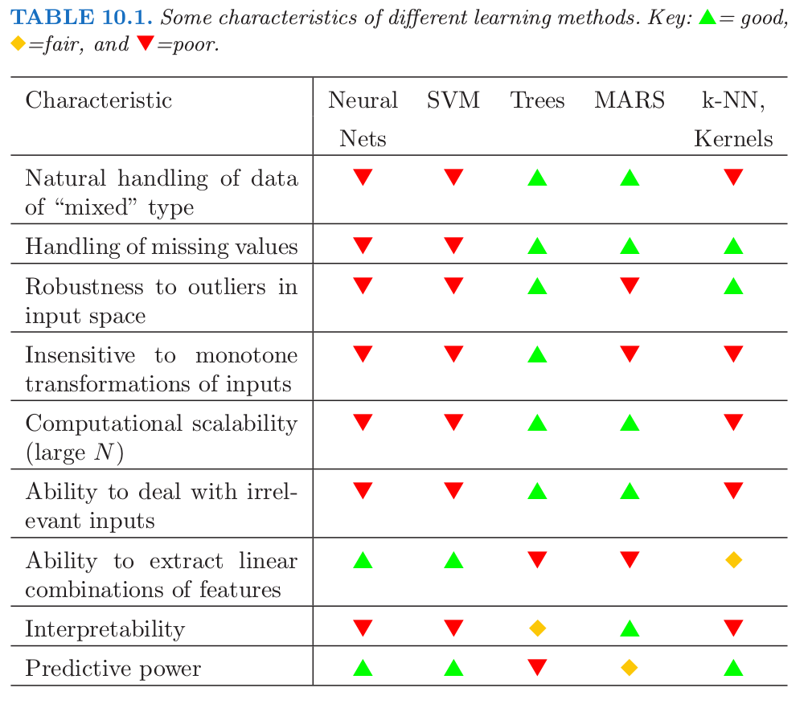

# 10.7 数据挖掘的现货方法

| 原文   | [The Elements of Statistical Learning](https://web.stanford.edu/~hastie/ElemStatLearn/printings/ESLII_print12.pdf#page=369) |
| ---- | ---------------------------------------- |
| 翻译   | szcf-weiya                               |
| 发布 | 2018-03-01 |
| 更新   | 2019-07-12 16:38:24                               |
| 状态 | Done|

**预测学习 (predictive learning)** 是数据挖掘中很重要的一部分．正如在这本书中看到的一样，已经提出了大量的方法对数据进行学习，然后预测．对于每个特定的方法，有些情形特别适用，但在其他情形表现得很差．我们已经试图在每个方法的讨论中明确合适的应用情形．然而，对于给定的问题，我们不会事先知道哪种方法表现得最好．表 10.1 总结了一些学习方法的特点．

工业和商业数据挖掘应用在学习过程的要求往往特别具有挑战性．数据集中观测值的个数以及每个观测值上衡量的变量个数往往都非常大．因此，需要注意计算的复杂度．并且，数据经常是混乱的 (messy)：输入往往是定量，二值以及类别型变量的混合，而且类别型变量往往有很多层次．一般还会有许多缺失值，完整的观测值是很稀少的．预测变量和响应变量的分布经常是 **长尾 (long-tailed)** 并且 **高偏的 (highly skewed)**．垃圾邮件的数据就是这种情形([9.1.2 节](../09-Additive-Models-Trees-and-Related-Methods/9.1-Generalized-Additive-Models/index.html))；当拟合一个广义可加模型，我们首先对每个预测变量进行对数变换以期得到合理的拟合．另外，它们通常会包含很大一部分的严重的误测量值（离群值）．预测变量通常在差异很大的尺度下进行测量．

在数据挖掘应用中，通常只有大量预测变量中的一小部分真正与预测值相关的变量才被包含在分析中．另外，不同于很多应用的是，比如模式识别，很少有可信的专业知识来创建相关的特征，或者过滤掉不相关的， 这些不相关的特征显著降低了很多方法的效果．

另外，数据挖掘一般需要可解释性的模型．简单地得到预测值是不够的．提供定性 (qualitative) 理解输入变量和预测的响应变量之间的关系的信息是迫切的．因此，**黑箱方法(black box)**，比如神经网络，在单纯的预测情形，比如模式识别中是很有用的，但在数据挖掘中不是很有用．

这些计算速度、可解释性的要求以及数据的混乱本性严重限制了许多学习过程作为数据挖掘的 **“现货”(off-the-shelf)** 方法．现货方法指的是可以直接应用到数据中而不需要大量时间进行数据预处理或者学习过程的精心调参．

在所有的有名的学习方法中，决策树最能达到数据挖掘的现货方法的要求．它们相对很快地构造出模型并且得到可解释的模型（如果树很小）．如 [9.2 节](../09-Additive-Models-Trees-and-Related-Methods/9.2-Tree-Based-Methods/index.html) 中讨论的，它们自然地包含数值型和类别型预测变量以及缺失值的混合．它们在对单个预测变量的（严格单调）的变换中保持不变．结果是，尺寸变换和（或）更一般的变换不是问题，并且它们不受预测变量中的离群值的影响．它们将中间的特征选择作为算法过程的一部分．从而它们抑制（如果不是完全不受影响）包含许多不相关预测变量． 决策树的这些性质在很大程度上是它们成为数据挖掘中最受欢迎的学习方法的原因．

树的不准确性导致其无法作为预测学习的最理想的工具．它们很少达到那个将数据训练得最好的方法的准确性．正如在 [10.1 节](../10-Boosting-and-Additive-Trees/10.1-Boosting-Methods/index.html)看到的，boosting 决策树提高了它们的准确性，经常是显著提高．同时它保留着数据挖掘中所需要的性质．一些树的优势被 boosting 牺牲的是计算速度、可解释性，以及对于 AdaBoost 而言，对重叠类的鲁棒性，特别是训练数据的误分类．**gradient boosted model(GBM)**是 tree boosting 的一般化，它试图减轻这些问题，以便为数据挖掘提供准确且有效的现货方法．
