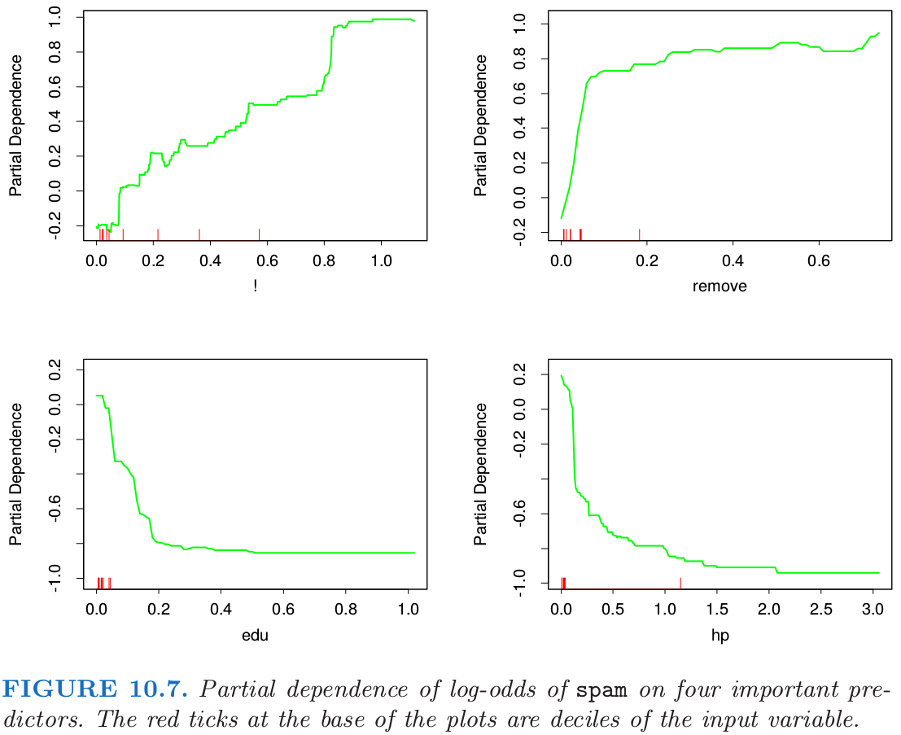
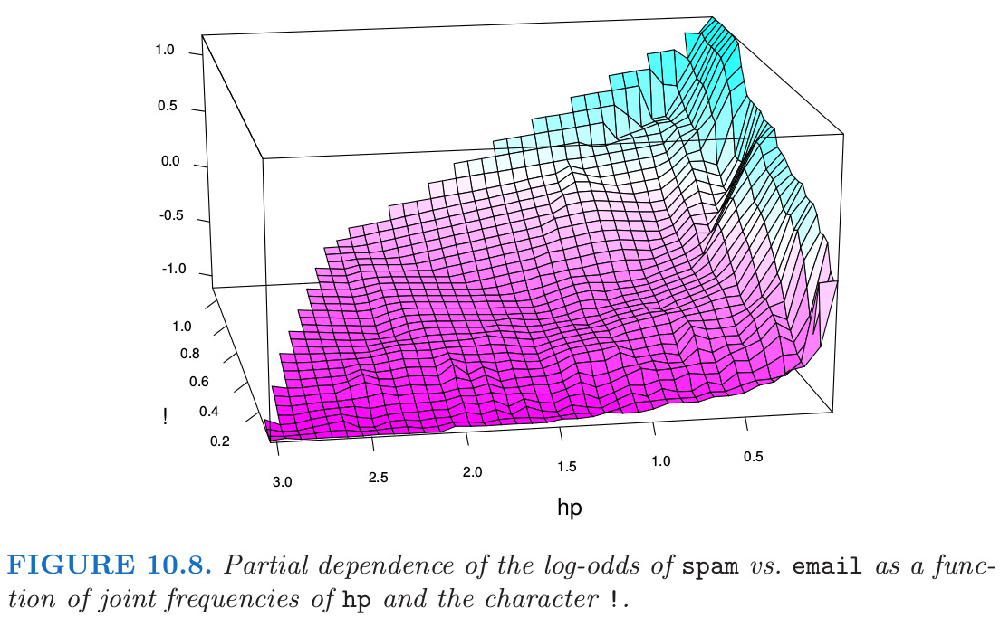

# 10.8 例子: 垃圾邮件

| 原文   | [The Elements of Statistical Learning](https://web.stanford.edu/~hastie/ElemStatLearn/printings/ESLII_print12.pdf) |
| ---- | ---------------------------------------- |
| 翻译   | szcf-weiya                               |
| 发布 | 2017-06-09 |
|更新|2020-01-14 14:53:37|
|状态|Done|

在我们讨论 gradient boosting 的细节之前，首先用一个二分类的问题来说明它的能力．垃圾邮件数据在第一章以及有过介绍，并且[第 9 章](/09-Additive-Models-Trees-and-Related-Methods/9.0-Introduction/index.html)的很多方法都将其作为例子（第 [9.1.2](/09-Additive-Models-Trees-and-Related-Methods/9.1-Generalized-Additive-Models/index.html#_3)，[9.2.5](/09-Additive-Models-Trees-and-Related-Methods/9.2-Tree-Based-Methods/index.html#_14)，[9.3.1](/09-Additive-Models-Trees-and-Related-Methods/9.3-PRIM/index.html#_1)，以及 [9.4.1](/09-Additive-Models-Trees-and-Related-Methods/9.4-MARS/index.html#_1)）．

对和 [9.1.2 节](/09-Additive-Models-Trees-and-Related-Methods/9.1-Generalized-Additive-Models/index.html#_3)一样的测试集应用 gradient boosting 会得到 4.5% 的测试误差．比较来看，可加逻辑斯蒂回归达到 5.5%，全生长并通过交叉验证剪枝 (fully grown and pruned by cross-validation) 的 CRAT 达到 8.7%，而 MARS 5.5%. 这些估计的标准差大概在 0.6%，通过 McNemar 检验，gradient boosting 显著地要比其它的好（[练习 10.6](https://github.com/szcf-weiya/ESL-CN/issues/214)）．

!!! info "weiya 注：Ex. 10.6"
    已解决，详见 [Issue 214: Ex. 10.6](https://github.com/szcf-weiya/ESL-CN/issues/214).

在后面的 [10.13 节](/10-Boosting-and-Additive-Trees/10.13-Interpretation/index.html)，我们对每个预测变量构造出相对重要性度量，以及描述变量对拟合模型的贡献的 **偏相依图 (partial dependence plot)**．我们现在对垃圾邮件数据说明这一点．

图 10.6 展示了对所有 57 个预测变量的相关重要性谱图．很明显，有些变量在将 `spam` 从 `email` 分离方面会更重要．字符串 `!`, `$`, `hp` 以及 `remove` 是四个最相关的预测变量．而在频谱的末端，字符串 `857`, `415`, `table` 和 `3d` 差不多没什么关系．

这里建模的是 `spam` 相对于 `email` 的对数比率，

$$
f(x) = \log \frac{\Pr(\text{spam}\mid x)}{\Pr(\text{email}\mid x)}\tag{10.24}\label{10.24}
$$

（见后面的 [10.13 节](/10-Boosting-and-Additive-Trees/10.13-Interpretation/index.html)）．

图 10.7 展示了对数比率在已选的重要预测变量上的偏相依性，`!` 和 `remove` 这两个跟 `spam` 正相关，以及两个负相关，`edu` 和 `hp`．这些特定的依赖性似乎本质上是单调的．这与通过可加逻辑斯蒂回归模型找到的对应的函数大体一致．见图 9.1.

!!! note "weiya 注：图 9.1"
    图 9.1 展示了关于 16 个预测变量的拟合函数，有三个共同预测变量，`remove`, `edu` 和 `hp`．从趋势上看，图 9.1 中这三个变量的拟合函数确实跟图 10.7 中对应的曲线趋势相同．
    
    

在这些数据上运行 $J=2$ 个终止结点的 gradient boosted 模型得到一个关于对数比率的完全可加模型（**主要影响 (main effects)**），对应的误差率为 4.7%，跟全 gradient boosted 模型（终止结点个数为 $J=5$）的 4.5% 相比．尽管不是显著差异，但是这略高的误差率表明在某些重要的预测变量间存在 **交叉影响 (interactions)**．这可以通过双变量偏相依性图来诊断．图 10.8 展示了其中一张表现出强交叉影响的图．

可以看到，对于频率非常低的 `hp`，`spam` 的对数比率大幅提高．对于高频率时的 `hp`，`spam` 的对数比率趋向于非常低，而且近似是 `!` 的常数函数．当 `hp` 的频率降低时，其跟 `!` 的函数关系在增强． 