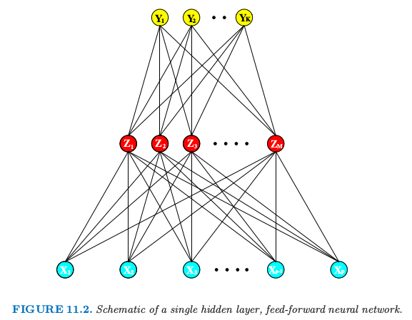

# 11.3 神经网络

| 原文   | [The Elements of Statistical Learning](https://web.stanford.edu/~hastie/ElemStatLearn/printings/ESLII_print12.pdf#page=411) |
| ---- | ---------------------------------------- |
| 翻译   | szcf-weiya                               |
| 发布 | 2017-02-08 |
|更新|2019-02-16 15:57:15|
|状态|Done|

**神经网络**已经进化成包含许多类模型和学习方法．这里我们描述一个使用最广泛的“vanilla”神经网络，有时候也称为单隐藏层的向后传播网络，或者单层感知器．有大量宣传吹捧神经网络，使得它们看起来很奇幻和神秘．正如我们在这章中弄清楚它，它们仅仅是非线性统计方法，很像上面我们讨论的投影寻踪回归．

神经网络是两步回归或者分类的模型，一般用图 11.2 中的网络图来表示．这个网络可以应用到回归或者分类上．对于回归，一般地 $K=1$，并且在顶部仅有一个输出元 $Y_1$．然而，这些网络可以解决很自然地处理多重定量响应变量的问题，所以我们将要处理最一般的情形．

> 图 11.2 单隐藏层、向前反馈的神经网络概要图

对于 $K$ 个类别的分类问题，在顶部有 $K$ 个单元，第 $k$ 个单元表示类别 $k$ 的概率．有 $K$ 个目标测量$Y_k,k=1,2,\ldots,K$，对于第 $k$ 个类别编码为 0-1 变量．

派生特征 $Z_m$ 是由输入的线性组合得到的，然后目标 $Y_k$ 被建模成 $Z_m$ 线性组合的函数，
$$
\begin{align*}
Z_m&=\sigma(\alpha_{0m}+\alpha_m^TX),m=1,2,\ldots,M\\
T_k&=\beta_{0k}+\beta_k^TZ,k=1,\ldots,K,\\
f_k(X)&=g_k(T),k=1,\ldots,K
\end{align*}
\tag{11.5}
\label{11.5}
$$
其中 $Z=(Z_1,Z_2,\ldots,Z_M)$，以及 $T=(T_1,T_2,\ldots,T_K)$

激活函数 $\sigma(v)$ 通常取 sigmoid 函数 $\sigma(v)=1/(1+e^{-v})$; 图 11.3 展示了 $1/(1+e^{-v})$ 的图象．有时 $\sigma(v)$ 取为高斯径向基函数，得到所谓的 **径向基函数网络 (radical basis function network)**．

> 图 11.3. sigmoid 函数 $\sigma(v)=1/(1+\exp(-v))$ 的图象（红色曲线），经常应用在神经网络的隐藏层中．图中也画出了 $s=\frac{1}{2}$ 时的 $\sigma(sv)$ 图象（蓝色曲线），以及 $s=10$ 时（紫色曲线）．缩放参数 $s$ 控制着激活率，而且我们可以看到 $s$ 越大，$v=0$ 处越难激活．注意到 $\sigma(s(v-v_0))$ 平移活性阈值从 0 移动到 $v_0$．

!!! note "weiya 注：其他形式的激活函数"

    - tanh: $g(z) = \frac{e^z-e^{-z}}{e^z+e^{-z}}$
    - rectified linear unit (ReLU): $g(z) = z_+$
    - leaky rectified linear unit: $g_\alpha(z)=z_+-\alpha z_-$

    采用 Julia 绘制它们的图象，
    
    
    

类似图 11.2 的神经网络有时画一个额外的 bias 单元馈送到隐藏层和输出层的每个单元．将常数 1 看成是额外的输入特征，这个 bias 单元捕捉模型 $\eqref{11.5}$ 的截距项 $\alpha_{0m}$ 和 $\beta_{0k}$.

输出函数 $g_k(T)$ 允许对输出向量 $T$ 进行最后的变换．对于回归，我们一般选择单位函数 $g_k(T)=T_k$．在 $K$ 类别分类问题的早期工作中也使用单位函数，但是后来丢弃了而采用 softmax 函数

$$
g_k(T)=\frac{e^{T_k}}{\sum_{\ell=1}^Ke^{T_\ell}}\tag{11.6}
$$

这与在多重 logit 模型使用的变换完全一样（[4.4 节](../04-Linear-Methods-for-Classification/4.4-Logistic-Regression/index.html)），而且得到正的估计值且和为 1．在 [4.2 节](../04-Linear-Methods-for-Classification/4.2-Linear-Regression-of-an-Indicator-Matrix/index.html)，我们用线性激活函数讨论其他问题，特别是潜在的严重掩饰影响 (masking effects)．

网络的中间层的单元，计算派生的特征 $Z_m$，之所以被称作 **隐藏层 (hidden units)** 是因为值 $Z_m$ 不是直接被观测到．一般地，正如在本章的最后的例子说明的那样，可能存在多个隐藏层．我们可以把 $Z_m$ 看成是原始输入 $X$ 的基展开；神经网络则是用这些变换作为输入的标准线性模型、或者是线性多重逻辑斯蒂模型．然而，这是一个在[第 5 章](../05-Basis-Expansions-and-Regularization/5.1-Introduction/index.html)中讨论的基展开技巧上的重要改进；这里基函数的参数是从数据中学习．

注意到如果 $\sigma$ 为单位函数，则整个模型在输入中退化为线性模型．因此神经网络可以看成是线性模型的非线性的推广，可以应用到回归和分类．通过引入非线性变换 $\sigma$，它可以显著扩大线性模型类别的种类．图 11.3 中，我们看到 sigmoid 函数激活率取决于 $\alpha_m$ 的范数，并且如果 $\Vert \alpha_m\Vert$ 非常小，单元实际作用在激活函数的线性部分．

也注意到含一个隐藏层的神经网络模型实际上与前面讨论的投影寻踪模型是一样的．不同之处在于 PPR 模型采用非参函数 $g_m(v)$，而神经网络模型采用一个基于 $\sigma(v)$ 更简单的函数，变量里面有三个自由参数．具体点，将神经网络模型看成是一个 PPR 模型，我们有

$$
\begin{align}
g_m(\omega_m^TX)&=\beta_m\sigma(\alpha_{0m}+\alpha_m^TX)\notag\\
&=\beta_m\sigma(\alpha_{0m}+\Vert \alpha_m\Vert(\omega_m^TX))\tag{11.7}
\end{align}
$$

其中 $\omega_m=\alpha_m/\Vert \alpha_m\Vert$ 是 $m$ 元单位向量．因为 $\sigma_{\beta,\alpha_0,s}(v)=\beta\sigma(\alpha_0+sv)$ 比更一般的非参函数 $g(v)$ 复杂度更低，所以当一个神经网络可能使用 20 或 100 个这样的函数，而 PPR 模型一般使用更少的项（举个例子，$M=5$ 或 $10$），也不觉得奇怪了．

!!! info "weiya 注：Ex. 11.1"
    Ex. 11.1 讨论了单层回归（分类）神经网络与 PPR 模型的等价性．该题已解决，欢迎讨论，详见 [Issue 171: Ex. 11.1](https://github.com/szcf-weiya/ESL-CN/issues/171)．

最后，我们注意到“神经网络”的名字源于它们一开始被看成人类大脑的模型而发展的事实．每个单元代表一个神经元，而连接（图 11.2 中的连线）表示突触．在早期模型中，当传递到该单元的总信号超过某一阈值，神经元被激发．在上面的模型中，这对应 $\sigma(Z)$ 和 $g_m(T)$ 的阶梯函数的使用．后来神经网络被看成是非线性统计建模的一个有用工具，为了这一目的，阶梯函数对于优化来说不是充分地光滑．因此阶梯函数被更光滑的阈值函数替代，阈值函数为图 11.3 的 sigmoid 函数．
