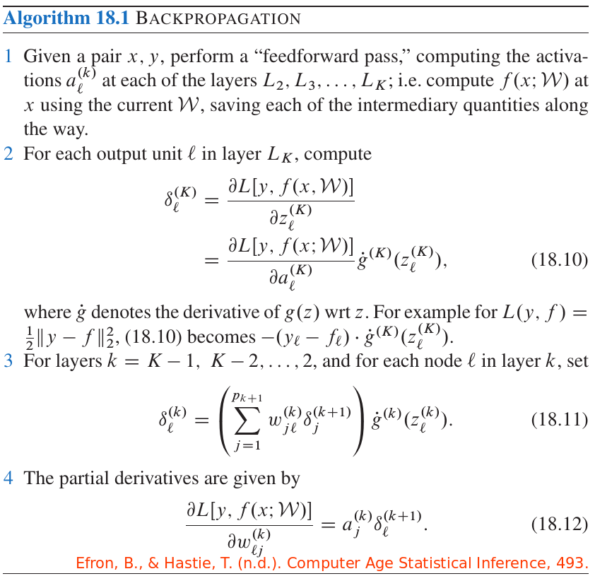

# 11.4 拟合神经网络

| 原文   | [The Elements of Statistical Learning](https://web.stanford.edu/~hastie/ElemStatLearn/printings/ESLII_print12.pdf#page=414) |
| ---- | ---------------------------------------- |
| 翻译   | szcf-weiya                               |
| 发布 | 2017-02-08 |
|更新|2019-02-16 16:13:40|
|状态|Done|

神经网络模型中未知的参数，通常称为 **权重 (weights)**，我们需要寻找它们的值使得模型很好地拟合训练数据．我们将参数的全集记为 $\theta$，包括

$$
\begin{align*}
\{\alpha_{0m},\alpha_m;m=1,2,\ldots,M\}\;&M(p+1)\text{ 个权重}\\
\{\beta_{0k},\beta_k;k=1,2,\ldots,K\}\;&K(M+1)\text{ 个权重}
\end{align*}                                  
\tag{11.8}
$$

对于回归，我们采用误差平方和用于衡量拟合的效果（误差函数）

$$
R(\theta)=\sum\limits_{k=1}^K\sum\limits_{i=1}^N(y_{ik}-f_k(x_i))^2\tag{11.9}
$$

对于分类，我们可以采用平方误差或者交叉熵（偏差）：

$$
R(\theta)=-\sum\limits_{i=1}^N\sum\limits_{k=1}^Ky_{ik}\mathrm{log}\;f_k(x_i)\tag{11.10}
$$

以及对应的分类器 $G(x)=\mathrm{arg\; max}_kf_k(x)$．有了 softmax 激活函数和交叉熵误差函数，神经网络模型实际上是关于隐藏层的线性逻辑斯蒂回归模型，而且所有的参数通过极大似然来估计．

一般地，我们不想要 $R(\theta)$ 的全局最小值，因为这可能会是一个过拟合解．而是需要一些正则化：这个可以通过惩罚项来直接实现，或者提前终止来间接实现．下一节中将给出详细的细节．

最小化 $R(\theta)$ 的一般方法是通过梯度下降，在这种情形下称作 **向后传播 (back-propagation)**．因为模型的组成成分，运用微分的链式法则可以很简单地得到梯度．这个可以通过对网络向前或向后遍历计算得到，仅跟踪每个单元的局部量．

!!! note "weiya 注：Recall \eqref{11.5}"
    $$
    \begin{align*}
    Z_m&=\sigma(\alpha_{0m}+\alpha_m^TX),m=1,2,\ldots,M\\
    T_k&=\beta_{0k}+\beta_k^TZ,k=1,\ldots,K,\\
    f_k(X)&=g_k(T),k=1,\ldots,K
    \end{align*}
    \tag{11.5}
    \label{11.5}
    $$

下面是对于平方误差损失的向后传播的细节．由 \eqref{11.5} 式令 $z_{mi}=\sigma(\alpha_{0m}+\alpha_m^Tx_i)$，并令 $z_i=(z_{1i},z_{2i},\ldots,z_{Mi})$，则我们有

$$
\begin{align*}
R(\theta)&\equiv\sum\limits_{i=1}^NR_i\\
&=\sum\limits_{i=1}^N\sum\limits_{k=1}^K(y_{ik}-f_k(x_i))^2\tag{11.11}
\end{align*}
$$

微分为

$$
\begin{align*}
\frac{\partial R_i}{\partial \beta_{km}}&=-2(y_{ik}-f_k(x_i))g'_k(\beta_k^Tz_i)z_{mi}\\
\frac{\partial R_i}{\partial \alpha_{m\ell}}&=-\sum\limits_{k=1}^K2(y_{ik}-f_k(x_i))g'_k(\beta_k^Tz_i)\beta_{km}\sigma'(\alpha_m^Tx_i)x_{i\ell}
\end{align*}
\tag{11.12}
\label{11.12}
$$

给定这些微分，梯度下降在第 $(r+1)$ 步迭代更新为

$$
\begin{align*}
\beta_{km}^{(r+1)}&=\beta_{km}^{(r)}-\gamma_r\sum\limits_{i=1}^N\frac{\partial R_i}{\partial \beta_{km}^{(r)}}\\
\alpha_{m\ell}^{(r+1)}&=\alpha_{m\ell}^{(r)}-\gamma_r\sum\limits_{i=1}^N\frac{\partial R_i}{\partial\alpha_{m\ell}^{(r)}}
\end{align*}
\tag{11.13}
\label{11.13}
$$

其中 $\gamma_r$ 为 **学习速度 (learning rate)**，将在下面讨论．

现在将 $\eqref{11.12}$ 式写成
$$
\begin{align*}
\frac{\partial R_i}{\partial \beta_{km}}&=\delta_{ki}z_{mi}\\
\frac{\partial R_i}{\partial \alpha_{m\ell}}&=s_{mi}x_{i\ell}
\end{align*}
\tag{11.14}
\label{11.14}
$$
$\delta_{ki}$ 和 $s_{mi}$ 的值分别为当前模型在输出和隐藏层单元的误差．从它们的定义来看，它们满足
$$
s_{mi}=\sigma'(\alpha_m^Tx_i)\sum\limits_{k=1}^K\beta_{km}\delta_{ki}\tag{11.15}\label{11.15}
$$
上式称为 **向后传播等式 (back-propagation equations)**．用这个等式，$\eqref{11.13}$ 的更新可以通过 two-pass 算法来实现．在 forward pass，固定当前权重，预测值 $\hat f_k(x_i)$ 通过 (11.5) 式计算．在 backward pass，计算当前误差 $\delta_{ki}$，接着向后传播通过 $\eqref{11.15}$ 式给出误差 $s_{mi}$．则两个误差都用来计算 $\eqref{11.13}$、$\eqref{11.14}$ 中更新的梯度．

!!! note "weiya 注：向后传播的算法形式"
    记
    $$
    \begin{align*}
    z^{(k)} &= \W^{(k-1)}a^{(k-1)}\\
    a^{(k)} &= g^{(k)}(z^{(k)})\,,
    \end{align*}
    $$
    其中 $\W^{(k-1)}$ 表示从 $L_{k-1}$ 层到 $L_k$，$a^{(k)}$ 是 $L_k$ 层所有的激活向量，并假设激活函数 $g^{(k)}$ 逐个元素地作用在向量上，则可以整理出向后传播的算法形式：
    
    

    注意图中的符号含义与 ESL 中稍有不同．

这个 two-pass 过程称作向后传播．也被称为 delta rule (Widrow and Hoff, 1960[^1])．交叉熵计算的组分与平方误差函数和有同样的形式，并且在[练习 11.3]() 中被导出来．

向后传播的优点在于简单，局部自然．在向后传播算法中，每个隐藏层单元仅仅向（从）有其联系的单元传递（接收）信息．因此可以在并行架构的计算机上高效地实现．

$\eqref{11.13}$ 式的更新是一种 batch learning，参数更新为所有训练情形的和．学习也可以 online 地进行——每次处理一个观测，每个训练情形过后更新梯度，然后对训练情形重复多次．在这种情形下，$\eqref{11.13}$ 式的和可以替换成单个被加数．训练时期 (training epoch) 指的是一次扫描整个训练集．在线 (online) 训练允许网络处理非常大的训练集，而且当新观测加入时更新权重．

batch learning 的学习速率 $\gamma_r$ 经常取为常数，而且可以通过在每次更新时运用线搜索最小化误差函数来优化．online 学习中，当 $r\rightarrow \infty$ 时 $\gamma_r$ 应当下降减为 0．这个学习是 **随机近似 (stochastic approximation)** 的形式 (Robbins and Munro, 1951[^2])；如果 $\gamma_r\rightarrow \infty,\sum_r\gamma_r=\infty$，且 $\sum_r\gamma_r^2<\infty$，（举个例子，$\gamma_r=1/r$ 便满足条件）则在这个领域内的结果保证收敛．

向后传播可以非常慢，而且因为这个原因经常不选择这个方法．像牛顿法的二阶技巧在这里不是很好，因为 $R$ 的二阶微分矩阵（Hessian 阵）可以变得非常大．更好的拟合方式包括共轭梯度法以及变量度量方法．它们避免直接计算二阶微分矩阵但仍能提供很快的收敛性．

[^1]: Widrow, B. and Hoff, M. (1960). Adaptive switching circuits, IRE WESCON Convention record, Vol. 4. pp 96-104; Reprinted in Andersen and Rosenfeld (1988).
[^2]: Robbins, H. and Munro, S. (1951). A stochastic approximation method, Annals of Mathematical Statistics 22: 400–407.
