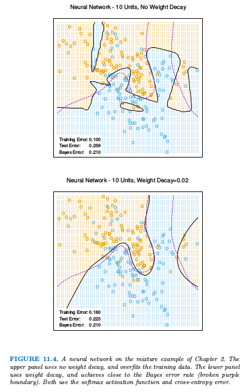
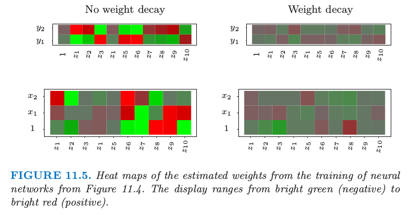

# 11.5 训练神经网络的一些问题

| 原文   | [The Elements of Statistical Learning](https://web.stanford.edu/~hastie/ElemStatLearn/printings/ESLII_print12.pdf) |
| ---- | ---------------------------------------- |
| 翻译   | szcf-weiya                               |
| 发布 | 2017-02-08 |
|更新|2019-02-16 16:59:50|
|状态|Done|

训练神经网络真的是一门艺术．模型一般会过参量化，而且优化问题非凸而且不稳定，除非遵循某确定的方式．在这节我们总结一些重要的问题．

## 初始值

注意如果权重接近 0，则 sigmoid（图 11.3）起作用的部分近似线性，因此神经网络退化成近似线性模型（[练习 11.2](https://github.com/szcf-weiya/ESL-CN/issues/177)）．通常权重系数的初始值取为接近 0 的随机值．因此模型开始时近似线性，当系数增大时变成非线性．需要的时候局部化单个单元的方向并且引入非线性．恰巧为 0 的权重的使用导致 0 微分和完美的对称，而且算法将不会移动．而以较大的值开始经常带来不好的解．

## 过拟合

通常神经网络有太多的权重而且在 $R$ 的全局最小处过拟合数据．在神经网络的发展早期，无论是设计还是意外，采用提前终止的规则来避免过拟合．也就是训练一会儿模型，在达到全局最小前终止．因为权重以高正则化（线性）解开始，这有将最终模型收缩成线性模型的效果．验证集对于决定什么时候停止是很有用的，因为我们期望此时验证误差开始增长．

一个更明显的正则化方法是 **权重衰减 (weight decay)**，类似用于线性模型的岭回归（[3.4.1 节](../03-Linear-Methods-for-Regression/3.4-Shrinkage-Methods/index.html)）．我们对误差函数加上惩罚 $R(\theta)+\lambda J(\theta)$，其中
$$
J(\theta)=\sum\limits_{km}\beta_{km}^2+\sum\limits_{m\ell}\alpha_{m\ell}^2\tag{11.16}\label{11.16}
$$
$\lambda\ge 0 $是一个调整参数．更大的 $\lambda$ 有将系数收缩到 0 的趋势：一般地，采用交叉验证估计 $\lambda$．惩罚项带来的影响是简单地在（11.13）的梯度表达式上分别加上 $2\beta_{km}$ 和 $2\alpha_{m\ell}$．也有提出其他形式的惩罚项，举个例子，
$$
J(\theta)=\sum\limits_{km}\frac{\beta_{km}^2}{1+\beta_{km}^2}+\sum\limits_{m\ell}\frac{\alpha_{m\ell}^2}{1+\alpha_{m\ell}^2}\tag{11.17}
$$
也称作 **权重消去 (weight elimination)** 惩罚．这比 $\eqref{11.16}$ 更能收缩系数．

> 图 11.4. 第 2 章混合例子的神经网络模型．上图没有采用系数衰减，对训练数据有过拟合．下图用了系数衰减，而且与贝叶斯误差率（紫色虚线边界）相近．两者都是采用softmax激活函数以及交叉熵误差．

图 11.4 显示了对第 2 章中混合例子训练含 10 个隐藏单元的神经网络的结果，上图没有系数衰减的情形，下图是加上权重衰减的情形．权重衰减显然提高了预测效果．图 11.5 显示了从训练及中估计的参数的热图（黑白版本的图象称为 Hinton 图）．我们看到系数衰减对两层的权重系数都有抑制：最终的权重系数在十个隐藏单元上分布相当均匀．

> 图 11.5 对图 11.4 神经网络的进行训练得到的估计权重系数的热图．显示范围为从亮绿（负）到亮红（正）．

## 输入的缩放

因为对输入的缩放决定了在底层中系数缩放的效率，所有它可以对最终解有很大的影响．最开始最好是对所有输入进行标准化使均值为 0，标准差为 1．这保证了在正则化过程中对所有输入公平对待，而且允许为随机的初始权重系数选择一个有意义的区间．有了标准化的输入，一般在 $[-0.7,+0.7]$ 范围内均匀随机选择权重系数．

## 隐藏单元和层的个数

一般来说，太多的隐藏单元比太少的隐藏单元要好．太少的隐藏单元，模型或许没有足够的灵活性来捕捉数据的非线性；太多的隐藏单元，如果使用了合适的正则化，额外的权重系数可以收缩到 0．一般地，隐藏单元的数量处于 5 到 100 的范围之内，而且随着输入个数、训练情形的种数的增加而增加．最常见的是放入相当大数量的单元并且进行正则化训练．一些研究者采用交叉验证来估计最优的数量，但是当交叉验证用来估计正则化系数这似乎是不必要的．隐藏层的选择由背景知识和经验来指导．每一层提取输入的特征用于回归或者分类．多重隐藏层的使用允许在不同的分解层次上构造层次特征．[第 11.6 节](11.6-Example-of-Simulated-Data.md)给出了多层有效使用的一个例子．

## 多重最小点

误差函数 $R(\theta)$ 为非凸，具有许多局部最小点．后果是最终得到的解取决于权重系数的初始值．至少需要尝试一系列随机的初始配置，然后选择给出最低（惩罚）误差的解．或许更好的方式是在对一系列网络的预测值进行平均作为最终的预测（Ripley，1996[^1]）．这比平均权重系数更好，因为模型的非线性表明平均的解会很差．另一种方式是通过 bagging，它是对不同网络的预测值进行平均，这些网络是对随机扰动版本的训练数据进行训练得到的．这在 [8.7 节](../08-Model-Inference-and-Averaging/8.7-Bagging/index.html)中有描述．

[^1]: Ripley, B. D. (1996). Pattern Recognition and Neural Networks, Cambridge University Press.
