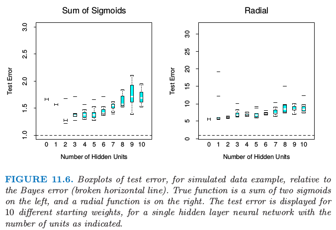
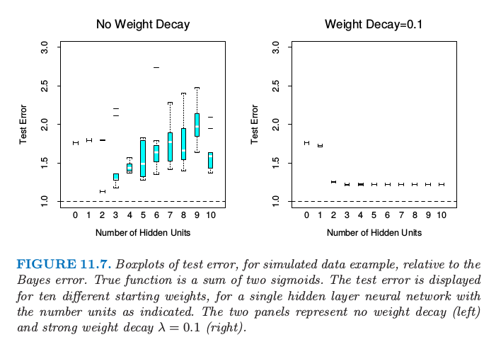
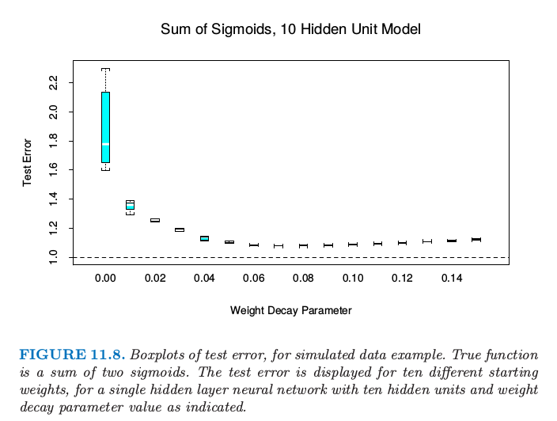

# 11.6 例子：模拟数据

| 原文   | [The Elements of Statistical Learning](https://web.stanford.edu/~hastie/ElemStatLearn/printings/ESLII_print12.pdf) |
| ---- | ---------------------------------------- |
| 翻译   | szcf-weiya                               |
| 发布 | 2017-02-08 |
|更新|2017-12-28|

!!! note "更新笔记"
    @2017-12-28 挺惭愧的！直到今天才认真地从零开始写了个简单的神经网络代码，具体代码详见[Notebook for Simple Neural Network](http://nbviewer.jupyter.org/github/szcf-weiya/TFnotes/blob/master/nn/nn.ipynb)．对于本节的例子，我也写了份代码试图重现书中的结果，代码详见[Notebook for this Section](http://nbviewer.jupyter.org/github/szcf-weiya/ESL-CN/blob/master/code/nn/Implementation-for-Section-6.ipynb)

我们从两个可加误差模型 $Y=f(X)+\varepsilon$ 中产生数据：
$$
\begin{align*}
\text{Sum of sigmoids: }& Y=\sigma(a_1^TX)+\sigma(a_2^TX)+\varepsilon_1\\
\text{Radial: }&Y=\prod\limits_{m=1}^{10}\phi(X_m)+\varepsilon_2
\end{align*}
$$
这里 $X^T=(X_1,X_2,\ldots,X_p)$，每个 $X_j$ 是标准高斯变量，第一个模型中 $p=2$，第二个模型中 $p=10$.

对于sigmoid模型，$a_1=(3,3),a_2=(3,-3)$；对于径向模型，$\phi(t)=(1/2\pi)^{1/2}exp(-t^2/2)$.$\varepsilon_1$和$\varepsilon_2$都是高斯误差，选择方差使得两个模型的信噪比都为4.
$$
\frac{Var(E(Y\mid X))}{Var(Y-E(Y\mid X))}=\frac{Var(f(X))}{Var(\varepsilon)}\tag{11.18}
$$
我们取大小为100的训练集和大小为10000的测试集．我们采用权重系数衰减和不同的隐藏单元来拟合神经网络，然后记录10个随机初始权重系数值情形下的平均测试误差$E_{Test}(Y-\hat f(X))^2$．虽然只产生了一个训练集，但是结果是“平均”的训练集的典型．测试误差展示在图11.6中．注意到0个隐藏层单元指的是线性最小二乘回归．神经网络对于sigmoid函数之和的模型拟合效果很好，而且当有两个神经元时效果最好，非常接近贝叶斯误差率．（回忆一下，回归的平方误差的贝叶斯误差率是误差的方差；这张图中是测试误差相对于贝叶斯误差的比例）然而，注意到更多的隐藏层单元，很快便出现了过拟合，而且有些权重系数的初始值比线性模型（0个隐藏单元）拟合得还差．即便是2个隐藏单元的情形，10个权重系数的初始值中有两个的结果不好于线性模型，证实了多重初始值的重要性．

> 图11.6 模拟数据例子的测试误差相对于贝叶斯误差（水平虚线）的箱线图．左图的真实函数是两个sigmoid函数之和，右图是径向函数．对于具有所指示单元数目的单个隐藏层神经网络，显示10个不同起始权重的测量误差．

在某种程度上径向函数对于神经网络是最困难的，因为它是球对称且没有偏好的方向．我们可以从图11.6的右图中看出在这种情形下缺失效果很差，测试误差远远超出贝叶斯误差（注意与左图不同的垂直刻度）．事实上，因为常值拟合（比如样本均值）的相对误差率达到5（当SNR为4），我们看到神经网络比均值表现得越来越差．

这个例子中我们采用一个固定的系数衰减参数0.0005，表现一个温和的正则化．图11.6的左图的结果表明在更多隐藏单元的情形下需要更多的正则化．

> 图11.7. 模拟数据例子的测试误差相对于贝叶斯误差的箱线图．真实函数是两个sigmoid函数之和．对于具有所指示单元数目的单个隐藏层神经网络，显示10个不同起始权重的测量误差．两个图分别表示无系数衰减（左边）和强误差衰减$\lambda=0.1$(右图)

图11.7中，我们对两sigmoids和的模型重复实验，左边图没有系数衰减，右边图为更强的系数衰减($\lambda=0.1$).没有系数衰减时，越多的隐藏单元，过拟合变得越严重．系数衰减值$\lambda=0.1$在所有隐藏神经元个数的情形下都能得到好结果，当隐藏单元的个数增加并不表现出过拟合的现象．最后，图11.8显示了含10个隐藏单元神经网络的测试误差随着不同衰减参数的变化．值为0.1时近似是最优的．

> 图11.8. 对于模拟数据例子的测试误差的箱线图．真实函数为两个sigmoid函数之和．对于具有所指示单元数目的单个隐藏层神经网络，显示10个不同起始权重的测量误差．

总的来说，有两个自由参数需要选择：权重衰减参数$\lambda$和隐藏层的数目$M$．作为一个学习的策略，可以在对应的最小约束模型下固定任一个参数，来确保模型足够丰富，并且运用交叉验证来选择另一个参数．这里最少约束值为0权重衰减和10个隐藏层单元．将图11.7的左图与图11.8相比，我们可以看到测试误差对于系数衰减更不敏感，因此此参数的交叉验证会更好．
