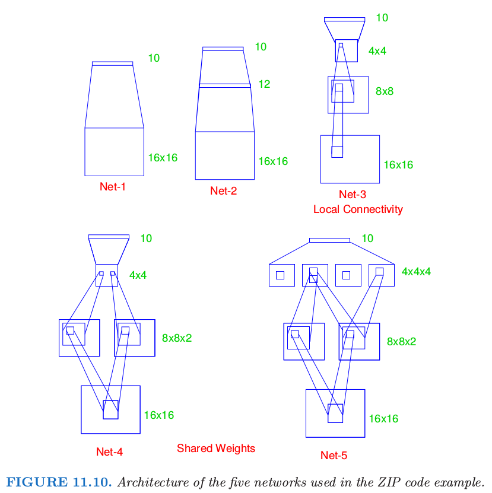
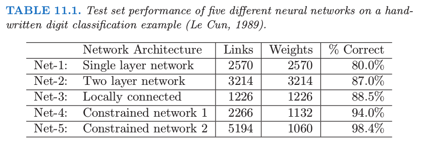

# 11.7 例子：邮编数据

| 原文   | [The Elements of Statistical Learning](https://web.stanford.edu/~hastie/ElemStatLearn/printings/ESLII_print12.pdf) |
| ---- | ---------------------------------------- |
| 翻译   | szcf-weiya                               |
| 发布 | 2017-12-28 |

这个例子是字体识别任务：对手写字母分类．这个问题引起了机器学习和神经网络社区数年的关注，并且仍是该领域的基准问题．图11.9展示了标准化手写字体的一些例子，这是从美国邮局服务的信封中自动扫描得到的．原始的扫描数字是二值的且有不同的大小和朝向；这里展示的图象已经被deslanted且大小被标准化了，最终得到$16\times 16$的灰白图象（Le Cun et al., 1990[^1]）．这256个像素值作为神经网络分类器的输入．

黑箱神经网络不适合这个特征识别任务，一部分是因为图象的像素表示缺少具体的不变量（比如图象微小的旋转）．结果使得早期神经网络的尝试得到将近4.5%的误分类率．在这一节我们展示一些利用神经网络克服这些不足的开拓性研究（Le Cun, 1989[^2]），最终导致了神经网络性能的最佳状态(Le Cun et al., 1998[^3])．

尽管当前数字数据集已经有成千上万的训练集和测试集，但这里为了强调其效果而特意取中等的样本大小．这些例子是通过扫描部分真实的手写字体然后通过随机偏离产生另外的图象得到的．具体细节可以在Le Cun (1989)[^2]中找到．在训练集中有320个手写数字，而在测试集中有160个．

对这些数据应用五个不同的网络进行拟合．

- Net-1: 无隐藏层，等价于多项逻辑斯蒂回归．
- Net-2: 一个隐藏层，12个隐藏单元全部连接．
- Net-3: 两个隐藏层局部连接．
- Net-4: 两个隐藏层局部连接，并且共享权重．
- Net-5: 两个隐藏层局部连接，两层权重共享．

这些展示在图11.10中．

Net-1有256个输入，每一个是 $16\times 16$ 输入像素点中的一个，对应0-9数字的 $10$ 个输出．预测值 $\hat f_k(x)$ 表示图象$x$属于类别$k, k=0,1,\ldots,9$的概率．

所有网络都有 sigmoidal 输出单元，而且用误差函数的平方和来拟合．第一个网络没有隐藏单元，因此近似等于线性多项式回归模型．Net-2是有12个隐藏单元的单层神经网络，是上面所描述的情形．

所有的网络的训练集误差为 $0\%$，因为在所有情形中，参数个数多于训练观察值的个数．在训练期册书误差的变化展示在图11.11中．线性网络(Net-1)迅速过拟合，而其它网络的测试效果相继在更优的值出趋于平稳．

其它三个网络有额外的体现神经网络范式的威力和灵活性的特征．它们在网络中引入约束，对于我们现在的问题是很自然的，这允许更复杂的连接性但更少的参数．

Net-3采用局部连接性：这意味着每个隐藏单元仅仅与下一层的一小片单元有联系．在第一个隐藏层（$8\times 8$的数组），从输入层的$3\times 3$小片中获得输入；对于第一个隐藏层中相隔一个单元的单元，它们的接受域(receptive fields)被一行或一列重叠，因此相隔两个像素．在第二个隐藏层，从$5\times 5$的小片中获取输入，同样地，相隔一个单元的单元的接受域相隔两个单元．其它的联系的权重设为0．局部连接性使得每个单元对从下层提取的局部特征负责，并且显著减少了权重的总个数．比Net-2有更多隐藏单元的Net-3有更少的连接，也因此有更少的参数（1226 vs. 3214），却能达到类似的效果．

Net-4和Net-5具有局部连接性和共享权重．在局部特征映射中的所有单元在图象的不同部分进行同样的操作，这通过共享权重实现．Net-4有两个$8\times 8$的数组，每个单元类似Net-3中一样从$3\times 3$的小片中得到输入．然而，在单个$8\times 8$的特征映射中的每个单元共享9个同样的权重（但是会有各自的偏差参数）．这使得在图象不同部位提取的特征要使用同样的线性函数来计算，结果这些网络有时被称为卷积网络(convolutional networks)．Net-4的第二层没有权重共享，这与Net-3一样．误差函数$R$关于共享权重的梯度等于$R$关于问题中由权重控制的每个连接的梯度之和．

表 11.1 给出了连接的个数，权重的个数以及每个网络的最优测试表现．我们看到 Net-4 比 Net-3 有更多的连接但是更少的权重，并且有更优秀的效果．Net-5 在第二个隐藏层有 $4$ 个 $4\times 4$ 特征映射，每个单元与下一层的 $5\times 5$ 的局部小块有连接．在这些特征映射中权重是共享的．我们看到 Net-5 效果最好，误差率仅为 $1.6\%$，而 Net-2 的“vanilla”版本为 $13\%$．Net-5 的巧妙设计，是受书写风格应当出现在数字的多个部分这一事实启发的，是许多人多年的实验的结果．对于邮编问题，这个网络以及相似的网络在当时给出了比其它任何学习方法都好的效果（1990 年代早期）．这个例子也展示了神经网络不是一个如它们有时做广告所称的全自动工具．和所有统计模型一样，主观知识可以并且应该用来改善其效果．

这个网络后来被第 13.3.3 节讨论的切线距离方法(Simard et al., 1993[^4])所超过，该方法显性地结合了自然的仿射不变量．这时数字识别数据集变成了每个学习过程的测试床，而且研究者们努力工作来降低误差率．在原文的写作时，从标准的 NIST 数据库导出的某个大数据库(60,000个训练，10,000个测试观测)的最优误差率报告如下：(Le Cun et al., 1998[^3])：

- $1.1\%$：$1$-最近邻分类器的切线距离（第13.3.3节）
- $0.8\%$：$9$ 阶多项式SVM（第 12.3 节)
- $0.8\%$：LeNet-5，这里描述的卷积神经网络的更复杂版本
- $0.7\%$： boosted LeNet-4．boosting 在第 8 章有描述．LeNet-4是LeNet-5的先驱．

Le Cun et al. (1998)[^3]报告了大量的效果结果表，而且一直有研究团队在努力工作来降低误差率．、他们在误差估计上报告了0.1%的标准误差，这是基于$N=10,000,p\sim 0.01$的二项平均．这意味着误差率在0.1-0.2%的方法在统计上是等价的．实际中标准误差会更高，因为测试数据已经隐式地用在了各种调参过程中．

[^1]: Le Cun, Y., Boser, B., Denker, J., Henderson, D., Howard, R., Hubbard, W. and Jackel, L. (1990). Handwritten digit recognition with a backpropogation network, in D. Touretzky (ed.), Advances in Neural Information Processing Systems, Vol. 2, Morgan Kaufman, Denver, CO, pp. 386–404.
[^2]: Le Cun, Y. (1989). Generalization and network design strategies, Technical Report CRG-TR-89-4, Department of Computer Science, Univ. of Toronto.
[^3]: Le Cun, Y., Bottou, L., Bengio, Y. and Haffner, P. (1998). Gradient-based learning applied to document recognition, Proceedings of the IEEE 86(11): 2278–2324.
[^4]: Simard, P., Cun, Y. L. and Denker, J. (1993). Efficient pattern recognition using a new transformation distance, Advances in Neural Information Processing Systems, Morgan Kaufman, San Mateo, CA, pp. 50–58.
