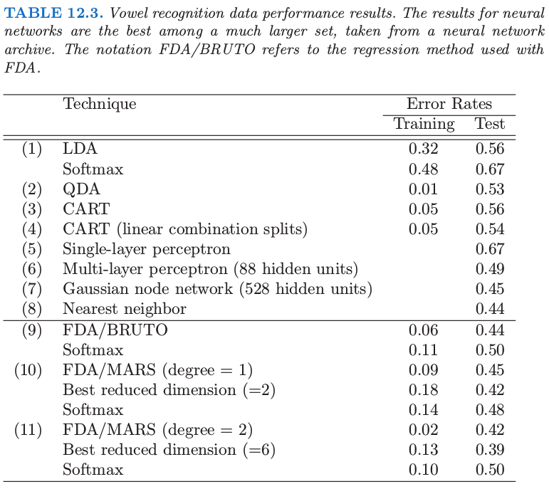
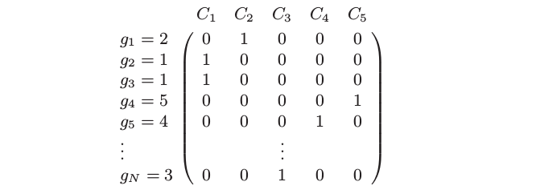

# 12.5 FDA

| 原文   | [The Elements of Statistical Learning](https://web.stanford.edu/~hastie/ElemStatLearn/printings/ESLII_print12.pdf#page=459) |
| ---- | ---------------------------------------- |
| 翻译   | szcf-weiya                               |
| 发布 | 2016-09-30 |
| 更新 | 2020-05-26 17:46:15|
| 状态 | Done|

在这一节我们描述一种在导出的响应变量上使用线性回归的 LDA 方法．这相应地导出非参的以及更灵活的替换 LDA 的方法．如[第 4 章](04-Linear-Methods-for-Classification/4.1-Introduction/index.html)一样，我们假设我们有定量变量 $G$，它落入 $K$ 个类别 ${\cal G} = \\{1,\ldots,K\\}$ 中的其中一个类别，每个都有测量特征 $X$．假设 $\theta: \cal G\mapsto\IR^1$ 是对类别打分的函数，使得转换后的类别标签通过 $X$ 上的线性回归来最优预测：如果我们的训练样本形式为 $(g_i,x_i),i=1,2,\ldots,N$，则我们求解带关于 $\theta$ 约束的下式来避免平凡解（在训练数据上均值为零单位方差）

$$
\underset{\beta,\theta}{\min}\sum\limits_{i=1}^N(\theta(g_i)-x_i^T\beta)^2\tag{12.52}
$$

这得到类别间的一维划分．

更一般地，我们可以寻找至多 $L\le K-1$ 个类别标签的独立得分， $\theta_1,\theta_2,\ldots,\theta_L$，以及 $L$ 个对应的线性映射 $\eta_\ell(X)=X^T\beta_\ell,\ell=1,\ldots,L$，它们的选择使得 $\IR^p$ 中的多重回归达到最优．得分 $\theta_\ell(g)$ 以及映射 $\beta_\ell$ 的选择使得均方残差最小

$$
ASR=\frac 1N\sum\limits_{\ell=1}^L[\sum\limits_{i=1}^N(\theta_\ell(g_i)-x_i^T\beta_\ell)^2]\tag{12.53}
$$

得分集假设为相互正交的并且关于合适的内积进行了标准化来避免平方的零解．

为什么我们要采用这种方式？可以证明 [4.3.3 节](../04-Linear-Methods-for-Classification/4.3-Linear-Discriminant-Analysis/index.html#_2)导出的判别（典则）向量 $\nu_\ell$ 的序列在忽略常数的意义下等于 $\beta_\ell$ (Mardia et al., 1979; Hastie et al., 1995)．更多地，测试点 $x$ 到第 $k$ 个类别重心 $\hat\mu_k$ 的 Mahalanobis 距离由下式给出

$$
\delta_J(x,\hat\mu_k)=\sum\limits_{\ell=1}^{K-1}w_\ell(\hat\eta_\ell(x)-\bar\eta_\ell^k)^2+D(x)\tag{12.54}\label{12.54}
$$

其中 $\bar \eta_\ell^k$ 是第 $k$ 类的 $\hat\eta_\ell(x_i)$ 的均值，且 $D(x)$ 不依赖 $k$．这里 $w_\ell$ 是坐标权重，并且用第 $\ell$ 个最优的得分的均方残差 $r_\ell^2$ 来拟合

$$
w_\ell = \frac{1}{r_\ell^2(1-r_\ell^2)}\tag{12.55}
$$

在 [4.3.2 节](../04-Linear-Methods-for-Classification/4.3-Linear-Discriminant-Analysis/index.html#lda)中，我们看到典则距离是高斯情形下分类所需要的全部条件，并且每个类别间有相等的协方差．总结下，就是：

> LDA 可以通过一系列的线性回归来实现，将测试点划分到拟合空间中距离最近的那个类别重心的类中．这类似可以应用到降维后的版本，或者当 $L=K-1$ 时的全秩版本．

这个结果的真正力量在于它的推广．我们可以用更灵活、非参的拟合来替换线性回归拟合 $\eta_\ell(x)=x^T\beta_\ell$，并且类似地达到比 LDA 更灵活的分类器．我们考虑了广义可加拟合，样条函数，MARS 模型以及类似的．在这种更一般的形式下，回归问题通过下面准则来定义

$$
ASR(\{\theta_\ell,\eta_\ell\}_{\ell=1}^L)=\frac 1N\sum\limits_{\ell=1}^L[\sum\limits_{i=1}^N(\theta_\ell(g_i)-\eta_\ell(x_i))^2+\lambda J(\eta_\ell)]\tag{12.56}
$$

其中 $J$ 是关于某种形式的非参回归的合适的正则器，比如光滑样条，可加样条以及低阶 ANOVA 样条模型．其中也包括由核生成的函数类和相关惩罚，如 [12.3.3 节](12.3-Support-Vector-Machines-and-Kernels/index.html)中一样．

在我们描述泛化中的计算之前，让我们考虑一种非常简单的例子．假设我们对每个 $\eta_\ell$ 采用 2 阶多项式回归．由 \eqref{12.54} 定义的判别边界会变成二次曲面，因为每个拟合的函数是二次的，并且当比较距离时像 LDA 中一样，平方项会被抵消掉．我们会以更传统的方式达到相同的二次边界，通过用平方项及交叉项来增广我们的原始预测变量的空间．在增广空间中应用 LDA 时，增广空间中的线性边界会映射到原始空间的二次边界．一个经典的例子是中心在原点处的一对多元高斯分布，其中一个协方差阵为 $I$，另一个为 $cI$，其中 $c>1$；图 12.9 图示了这个例子．贝叶斯判别边界是球 $\Vert x\Vert=\frac{pc\log c}{2(c-1)}$，这是在增广空间中的线性边界．

许多非参回归过程通过生成衍生变量的基展开来进行，然后在增广空间中进行线性回归．MARS（[第 9 章](../09-Additive-Models-Trees-and-Related-Methods/9.4-MARS/index.html)）过程正是这种形式．光滑样条和可加样条模型生成非常大的基的集合（对于可加样条有 $N\times p$ 个基函数），但接着要在增广空间中进行带惩罚的回归拟合，SVM 也是如此；也可以参见 [12.3.7 节](12.3-Support-Vector-Machines-and-Kernels/index.html#_3)基于核的回归的例子．在这种情形下 FDA 可以证明是在增广空间中进行带惩罚的线性判别分析．我们将在 [12.6 节](12.6-Penalized-Discriminant-Analysis/index.html)详细阐述．增广空间中的线性边界会映射到低维空间中的非线性边界．这正是支持向量机中采用的模式（[12.3 节](12.3-Support-Vector-Machines-and-Kernels/index.html)）．

我们用[第 4 章](../04-Linear-Methods-for-Classification/4.2-Linear-Regression-of-an-Indicator-Matrix/index.html)中的语音识别例子来解释 FDA，其中有 $K=11$ 个类别以及 $p=10$ 个预测变量．这些类别对应 11 个元音，每个是在 11 个不同的单词中．下面是这些单词，前面的符号来表示这些元音：

在测试集中 8 个演讲者讲每个词说 6 次，同样地，测试集中 7 个演讲者也这样做．用某种比较复杂但却是语音识别领域中的标准方式从数字语音中提取 10 个预测变量．因此得到 528 个训练观测，以及 462 个测试观测．图 12.10 展示了通过 LDA 和 FDA 得到的二维投影．

FDA 模型采用自适应的可加样条回归函数来对 $\eta_\ell(x)$ 建模，并且在右图中的点有坐标 $\hat\eta_1(x_i)$ 和 $\hat\eta_2(x_i)$．在 S-PLUS 用的程序叫做 `bruto`，因此有了图的标题以及表格中的名称．我们看到这种情形下灵活模型帮助分离类别．表 12.3 展示了一系列分类技巧的训练误差和测试误差．FDA/MARS 指的是 Friedman 的多元自适应回归样条；degree = 2 表明允许成对交叉项．注意到对于 FDA/MARS，最优的分类记过是在降维后的子空间中得到的．

## 计算 FDA 估计

FDA 坐标的计算在许多重要的情形中可以简化，特别是当非参回归过程可以表示成线性算子．我们将这种算子用 $\mathbf S_\lambda$ 表示，也就是 $\hat{\mathbf y}=\mathbf S_\lambda\mathbf y$，其中 $\mathbf y$ 是响应变量向量，而 $\hat {\mathbf y}$ 是拟合值的向量．如果固定光滑参数，可加样条有这样的性质，如果 MARS 一次性选出基函数，它也有这个性质．下标 $\lambda$ 表示整个光滑参数集．在这种情形中，最优得分等价于典则相关系数问题，并且解可以通过单特征值分解进行求解．这在[练习 12.6](https://github.com/szcf-weiya/ESL-CN/issues/156) 中有讨论，并且将得到的算法展现在这里．

!!! note "weiya 注：Ex. 12.6"
    已解决，但存在疑问，详见 [Issue 156: Ex. 12.6](https://github.com/szcf-weiya/ESL-CN/issues/156)，欢迎讨论！

我们从响应变量 $g_i$ 构造一个 $N\times K$ 的 **指示变量响应矩阵 (indicator response matrix)** $\mathbf Y$，使得若 $g_i=k$ 则 $y_{ik}=1$，否则 $y_{ik}=0$．对于五类别的问题 $\mathbf Y$ 形式可能如下：

计算步骤如下：

1. **多元非参回归 (Multivariate nonparametric regression)**．在 $\mathbf X$ 上拟合 $\mathbf Y$ 的多响应、自适应的非参回归，得到拟合值 $\hat{\mathbf Y}$．令 $\mathbf S_\lambda$ 为拟合最终选择的模型的线性算子，并且 $\eta^*(x)$ 为拟合的回归函数的向量．
2. **最优得分 (Optimal scores)**．计算 $\mathbf Y^T\hat{\mathbf Y}=\mathbf Y^T\mathbf S_\lambda\mathbf Y$ 的特征值分解，其中特征向量 $\mathbf \Theta$ 是标准化的：$\mathbf \Theta^T\mathbf D_\pi\mathbf \Theta = \mathbf I$．这里 $\mathbf D_\pi = \mathbf Y^T\mathbf Y/N$ 是类别先验概率的对角阵．
3. **更新 (Update)**．采用最优得分 $\eta(x)=\mathbf\Theta^T\eta^*(x)$ 从第一步更新模型．

$\eta(x)$ 中 $K$ 个函数的第一个函数是常值函数——平凡解；剩下的 $K-1$ 个函数是判别函数．常值函数以及标准化使得所有剩下的函数都进行了中心化．

再一次，$\mathbf S_\lambda$ 可以对应任意回归方法．当 $\mathbf S_\lambda=\mathbf H_X$，也就是等于线性回归投影算子，则 FDA 是线性判别分析．我们在本章后面的“计算上的考虑”一节中引用的软件充分利用了这个模块；`fda` 函数有个 `method=` 变量允许应用任意回归函数，只要函数满足一些很自然的条件．我们提供的回归函数允许多项式回归，自适应可加模型以及 MARS．它们都能有效地处理多重响应的情形，所以第 (1) 步是简单的调用回归程序．第 (2) 步中的特征值分解同时计算了所有的最优得分函数．

在 [4.2 节](../04-Linear-Methods-for-Classification/4.2-Linear-Regression-of-an-Indicator-Matrix/index.html)我们讨论了在指示响应变量矩阵上使用回归用作分类的方法的缺点．具体地，会出现三个或更多类别的 masking 问题．FDA 在第 (1) 步中也用了这样的回归的拟合，但是然后进一步转换得到有用的判别函数，因此它们没有这些缺点．[练习 12.9](https://github.com/szcf-weiya/ESL-CN/issues/154) 从另外一个角度解释了这个现象．

!!! info "weiya 注：Ex. 12.9"
    已解决，详见 [Issue 154: Ex. 12.9](https://github.com/szcf-weiya/ESL-CN/issues/154)，欢迎讨论交流～
