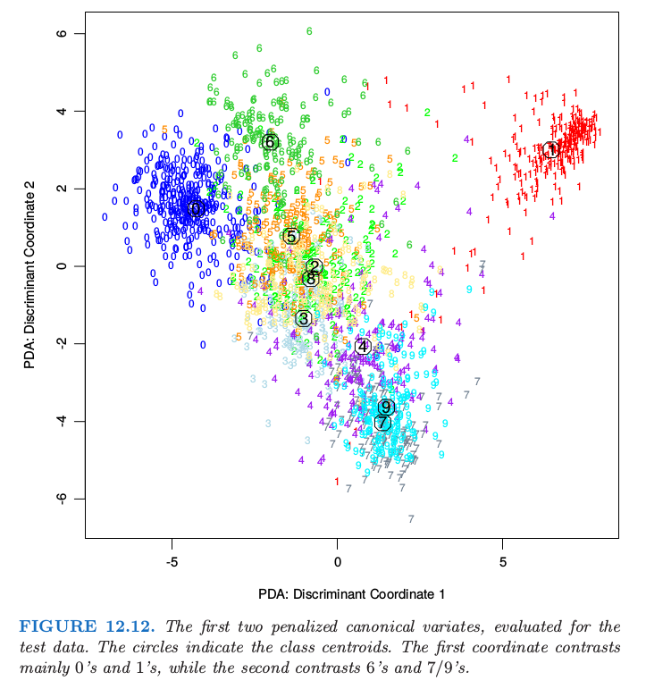

# 12.6 惩罚判别分析

| 原文   | [The Elements of Statistical Learning](https://web.stanford.edu/~hastie/ElemStatLearn/printings/ESLII_print12.pdf#page=465) |
| ---- | ---------------------------------------- |
| 翻译   | szcf-weiya                               |
| 发布 | 2018-08-08 |
| 更新 | 2020-05-27 10:29:44|
|状态| Done| 

尽管 FDA 的动机是推广最优得分，但是它也可以直接看成是正则化判别分析的形式．假设 FDA 中的回归过程意味着在基展开 $h(X)$ 上的、并且系数有二次惩罚的线性回归：

$$
ASR(\{\theta_\ell,\beta_\ell\}^L_{\ell=1})=\frac 1N\sum\limits_{\ell=1}^L\Big[\sum\limits_{i=1}^N(\theta_\ell(g_i)-h^T(x_i)\beta_\ell)^2+\lambda\beta_\ell^T\mathbf \Omega\beta_\ell\Big].\tag{12.57}
$$

$\mathbf \Omega$ 的选择取决于具体问题．如果 $\eta_\ell(x)=h(x)\beta_\ell$ 是样条基函数的展开，则 $\mathbf\Omega$ 可能约束 $\eta_\ell$ 要在 $\IR^p$ 上光滑．在可加样条的情形下，每个坐标有 $N$ 个样条基函数，则 $h(x)$ 总共包含 $Np$ 个基函数；在这种情形下，$\mathbf\Omega$ 是 $Np\times Np$ 的，并且是分块对角的．

然后 FDA 中的步骤就可以看成是 LDA 的推广形式，我们称之为 **带惩罚的判别分析 (penalized discriminant analysis)**，或者 PDA：

- 通过基展开 $h(X)$ 扩充预测变量 $X$ 的集合；
- 在增广空间中采用（带惩罚的）LDA，其中带惩罚的 **马氏距离 (Mahalanobis distance)** 由下式给出
$$
D(x,\mu)=(h(x)-h(\mu))^T(\mathbf \Sigma_W+\lambda\Omega)^{-1}(h(x)-h(\mu))\tag{12.58}
$$
其中 $\mathbf \Sigma_W$ 是导出变量 $h(x_i)$ 的类别内协方差矩阵．
- 采用惩罚度量分解分类子空间：
$$
\max\; u^T\mathbf \Sigma_{\mathrm{Bet}}u\;\text{subject to }u^T(\mathbf\Sigma_W+\lambda\mathbf\Omega)u=1
$$
不严谨地说，带惩罚的麦哈顿距离趋向于给“粗糙”的坐标更少的权重，而给“光滑”的坐标更多的权重；因为惩罚不是对角的，同样的方式会应用到粗糙或光滑的线性组合中．

对于某些类的问题，第一步的基展开不是必须的；我们已经有太多（相关的）预测变量了．一个突出的例子是当分类的对象是 **数字化模拟信号 (digitized analog signals)** ：

- 语音片段的对数周期图，在 256 个频率的集合上进行采样；见图 5.5．
- 手写数字的数字图像中的灰度像素值．

在这些情形中直观上很清楚为什么需要正则化．以数字图像为例．相邻像素值趋向于相关，通常几乎是一样的．这意味着这些像素的对应 LDA 系数对可能会很不一样并且符号相反，因此当作用到类似的像素值时系数会被抵消掉．正相关的预测变量导致噪声的、负相关的系数估计，并且这个噪声导致多余的采样方差．一个合理的策略是在空间中对系数正则化使之光滑，，图像也一样．这就是 PDA 做的事．计算步骤和 FDA 一样，除了需要使用合适的带惩罚的回归方法．这里 $h^T(X)\beta_\ell=X\beta_\ell$，并且选择 $\mathbf \Omega$ 使得 $\beta_\ell^T\mathbf\Omega\beta_\ell$ 惩罚关于 $\beta_\ell$ 的粗糙程度（将其看成图像时）．图 1.2 展示了一些手写字母的例子．图 12.11 显示了采用 LDA 和 PDA 的判别变量．

由 LDA 生成的判别变量系数看起来像 **椒盐 (salt and pepper)** 图像，而由 PDA 得到了光滑图像．第一张光滑图像可以看成是线性对比度函数的系数，用于从中间为中空的图像中（可能是 0 或 4）分离具有暗中心垂直条带的图像（可能是 1 或 7）．图 12.12 佐证了这个解释，第二个坐标的解释更加困难．这个以及其他例子在 Hastie et al. (1995) 中有更详细的讨论，其中也展示了在他们试过的情形中，在独立的测试数据中，正则化将 LDA 的分类效果约提高了 $25\%$．

